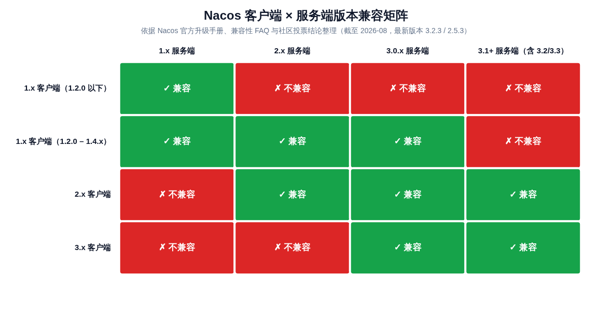
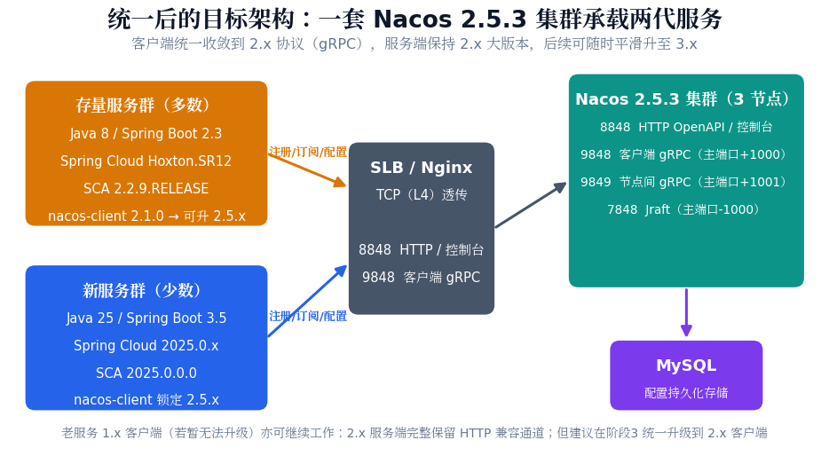
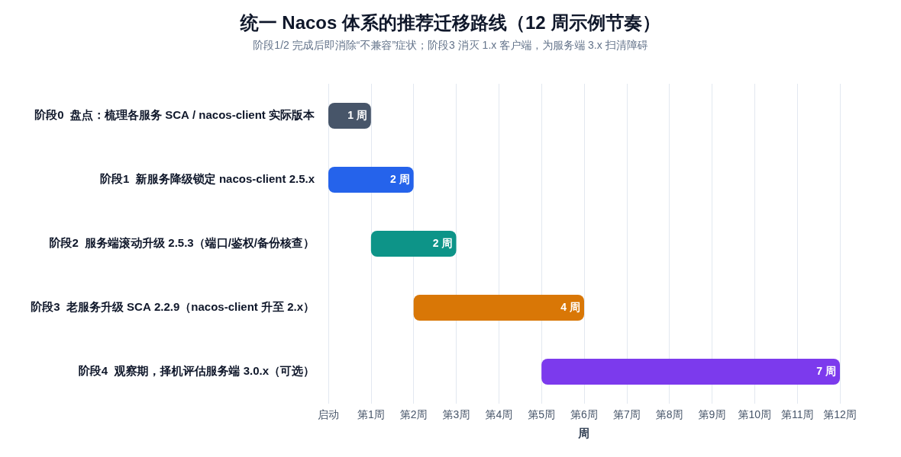

# Nacos 版本统一方案：双代微服务并存下的冲突治理

> **TL;DR（直接答案）**：这个问题有标准解法，而且**不需要部署两套 Nacos**。Nacos 的兼容原则是"服务端向下兼容、客户端不向上兼容"：**2.x 服务端同时兼容全部 2.x 客户端和 1.2.0 之后的 1.x 客户端**，配置中心甚至兼容 1.0 起的客户端 [(Nacos)](https://nacos.io/blog/faq/nacos-user-question-history8233/) 。你们现有的 2.2/2.3 服务端本身就能同时承载新老两代服务——真正"不兼容"的爆点几乎可以锁定在：**Spring Boot 3.5 的新服务若使用 Spring Cloud Alibaba 2025.0.0.0，会自带 nacos-client 3.0.3，而 3.x 客户端连 2.x 服务端会因"空命名空间 vs public"的语义差异无法正确读取配置** [(Github)](https://github.com/alibaba/spring-cloud-alibaba/issues/4098) 。推荐主方案：**新服务把 nacos-client 锁定回 2.5.x（Spring Cloud Alibaba 官方维护者给出的标准做法） [(Github)](https://github.com/alibaba/spring-cloud-alibaba/issues/4098) ，同时把服务端滚动升级到 2.5.3（2.x 最新版，仍保持 JDK 8 基线） [(Github)](https://github.com/alibaba/nacos/releases) ，老服务借机将 Spring Cloud Alibaba 升级到 2.2.9.RELEASE（适配 Boot 2.3.12，自带 nacos-client 2.1.0） [(腾讯云)](https://cloud.tencent.com/document/product/1364/78717) **。三步完成后，全体系收敛到"2.x 客户端 × 2.x 服务端"的单一协议代际，未来升级 3.x 服务端也将一路畅通。

---

## 1. 问题界定：这不是 JDK 冲突，而是客户端代际错配

先纠正一个容易误导排查方向的直觉：Java 8 与 Java 25 的差异**不是** Nacos 不兼容的直接原因。Nacos 客户端与服务端之间通过 HTTP 或 gRPC 通信，协议层面与业务进程的 JDK 版本无关——Nacos 官方甚至明确保证 **nacos-client 2.x 和 3.x 都以 JDK 8 编译，可以同时用在 Spring Boot 2.x 和 3.x 应用里** [(Github)](https://github.com/alibaba/nacos/issues/14430) ，而 Nacos 3.x 服务端自身才需要 Java 17 运行环境 [(Github)](https://github.com/alibaba/nacos/releases) 。你们的 Spring Boot 3.5 搭配 Java 25 也在官方兼容区间（Boot 3.5.x 支持 Java 17–25） [(stevenpg.com)](https://stevenpg.com/posts/spring-compat-cheatsheet/) 。真正决定兼容性的是每个服务**间接引入的 nacos-client 大版本**，而它又由 Spring Cloud Alibaba（下文简称 SCA）的版本锁定。因此排查和治理的主线应该是"版本链"，而不是 JDK。

结合你们确认的现状——服务端为 Nacos 2.x（2.2/2.3）、可以推动升级但需评估审批、新老服务需要通过注册中心互相发现调用——可以把问题精确表述为：**同一套 2.x 服务端之下，老服务的 nacos-client 可能是 1.x 或 2.x（取决于 SCA 小版本），新服务的 nacos-client 则可能是 2.4.x 或 3.0.3，其中 3.x 客户端与 2.x 服务端存在真实的、官方已确认的兼容性断点**。这个断点不解决，即使网络、端口、鉴权全部正确，新服务也会在配置中心环节失败。下文第 2 章给出完整的证据链，第 3 章对比四条候选路线，第 4–5 章给出推荐方案的落地细节与迁移节奏。

---

## 2. 根因分析：三条版本链如何交汇出"不兼容"

### 2.1 版本链锁定：从 Spring Boot 一路传导到 nacos-client

在 Spring Cloud 体系中，业务开发者通常只选择 Spring Boot 版本，但 **Spring Cloud 版本由 Boot 版本决定，SCA 版本由 Spring Cloud 版本决定，nacos-client 版本又被 SCA 锁定**，形成一条四级传导链 [(CSDN博客)](https://blog.csdn.net/qq_42700109/article/details/136173677) 。Spring 官方的版本火车表显示，Spring Boot 3.5.x 对应 Spring Cloud 2025.0.x（Northfields），而 Boot 2.2.x/2.3.x 对应早已停止维护的 Hoxton 系列 [(Spring)](https://spring.io/projects/spring-cloud) 。SCA 侧为这两条链路分别提供了对应发行版：面向 Boot 2.3 的是 2.2.x.RELEASE 分支（最高 2.2.9.RELEASE，适配 Hoxton.SR12 / Boot 2.3.12.RELEASE） [(腾讯云)](https://cloud.tencent.com/document/product/1364/78717) ；面向 Boot 3.5 的是 2025.0.0.0（Bump Spring Boot to 3.5.0、Spring Cloud 2025.0.0） [(Github)](https://github.com/alibaba/spring-cloud-alibaba/releases) 。

关键在于每个 SCA 版本内置的 nacos-client 版本差异巨大。SCA 官方版本说明显示：**2.2.3.RELEASE 内置 nacos-client 1.3.3，2.2.6.RELEASE 内置 1.4.2，2.2.7.RELEASE 起跳到 2.0.3，2.2.8/2.2.9.RELEASE 内置 2.1.0**；2021.0.5.0/2021.0.6.0 内置 2.2.0；2023.0.1.0 内置 2.3.2 [(aliyun.com)](https://sca.aliyun.com/en/faq/sca-user-question-history16244/) ；2023.0.3.4 升级为 2.4.3；而 **2025.0.0.0 直接升级到 nacos-client 3.0.3** [(Github)](https://github.com/alibaba/spring-cloud-alibaba/releases) 。也就是说，你们的新服务只要用的是 SCA 2025.0.0.0，就自动成为"Nacos 3.x 客户端"；若老服务的 SCA 还停留在 2.2.6 或更早，则仍是 1.x 客户端。下表汇总这条传导链的关键坐标：

| 服务代际 | JDK | Spring Boot | Spring Cloud | Spring Cloud Alibaba | 内置 nacos-client |
|---|---|---|---|---|---|
| 存量服务（低版本 SCA） | 8 | 2.3.x | Hoxton.SR9–SR12 [(腾讯云)](https://cloud.tencent.com/document/buy-guide/1364/78717)  | 2.2.3–2.2.6.RELEASE | **1.3.3 – 1.4.2** [(aliyun.com)](https://sca.aliyun.com/en/faq/sca-user-question-history16244/)  |
| 存量服务（推荐落点） | 8 | 2.3.12.RELEASE | Hoxton.SR12 [(腾讯云)](https://cloud.tencent.com/document/product/1364/78717)  | **2.2.9.RELEASE** | **2.1.0** [(aliyun.com)](https://sca.aliyun.com/en/faq/sca-user-question-history16244/)  |
| 新服务（保守组合） | 17–25 | 3.2.4 | 2023.0.1 | 2023.0.1.0 | 2.3.2 [(aliyun.com)](https://sca.aliyun.com/docs/2023/overview/version-explain/)  |
| 新服务（当前组合） | 17–25 [(stevenpg.com)](https://stevenpg.com/posts/spring-compat-cheatsheet/)  | 3.5.x | 2025.0.x [(Spring)](https://spring.io/projects/spring-cloud)  | 2025.0.0.0 | **3.0.3** [(Github)](https://github.com/alibaba/spring-cloud-alibaba/releases/tag/2025.0.0.0)  |
| 新服务（推荐落点） | 17–25 | 3.5.x | 2025.0.x | 2025.0.0.0 + 手动降级 | **锁定 2.5.x** [(Github)](https://github.com/alibaba/spring-cloud-alibaba/issues/4098)  |

### 2.2 Nacos 的协议代际与官方兼容矩阵

Nacos 1.x 与 2.x 的本质区别是通信协议换代：1.x 客户端用 HTTP 短连接注册、长轮询拉配置、UDP 接收变更推送；2.x 起统一改为 **gRPC 双向流长连接**，官方实测吞吐提升约 10 倍 [(SegmentFault 思否)](https://segmentfault.com/a/1190000039686529) 。2.x 服务端为兼容旧生态，**同时保留了 HTTP/UDP 的完整兼容通道** [(稀土掘金)](https://juejin.cn/post/7319669728820740135) ，由此形成官方明确的兼容规则："**Nacos 2.x 服务端兼容所有 2.x 客户端，同时兼容 1.2.0 及之后的所有 1.x 客户端；Nacos 1.x 服务端仅兼容 1.x 客户端，不支持 2.x 客户端**" [(Nacos)](https://nacos.io/blog/faq/nacos-user-question-history8233/) 。更细粒度地说，配置中心兼容 1.0 起所有客户端，服务发现兼容 1.2 起所有客户端 [(腾讯云)](https://cloud.tencent.com/document/product/1364/78717) 。因为注册表与配置数据都存储在服务端，**1.x 客户端注册的实例，2.x/3.x 客户端可以正常订阅发现，反之亦然**——跨代互通在服务端数据模型层面是天然成立的，这也是"一套服务端承载两代服务"的理论基础。

3.x 时代规则再次变化。社区投票决定"在 3.1 版本中正式移除对 1.x 客户端的兼容；3.0.x 中已将 1.x 的控制台 API 和 Admin API 默认移除，但 1.x 的 openAPI（即客户端数据面）仍保留" [(Github)](https://github.com/alibaba/nacos/issues/12922) ；到 3.2.x，官方升级手册的客户端兼容表已明确：**1.x 客户端不兼容（需自行集成 nacos-api-legacy-adapter），2.x 与 3.x 客户端兼容** [(nacos-group.github.io)](https://nacos-group.github.io/en/docs/latest/manual/admin/upgrading/) 。截至 2026 年 8 月，Nacos 最新版本为 3.2.3，2.x 线最新为 2.5.3（两者同日于 2026-07-14 发布，2.x 线仍保持 JDK 8 基线并持续修复安全问题） [(Github)](https://github.com/alibaba/nacos/releases) 。以上事实可浓缩为下图的兼容矩阵：



矩阵中最值得注意的两格是：**"3.x 客户端 × 2.x 服务端"为不兼容**（这正是你们当前踩中的格子，下一小节展开）；以及"1.x 客户端（1.2.0–1.4.x）× 2.x 服务端"为绿色——这意味着**老服务即使一行代码不改，也能继续留在升级后的 2.x 服务端上工作**，升级节奏可以完全由你们掌控。

### 2.3 真正的爆点：3.x 客户端 × 2.x 服务端的命名空间语义差异

"3.x 客户端不能连 2.x 服务端"并不是一句笼统的经验之谈，它有明确的机制级根因：**默认命名空间的 ID 定义在 3.0 发生了变化**。在 Nacos 2.x 及以前，默认命名空间 `public` 的真实 ID 是**空字符串 `""`**，很多人误把名称 `public` 当 ID 配置而引发混乱；为此 Nacos 3.0 把默认命名空间 ID 直接改为 `"public"`，并在服务端做了自动匹配——当 API 请求未传命名空间 ID 或传入空字符串时，3.0 服务端会自动按 `public` 处理，从而兼容旧客户端 [(微信公众号(码小辫))](http://mp.weixin.qq.com/s?__biz=MzA5NjMwMDg0Ng==&mid=2455391984&idx=2&sn=c127c390b5ce0c435ec236cfd0fcbf03) 。问题出在反方向：**2.x 服务端没有这个归一化逻辑，空字符串与 `public` 会被当成两个不同的命名空间** [(Github)](https://github.com/alibaba/nacos/issues/13977) 。3.x 客户端按新语义发起请求时，若配置数据实际存在空 ID 命名空间下，就会出现"配置明明存在却读取不到"的故障。

这一断点已被 Spring Cloud Alibaba 官方以 issue 形式确认并给出处置建议：SCA 维护者在《关于 Nacos 配置加载的问题说明》中明确写道——"**spring-cloud-alibaba 2025.0.0.0 中的 nacos 版本是 3.0.3，需要使用 nacos 3.x，使用 nacos 2.x 将无法正确获取到配置；如果无法升级 nacos 服务，请排除 spring-cloud-starter-alibaba-nacos-discovery、spring-cloud-starter-alibaba-nacos-config 中的 com.alibaba.nacos:nacos-client:3.0.3，使用 com.alibaba.nacos:nacos-client:2.5.1**"，并同时强调"无论使用哪个版本的 SCA，都应保持 nacos-client 与 nacos 服务端版本接近，请勿跨大版本使用" [(Github)](https://github.com/alibaba/spring-cloud-alibaba/issues/4098) 。需要补充说明的是，该断点最明确的表现在**配置中心**；注册发现在空命名空间下同样存在语义分岔风险（2.x 服务端视角下 `""` 与 `public` 是两个隔离的命名空间），因此不应抱"注册能通就凑合用"的侥幸。

实践中还有一个高频误判值得点名：很多团队把"2.x 客户端连不上服务端"归因为版本不兼容，实际却是**网络层只放行了 8848 而漏掉了 gRPC 端口 9848/9849**——典型报错为 `Server check fail ... port 9848 is available` 或客户端能连 HTTP 接口但注册不上 [(CSDN博客)](https://blog.csdn.net/qi923701/article/details/139949570) 。在动版本之前，先用第 4.4 节的清单排除端口与代理问题，能避免大量无效升级。

---

## 3. 候选方案对比与选型

围绕"一套 2.x 服务端如何服务两代应用"，存在四条现实路线。它们的差异不在"能不能跑通"，而在**改动落在哪一侧、风险何时释放、长期债务是否清偿**。下表先做总览，随后逐条分析：

| 维度 | 方案 A：仅锁定新服务客户端 | 方案 B：服务端升 2.5.3 + 客户端统一 2.x（**推荐**） | 方案 C：服务端直升 3.0.x | 方案 D：双集群 + 数据同步 |
|---|---|---|---|---|
| 服务端改动 | 无 | 2.2/2.3 → 2.5.3 滚动升级（同大版本） [(Github)](https://github.com/alibaba/nacos/releases)  | 2.x → 3.0.x 跨大版本升级，需 JDK 17 宿主 [(Github)](https://github.com/alibaba/nacos/releases)  | 新增一套 2.x/3.x 集群 |
| 新服务改动 | 降级锁定 nacos-client 2.5.x [(Github)](https://github.com/alibaba/spring-cloud-alibaba/issues/4098)  | 同左 | 无（保持 3.0.3） | 无 |
| 老服务改动 | 无（1.x 客户端继续可用） [(Nacos)](https://nacos.io/blog/faq/nacos-user-question-history8233/)  | 分批升 SCA 2.2.9 / client 2.x [(aliyun.com)](https://sca.aliyun.com/en/faq/sca-user-question-history16244/)  | 无（1.x 客户端仍可用，但锁定上限 3.0.x） [(Github)](https://github.com/alibaba/nacos/issues/12922)  | 无 |
| 审批与变更压力 | 最小 | 中（一次服务端滚动升级） | 大（跨大版本 + 命名空间迁移） | 中（新基建 + 同步组件） |
| 互通效果 | 全量互通（1.x/2.x 客户端 × 2.x 服务端） | 全量互通，且协议代际统一 | 全量互通（3.0.x 兼容 1.x openAPI） [(Github)](https://github.com/alibaba/nacos/issues/12922)  | 依赖同步链路，存在秒级延迟与不一致窗口 |
| 配置中心可用性 | 完整 | 完整 | 完整（自动归一化空命名空间） [(微信公众号(码小辫))](http://mp.weixin.qq.com/s?__biz=MzA5NjMwMDg0Ng==&mid=2455391984&idx=2&sn=c127c390b5ce0c435ec236cfd0fcbf03)  | **不推荐**跨集群同步配置 |
| 长期债务 | 仍留有 1.x 客户端，未来升 3.1+ 受阻 [(Github)](https://github.com/alibaba/nacos/issues/12922)  | 基本清偿，3.x 服务端随时可升 [(nacos-group.github.io)](https://nacos-group.github.io/en/docs/latest/manual/admin/upgrading/)  | 清偿，但升级当口风险集中 | 最高：双写一致性、同步组件运维 |
| 适用场景 | 止血/应急，1 天内可完成 | 有升级窗口、追求一劳永逸 | 服务端基础设施自主可控、能承担跨大版本变更 | 服务端确实动不了的过渡兜底 |

**方案 A 是纯客户端侧的最小改动**，价值在于"快"：新服务按 SCA 官方建议排除 nacos-client 3.0.3、显式引入 2.5.x 即可立即恢复与 2.x 服务端的正常协作 [(Github)](https://github.com/alibaba/spring-cloud-alibaba/issues/4098) ；老服务的 1.x 客户端依据官方兼容规则继续工作，无需任何动作 [(Nacos)](https://nacos.io/blog/faq/nacos-user-question-history8233/) 。但它把 1.x 客户端这个技术债留在了体系内——而 Nacos 社区已明确 3.1 起移除 1.x 客户端兼容 [(Github)](https://github.com/alibaba/nacos/issues/12922) ，2.x 服务端为兼容 1.x 需要同时维护 HTTP 与 gRPC 两套协议栈，在极端规模（如实例数 5 万以上）下可能放大稳定性风险 [(CSDN博客)](https://blog.csdn.net/weixin_29207439/article/details/158084850) 。因此方案 A 应被定位为**第一阶段动作**，而非终态。

**方案 B 在 A 的基础上再迈两步**：服务端从 2.2/2.3 滚动升级到 2.5.3——这是 2.x 线的最新版本，持续获得安全修复（内嵌 Tomcat 升级至 9.0.118 以应对已知 CVE，gRPC Java 升级至 1.75.0），且刻意保持 JDK 8 部署基线、不引入 Spring Boot 3 等破坏性依赖 [(Github)](https://github.com/alibaba/nacos/releases) ；老服务分批升级到 SCA 2.2.9.RELEASE，将 nacos-client 从 1.x 提升到 2.1.0，或直接显式指定 2.5.x [(aliyun.com)](https://sca.aliyun.com/en/faq/sca-user-question-history16244/) 。完成后全体系收敛为"2.x 客户端 × 2.x 服务端"的单一协议代际：协议栈单一、性能完整释放（gRPC 长连接、服务端主动推送） [(SegmentFault 思否)](https://segmentfault.com/a/1190000039686529) ，且由于 3.x 服务端完全兼容 2.x 客户端 [(nacos-group.github.io)](https://nacos-group.github.io/en/docs/latest/manual/admin/upgrading/) ，**未来任何时间点升级 3.x 服务端都不需要再动应用侧**。这是改动面、风险与长期收益最均衡的路线，定为主推荐。

**方案 C 把服务端直接推到 3.0.x**，好处是一步到位进入 3.x 时代（xDS 协议、A2A/MCP 注册中心、按 API 类型默认鉴权等新能力） [(微信公众号(码小辫))](http://mp.weixin.qq.com/s?__biz=MzA5NjMwMDg0Ng==&mid=2455391984&idx=2&sn=c127c390b5ce0c435ec236cfd0fcbf03) ，且 3.0.x 仍保留 1.x openAPI，老服务可暂时不动 [(Github)](https://github.com/alibaba/nacos/issues/12922) 。代价是变更复杂度显著上升：3.x 服务端宿主需要 Java 17 [(Github)](https://github.com/alibaba/nacos/releases) ；升级需执行数据库表结构变更与空命名空间→public 的数据迁移，并依赖默认开启的命名空间兼容模式做双向同步，关闭兼容模式后即失去平滑降级能力 [(书栈网)](https://www.bookstack.cn/read/nacos-3.0-en/afc1f53a4651cd98.md) ；1.x 的控制台 API 与 Admin API 在 3.0.x 已被默认移除 [(Github)](https://github.com/alibaba/nacos/issues/12922) ，依赖旧 API 的运维脚本和自研平台需要同步改造。若走此路，**版本上限必须钉死在 3.0.x，直至最后一个 1.x 客户端退出**——3.1 起 1.x 客户端被正式移除 [(Github)](https://github.com/alibaba/nacos/issues/12922) ，3.2.x 官方文档已将其标注为不兼容 [(nacos-group.github.io)](https://nacos-group.github.io/en/docs/latest/manual/admin/upgrading/) 。

**方案 D（双集群 + nacos-sync / 云上 MSE Sync）仅作兜底**。Nacos 服务端没有原生的跨集群互通能力，跨集群数据同步只能依靠 nacos-sync 这类外部工具 [(阿里云开发者社区)](https://developer.aliyun.com/ask/513281) ；云厂商的托管迁移场景也有对应的 MSE Sync 方案 [(阿里云)](https://www.aliyun.com/sswb/1754907.html) 。该方案本质是把版本问题转化为"两套注册中心 + 异步同步"的分布式一致性问题：同步存在延迟与不一致窗口、同步组件本身成为新的单点与运维对象、配置中心数据不适合跨集群双向同步。只有在"服务端确实无法变更、又必须让 3.x 客户端的新服务上线"的极端约束下才值得启用，并应设定明确的退出时间。

---

## 4. 推荐方案（B）的落地细节

### 4.1 新服务：把 nacos-client 锁定回 2.5.x

新服务保持 Spring Boot 3.5 + Spring Cloud 2025.0.x + SCA 2025.0.0.0 不动，仅做依赖排除与显式锁定。这正是 SCA 维护者给出的官方处置方式 [(Github)](https://github.com/alibaba/spring-cloud-alibaba/issues/4098) ：

```xml
<dependency>
    <groupId>com.alibaba.cloud</groupId>
    <artifactId>spring-cloud-starter-alibaba-nacos-discovery</artifactId>
    <exclusions>
        <exclusion>
            <groupId>com.alibaba.nacos</groupId>
            <artifactId>nacos-client</artifactId>
        </exclusion>
    </exclusions>
</dependency>
<dependency>
    <groupId>com.alibaba.cloud</groupId>
    <artifactId>spring-cloud-starter-alibaba-nacos-config</artifactId>
    <exclusions>
        <exclusion>
            <groupId>com.alibaba.nacos</groupId>
            <artifactId>nacos-client</artifactId>
        </exclusion>
    </exclusions>
</dependency>
<!-- 显式锁定与 2.x 服务端同代际的客户端 -->
<dependency>
    <groupId>com.alibaba.nacos</groupId>
    <artifactId>nacos-client</artifactId>
    <version>2.5.3</version> <!-- 官方 issue 示例为 2.5.1；2.5.3 为 2.x 最新补丁版 -->
</dependency>
```

配置加载方式必须同步切换到新模式：SCA 2025.x 要求**必须通过 `spring.config.import` 导入 Nacos 配置**，2025.1.x 已彻底移除 bootstrap.yml/bootstrap.properties 支持，2025.0.x 虽仍兼容但官方同样推荐 import 方式 [(aliyun.com)](https://sca.aliyun.com/docs/2025.x/user-guide/nacos/advanced-guide/) 。若引入了 `spring-cloud-starter-alibaba-nacos-config` 却没有配置任何 `nacos:` 条目，启动时会直接报 `The spring.config.import property is missing a nacos: entry` 的检查错误 [(aliyun.com)](https://sca.aliyun.com/docs/2025.x/user-guide/nacos/advanced-guide/) 。标准写法如下：

```yaml
spring:
  application:
    name: order-service
  profiles:
    active: dev
  config:
    import:
      - optional:nacos:application-${spring.profiles.active}.yml
      - optional:nacos:${spring.application.name}-${spring.profiles.active}.yml
  cloud:
    nacos:
      server-addr: nacos.internal:8848   # 只填主端口，gRPC 端口客户端自动按 +1000 计算 [(书栈网)](https://www.bookstack.cn/read/nacos-2.0-zh/ca650fdd653a70b2.md) 
      username: nacos
      password: ${NACOS_PASSWORD}
      discovery:
        server-addr: ${spring.cloud.nacos.server-addr}
      config:
        server-addr: ${spring.cloud.nacos.server-addr}
        file-extension: yml
```

两个容易忽视的收尾动作：其一，自 SCA 2023.0.1.3 起，`shared-configs`、`extension-configs` 等旧式共享配置写法已废弃，公共配置应改写在 `spring.config.import` 列表中（列表中越靠后的条目优先级越高） [(稀土掘金)](https://juejin.cn/post/7605494530017034280) ；其二，若新服务中存在直接操作 `com.alibaba.nacos.api` 的代码（绕过 SCA 的少量场景），降级客户端后需回归验证这些调用，尽管 1.x/2.x 客户端 API 保持二进制兼容，2.5.x 相比 3.0.3 在维护端 API（maintainer-sdk）上有明显差异 [(Github)](https://github.com/alibaba/spring-cloud-alibaba/releases) 。

### 4.2 服务端：从 2.2/2.3 滚动升级到 2.5.3

2.x 大版本内的升级是 Nacos 所有升级路径中风险最低的一类。官方升级手册确认 2.1.x–2.4.x 可直接升级到 2.5.x，仅需注意**数据库表结构在部分版本间有变化，升级前对比目标版本的 mysql-schema.sql 并先执行差异 SQL** [(Nacos)](https://nacos.io/docs/v2.5/manual/admin/upgrading/) 。1.x 时代遗留的"双写"问题与此无关——双写开关自 2.1.0 起默认关闭，只影响从 1.x 服务端的平滑升级，而你们已是 2.x 服务端 [(CSDN博客)](https://blog.csdn.net/aa657271/article/details/160726371) 。2.5.3 作为 2026 年 7 月发布的 2.x 最新补丁版，修复了配置命名空间隔离、客户端关闭线程泄漏等问题，并升级了存在已知 CVE 的内嵌 Tomcat 与 Jackson、gRPC 等依赖，同时明确保持 JDK 8 部署基线，不引入任何 JDK 17+ 的依赖线 [(Github)](https://github.com/alibaba/nacos/releases) 。

推荐的滚动升级步骤为：**（1）备份**——导出全量配置（控制台导出或 openAPI 备份），并对 MySQL 库做快照；**(2）表结构比对与变更**——对照 2.2/2.3 与 2.5.3 的 schema 文件执行差异 SQL [(Nacos)](https://nacos.io/docs/v2.5/manual/admin/upgrading/) ；**（3）逐节点替换升级**——每台节点依次 `shutdown.sh` → 替换 `nacos-server.jar` 并比对 `conf/application.properties` 差异 → `startup.sh` 拉起，确认该节点重新加入集群、Distro/Raft 数据同步完成后再处理下一台 [(CSDN博客)](https://blog.csdn.net/alpha/article/details/155247075) ；**（4）回归验证**——控制台服务列表/配置列表完整、老服务（1.x 客户端）心跳正常、新服务（2.5.x 客户端）注册订阅与配置推拉正常。整个过程对在线业务应做到零感知；若任一节点异常，直接回退该节点的 jar 包即可，2.x 内部小版本间数据格式兼容。

### 4.3 老服务：以 SCA 2.2.9 为支点升级客户端，不动 Spring Boot

老服务升级的关键洞察是：**不需要碰 Spring Boot 2.3 和 JDK 8，就能把 nacos-client 升级到 2.x**。SCA 2.2.9.RELEASE 官方适配的正是 Spring Boot 2.3.12.RELEASE + Spring Cloud Hoxton.SR12，而它内置的 nacos-client 已是 2.1.0 [(腾讯云)](https://cloud.tencent.com/document/product/1364/78717) 。换言之，老服务只需把 SCA 版本号从 2.2.3–2.2.6 提升到 2.2.9.RELEASE（若 Boot 是 2.3.x 早期小版本，同步升到 2.3.12.RELEASE 即可），客户端协议栈就自动完成代际升级。云厂商的 SDK 限制清单也佐证了这一路径：SCA 2.2.4–2.2.6 因默认依赖 nacos-client 1.4.2 及以下被列为不推荐版本，官方建议统一升级到 2.2.9.RELEASE 及以上 [(天翼云)](https://www.ctyun.cn/document/10116500/10437732) 。

如果个别老服务因为依赖固化等原因不便升级 SCA 大版本号，还有一条更轻的路径：**保持 SCA 不变，仅通过 dependencyManagement 显式把 nacos-client 钉到 2.5.x**。nacos-client 2.x 与 3.x 均以 JDK 8 编译，可以在 Spring Boot 2.x 应用中运行 [(Github)](https://github.com/alibaba/nacos/issues/14430) ；Nacos 2.0 设计时就保证了 Java SDK 完全兼容 1.x 客户端的所有 API 接口方法 [(书栈网)](https://www.bookstack.cn/read/nacos-2.0-zh/ca650fdd653a70b2.md) ，因此这种"换芯"对业务代码透明。无论走哪条路径，都建议客户端最终版本**不低于 2.1.1**（云厂商大规模实践中总结的避坑基线，2.0.x 时代存在若干已知问题） [(阿里云开发者社区)](https://developer.aliyun.com/ask/664351) ，统一对齐到 2.5.3 与新服务一致是更整洁的选择。升级后的收益是即时的：gRPC 长连接取代 HTTP 长轮询，配置变更从"轮询发现"变为"服务端毫秒级主动推送"，注册调用的吞吐能力数量级提升 [(SegmentFault 思否)](https://segmentfault.com/a/1190000039686529) 。

### 4.4 网络与部署检查清单（先于版本操作执行）

大量"版本不兼容"的报告最终定位到网络层。2.x 服务端在主端口（默认 8848）之外按固定偏移量派生新端口：**9848（主端口+1000，客户端 gRPC）、9849（主端口+1001，服务端节点间 gRPC）、7848（主端口-1000，Jraft 选主与日志复制）** [(书栈网)](https://www.bookstack.cn/read/nacos-2.0-zh/ca650fdd653a70b2.md) 。客户端只配置 `server-addr: host:8848`，gRPC 端口由客户端按相同规则自动计算 [(书栈网)](https://www.bookstack.cn/read/nacos-2.0-zh/ca650fdd653a70b2.md) 。据此，防火墙/安全组必须放行全部四个端口段；只放行 8848 时，2.x 客户端的典型症状是 `Server check fail` 或超时异常，而 1.x 客户端（纯 HTTP）却工作正常——这种"老服务能连、新服务连不上"的表象极易被误判为版本不兼容 [(CSDN博客)](https://blog.csdn.net/qi923701/article/details/139949570) 。

代理与容器化场景另有三个坑。**其一，Nacos 前置 VIP/Nginx 时必须使用 TCP（L4）透传**，不能按 HTTP/2 反向代理配置，否则 gRPC 连接会被 nginx 断开 [(书栈网)](https://www.bookstack.cn/read/nacos-2.0-zh/ca650fdd653a70b2.md) ；**其二，K8s 环境中 Service 需要同时映射 8848 与 9848**，只映射主端口时客户端按 +1000 计算出的端口没有被暴露，连接必然失败 [(zjcp.cc)](https://www.zjcp.cc/ask/14754.html) ；**其三，当对外端口受限（如统一走 443）时**，2.1.2 及以上客户端支持通过 JVM 参数 `nacos.server.grpc.port.offset` 自定义 gRPC 端口偏移，更低版本则只能严格遵守 +1000/+1001 规则规划端口 [(博客园)](https://www.cnblogs.com/johnnyzen/p/18401612) 。建议在升级前先完成这一轮端口与代理核查，它能独立解决一部分现网症状。

### 4.5 鉴权与安全基线

混部场景下开启鉴权是安全的底线配置，且对两代客户端都可行：服务端设置 `nacos.core.auth.enabled=true` 后，1.2.1+ 的 1.x 客户端与所有 2.x 客户端都支持以用户名/密码换取 accessToken 访问 [(CSDN博客)](https://blog.csdn.net/timshinlee/article/details/136322941) ，SCA 侧在 `spring.cloud.nacos.username/password` 配置即可 [(CSDN博客)](https://blog.csdn.net/timshinlee/article/details/136322941) 。需注意 2.2.0.1 之后服务端**不再提供默认 JWT 密钥，必须自行配置 Base64 编码、原始长度不低于 32 字符的 `nacos.core.auth.plugin.nacos.token.secret.key`**，否则无法启动；同时 `nacos.core.auth.enable.userAgentAuthWhite` 默认关闭后，集群节点间通信必须配置自定义的 `nacos.core.auth.server.identity.key/value` [(CSDN博客)](https://blog.csdn.net/qq_43437874/article/details/139135381) 。开启鉴权后未配置凭据的客户端会收到 `user not found!`（403）错误，这是配置缺失而非版本问题 [(CSDN博客)](https://blog.csdn.net/qq_43437874/article/details/139135381) 。

若未来采纳方案 C 升级到 3.x 服务端，还需预判一项安全模型变化：3.0 起按 API 类型实施差异化默认鉴权——InnerAPI/AdminAPI 默认走 ServerIdentity 校验、ConsoleAPI 默认启用用户名密码认证、OpenAPI 维持可手动开启的策略 [(微信公众号(码小辫))](http://mp.weixin.qq.com/s?__biz=MzA5NjMwMDg0Ng==&mid=2455391984&idx=2&sn=c127c390b5ce0c435ec236cfd0fcbf03) ；1.x/2.x 的控制台 API 与 Admin API 在 3.0.x 已被默认移除 [(Github)](https://github.com/alibaba/nacos/issues/12922) 。依赖 `/nacos/v1/console/**`、`/nacos/v1/auth/**` 等旧接口的自动化脚本、巡检平台和自研运维门户需要提前盘点并迁移到 v3 API，这部分工作量应计入方案 C 的评估。

---

## 5. 目标架构与迁移节奏

统一后的目标形态非常朴素：**一套 Nacos 2.5.3 三节点集群，前置 SLB/Nginx 做 TCP 透传，两代服务的客户端全部收敛到 2.x（gRPC）**。老服务（Java 8 / Boot 2.3 / SCA 2.2.9，nacos-client 2.1.0→2.5.x）与新服务（Java 25 / Boot 3.5 / SCA 2025.0.0.0，nacos-client 锁定 2.5.x）经由同一组端口完成注册、订阅与配置推拉；配置持久化落在 MySQL。即使个别老服务暂时保留 1.x 客户端，2.x 服务端保留的 HTTP 兼容通道也能继续承接，为分批升级留出缓冲 [(Nacos)](https://nacos.io/blog/faq/nacos-user-question-history8233/) 。



迁移节奏上，建议按"先止血、再升级、后清偿债务"的顺序推进，四个阶段有明确的进入与退出条件：



**阶段 0（盘点）** 输出一张全量清单：每个服务的 SCA 版本、实际生效的 nacos-client 版本（用 `mvn dependency:tree | grep nacos` 或启动日志中的客户端版本号核实 [(CSDN博客)](https://blog.csdn.net/aa657271/article/details/160726430) ）、使用的命名空间/分组清单、依赖 Nacos 旧版 openAPI 的运维脚本清单。盘点不彻底是后续所有返工的来源。**阶段 1（新服务降级锁定）** 按 4.1 节改造新服务并在测试环境回归配置读取与注册发现——这一步完成后，"不兼容"症状即告消除。**阶段 2（服务端升级 2.5.3）** 按 4.2 节滚动执行，前置完成 4.4 节的端口与代理核查。**阶段 3（老服务客户端升级）** 按 4.3 节分批灰度，每批观察注册抖动、配置推送时延与业务指标后再放大。**阶段 4（观察与评估）** 体系稳定运行一个以上发布周期后，再评估是否启动 3.x 服务端升级（见第 6 章）。

## 6. 长期演进：3.x 服务端的升级窗口与 1.x 客户端的终局

方案 B 完成后，你们将处在一个非常有利的位置：**3.x 服务端完全兼容 2.x 与 3.x 客户端** [(nacos-group.github.io)](https://nacos-group.github.io/en/docs/latest/manual/admin/upgrading/) ，何时升级服务端 3.x 变成一个纯粹的基础设施决策，不再需要业务侧联动。但版本窗口必须选对：若体系内仍残留 1.x 客户端，服务端上限只能到 **3.0.x**——这是最后一条保留 1.x openAPI 的版本线 [(Github)](https://github.com/alibaba/nacos/issues/12922) ；只有当 1.x 客户端彻底清零后，才能进入 3.1+（3.1 正式移除 1.x 客户端兼容 [(Github)](https://github.com/alibaba/nacos/issues/12922) ，3.2.x 起官方要求 1.x 客户端必须自行集成 nacos-api-legacy-adapter [(nacos-group.github.io)](https://nacos-group.github.io/en/docs/latest/manual/admin/upgrading/) ，3.3 进一步移除遗留的配置迁移兼容路径 [(Github)](https://github.com/alibaba/nacos/releases) ）。这条"版本绞索"是确定的时间表，越早完成客户端统一，未来可选的服务端版本空间越大。

升级 3.x 时的技术要点也要提前建档：3.x 服务端宿主需要 **Java 17**（客户端不受影响，仍是 Java 8 基线） [(Github)](https://github.com/alibaba/nacos/releases) ；从 2.x 升级需执行数据库表结构变更，且 3.0 会把空命名空间（`""`）的配置数据全量迁移到 `public` 命名空间，期间默认开启兼容模式做双向同步——首次启动耗时与配置量成正比（官方实测约 2 万条配置耗时 2 分钟左右），关闭兼容模式后即失去平滑降级能力，务必在验证完成后才关闭 [(书栈网)](https://www.bookstack.cn/read/nacos-3.0-en/afc1f53a4651cd98.md) 。至于收益，除了性能与维护性，3.x 还带来 xDS 原生支持、分布式锁、模糊监听、MCP/A2A 的 AI 注册中心等新能力 [(微信公众号(码小辫))](http://mp.weixin.qq.com/s?__biz=MzA5NjMwMDg0Ng==&mid=2455391984&idx=2&sn=c127c390b5ce0c435ec236cfd0fcbf03) ，对正在演进的平台有长期价值。同步值得规划的还有其他基础设施组件与 SCA 2025.0.0.0 的兼容性（例如 Druid 需替换为 `druid-spring-boot-3-starter` 1.2.24+） [(Github)](https://github.com/alibaba/spring-cloud-alibaba/issues/4221) ，避免治理完注册中心又在相邻组件上踩坑。

## 7. 验证与回滚清单

每个阶段都应以可观测指标而非主观感受验收。注册中心链路的验收项包括：服务注册/反注册成功率、订阅成功率、跨代互发现（1.x 或 2.x 老服务注册的实例被新服务正常拉到、反向亦然）、实例上下线后消费者侧列表收敛时间、RPC 调用成功率与 P99 延迟、消费者拿到空实例列表的次数；配置中心链路的验收项包括：配置读取、监听推送时延、发布/删除/历史版本回滚、`namespaceId=""` 与 `public` 两个场景的行为一致性 [(Github)](https://github.com/apache/dubbo-go/discussions/3318) 。灰度期间重点盯 Nacos 服务端的 CPU、内存、长连接数与数据库 QPS，以及客户端日志中的 `Server check fail`、`user not found!`、`Connection is unregistered` 等关键字 [(Github)](https://github.com/apache/dubbo-go/discussions/3318) 。

回滚设计同样前置：服务端侧，2.5.3 属同大版本升级，保留旧版本安装目录与数据库快照即可逐节点回退；客户端侧，无论是新服务锁定 2.5.x 还是老服务升 SCA 2.2.9，变更都只是依赖版本与配置，回滚等于重新发布旧制品，无需数据迁移。唯一"单行道"操作是方案 C/第 6 章中关闭 3.0 命名空间兼容模式——关闭后失去平滑降级能力，执行前必须确认集群已稳定运行且业务验证通过 [(书栈网)](https://www.bookstack.cn/read/nacos-3.0-en/afc1f53a4651cd98.md) 。将这份清单固化为发布流水线中的检查项，能把"版本治理"从一次性运动变成可持续的工程纪律。

---

## 8. 结论

回到最初的问题——"两代服务用的 Nacos 版本不兼容，有没有好办法"——答案是肯定的，而且解法比直觉更简单：**版本统一的主战场在 nacos-client 而非 JDK 或 Spring Boot**。短期，把新服务的 nacos-client 从 3.0.3 锁定回 2.5.x 即可立即恢复与 2.2/2.3 服务端的协作，这是 Spring Cloud Alibaba 官方确认的标准做法 [(Github)](https://github.com/alibaba/spring-cloud-alibaba/issues/4098) ；中期，服务端滚动升级至 2.5.3、老服务经 SCA 2.2.9 升到 2.x 客户端，全体系收敛到单一协议代际 [(Github)](https://github.com/alibaba/nacos/releases) ；长期，在 1.x 客户端清零后择机把服务端推进到 3.x，进入官方的主演进轨道 [(nacos-group.github.io)](https://nacos-group.github.io/en/docs/latest/manual/admin/upgrading/) 。整个过程不需要双注册中心、不需要业务停机，唯一需要纪律性执行的是第 7 章的验证清单。若未来服务端确实出现"完全无法变更"的极端约束，再退回双集群 + nacos-sync 的兜底方案也来得及 [(阿里云开发者社区)](https://developer.aliyun.com/ask/513281) ——但按你们"可推动升级"的前提，这条下策大概率用不上。

 [(CSDN博客)](https://blog.csdn.net/aa657271/article/details/160726371) : https://blog.csdn.net/aa657271/article/details/160726371
 [(腾讯云)](https://cloud.tencent.com/document/product/1364/78717) : https://cloud.tencent.com/document/product/1364/78717
 [(Github)](https://github.com/alibaba/nacos/issues/12922) : https://github.com/alibaba/nacos/issues/12922
 [(Nacos)](https://nacos.io/blog/faq/nacos-user-question-history8233/) : https://nacos.io/blog/faq/nacos-user-question-history8233/
 [(zjcp.cc)](https://www.zjcp.cc/ask/12159.html) : https://www.zjcp.cc/ask/12159.html
 [(zjcp.cc)](https://www.zjcp.cc/ask/14754.html) : https://www.zjcp.cc/ask/14754.html
 [(Nacos)](https://nacos.io/docs/v2.5/manual/admin/upgrading/) : https://nacos.io/docs/v2.5/manual/admin/upgrading/
 [(Nacos)](https://nacos.io/docs/latest/manual/admin/upgrading/) : https://nacos.io/docs/latest/manual/admin/upgrading/
 [(书栈网)](https://www.bookstack.cn/read/nacos-2.0-zh/ca650fdd653a70b2.md) : https://www.bookstack.cn/read/nacos-2.0-zh/ca650fdd653a70b2.md
 [(稀土掘金)](https://juejin.cn/post/7319669728820740135) : https://juejin.cn/post/7319669728820740135
 [(SegmentFault 思否)](https://segmentfault.com/a/1190000039686529) : https://segmentfault.com/a/1190000039686529
 [(CSDN博客)](https://blog.csdn.net/aa657271/article/details/160726430) : https://blog.csdn.net/aa657271/article/details/160726430
 [(Github)](https://github.com/alibaba/nacos/issues/14430) : https://github.com/alibaba/nacos/issues/14430
 [(Github)](https://github.com/alibaba/spring-cloud-alibaba/releases) : https://github.com/alibaba/spring-cloud-alibaba/releases
 [(Spring)](https://spring.io/projects/spring-cloud) : https://spring.io/projects/spring-cloud
 [(aliyun.com)](https://sca.aliyun.com/docs/2023/overview/version-explain/) : https://sca.aliyun.com/docs/2023/overview/version-explain/
 [(CSDN博客)](https://blog.csdn.net/qq_42700109/article/details/136173677) : https://blog.csdn.net/qq_42700109/article/details/136173677
 [(阿里云开发者社区)](https://developer.aliyun.com/ask/664351) : https://developer.aliyun.com/ask/664351
 [(Github)](https://github.com/alibaba/nacos/releases) : https://github.com/alibaba/nacos/releases
 [(博客园)](https://www.cnblogs.com/johnnyzen/p/18401612) : https://www.cnblogs.com/johnnyzen/p/18401612
 [(天翼云)](https://www.ctyun.cn/document/10116500/10437732) : https://www.ctyun.cn/document/10116500/10437732
 [(aliyun.com)](https://sca.aliyun.com/en/faq/sca-user-question-history16244/) : https://sca.aliyun.com/en/faq/sca-user-question-history16244/
 [(CSDN博客)](https://blog.csdn.net/qi923701/article/details/139949570) : https://blog.csdn.net/qi923701/article/details/139949570
 [(腾讯云)](https://cloud.tencent.com/document/buy-guide/1364/78717) : https://cloud.tencent.com/document/buy-guide/1364/78717
 [(Github)](https://github.com/alibaba/nacos/issues/13977) : https://github.com/alibaba/nacos/issues/13977
 [(Github)](https://github.com/alibaba/spring-cloud-alibaba/issues/4098) : https://github.com/alibaba/spring-cloud-alibaba/issues/4098
 [(Github)](https://github.com/alibaba/nacos/releases?after=1.0.0) : https://github.com/alibaba/nacos/releases?after=1.0.0
 [(Nacos)](https://nacos.io/blog/release-300-beta/?source=blog) : https://nacos.io/blog/release-300-beta/?source=blog
 [(Github)](https://github.com/apache/dubbo-go/discussions/3318) : https://github.com/apache/dubbo-go/discussions/3318
 [(书栈网)](https://www.bookstack.cn/read/nacos-3.0-en/afc1f53a4651cd98.md) : https://www.bookstack.cn/read/nacos-3.0-en/afc1f53a4651cd98.md
 [(微信公众号(码小辫))](http://mp.weixin.qq.com/s?__biz=MzA5NjMwMDg0Ng==&mid=2455391984&idx=2&sn=c127c390b5ce0c435ec236cfd0fcbf03) : http://mp.weixin.qq.com/s?__biz=MzA5NjMwMDg0Ng==&mid=2455391984&idx=2&sn=c127c390b5ce0c435ec236cfd0fcbf03
 [(nacos-group.github.io)](https://nacos-group.github.io/en/docs/latest/manual/admin/upgrading/) : https://nacos-group.github.io/en/docs/latest/manual/admin/upgrading/
 [(CSDN博客)](https://blog.csdn.net/weixin_29207439/article/details/158084850) : https://blog.csdn.net/weixin_29207439/article/details/158084850
 [(stevenpg.com)](https://stevenpg.com/posts/spring-compat-cheatsheet/) : https://stevenpg.com/posts/spring-compat-cheatsheet/
 [(Maven Central)](https://central.sonatype.com/artifact/com.alibaba.nacos/nacos-all/3.1.0) : https://central.sonatype.com/artifact/com.alibaba.nacos/nacos-all/3.1.0
 [(CSDN博客)](https://blog.csdn.net/alpha/article/details/155247075) : https://blog.csdn.net/alpha/article/details/155247075
 [(Github)](https://github.com/alibaba/nacos/releases/latest) : https://github.com/alibaba/nacos/releases/latest
 [(稀土掘金)](https://juejin.cn/post/7605494530017034280) : https://juejin.cn/post/7605494530017034280
 [(Github)](https://github.com/alibaba/spring-cloud-alibaba/issues/4166) : https://github.com/alibaba/spring-cloud-alibaba/issues/4166
 [(Github)](https://github.com/alibaba/spring-cloud-alibaba/releases/tag/2025.0.0.0) : https://github.com/alibaba/spring-cloud-alibaba/releases/tag/2025.0.0.0
 [(微信公众号(椎叶古杜音))](http://mp.weixin.qq.com/s?__biz=Mzg3MTEzMzg0Ng==&mid=2247484704&idx=2&sn=491f42554597a5e8739a9b9fa1dd5526) : http://mp.weixin.qq.com/s?__biz=Mzg5NTEzMzg0Ng==&mid=2247484704&idx=2&sn=491f42554597a5e8739a9b9fa1dd5526
 [(阿里云)](https://www.aliyun.com/sswb/1754907.html) : https://www.aliyun.com/sswb/1754907.html
 [(aliyun.com)](https://sca.aliyun.com/docs/2025.x/user-guide/nacos/advanced-guide/) : https://sca.aliyun.com/docs/2025.x/user-guide/nacos/advanced-guide/
 [(Github)](https://github.com/alibaba/spring-cloud-alibaba/issues/4221) : https://github.com/alibaba/spring-cloud-alibaba/issues/4221
 [(稀土掘金)](https://juejin.cn/post/7355011823279030272) : https://juejin.cn/post/7355011823279030272
 [(阿里云开发者社区)](https://developer.aliyun.com/ask/513281) : https://developer.aliyun.com/ask/513281
 [(CSDN博客)](https://blog.csdn.net/aa657271/article/details/160726463) : https://blog.csdn.net/aa657271/article/details/160726463
 [(微信公众号(安全运维派))](http://mp.weixin.qq.com/s?__biz=MjM5NzUyNTYwMw==&mid=2247581819&idx=4&sn=15c11a8f50ae79ce596acb41ddc3e4fe) : http://mp.weixin.qq.com/s?__biz=MjM5NzUyNTYwMw==&mid=2247581819&idx=4&sn=15c11a8f50ae79ce596acb41ddc3e4fe
 [(CSDN博客)](https://blog.csdn.net/qq_43437874/article/details/139135381) : https://blog.csdn.net/qq_43437874/article/details/139135381
 [(CSDN博客)](https://blog.csdn.net/timshinlee/article/details/136322941) : https://blog.csdn.net/timshinlee/article/details/136322941
 [(阿里云开发者社区)](https://developer.aliyun.com/ask/574699) : https://developer.aliyun.com/ask/574699
 [(阿里云开发者社区)](https://developer.aliyun.com/ask/612013) : https://developer.aliyun.com/ask/612013
