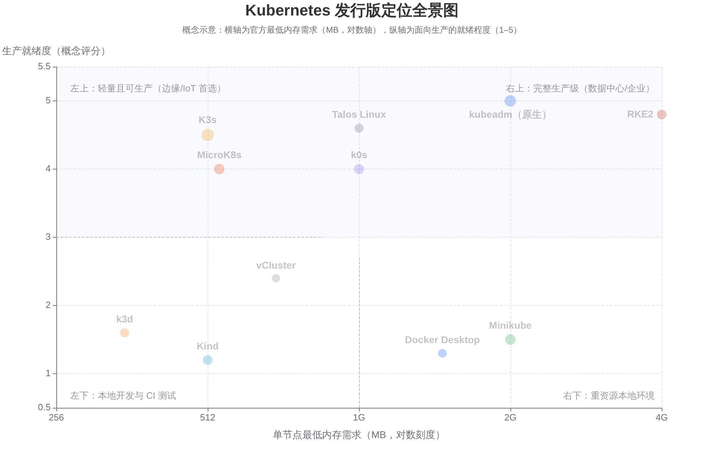
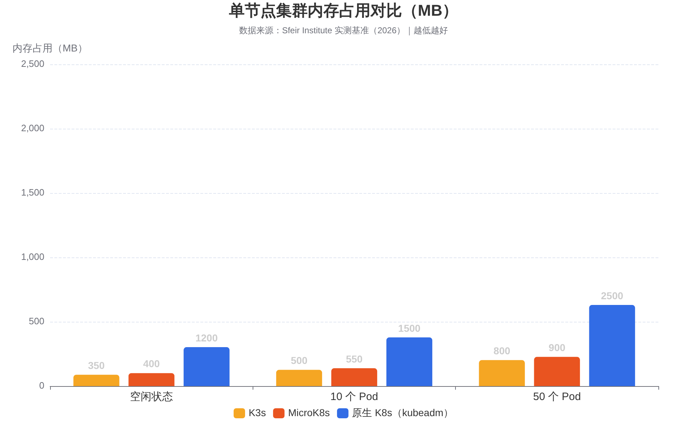
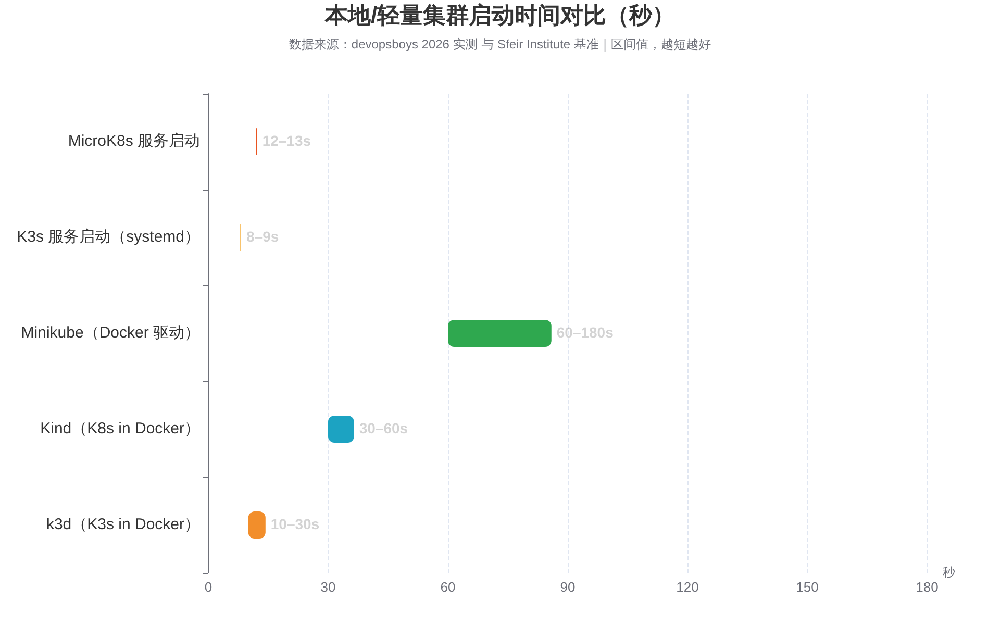
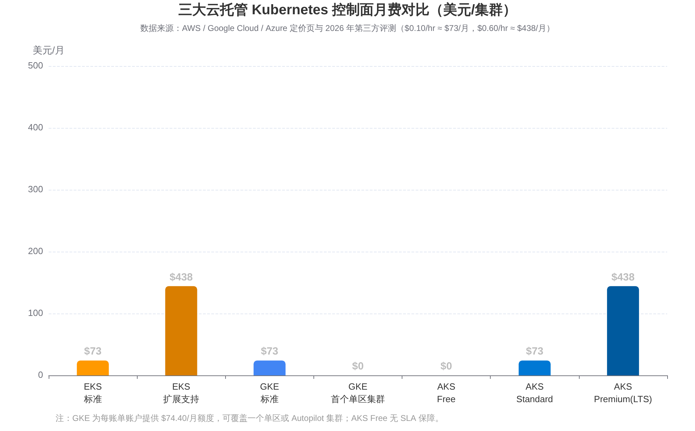

# Kubernetes 发行版全景对比：官方版、K3s、Kind、Minikube 及更多

> 调研基准时间：2026 年 8 月。上游 Kubernetes 最新稳定版为 **v1.36**（2026 年 4 月 22 日发布，最新补丁 v1.36.2 于 2026 年 6 月 9 日发布），项目同时维护 1.36 / 1.35 / 1.34 三个分支，v1.37 计划于 2026 年 8 月 26 日发布 [(Kubernetes)](https://kubernetes.io/releases/1.36/) 。

---

## 1. 摘要与选型速查

Kubernetes 本身是一个开源编排引擎，而"发行版"（distribution）是把这套引擎连同安装工具、默认组件、生命周期管理一起打包交付的形态。截至 2026 年，CNCF 的 Certified Kubernetes 认证计划下已有 **超过 90 个通过一致性认证的发行版与平台** [(Cloud Native Computing Foundation)](https://www.cncf.io/training/certification/software-conformance/) ，它们共享同一套 Kubernetes API，但在资源占用、运维复杂度、目标场景上差异巨大。据 CNCF 2025 年度调查，82% 的容器用户已在生产环境运行 Kubernetes [(sfeir.com)](https://institute.sfeir.com/en/kubernetes-training/deploy-first-cluster-kubernetes-30-minutes-kubeadm/) ，选对发行版直接决定了集群的部署成本与长期运维负担。

**一句话结论**：

- **学习与本地开发**：首选 **Minikube**（功能最全、文档最多）或 **Kind**（最快、CI 标配）；想要更轻更快可用 **k3d**。
- **边缘 / IoT / 轻量生产**：首选 **K3s**——单二进制不到 70MB、512MB 内存即可运行，且为生产而设计 [(K3sK3s)](https://k3s-io.github.io/) 。
- **企业生产（自托管）**：预算与人力充足选 **kubeadm + 原生 Kubernetes** 全量控制；安全合规驱动选 **RKE2**；Ubuntu 生态选 **MicroK8s**；偏好简洁与贴近上游选 **k0s**。
- **企业生产（免运维）**：直接上 **EKS / GKE / AKS**（国内对应 **ACK / TKE / CCE**）。
- **一体化企业平台**：需要内置 CI/CD、Web 控制台与企业支持，选 **Red Hat OpenShift**。

**选型速查表**：

| 你的场景 | 推荐发行版 | 关键理由 |
|---|---|---|
| 零基础学习 K8s | Minikube / Kind | 一条命令起集群，文档社区最成熟 [(Better Stack)](https://betterstack.com/community/guides/scaling-docker/minikube-vs-kubernetes/)  |
| CI 流水线临时集群 | Kind / k3d | 秒级创建销毁，容器即节点 [(rackspace.com)](https://spot.rackspace.com/blog/kind-kubernetes)  |
| 笔记本日常开发 | k3d / Rancher Desktop | 10–30 秒启动、内存占用最低 [(DevOpsBoys)](https://devopsboys.com/blog/kind-vs-k3d-vs-minikube-local-kubernetes-2026)  |
| 树莓派 / 边缘网关 | K3s | ARM 一等公民，512MB 内存起步 [(K3sK3s)](https://k3s-io.github.io/)  |
| 轻量但真实生产 | K3s / k0s / MicroK8s | 均通过 CNCF 认证，支持多节点 HA [(博客园)](https://www.cnblogs.com/2018/p/16099540.html)  |
| 政府 / 金融合规 | RKE2 / OpenShift | CIS 加固、FIPS 140-2、企业支持 [(RKE 2)](https://docs.rke2.io/)  |
| 大规模数据中心 | kubeadm 原生 / 云托管 | 轻量发行版约 50–100 节点后架构受限 [(shipyard.build)](https://shipyard.build/blog/k0s-k3s-k8s/)  |
| 不想运维控制面 | EKS / GKE / AKS / ACK | 控制面托管，SLA 99.95% [(CloudInsight)](https://cloudinsight.cc/zh/blog/kubernetes-cloud-services)  |

---

## 2. 什么是 Kubernetes 发行版：全景与分类

在 Kubernetes 世界里，"发行版"不同于 Linux 发行版的概念——它指的是**一种把 Kubernetes 跑起来的打包方式**：预配置好的组件集合 + 安装与运维工具 [(SUSE)](https://www.suse.com/c/rancher_blog/introduction-to-k3s-2/) 。上游 Kubernetes（vanilla Kubernetes）只提供各组件源码与二进制（kube-apiserver、kubelet、kube-scheduler 等），如何把它们组装成一个高可用集群，是各发行版要回答的问题。判断一个发行版是否"正宗"，业界通行标准是 CNCF 的**软件一致性认证**（Certified Kubernetes Conformance）：通过 Sonobuoy 一致性测试的发行版才能保证任意标准 K8s 工作负载可移植运行，且厂商每年至少提供一次最新版本更新 [(Cloud Native Computing Foundation)](https://www.cncf.io/training/certification/software-conformance/) 。

按定位可以把主流发行版分为五大类。**第一类是官方/上游形态**，即以 kubeadm 为代表的 vanilla Kubernetes 部署方式，组件完整、控制粒度最细，是所有其它发行版的"参照系" [(Kubernetes)](https://kubernetes.io/docs/setup/production-environment/tools/kubeadm/create-cluster-kubeadm/) 。**第二类是轻量级生产发行版**（K3s、k0s、MicroK8s、RKE2），它们删减或合并组件、打包为单二进制或单包，瞄准边缘、IoT、中小规模生产 [(shipyard.build)](https://shipyard.build/blog/k0s-k3s-k8s/) 。**第三类是本地开发/测试工具**（Minikube、Kind、k3d、Docker Desktop 内置 K8s、Rancher Desktop、vCluster），目标是在笔记本上一分钟内拿到一个一次性集群，不为生产负责 [(rackspace.com)](https://spot.rackspace.com/blog/kind-kubernetes) 。**第四类是企业级平台**（OpenShift、Rancher Prime），在 K8s 之上叠加 CI/CD、控制台、Operator 市场与商业支持 [(sfeir.com)](https://institute.sfeir.com/en/kubernetes-training/understanding-ecosystem-distributions-kubernetes/) 。**第五类是云托管服务**（EKS、GKE、AKS 及国内 ACK、TKE、CCE），由云厂商直接运维控制面 [(CloudInsight)](https://cloudinsight.cc/zh/blog/kubernetes-cloud-services) 。此外还有一些"跨界"形态，如 Talos Linux 把操作系统与 K8s 融为一体 [(Sidero Labs)](https://www.siderolabs.com/blog/talos-linux-vs-k3s/) 。

理解发行版还要理解上游版本节奏，因为所有发行版都跟着上游走。Kubernetes 每年约发布三个小版本，每个小版本获得约一年补丁支持 [(Kubernetes)](https://kubernetes.io/releases/) 。2026 年年中的一个关键变化是：**Kubernetes 1.35 是最后一个支持 containerd 1.x 的小版本**，1.36 起 containerd 2.0 成为事实上的最低要求；1.33 已于 2026 年 6 月 28 日结束支持 [(Powered Solutions | Digital Transformation)](https://ecorpit.com/kubernetes-1-35-containerd-2-0-migration-upgrade-2026/) 。另外上游在 1.36 中正式退役了 Ingress-NGINX 控制器（转向 Gateway API），这会影响所有发行版的默认 Ingress 选型 [(cloudnativenow.com)](https://cloudnativenow.com/features/what-to-expect-from-kubernetes-1-36/) 。

---

## 3. 官方 Kubernetes（上游 + kubeadm）

### 3.1 定位与架构

官方 Kubernetes（vanilla K8s）是 CNCF 直接维护的上游项目，也是一切发行版的源头。官方并不提供"一键安装包"，而是提供 **kubeadm** 这个集群引导工具：它执行创建最小可行集群所需的最少动作，自动完成 TLS 证书生成、etcd 配置、控制面组件（kube-apiserver、kube-controller-manager、kube-scheduler）部署与 admin kubeconfig 创建，所建集群本身就能通过 Kubernetes 一致性测试 [(Kubernetes)](https://kubernetes.io/docs/setup/production-environment/tools/kubeadm/create-cluster-kubeadm/) 。kubeadm 整体功能状态为 GA，还支持 bootstrap token 与集群升级等生命周期能力 [(Kubernetes)](https://kubernetes.io/docs/setup/production-environment/tools/kubeadm/create-cluster-kubeadm/) 。

kubeadm 的典型使用方式是：`kubeadm init` 初始化控制面，再安装一个 CNI 网络插件（如 Flannel、Calico），最后在各工作节点执行 `kubeadm join` [(sfeir.com)](https://institute.sfeir.com/en/kubernetes-training/deploy-first-cluster-kubernetes-30-minutes-kubeadm/) 。它的定位有三层：新手第一次正式尝试 Kubernetes 的途径；老用户自动化建集群、测试应用的基座；以及更大型安装器（如 Kubespray、kops、Rancher）的底层构建块 [(Kubernetes)](https://kubernetes.io/docs/setup/production-environment/tools/kubeadm/create-cluster-kubeadm/) 。社区也把 kubeadm 视为 CKA 认证与 K8s 管理员训练的必备技能 [(sfeir.com)](https://institute.sfeir.com/en/kubernetes-training/deploy-first-cluster-kubernetes-30-minutes-kubeadm/) 。

### 3.2 部署要求与运维成本

官方最低要求是每台 Linux 机器 **2GB 内存、控制面节点至少 2 核 CPU**，节点间网络全互通 [(Kubernetes)](https://kubernetes.io/docs/setup/production-environment/tools/kubeadm/create-cluster-kubeadm/) 。这看起来不高，但它只是"能跑起来"的下限——实测中一个空闲的单节点原生 K8s 集群内存占用约 **1.2GB**，跑到 50 个 Pod 时约 2.5GB，是 K3s 的三倍左右 [(sfeir.com)](https://institute.sfeir.com/en/kubernetes-training/k3s-vs-k8s-vs-microk8s-distribution-lightweight/) 。生产级部署还需要自行解决 etcd 高可用、控制面多副本、负载均衡、证书轮换、CNI/CSI 选型等一系列问题，社区普遍评价其安装耗时在 10–30 分钟级别，远长于轻量发行版的秒级 [(sfeir.com)](https://institute.sfeir.com/en/kubernetes-training/k3s-vs-k8s-vs-microk8s-distribution-lightweight/) 。

运维层面的关键事实是：kubeadm 只负责"出生证"，不负责"抚养"。它不管理云资源生命周期（负载均衡器、存储卷），CNI 要单独装，升级要逐节点执行 [(sfeir.com)](https://institute.sfeir.com/en/kubernetes-training/kubeadm-vs-kops-vs-k3s-deploy-cluster-kubernetes/) 。版本跟进上，官方发行版永远与上游同步——这是它相对所有下游发行版的独特优势：K3s、RKE2 等通常落后上游几天到几周（K3s 的目标是补丁版本一周内、次要版本 30 天内跟进） [(x-cmd.com)](https://cn.x-cmd.com/install/k3s/) 。

### 3.3 优势与局限

原生方案的优势在于**完整性与可控性**：没有任何组件被删减，所有 alpha/beta 特性、所有 in-tree 与 out-of-tree 扩展都可用；架构完全透明，适合需要深度定制调度器、apiserver 参数或自研控制面的团队。它同时也是理解 Kubernetes 内部机制的最佳路径——kubeadm 把 etcd、apiserver、scheduler 的关系完整地暴露给你，而不是藏进一个二进制里 [(sfeir.com)](https://institute.sfeir.com/en/kubernetes-training/deploy-first-cluster-kubernetes-30-minutes-kubeadm/) 。

局限同样清晰：**资源重、门槛高、运维重**。轻量发行版砍掉的东西——旧版/alpha 特性、in-tree 云厂商与存储驱动、多进程架构——恰恰都是原生 K8s 保留的 [(cloudification.io)](https://cloudification.io/cloud-blog/k3s-vs-k8s-which-one-is-better/) 。对于 50 节点以下的集群、边缘设备或笔记本环境，原生方案通常被认为是"杀鸡用牛刀" [(shipyard.build)](https://shipyard.build/blog/k0s-k3s-k8s/) 。因此业界的共识是：学习与超大规模生产用原生，中间地带交给轻量发行版或托管服务 [(sfeir.com)](https://institute.sfeir.com/en/kubernetes-training/k3s-vs-k8s-vs-microk8s-distribution-lightweight/) 。

---

## 4. 轻量级生产发行版：K3s、k0s、MicroK8s、RKE2

这一阵营是近五年增长最快的类别：它们都通过 CNCF 一致性认证、都能跑标准 K8s 工作负载，但把资源占用和部署复杂度压缩到原生方案的零头 [(博客园)](https://www.cnblogs.com/2018/p/16099540.html) 。

### 4.1 K3s：边缘计算的事实标准

K3s 由 Rancher Labs（现属 SUSE）开发，2020 年捐赠给 CNCF 成为 Sandbox 项目，是**第一个进入 CNCF 的 Kubernetes 发行版** [(SUSE)](https://www.suse.com/c/rancher_blog/introduction-to-k3s-2/) 。名字的由来是：Kubernetes 共 10 个字母缩写为 K8s，而 K3s 的目标是内存占用减半——"一半大小就是 5 个字母" [(cloudification.io)](https://cloudification.io/cloud-blog/k3s-vs-k8s-which-one-is-better/) 。它把整个控制面打包进一个**不到 70MB 的单二进制**，单进程运行，最低只需 **512MB 内存与 1 核 CPU**（server 节点 512MB，agent 减半），官方实测空闲内存约 350MB [(K3sK3s)](https://k3s-io.github.io/) 。

K3s 不是 fork，它保留完整 Kubernetes API，其轻量化手段包括：移除 in-tree 云厂商驱动与存储驱动（改用 addon）、默认用 **SQLite** 替代 etcd 作为单节点存储（HA 场景可用嵌入式 etcd、MySQL 或 PostgreSQL）、内置 containerd、Flannel、CoreDNS、Traefik Ingress、ServiceLB（Klipper）与 local-path-provisioner，开箱即用 [(cloudification.io)](https://cloudification.io/cloud-blog/k3s-vs-k8s-which-one-is-better/) 。它对 ARM64/ARMv7 做一等公民支持，从树莓派到 AWS a1.4xlarge 都能跑 [(K3sK3s)](https://k3s-io.github.io/) 。版本策略严格跟随上游，格式为 `v<k8s版本>+k3s<N>`，截至 2026 年 8 月最新为 **v1.36.3+k3s1** [(K3s)](https://docs.k3s.io/release-notes/v1.36.X) 。与 Minikube 等本地工具的本质区别在于：**K3s 从第一天起就是为生产设计的**——组件间使用独立 TLS 证书认证、安全默认配置 [(SUSE)](https://www.suse.com/c/rancher_blog/introduction-to-k3s-2/) 。

### 4.2 k0s：贴近上游的零依赖方案

k0s 由 Mirantis（Lens 背后的团队）主导维护，"0"代表 zero friction / zero dependencies / zero downtime 的设计目标 [(shipyard.build)](https://shipyard.build/blog/k0s-k3s-k8s/) 。它与 K3s 同样是单二进制、CNCF 认证的轻量发行版，但二进制更大（**160–300MB**），原因是 k0s 把 apiserver、etcd、kubelet、containerd、runc 甚至静态链接的 iptables 全部原样打包，不做 K3s 那样的组件合并 [(Cloud Native Computing Foundation)](https://www.cncf.io/blog/2024/12/06/understanding-k0s-a-lightweight-kubernetes-distribution-for-the-community/) 。

k0s 的哲学是**最大限度贴近上游、最小限度替用户做决定**：默认不捆绑 Ingress 控制器（K3s 捆绑 Traefik）、不内置 local-path provisioner、默认使用嵌入式 etcd（单节点也可用 SQLite），集群配置集中于一份 YAML [(Turing Pi)](https://turingpi.com/k3s-vs-k0s-vs-microk8s-vs-rke2-lightweight-kubernetes-arm-homelab/) 。因此它更适合"想要轻量的部署体验、但希望自己挑选 ingress/存储等组件"的团队。规模上，k0s 与 K3s 都被认为适合约 50–100 节点以内；更大规模时 SQLite/嵌入式 etcd 会成为瓶颈，应考虑原生 K8s 或托管服务 [(shipyard.build)](https://shipyard.build/blog/k0s-k3s-k8s/) 。配套的多集群管理工具是 k0smotron（可在管理集群内以容器方式运行控制面，集成 Cluster API） [(Cloud Native Computing Foundation)](https://www.cncf.io/blog/2024/12/06/understanding-k0s-a-lightweight-kubernetes-distribution-for-the-community/) 。截至 2026 年 8 月，k0s 最新版本为 **v1.36.3+k0s.2** [(Github)](https://github.com/k0sproject/k0s/releases) 。

### 4.3 MicroK8s：Canonical 的 Snap 化方案

MicroK8s 是 Canonical（Ubuntu 母公司）的轻量发行版，通过 **Snap 包**分发，一条 `snap install microk8s` 即可完成安装，天然获得事务化 OTA 更新与自动安全补丁 [(python | DeepWiki)](https://deepwiki.com/canonical/microk8s/1-overview) 。它最低内存需求约 **540MB**——MicroK8s 1.21 曾把上游多个二进制合并编译为单一二进制，使内存占用从 800MB 降到 540MB（降幅 32.5%），实测空闲约 400MB [(ZDNET)](https://www.zdnet.com/article/canonicals-mini-kubernetes-microk8s-has-been-optimized-for-raspberry-pi/) 。

MicroK8s 的差异化在于**模块化 addon 体系与零运维体验**：DNS、Ingress、Prometheus、Grafana、Istio、Knative、GPU 支持等都以 addon 形式按需启用 [(CloudThat)](https://www.cloudthat.com/resources/blog/unlocking-the-strong-power-of-kubernetes-with-microk8s/) 。高可用采用 **dqlite**（分布式 SQLite）而非 etcd，多节点集群可自动达成控制面 HA，这是轻量阵营中"自动 HA + 自动更新"做得最完整的一个 [(Turing Pi)](https://turingpi.com/k3s-vs-k0s-vs-microk8s-vs-rke2-lightweight-kubernetes-arm-homelab/) 。snap 的 strict confinement 还带来与宿主机操作系统的完全隔离，对边缘网关场景有安全加成 [(ZDNET)](https://www.zdnet.com/article/canonicals-mini-kubernetes-microk8s-has-been-optimized-for-raspberry-pi/) 。代价是：Snap 生态在非 Ubuntu 系发行版上接受度一般，资源占用也略高于 K3s [(Zesty)](https://zesty.co/finops-glossary/microk8s/) 。

### 4.4 RKE2：安全合规优先

RKE2（Rancher Kubernetes Engine 2，又称 RKE Government）是 Rancher 面向**企业数据中心与强合规场景**的发行版。它融合了 K3s 的易用性与 RKE1 对上游的紧密跟随：与 K3s 一样一条命令安装，但不像 K3s 那样为边缘场景做裁剪，控制面以静态 Pod 形式由 kubelet 管理，容器运行时为 containerd [(RKE 2)](https://docs.rke2.io/) 。

RKE2 的核心卖点是**默认安全**：默认配置即可在最少人工干预下通过 CIS Kubernetes Benchmark v1.7/v1.8，支持 FIPS 140-2 合规加密模块，构建流水线中用 Trivy 持续扫描 CVE；Secrets 默认静态加密，可选 DISA STIG 合规 [(RKE 2)](https://docs.rke2.io/) 。与 K3s 的关键差异包括：不支持 SQLite（只用嵌入式 etcd）、默认 Ingress 为 ingress-nginx、二进制约 125MB、内存需求明显更高（server 节点最低 **4GB**） [(oneuptime.com)](https://oneuptime.com/blog/post/2026-03-20-rke2-vs-k3s/view) 。因此 RKE2 与 K3s 并非替代关系，而是同一体系下"边缘轻量"与"企业合规"的双生子 [(oneuptime.com)](https://oneuptime.com/blog/post/2026-03-20-rke2-vs-k3s/view) 。

### 4.5 轻量阵营横向对比

四个轻量发行版都能覆盖"中小规模生产"这个甜蜜区，选择更多取决于生态偏好与合规要求：ARM 边缘场景 K3s 生态最成熟、教程与第三方资源最多；偏好自主选件选 k0s；Ubuntu 标准化环境选 MicroK8s；安全合规驱动选 RKE2 [(Turing Pi)](https://turingpi.com/k3s-vs-k0s-vs-microk8s-vs-rke2-lightweight-kubernetes-arm-homelab/) 。

| 维度 | K3s | k0s | MicroK8s | RKE2 |
|---|---|---|---|---|
| 背后厂商 | SUSE / Rancher（CNCF Sandbox） | Mirantis / Lens | Canonical | SUSE / Rancher |
| 打包形态 | 单二进制 <70MB [(K3sK3s)](https://k3s-io.github.io/)  | 单二进制 160–300MB [(shipyard.build)](https://shipyard.build/blog/k0s-k3s-k8s/)  | Snap 包 [(python | DeepWiki)](https://deepwiki.com/canonical/microk8s/1-overview)  | 二进制约 125MB [(oneuptime.com)](https://oneuptime.com/blog/post/2026-03-20-rke2-vs-k3s/view)  |
| 最低内存 | 512MB（server） [(devtron.ai)](https://devtron.ai/what-is-k3s)  | 约 1GB [(云质变)](http://yunzhibian.com/software-intelligence-platform-content127.html)  | 540MB [(ZDNET)](https://www.zdnet.com/article/canonicals-mini-kubernetes-microk8s-has-been-optimized-for-raspberry-pi/)  | 4GB（server） [(oneuptime.com)](https://oneuptime.com/blog/post/2026-03-20-rke2-vs-k3s/view)  |
| 默认存储 | SQLite；HA 可用 etcd/MySQL/PG [(cloudification.io)](https://cloudification.io/cloud-blog/k3s-vs-k8s-which-one-is-better/)  | 嵌入式 etcd [(Turing Pi)](https://turingpi.com/k3s-vs-k0s-vs-microk8s-vs-rke2-lightweight-kubernetes-arm-homelab/)  | dqlite [(Turing Pi)](https://turingpi.com/k3s-vs-k0s-vs-microk8s-vs-rke2-lightweight-kubernetes-arm-homelab/)  | 嵌入式 etcd [(oneuptime.com)](https://oneuptime.com/blog/post/2026-02-26-argocd-with-rancher-rke2/view)  |
| 默认 Ingress | Traefik [(devtron.ai)](https://devtron.ai/what-is-k3s)  | 无（自选） [(Turing Pi)](https://turingpi.com/k3s-vs-k0s-vs-microk8s-vs-rke2-lightweight-kubernetes-arm-homelab/)  | addon 自选 [(CloudThat)](https://www.cloudthat.com/resources/blog/unlocking-the-strong-power-of-kubernetes-with-microk8s/)  | ingress-nginx [(oneuptime.com)](https://oneuptime.com/blog/post/2026-03-20-rke2-vs-k3s/view)  |
| 安全合规 | 合理默认值 [(oneuptime.com)](https://oneuptime.com/blog/post/2026-03-20-rke2-vs-k3s/view)  | 合理默认值 | strict confinement [(ZDNET)](https://www.zdnet.com/article/canonicals-mini-kubernetes-microk8s-has-been-optimized-for-raspberry-pi/)  | CIS 加固 + FIPS 140-2 [(RKE 2)](https://docs.rke2.io/)  |
| 最新版本（2026.08） | v1.36.3+k3s1 [(K3s)](https://docs.k3s.io/release-notes/v1.36.X)  | v1.36.3+k0s.2 [(Github)](https://github.com/k0sproject/k0s/releases)  | 跟踪 1.3x 稳定通道 | 跟踪上游稳定版 |
| 典型场景 | 边缘/IoT/轻量生产/CI [(K3sK3s)](https://k3s-io.github.io/)  | 轻量生产、上游洁癖 | Ubuntu 生态、边缘网关 | 政府/金融/合规生产 |

下图是三组实测内存数据，可以直观看到轻量发行版与原生 K8s 的量级差距：空闲状态 K3s 约 350MB、MicroK8s 约 400MB、原生 K8s 约 1.2GB；负载到 50 个 Pod 时三者分别约 800MB / 900MB / 2.5GB [(sfeir.com)](https://institute.sfeir.com/en/kubernetes-training/k3s-vs-k8s-vs-microk8s-distribution-lightweight/) 。

---

## 5. 本地开发与测试工具：Minikube、Kind、k3d 等

这一阵营的共同目标是"在笔记本上快速得到一个一次性 K8s"，不为生产可靠性负责，但决定了开发者每天的幸福感。

### 5.1 Minikube：功能最全的老牌选择

Minikube 是 Kubernetes SIG 维护的官方本地工具，也是历史最久、文档最多、新手教程默认引用的方案 [(Better Stack)](https://betterstack.com/community/guides/scaling-docker/minikube-vs-kubernetes/) 。它通过**多驱动架构**支持 VirtualBox、KVM、HyperKit、Hyper-V、Docker、Podman 等多种后端，可以跑成 VM、容器甚至裸金属 [(Better Stack)](https://betterstack.com/community/guides/scaling-docker/minikube-vs-kubernetes/) 。集群内是完整的标准 Kubernetes 组件（API Server、Controller Manager、Scheduler、etcd、kubelet） [(Better Stack)](https://betterstack.com/community/guides/scaling-docker/minikube-vs-kubernetes/) 。

Minikube 的招牌是**丰富的 addon 生态与图形化体验**：Dashboard、Metrics Server、Ingress、Registry、存储供给一应俱全，`minikube tunnel` 还能直接提供 LoadBalancer 服务 [(Better Stack)](https://betterstack.com/community/guides/scaling-docker/minikube-vs-kubernetes/) 。近年它还在强化 AI 开发能力——支持 NVIDIA / AMD / Apple GPU 直通，并提供 AI Playground 教程 [(minikube)](https://minikube.sigs.k8s.io/docs/) 。短板是资源与速度：默认分配 2GB 内存，启动通常需要 1–3 分钟，多节点仍是实验特性 [(Better Stack)](https://betterstack.com/community/guides/scaling-docker/minikube-vs-kubernetes/) 。截至 2026 年 2 月最新版本为 **v1.38.1**，支持到 Kubernetes v1.35.1 [(minikube)](https://minikube.sigs.k8s.io/docs/) 。

### 5.2 Kind：CI 流水线的标配

Kind（Kubernetes IN Docker）由 Kubernetes SIG 维护，最初为**测试 Kubernetes 本身**而设计，后来成为本地开发与 CI/CD 的事实标准之一 [(automq.com)](https://www.automq.com/blog/minikube-vs-k3s-vs-kind-comparison-local-kubernetes-development) 。它的架构是把每个"节点"跑成一个 Docker 容器，容器内运行 kubeadm 与 kubelet，因此创建/销毁极快（典型 30–60 秒），且天然支持**多节点与 HA 控制面**——这是多数本地工具做不到的 [(automq.com)](https://www.automq.com/blog/minikube-vs-k3s-vs-kind-comparison-local-kubernetes-development) 。

Kind 通过 CNCF 一致性认证，跑的是真正的上游 Kubernetes，可通过指定 node 镜像精确控制 K8s 版本，空闲单节点集群内存约 463–581MiB [(automq.com)](https://www.automq.com/blog/minikube-vs-k3s-vs-kind-comparison-local-kubernetes-development) 。它可以从源码构建 Kubernetes 来测试，也支持 Podman、nerdctl 后端 [(rackspace.com)](https://spot.rackspace.com/blog/kind-kubernetes) 。局限是结构性的：集群生命周期绑定在单机 Docker 环境上，没有跨机 HA、没有开箱的持久化存储与负载均衡，**明确不为生产设计**；Ingress 等需要手工配置 [(rackspace.com)](https://spot.rackspace.com/blog/kind-kubernetes) 。2026 年中的常用版本为 **v0.32.0** [(T Recommendation H.263)](https://tech-insider.org/how-to-set-up-kubernetes-2026/) 。

### 5.3 k3d：把 K3s 装进 Docker

k3d 是 k3s 的 Docker 封装：每个节点是运行 k3s 的容器，兼具 k3s 的轻量与容器集群的创建速度——**典型 10–30 秒**，是三个主流本地方案中启动最快的 [(DevOpsBoys)](https://devopsboys.com/blog/kind-vs-k3d-vs-minikube-local-kubernetes-2026) 。它原生支持多节点、内置 LoadBalancer（Klipper），自带本地镜像仓库支持，非常适合快速迭代与多集群演练 [(DevOpsBoys)](https://devopsboys.com/blog/kind-vs-k3d-vs-minikube-local-kubernetes-2026) 。

需要注意的是 k3d 集群里跑的是 K3s 而非上游 K8s：默认捆绑 Traefik 与 ServiceLB，存储后端是 SQLite/local-path，与"标准"集群存在少量行为差异；如果生产环境是原生 K8s，严格的对齐测试仍应交给 Kind [(ARMO)](https://www.armosec.io/blog/best-local-kubernetes-tools/) 。目前 k3d 稳定线为 v5.7.x [(k3d)](https://k3d.io/v5.7.5/) 。

### 5.4 桌面一体化工具：Docker Desktop、Rancher Desktop、OrbStack、Podman Desktop

**Docker Desktop** 内置的单节点 Kubernetes 是"零配置拿集群"的最短路径，API server 通过 localhost 绑定，网络暴露面小，但几乎不可调优（PSS、准入控制器、审计日志都难以配置），多节点与 HA 均不支持 [(rackspace.com)](https://spot.rackspace.com/blog/kind-kubernetes) 。另外要注意其商业模式：超过 250 名员工或年收入 1000 万美元的企业使用需付费订阅（Business 档位最高 24 美元/人/月） [(T Recommendation H.263)](https://tech-insider.org/au/orbstack-vs-rancher-desktop-vs-colima-2026/) 。

**Rancher Desktop**（SUSE，Apache 2.0）是这个类别中 Kubernetes 体验最强的：内置 k3s、可在设置中选择 K8s 版本以匹配生产集群，跨 macOS / Windows / Linux，任意规模企业免费使用 [(T Recommendation H.263)](https://tech-insider.org/au/orbstack-vs-rancher-desktop-vs-colima-2026/) 。**OrbStack** 是 macOS 独占的商业软件（个人免费、商用 8 美元/人/月），以极致性能著称——空闲内存约 300MB，仅为 Docker Desktop（约 1.5GB）的五分之一，容器冷启动小于 1 秒，还支持 ClusterIP 直连与 LoadBalancer IP [(T Recommendation H.263)](https://tech-insider.org/au/orbstack-vs-rancher-desktop-vs-colima-2026/) 。**Podman Desktop** 走 daemonless/rootless 的安全路线，通常借助 Kind 提供本地集群，并能用 `podman generate kube` 把本地容器导出为 K8s YAML [(T Recommendation H.263)](https://tech-insider.org/au/orbstack-vs-rancher-desktop-vs-colima-2026/) 。

### 5.5 vCluster：集群里的虚拟集群

vCluster（Loft Labs）走了另一条路：在**现有集群的命名空间内**运行一个轻量虚拟控制面，让用户得到一个行为与真实集群无异的"虚拟集群"。它同样是通过 CNCF 一致性认证的发行版 [(vcluster)](https://www.vcluster.com/blog/vcluster-plugin-system-and-sdk) 。

vCluster 解决的核心问题是**多租户与测试隔离**：比纯 namespace 隔离更强（每个租户有独立的 apiserver 与 CRD 空间），又比为每个租户开独立物理集群便宜得多，常用于开发者自助环境、CI/CD 临时环境与企业内部平台（Loft） [(vcluster)](https://www.vcluster.com/blog/vcluster-plugin-system-and-sdk) 。

### 5.6 本地工具横向对比

2026 年的共识是：**CI 选 Kind（最快最标准），日常开发选 k3d（最轻）或 Rancher Desktop（功能全），学习与排障选 Minikube（addons 与文档最全），图省事且只用单节点可用 Docker Desktop** [(DevOpsBoys)](https://devopsboys.com/blog/kind-vs-k3d-vs-minikube-local-kubernetes-2026) 。安全视角上还有一个常被忽略的点：本地集群同样会改变笔记本的网络暴露与凭证存储，45% 的 K8s 安全事件源于配置错误，本地与生产策略漂移是最大的隐患 [(ARMO)](https://www.armosec.io/blog/best-local-kubernetes-tools/) 。

| 维度 | Minikube | Kind | k3d | Docker Desktop |
|---|---|---|---|---|
| 集群形态 | VM / 容器 / 裸金属 [(Better Stack)](https://betterstack.com/community/guides/scaling-docker/minikube-vs-kubernetes/)  | Docker 容器即节点 [(automq.com)](https://www.automq.com/blog/minikube-vs-k3s-vs-kind-comparison-local-kubernetes-development)  | 容器内跑 K3s [(Github)](https://github.com/k3d-Kubernetes)  | 内置单节点 [(rackspace.com)](https://spot.rackspace.com/blog/kind-kubernetes)  |
| K8s 血统 | 原生上游 [(博客园)](https://www.cnblogs.com/2018/p/16099540.html)  | 原生上游 [(automq.com)](https://www.automq.com/blog/minikube-vs-k3s-vs-kind-comparison-local-kubernetes-development)  | K3s（轻量发行版） [(DevOpsBoys)](https://devopsboys.com/blog/kind-vs-k3d-vs-minikube-local-kubernetes-2026)  | 原生上游 |
| 启动速度 | 1–3 分钟 [(DevOpsBoys)](https://devopsboys.com/blog/kind-vs-k3d-vs-minikube-local-kubernetes-2026)  | 30–60 秒 [(DevOpsBoys)](https://devopsboys.com/blog/kind-vs-k3d-vs-minikube-local-kubernetes-2026)  | 10–30 秒 [(DevOpsBoys)](https://devopsboys.com/blog/kind-vs-k3d-vs-minikube-local-kubernetes-2026)  | 快（常驻） [(rackspace.com)](https://spot.rackspace.com/blog/kind-kubernetes)  |
| 多节点/HA | 实验性 [(Better Stack)](https://betterstack.com/community/guides/scaling-docker/minikube-vs-kubernetes/)  | 原生支持 [(rackspace.com)](https://spot.rackspace.com/blog/kind-kubernetes)  | 原生支持 [(DevOpsBoys)](https://devopsboys.com/blog/kind-vs-k3d-vs-minikube-local-kubernetes-2026)  | 不支持 [(rackspace.com)](https://spot.rackspace.com/blog/kind-kubernetes)  |
| LoadBalancer | `minikube tunnel` [(Better Stack)](https://betterstack.com/community/guides/scaling-docker/minikube-vs-kubernetes/)  | 需 MetalLB [(DevOpsBoys)](https://devopsboys.com/blog/kind-vs-k3d-vs-minikube-local-kubernetes-2026)  | 内置 [(DevOpsBoys)](https://devopsboys.com/blog/kind-vs-k3d-vs-minikube-local-kubernetes-2026)  | localhost 直连 [(rackspace.com)](https://spot.rackspace.com/blog/kind-kubernetes)  |
| GPU 支持 | 支持（N/A/Apple） [(minikube)](https://minikube.sigs.k8s.io/docs/)  | 不支持 [(DevOpsBoys)](https://devopsboys.com/blog/kind-vs-k3d-vs-minikube-local-kubernetes-2026)  | 有限 [(DevOpsBoys)](https://devopsboys.com/blog/kind-vs-k3d-vs-minikube-local-kubernetes-2026)  | 有限 |
| 资源占用 | 高（默认 2GB） [(Better Stack)](https://betterstack.com/community/guides/scaling-docker/minikube-vs-kubernetes/)  | 低（约 0.5GB） [(automq.com)](https://www.automq.com/blog/minikube-vs-k3s-vs-kind-comparison-local-kubernetes-development)  | 最低 [(DevOpsBoys)](https://devopsboys.com/blog/kind-vs-k3d-vs-minikube-local-kubernetes-2026)  | 中（空闲约 1.5GB） [(PkgPulse)](https://www.pkgpulse.com/guides/podman-vs-docker-desktop-vs-orbstack-container-tools-2026)  |
| 最佳场景 | 学习/功能验证 | CI、多节点测试 [(rackspace.com)](https://spot.rackspace.com/blog/kind-kubernetes)  | 快速日常开发 [(DevOpsBoys)](https://devopsboys.com/blog/kind-vs-k3d-vs-minikube-local-kubernetes-2026)  | 极简单节点 [(rackspace.com)](https://spot.rackspace.com/blog/kind-kubernetes)  |

---

## 6. 专用与新兴形态

### 6.1 Talos Linux：操作系统即发行版

Talos Linux（Sidero Labs）严格说不是 K8s 发行版，而是**专为运行上游 Kubernetes 设计的不可变 Linux 发行版**：它替代传统 OS，负责安装、配置、加固原版 Kubernetes，与"K3s + 传统 Linux"处于不同层级——两者甚至可以叠加使用 [(Sidero Labs)](https://www.siderolabs.com/blog/talos-linux-vs-k3s/) 。

Talos 的激进之处在于：**没有 SSH、没有 shell、没有包管理器**，根文件系统是只读 SquashFS，所有管理通过 mTLS 认证的 gRPC API（`talosctl`）以声明式配置完成，系统升级为原子化 A/B 切换 [(Stribog)](https://stribog.com/blog/talos-linux-immutable-kubernetes-os-security-case) 。这使攻击面与配置漂移降到极低——容器逃逸者无法在节点上写入任何持久化后门 [(Stribog)](https://stribog.com/blog/talos-linux-immutable-kubernetes-os-security-case) 。代价是运维习惯要彻底改造（不能登录机器 debug），但 `talosctl` 内置了抓包、日志、健康检查等工具弥补 [(a-cup-of.coffee)](https://a-cup-of.coffee/blog/talos/) 。Talos 支持裸金属、各主流云平台、虚拟化与树莓派等 SBC，最新稳定版为 **v1.12.x**（1.13 于 2026 年 4 月发布，支持 K8s 1.36–1.31） [(Github)](https://github.com/siderolabs/talos/releases) 。

### 6.2 边缘扩展：KubeEdge 与 OpenYurt

当需求从"在边缘跑一个小集群"变成"把成百上千个边缘节点纳入统一编排"时，K3s 这类独立小集群就不够用了，需要云边协同架构。**KubeEdge**（CNCF 孵化，华为主导）与 **OpenYurt**（CNCF 孵化，阿里云主导）都提供边缘节点断网自治与云边协同能力：KubeEdge 原生支持 DeviceTwin 设备管理与离线自治，OpenYurt 擅长把存量 K8s 集群反向延伸到边缘 [(云质变)](http://yunzhibian.com/software-intelligence-platform-content127.html) 。国内工业边缘场景的五维横评显示，K3s 胜在生态与上手成本，KubeEdge/OpenYurt 胜在断网自治与云边协同 [(云质变)](http://yunzhibian.com/software-intelligence-platform-content127.html) 。

这一类方案的取舍逻辑与轻量发行版不同：K3s 把每个边缘站点当作独立集群来简化，KubeEdge/OpenYurt 则把边缘节点逻辑上并入中心集群来统一管理。前者的代价是集群数量爆炸时的治理复杂度，后者的代价是架构侵入性与对厂商生态的绑定 [(云质变)](http://yunzhibian.com/software-intelligence-platform-content127.html) 。实践中两者并不互斥——不少团队用 K3s 作为站点级底座，再用 KubeEdge 或 Rancher Fleet 做跨站点编排。

---

## 7. 企业级平台：OpenShift 与 Rancher

### 7.1 Red Hat OpenShift / OKD

OpenShift 是**企业部署量最大的 Kubernetes 发行版**，Red Hat 将其定位为"应用平台"而非单纯的编排器 [(sfeir.com)](https://institute.sfeir.com/en/kubernetes-training/understanding-ecosystem-distributions-kubernetes/) 。控制面是未修改的上游 Kubernetes，价值在于捆绑层：OperatorHub 认证算子市场、Source-to-Image（免 Dockerfile 构建）、Routes（Ingress 之上的抽象）、Security Context Constraints、完整 Web 控制台，以及 Tekton、Argo CD、Service Mesh、KubeVirt 等可选组件 [(sfeir.com)](https://institute.sfeir.com/en/kubernetes-training/understanding-ecosystem-distributions-kubernetes/) 。底座操作系统是 RHEL CoreOS，容器运行时为 CRI-O [(tbs.tech)](https://www.tbs.tech/red-hat-openshift-the-basics/) 。

代价主要有三：资源开销比原生 K8s 高约 **15%** [(sfeir.com)](https://institute.sfeir.com/en/kubernetes-training/understanding-ecosystem-distributions-kubernetes/) ；商业订阅价格约 **1,000–2,500 美元 / 2 核 / 年**（另有 Premium 支持与 ACS、ODF 等付费组件） [(T Recommendation H.263)](https://tech-insider.org/openshift-vs-kubernetes-2026/) ；OpenShift 专有资源（Routes、BuildConfig、ImageStream、SCC）迁移回原生 K8s 时需要转换，官方迁移工具（Konveyor）可自动化大部分工作 [(T Recommendation H.263)](https://tech-insider.org/openshift-vs-kubernetes-2026/) 。开源上游版本是 **OKD**（基于 Fedora CoreOS，无商业支持，版本跟进更快），适合学习与非生产环境 [(faddom.com)](https://faddom.com/openshift-pricing-in-2026-managed-vs-self-managed/) 。托管变体包括 ROSA（AWS）、OpenShift Dedicated 与 ROKS（IBM Cloud） [(abdulrahmanh.com)](https://abdulrahmanh.com/blog/openshift) 。

### 7.2 Rancher 管理平台（注意：它不是发行版）

Rancher 常被误当作发行版，实际上它是**多集群管理平台**：本身不定义 K8s 形态，而是统一纳管 RKE2、K3s、EKS、GKE、AKS 等各种集群，提供 Web UI、认证授权、应用目录与 Fleet（GitOps 多集群分发） [(devtron.ai)](https://devtron.ai/blog/rancher-kubernetes-a-quick-installation-guide-for-rke2/) 。SUSE 体系内的分工是：**K3s 管边缘、RKE2 管数据中心合规、Rancher 管全局**。对于"发行版对比"而言，Rancher 是叠加在发行版之上的管理层，选型时应与发行版决策分开评估。

生产环境使用 Rancher 还需要一套独立的安全加固功课：它本身应部署在加固过的发行版（如 CIS profile 的 RKE2）之上，配合可信 CA 证书、Helm 方式高可用安装等最佳实践，否则管理面本身会成为集群群的最大单点风险 [(oneuptime.com)](https://oneuptime.com/blog/post/2026-03-19-rancher-harden-production/view) 。对只需要单一集群的小团队来说，引入 Rancher 管理面的收益有限；但当集群数量增长到跨环境、跨云时，统一管理平面几乎是从"脚本运维"走向"平台工程"的必经之路。

---

## 8. 云托管服务

### 8.1 EKS vs GKE vs AKS

三大云托管服务都把 etcd 集群、API server 高可用与控制面补丁收归厂商负责，但在数据面抽象程度、版本跟进速度与计费上差异明显 [(cloudoptimo.com)](https://www.cloudoptimo.com/blog/eks-vs-gke-vs-aks-best-managed-kubernetes-service-in-2026/) 。2026 年的格局：**GKE 体验最精致**（Autopilot 免节点管理、发布通道升级最顺滑、版本跟进最快——Rapid 通道在上游发布后约 2 周可用）；**EKS 最灵活、生态最广**（市场份额约 45%），但运维负担与控制面成本最高；**AKS 是"黑马"**，2023 年后大幅追赶，Entra ID 集成最深，控制面 Free 档免费 [(EdgeServers)](https://www.edgeservers.com.au/pt/articles/eks-vs-gke-vs-aks-2026) 。多家第三方评测给绿field项目的排序是 GKE > AKS > EKS，但"已有云在哪就用哪家的"几乎总是正确答案——跨云迁移生态的成本远超编排层差异 [(EdgeServers)](https://www.edgeservers.com.au/pt/articles/eks-vs-gke-vs-aks-2026) 。

| 维度 | Amazon EKS | Google GKE | Azure AKS |
|---|---|---|---|
| 控制面费用 | $0.10/hr（约 $73/月） [(CloudInsight)](https://cloudinsight.cc/zh/blog/kubernetes-cloud-services)  | $0.10/hr，首个单区/Autopilot 集群可用 $74.40 额度抵扣 [(CloudInsight)](https://cloudinsight.cc/zh/blog/kubernetes-cloud-services)  | Free 档 $0（无 SLA）；Standard $0.10/hr [(CloudInsight)](https://cloudinsight.cc/zh/blog/kubernetes-cloud-services)  |
| 控制面 SLA | 99.95%（Provisioned CP 可达 99.99%） [(Time ETL Are Transforming Healthcare IT Leadership)](https://technologymatch.com/blog/eks-vs-aks-vs-gke-managed-kubernetes-guide)  | 99.95%（区域/Autopilot） [(Time ETL Are Transforming Healthcare IT Leadership)](https://technologymatch.com/blog/eks-vs-aks-vs-gke-managed-kubernetes-guide)  | 99.95%（需启用可用区） [(Time ETL Are Transforming Healthcare IT Leadership)](https://technologymatch.com/blog/eks-vs-aks-vs-gke-managed-kubernetes-guide)  |
| 版本跟进 | 最慢（约 4–8 周） [(cloudsoftsol.com)](https://cloudsoftsol.com/interview-questions/eks-aks-gke-interview-questions-2026/)  | 最快（Rapid 约 2 周） [(cloudsoftsol.com)](https://cloudsoftsol.com/interview-questions/eks-aks-gke-interview-questions-2026/)  | 居中（约 3–6 周） [(cloudsoftsol.com)](https://cloudsoftsol.com/interview-questions/eks-aks-gke-interview-questions-2026/)  |
| 扩展支持 | 延长约 12 个月，$0.60/hr [(Powered Solutions | Digital Transformation)](https://ecorpit.com/kubernetes-1-35-containerd-2-0-migration-upgrade-2026/)  | Autopilot 最长约 30 个月 [(cloudsoftsol.com)](https://cloudsoftsol.com/interview-questions/eks-aks-gke-interview-questions-2026/)  | LTS 约 24 个月（Premium $0.60/hr） [(cloudsoftsol.com)](https://cloudsoftsol.com/interview-questions/eks-aks-gke-interview-questions-2026/)  |
| 节点自动化 | Karpenter / Auto Mode [(cloudoptimo.com)](https://www.cloudoptimo.com/blog/eks-vs-gke-vs-aks-best-managed-kubernetes-service-in-2026/)  | Autopilot（按 Pod 计费） [(cloudoptimo.com)](https://www.cloudoptimo.com/blog/eks-vs-gke-vs-aks-best-managed-kubernetes-service-in-2026/)  | Automatic / Karpenter（预览） [(CloudWizz)](https://cloudwizz.com/blog/eks-vs-gke-vs-aks-2026/)  |
| 升级体验 | 最手动（控制面/addon/AMI 需编排） [(cloudsoftsol.com)](https://cloudsoftsol.com/interview-questions/eks-aks-gke-interview-questions-2026/)  | 最顺滑（发布通道 + surge） [(cloudsoftsol.com)](https://cloudsoftsol.com/interview-questions/eks-aks-gke-interview-questions-2026/)  | 可靠自动升级 [(cloudsoftsol.com)](https://cloudsoftsol.com/interview-questions/eks-aks-gke-interview-questions-2026/)  |
| 市场份额（2024 调查） | 约 45% [(CloudInsight)](https://cloudinsight.cc/zh/blog/kubernetes-cloud-services)  | 约 25% [(CloudInsight)](https://cloudinsight.cc/zh/blog/kubernetes-cloud-services)  | 约 20% [(CloudInsight)](https://cloudinsight.cc/zh/blog/kubernetes-cloud-services)  |

控制面费用层面有一个 2026 年的重要变化：**三家的标准控制面管理费已拉平为 $0.10/小时**，早年"GKE 免费"的选型理由已不成立；能把控制面压到 $0 的只剩两种特例——GKE 账户内第一个单区集群（用免费额度）与 AKS Free 档（放弃 SLA） [(CloudInsight)](https://cloudinsight.cc/zh/blog/kubernetes-cloud-services) 。真正拉开成本差距的是版本支持窗口：超出约 14 个月标准支持期后，EKS 扩展支持按 $0.60/小时（约 $438/月/集群）收费，多集群环境下这是一笔需要提前规划的隐性支出 [(Powered Solutions | Digital Transformation)](https://ecorpit.com/kubernetes-1-35-containerd-2-0-migration-upgrade-2026/) 。

### 8.2 国内托管：ACK / TKE / CCE

国内三大云的托管 K8s 在 2026 年同样高度成熟，且各有侧重。**腾讯云 TKE** 主打超大规模与弹性，单集群支持 50,000+ 节点，为四家中最高，并提供 Serverless 超级节点（秒级 Pod 启动）与 Crane 成本优化 [(腾讯云)](https://developer.cloud.tencent.com/article/2725294) 。**阿里云 ACK** 生态最完善，支持 15,000 节点规模，版本迭代快（2026 年 7 月已支持 1.35），Serverless 形态 ASK 按 ECI 实例秒级计费 [(腾讯云)](https://developer.cloud.tencent.com/article/2725294) 。**华为云 CCE** 强调软硬协同与国产化适配（昇腾/鲲鹏），控制面免费，适合信创与混合云项目；版本跟进最快，已支持 1.36 [(腾讯云)](https://developer.cloud.tencent.com/article/2725294) 。三家的控制面 SLA 均为 99.95% [(腾讯云)](https://developer.cloud.tencent.com/article/2725294) 。

计费模式差异值得注意：CCE 控制面免费（仅收节点/存储/网络），ACK 基础版控制面免费而 Pro 版收管理费，TKE 托管集群按节点计费、Serverless 按 Pod 计费 [(博客园)](https://www.cnblogs.com/hanease/p/19598495) 。对成本敏感的多集群用户，这一差异在长期账单上相当可观。

---

## 9. 综合对比总表与分场景选型建议

### 9.1 发行版综合对比总表

下表汇总本报告涉及的全部主流方案的核心指标（"最低内存"指官方或实测的可运行下限，生产环境请预留余量）。读表时需要注意两点：其一，"CNCF 认证"只保证 API 一致性，不代表生产适用性——Kind、Docker Desktop 同样通过认证，但定位是本地工具 [(rackspace.com)](https://spot.rackspace.com/blog/kind-kubernetes) ；其二，"最低内存"是可启动下限而非推荐配置，官方建议与实测空闲占用往往更高（参见第 4.5 节的实测图） [(sfeir.com)](https://institute.sfeir.com/en/kubernetes-training/k3s-vs-k8s-vs-microk8s-distribution-lightweight/) 。

| 发行版 | 类别 | 最低内存 | 多节点/HA | CNCF 认证 | 生产可用 | 核心卖点 | 主要短板 |
|---|---|---|---|---|---|---|---|
| 原生 K8s（kubeadm） | 官方 | 2GB [(Kubernetes)](https://kubernetes.io/docs/setup/production-environment/tools/kubeadm/create-cluster-kubeadm/)  | ✅ | ✅（基准） | ✅ | 完整可控、永远最新 [(Kubernetes)](https://kubernetes.io/docs/setup/production-environment/tools/kubeadm/create-cluster-kubeadm/)  | 部署运维最重 [(sfeir.com)](https://institute.sfeir.com/en/kubernetes-training/k3s-vs-k8s-vs-microk8s-distribution-lightweight/)  |
| K3s | 轻量生产 | 512MB [(devtron.ai)](https://devtron.ai/what-is-k3s)  | ✅ | ✅ [(K3sK3s)](https://k3s-io.github.io/)  | ✅ | 极致轻量、边缘事实标准 [(K3sK3s)](https://k3s-io.github.io/)  | 超大规模受限 [(shipyard.build)](https://shipyard.build/blog/k0s-k3s-k8s/)  |
| k0s | 轻量生产 | 约 1GB [(云质变)](http://yunzhibian.com/software-intelligence-platform-content127.html)  | ✅ | ✅ [(Cloud Native Computing Foundation)](https://www.cncf.io/blog/2024/12/06/understanding-k0s-a-lightweight-kubernetes-distribution-for-the-community/)  | ✅ | 零依赖、贴近上游 [(Cloud Native Computing Foundation)](https://www.cncf.io/blog/2024/12/06/understanding-k0s-a-lightweight-kubernetes-distribution-for-the-community/)  | 生态小于 K3s [(Turing Pi)](https://turingpi.com/k3s-vs-k0s-vs-microk8s-vs-rke2-lightweight-kubernetes-arm-homelab/)  |
| MicroK8s | 轻量生产 | 540MB [(ZDNET)](https://www.zdnet.com/article/canonicals-mini-kubernetes-microk8s-has-been-optimized-for-raspberry-pi/)  | ✅（dqlite 自动 HA） [(Turing Pi)](https://turingpi.com/k3s-vs-k0s-vs-microk8s-vs-rke2-lightweight-kubernetes-arm-homelab/)  | ✅ [(博客园)](https://www.cnblogs.com/2018/p/16099540.html)  | ✅ | snap 自动更新、addon 丰富 [(Canonical)](https://canonical.com/microk8s/compare)  | Snap 生态绑定 [(Zesty)](https://zesty.co/finops-glossary/microk8s/)  |
| RKE2 | 企业生产 | 4GB [(oneuptime.com)](https://oneuptime.com/blog/post/2026-03-20-rke2-vs-k3s/view)  | ✅ | ✅ [(RKE 2)](https://docs.rke2.io/)  | ✅ | CIS 加固、FIPS [(RKE 2)](https://docs.rke2.io/)  | 资源占用较高 [(oneuptime.com)](https://oneuptime.com/blog/post/2026-03-20-rke2-vs-k3s/view)  |
| Minikube | 本地工具 | 2GB [(Better Stack)](https://betterstack.com/community/guides/scaling-docker/minikube-vs-kubernetes/)  | 实验性 [(Better Stack)](https://betterstack.com/community/guides/scaling-docker/minikube-vs-kubernetes/)  | ✅ [(博客园)](https://www.cnblogs.com/2018/p/16099540.html)  | ❌ | addons 最全、文档最多 [(Better Stack)](https://betterstack.com/community/guides/scaling-docker/minikube-vs-kubernetes/)  | 重、慢 [(DevOpsBoys)](https://devopsboys.com/blog/kind-vs-k3d-vs-minikube-local-kubernetes-2026)  |
| Kind | 本地工具 | 约 0.5GB [(automq.com)](https://www.automq.com/blog/minikube-vs-k3s-vs-kind-comparison-local-kubernetes-development)  | ✅（容器内） [(rackspace.com)](https://spot.rackspace.com/blog/kind-kubernetes)  | ✅ [(rackspace.com)](https://spot.rackspace.com/blog/kind-kubernetes)  | ❌ | CI 标配、多节点快建 [(rackspace.com)](https://spot.rackspace.com/blog/kind-kubernetes)  | 无生产持久化/LB [(rackspace.com)](https://spot.rackspace.com/blog/kind-kubernetes)  |
| k3d | 本地工具 | 极低 [(博客园)](https://www.cnblogs.com/2018/p/16099540.html)  | ✅（容器内） [(DevOpsBoys)](https://devopsboys.com/blog/kind-vs-k3d-vs-minikube-local-kubernetes-2026)  | ✅（基于 K3s） | ❌ | 10–30 秒启动 [(DevOpsBoys)](https://devopsboys.com/blog/kind-vs-k3d-vs-minikube-local-kubernetes-2026)  | 与上游有行为差异 [(ARMO)](https://www.armosec.io/blog/best-local-kubernetes-tools/)  |
| Docker Desktop K8s | 本地工具 | 约 1.5GB [(PkgPulse)](https://www.pkgpulse.com/guides/podman-vs-docker-desktop-vs-orbstack-container-tools-2026)  | ❌ [(rackspace.com)](https://spot.rackspace.com/blog/kind-kubernetes)  | ✅ | ❌ | 零配置 [(rackspace.com)](https://spot.rackspace.com/blog/kind-kubernetes)  | 不可调、商业许可 [(ARMO)](https://www.armosec.io/blog/best-local-kubernetes-tools/)  |
| Rancher Desktop | 本地工具 | 中（内置 K3s） [(T Recommendation H.263)](https://tech-insider.org/au/orbstack-vs-rancher-desktop-vs-colima-2026/)  | 单节点 | ✅（内置 K3s） | ❌ | 版本可选、免费 [(T Recommendation H.263)](https://tech-insider.org/au/orbstack-vs-rancher-desktop-vs-colima-2026/)  | 性能一般 [(T Recommendation H.263)](https://tech-insider.org/au/orbstack-vs-rancher-desktop-vs-colima-2026/)  |
| vCluster | 虚拟集群 | 依宿主集群 | 依宿主集群 | ✅ [(vcluster)](https://www.vcluster.com/blog/vcluster-plugin-system-and-sdk)  | 视场景 | 多租户隔离、低成本 [(vcluster)](https://www.vcluster.com/blog/vcluster-plugin-system-and-sdk)  | 依赖宿主集群 |
| Talos Linux | OS 级 | 低（极简 OS） [(DEV Community)](https://dev.to/alexandrev/talos-a-modern-kubernetes-optimized-linux-distribution-1pfg)  | ✅ | ✅ | ✅ | 不可变、无 SSH、API 管理 [(DEV Community)](https://dev.to/alexandrev/talos-a-modern-kubernetes-optimized-linux-distribution-1pfg)  | 运维习惯改造大 [(a-cup-of.coffee)](https://a-cup-of.coffee/blog/talos/)  |
| OpenShift | 企业平台 | 高（约 +15%） [(sfeir.com)](https://institute.sfeir.com/en/kubernetes-training/understanding-ecosystem-distributions-kubernetes/)  | ✅ | ✅ | ✅ | 一体化平台、企业支持 [(sfeir.com)](https://institute.sfeir.com/en/kubernetes-training/understanding-ecosystem-distributions-kubernetes/)  | 订阅昂贵 [(T Recommendation H.263)](https://tech-insider.org/openshift-vs-kubernetes-2026/)  |
| EKS/GKE/AKS | 云托管 | N/A（控制面托管） | ✅ | ✅ | ✅ | 免运维、SLA 99.95% [(Time ETL Are Transforming Healthcare IT Leadership)](https://technologymatch.com/blog/eks-vs-aks-vs-gke-managed-kubernetes-guide)  | 控制面月费+锁定 [(CloudInsight)](https://cloudinsight.cc/zh/blog/kubernetes-cloud-services)  |
| ACK/TKE/CCE | 云托管（国内） | N/A | ✅（最大 5 万节点） [(腾讯云)](https://developer.cloud.tencent.com/article/2725294)  | ✅ | ✅ | 国内合规与生态 [(博客园)](https://www.cnblogs.com/hanease/p/19598495)  | 国际站生态差异 |

从总表可以提炼出三条贯穿全报告的规律。**轻量与生产不再矛盾**：K3s、k0s、MicroK8s 以几百 MB 的代价拿到了完整的 CNCF 认证与 HA 能力，"小集群只能当玩具"的时代已经过去 [(博客园)](https://www.cnblogs.com/2018/p/16099540.html) 。**本地工具的分化点是速度与血统**：要最快选 k3d、要最贴近上游选 Kind、要功能最全选 Minikube，三者的差距在 2026 年已经足够清晰，按习惯任选其一都不会出错 [(DevOpsBoys)](https://devopsboys.com/blog/kind-vs-k3d-vs-minikube-local-kubernetes-2026) 。**越往上层走，差异越不在 K8s 本身**：OpenShift 卖的是平台与支持，云托管卖的是运维减免，选型计算应从"技术参数对比"转向"总拥有成本（TCO）对比" [(sfeir.com)](https://institute.sfeir.com/en/kubernetes-training/understanding-ecosystem-distributions-kubernetes/) 。

### 9.2 分场景决策建议

**个人学习与技能认证**：从 Minikube 或 Kind 起步。Minikube 的 Dashboard、addons 与海量教程让第一次接触 K8s 的成本最低 [(Better Stack)](https://betterstack.com/community/guides/scaling-docker/minikube-vs-kubernetes/) ；若目标是 CKA 或理解控制面原理，进一步用 kubeadm 手工搭一遍集群是公认的最佳练习 [(sfeir.com)](https://institute.sfeir.com/en/kubernetes-training/deploy-first-cluster-kubernetes-30-minutes-kubeadm/) 。笔记本内存不足 8GB 时，Kind 与 k3d 是更现实的选择 [(DevOpsBoys)](https://devopsboys.com/blog/kind-vs-k3d-vs-minikube-local-kubernetes-2026) 。

**团队开发与 CI/CD**：CI 流水线默认选 **Kind**——Kubernetes SIG 血统、版本可精确锁定、创建销毁极快 [(rackspace.com)](https://spot.rackspace.com/blog/kind-kubernetes) ；需要更接近轻量生产行为或内置 LB 时换 k3d [(DevOpsBoys)](https://devopsboys.com/blog/kind-vs-k3d-vs-minikube-local-kubernetes-2026) 。开发者本地环境推荐 Rancher Desktop（版本可匹配生产、企业免费）或 k3d；macOS 性能敏感者用 OrbStack [(T Recommendation H.263)](https://tech-insider.org/au/orbstack-vs-rancher-desktop-vs-colima-2026/) 。无论选哪个，都应把 Pod Security Standards、RBAC、网络策略与生产对齐，避免"本地能跑、上线就炸"的策略漂移 [(ARMO)](https://www.armosec.io/blog/best-local-kubernetes-tools/) 。

**边缘 / IoT / 门店与工厂**：默认答案就是 **K3s**——512MB 内存、ARM 一等公民、单二进制断网可装、可通过 Rancher Fleet 做万级集群的 GitOps 分发 [(K3sK3s)](https://k3s-io.github.io/) 。需要云边协同与断网自治的超大规模边缘网络（如车间设备管理），评估 KubeEdge 或 OpenYurt [(云质变)](http://yunzhibian.com/software-intelligence-platform-content127.html) 。

**中小企业生产（自托管）**：节点规模在 50–100 以内时，K3s / k0s / MicroK8s 的轻量方案完全够用且能显著降低运维人力 [(shipyard.build)](https://shipyard.build/blog/k0s-k3s-k8s/) ；其中合规敏感（金融、医疗、政务）直接上 RKE2，拿到 CIS 加固与 FIPS 的默认安全基线 [(RKE 2)](https://docs.rke2.io/) 。节点规模超过数百、或需要深度定制控制面时，回归 kubeadm 原生方案 [(shipyard.build)](https://shipyard.build/blog/k0s-k3s-k8s/) 。

**大型企业与强合规**：需要一体化平台、Web 控制台、内置 CI/CD 与 7×24 厂商支持的，OpenShift 是企业市场部署量最大的选项，预算约为每 2 核每年 1,000–2,500 美元 [(sfeir.com)](https://institute.sfeir.com/en/kubernetes-training/understanding-ecosystem-distributions-kubernetes/) ；偏好模块化组合的可用 RKE2 + Rancher 管理面 + 自选工具链。多集群治理层面，Rancher、GKE Fleet、AKS Fleet Manager 分别代表开源与两朵云的舰队管理方案 [(cloudoptimo.com)](https://www.cloudoptimo.com/blog/eks-vs-gke-vs-aks-best-managed-kubernetes-service-in-2026/) 。

**不想运维控制面**：直接托管。海外按所在云选 EKS/GKE/AKS——版本跟进速度与升级体验上 GKE 最优、AKS 次之、EKS 最手动 [(cloudsoftsol.com)](https://cloudsoftsol.com/interview-questions/eks-aks-gke-interview-questions-2026/) ；注意控制面月费已统一为 $0.10/小时，别再以"GKE 免费"做决策 [(CloudInsight)](https://cloudinsight.cc/zh/blog/kubernetes-cloud-services) 。国内按规模与生态选：超大规模选 TKE（5 万节点）、生态与版本跟进选 ACK、国产化/信创选 CCE [(腾讯云)](https://developer.cloud.tencent.com/article/2725294) 。

---

## 10. 结语

Kubernetes 发行版的繁荣本质是同一套 API 在**资源、运维、合规**三个约束下的不同取舍：官方版给你全部控制权，K3s 们用 70MB 二进制把 K8s 塞进树莓派，Kind/Minikube 把集群变成一次性日用品，OpenShift 与云托管则用真金白银换运维人力。2026 年的趋势已经明朗：轻量发行版与托管服务在两端挤压中间地带，纯手搓 kubeadm 集群越来越成为"学习与超大规模"两端的专属 [(shipyard.build)](https://shipyard.build/blog/k0s-k3s-k8s/) 。选型的正确姿势不是问"哪个最好"，而是先定位自己的场景象限（本报告第 2 章的全景图），再用第 9 章的总表核对硬指标——内存、HA、合规与成本，答案通常会自己浮现。
