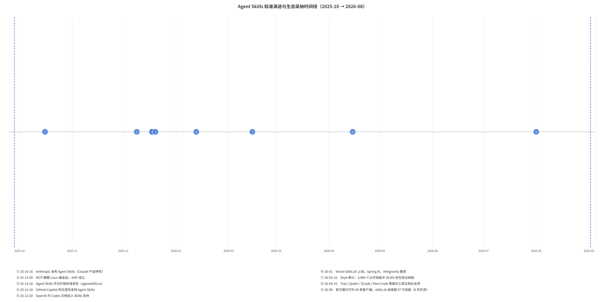
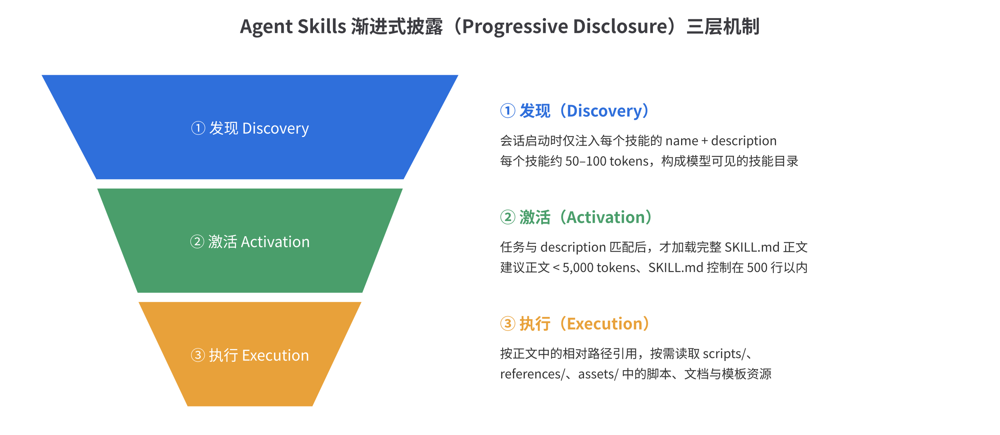
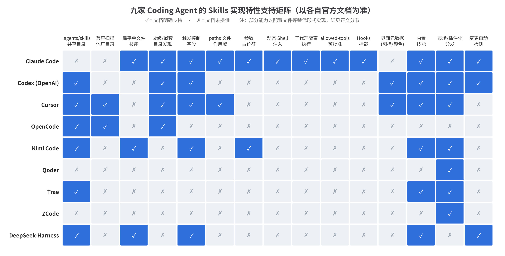

# Agent Skills 开放标准与九家 Coding Agent 实现的全面比较

> **一句话结论**：Agent Skills 标准只约定了"一个 SKILL.md 文件夹长什么样"，而九家主流 Coding Agent 在这层薄薄的标准内核之外，各自长出了差异巨大的发现机制、优先级规则、触发控制、上下文预算与安全模型——**文件格式已经统一，运行时语义远未统一**。

## 摘要

本报告以 Agent Skills 开放标准（agentskills.io）为基准，系统比较九家 Coding Agent 的 Skills 实现：Claude Code、Codex（OpenAI）、Cursor、OpenCode、Kimi Code、Qoder、Trae、ZCode 与 DeepSeek-Harness。研究发现，标准本身刻意保持极简——仅强制 `name` 与 `description` 两个 frontmatter 字段，外加可选的 `license`、`compatibility`、`metadata` 与实验性的 `allowed-tools`[^2^]；而各厂商在此基础上分化出三条实现路线：**以 Claude Code 为代表的"超集路线"**（二十余个扩展字段、动态 Shell 注入、Hooks、子代理隔离），**以 Codex 为代表的"标准原教旨 + Sidecar 配置路线"**（frontmatter 保持干净，厂商私有元数据移入 `agents/openai.yaml`）[^29^]，以及**以 Qoder、Trae、ZCode 为代表的"最小可用路线"**（仅支持 name/description，重在快速接入生态）[^34^][^6^][^7^]。

跨厂商层面最重要的趋势是 `.agents/skills` 共享目录事实标准的形成：Codex、Cursor、OpenCode、Kimi Code、DeepSeek-Harness 均原生扫描该目录，Trae 提供选择性开启，GitHub Copilot 亦将其列为项目技能存放路径之一[^56^][^58^]，唯有 Claude Code 坚持只读 `.claude/skills`[^32^]。与此同时，各家在技能目录注入的上下文预算（上下文窗口的 1%–2%、字符上限、描述截断）、项目级与用户级技能的优先级仲裁、`allowed-tools` 字段语义等关键问题上给出了互相矛盾的答案，构成了当前可移植性的主要障碍。安全维度上，Snyk 对 3,984 个公开技能的审计发现 36.82% 存在安全缺陷、13.4% 达到严重级别[^88^]，供应链信任基础设施已成为 2026 年下半年的行业主战场[^49^]。

## 一、研究对象与方法

本报告的研究对象分为两层。第一层是**标准层**：Agent Skills 开放标准，其规范文本托管于 agentskills.io，源代码与议题追踪位于 GitHub 的 agentskills 组织[^2^][^54^]。该标准由 Anthropic 于 2025 年 10 月 16 日以 Claude 产品特性的形式首次发布，2025 年 12 月 18 日作为开放标准对外发布[^81^]。第二层是**实现层**：九家已将 Skills 能力文档化的 Coding Agent，其中 Claude Code、Codex、Cursor、OpenCode 为国际厂商代表，Kimi Code、Qoder、Trae、ZCode 为中国大陆厂商代表，DeepSeek-Harness 则代表"把 Skills 作为框架子系统"的第三类形态[^8^]。

方法上，本报告以各家**官方文档**为第一手证据来源：Claude Code 的 Skills 文档[^31^][^32^]、OpenAI 的 build-skills 文档[^29^]、Cursor 中文文档[^30^]、OpenCode 文档[^4^]、Kimi Code CLI 文档[^5^]、Qoder CLI 文档[^33^][^34^]、Trae IDE 文档[^6^]、ZCode 文档[^7^]、DeepSeek-Harness 参考手册[^8^]，以及标准官方站的规范、实现指南与客户端展示厅[^2^][^55^][^56^]。所有特性断言均以上述文档明确记载为准；文档未记载的能力一律记为"未提供"，而非"不存在"。生态与治理背景（采纳时间线、市场规模、安全审计）来自 arXiv 综述、Linux 基金会公告、Vercel 官方文档与 Snyk 等安全机构的公开研究[^37^][^78^][^90^][^88^]。需要提示的是，Coding Agent 迭代极快，本报告反映的是 **2026 年 8 月**这一时间截面的文档状态。

## 二、Agent Skills 开放标准解析

### 2.1 从产品特性到开放标准：演进脉络

Agent Skills 的演进速度在基础设施级标准中相当罕见。Anthropic 于 2025 年 10 月 16 日在 Claude 产品表面发布 Agent Skills，将"指令 + 脚本 + 资源"打包进文件夹供模型按需加载[^81^]；约两个月后的 2025 年 12 月 18 日，该格式以开放标准形式发布于 agentskills.io[^49^]。这一动作与 Anthropic 此前对 MCP 的操作路径完全一致——MCP 于 2025 年 12 月 9 日捐赠给 Linux 基金会旗下新成立的 Agentic AI Foundation（AAIF），创始白金成员包括 AWS、Anthropic、Block、Bloomberg、Cloudflare、Google、Microsoft 与 OpenAI，创始项目除 MCP 外还有 goose、AGENTS.md 与 agentgateway[^78^]。学术综述将这一组合概括为：MCP 负责"如何连接"（how to connect），Skills 负责"做什么"（what to do），两者构成互补的智能体技术栈[^37^]。

开放之后的采纳曲线极为陡峭：GitHub Copilot 在标准发布同日宣布支持，OpenAI 在两天内为 Codex 文档加入 Skills 章节，48 小时内微软与 OpenAI 两大阵营完成跟进[^81^][^58^]。2026 年 1 月，Vercel 推出 skills.sh 目录与 `npx skills` CLI，将技能的发现与安装收敛为一行命令[^90^]；到 2026 年年中，官方客户端展示厅收录约 40 个兼容产品，skills.sh 生态覆盖的代理类型达 71 种[^55^][^90^]。中国厂商的文档化支持集中在 2026 年春季落地，Trae、Qoder、ZCode、Kimi Code 相继发布官方 Skills 文档[^6^][^34^][^7^][^5^]。下图以时间线形式呈现关键节点。



### 2.2 规范核心：SKILL.md 的文件格式契约

标准规定，一个技能就是一个**包含 SKILL.md 文件的目录**，可选地携带 `scripts/`（可执行脚本）、`references/`（参考文档）与 `assets/`（模板、字体等资源）子目录[^2^]。SKILL.md 由 YAML frontmatter 与 Markdown 正文组成。frontmatter 中**必填字段仅有两个**：`name`（1–64 字符，小写字母、数字与连字符，不得以连字符开头或结尾、不得出现连续连字符，且必须与父目录名一致）与 `description`（1–1024 字符，用于向模型说明该技能何时适用）[^2^]。可选字段包括 `license`、`compatibility`（环境前置条件，不超过 500 字符）、`metadata`（任意键值对映射，供厂商扩展）与标注为**实验性**的 `allowed-tools`[^2^]。

值得注意的是标准的自我约束。规范明确给出体积建议：SKILL.md 正文应控制在 500 行以内，超出内容应拆分到 `references/` 按需加载[^2^]。配套工具方面，官方提供 `skills-ref` 参考校验器，用于在 CI 中验证技能包的合规性[^2^]；规范仓库同时维护 `llms.txt` 以便大模型直接消费标准文本[^54^]。这种"小核心 + 工具链"的设计，使标准本身可以被一个下午读完，而把复杂性留给了实现者——这正是后文九家实现分化的结构性原因。

### 2.3 渐进式披露：标准的架构灵魂

渐进式披露（Progressive Disclosure）是 Agent Skills 区别于传统 prompt 模板或插件系统的核心架构决策。其要义是：**技能信息分三层进入模型上下文，每深入一层才付出相应的上下文成本**。第一层是元数据层——所有已发现技能的 `name` 与 `description` 常驻系统提示，每个技能仅消耗约百 token 量级，供模型判断"何时该用谁"；第二层是激活层——当任务匹配时，SKILL.md 的完整正文才被载入，预算量级在数千 token；第三层是资源层——`scripts/`、`references/`、`assets/` 中的文件只有在正文指引时才会被读取或执行，成本上不封顶但按需发生[^2^][^49^]。



这一机制把"技能库规模"与"上下文成本"解耦：一个代理可以挂载数百个技能，而为每个技能支付的常态化成本只是其元数据条目。生态系统报告将其总结为"保持大型技能库的上下文成本低廉"的关键设计[^49^]。但标准只规定了"应该渐进披露"这一原则，**具体把元数据目录放在哪里、给多大预算、超预算如何降级，全部留给实现者**——第四、五章将展示，九家代理在这一留白上给出了从"上下文窗口的 1%"到"固定 500 字符截断"等截然不同的工程答案[^32^][^29^][^8^]。

### 2.4 标准刻意留白：不规定什么

理解各家实现差异的前提，是理解标准**不管什么**。通读规范文本与官方实现指南，可以发现标准对以下事项刻意保持沉默：技能目录放在文件系统的哪个位置（规范只定义文件夹内部结构，未强制任何存放路径）；多个技能同名时如何仲裁；技能如何被显式调用（斜杠命令、`$` 前缀还是自然语言）；技能能调用哪些工具的权限模型；以及技能如何分发与更新[^2^][^56^]。这些留白并非疏漏，而是标准的务实选择——它把互操作性的锚点压在最不易引起争议的"文件格式"上。

官方实现指南以**建议而非强制**的方式填补了部分空白。指南推荐（而非要求）各客户端收敛到 `.agents/skills` 作为跨工具共享目录，并指出"项目级覆盖用户级"是通行惯例；同时建议实现者做信任门控（首次加载新技能前提示用户）、宽松校验（忽略未知字段而非报错）、目录注入位置选择（系统提示或工具描述）、以及在上下文压缩（compaction）时保护已激活技能不被裁掉[^56^]。后文将反复看到：正是这些"建议级"事项，构成了九家实现最真实的分野——有的照单全收，有的反其道而行。

## 三、九家 Coding Agent 实现剖析

### 3.1 Claude Code：超集实现与封闭花园

作为标准的发起者，Claude Code 的实现是九家中**功能密度最高**的，同时也是对共享目录最封闭的。技能发现覆盖四级位置：企业管理目录、个人目录 `~/.claude/skills`、项目目录 `.claude/skills` 与插件目录，优先级为企业 > 个人 > 项目，插件技能以 `plugin:skill` 命名空间隔离[^32^]。发现机制支持嵌套目录的惰性遍历，深层技能以限定名引用（如 `apps/web:deploy`），并具备文件变更的实时检测能力——编辑 SKILL.md 后无需重启即可生效[^32^]。值得强调的是，Claude Code **不扫描** `.agents/skills` 共享目录，也未提供对其他厂商目录的兼容扫描[^32^]，这使其在"格式发起者"与"目录孤岛"之间形成了耐人寻味的反差。

在 frontmatter 层面，Claude Code 支持的字段集合远超标准：除 `name`、`description` 外，还包括 `when_to_use`、`argument-hint`、`arguments`、`disable-model-invocation`、`user-invocable`、`allowed-tools`、`disallowed-tools`、`model`、`effort`、`context: fork`（子代理隔离执行）、`agent`、`background`、`hooks`、`paths`（文件作用域限定）、`shell` 等二十余项[^32^]。正文支持动态上下文注入——`!\`command\`` 语法与 ` ```! ` 代码块可在技能激活时执行 Shell 命令并把输出嵌入指令；参数替换体系覆盖 `$ARGUMENTS`、位置参数 `$N`、命名参数 `$name` 以及 `${CLAUDE_SKILL_DIR}`、`${CLAUDE_PROJECT_DIR}`、`${CLAUDE_SESSION_ID}`、`${CLAUDE_EFFORT}` 等环境变量[^32^]。

上下文工程方面，Claude Code 给出了九家中最精细的公开参数：技能目录清单（metadata listing）默认预算为**上下文窗口的 1%**（`skillListingBudgetFraction`），单条技能条目上限 1,536 字符；上下文压缩时每个已激活技能可重新附着最多 5,000 token、合计上限 25,000 token[^32^]。治理面提供 `skillOverrides`（on / name-only / user-invocable-only / off 四档）、`Skill(name)` 权限规则与 `disableSkillShellExecution` 总开关；内置技能包括 `/doctor`、`/code-review`、`/batch`、`/debug`、`/loop`、`/claude-api`、`/run`、`/verify` 等；个人技能还可与 claude.ai 账户同步（`~/.claude/skills/synced`，保留命名空间）[^32^]。一个关键收紧是：上传到 Claude 平台或经 Skills API 分发的技能仅允许标准规定的 6 个字段，出现扩展字段将直接报错[^32^]——Anthropic 在自家运行时放纵扩展，在分发通道上强制回归标准，这一"宽进严出"的分层策略值得所有生态参与者注意。

### 3.2 Codex：标准原教旨与 Sidecar 扩展

OpenAI Codex 是 `.agents/skills` 共享目录最坚定的践行者。其发现路径从 `$CWD/.agents/skills` 逐级向上至仓库根目录的 `$REPO_ROOT/.agents/skills`，再叠加用户级 `$HOME/.agents/skills`、管理员级 `/etc/codex/skills`（ADMIN 层级）与随发行版捆绑的 SYSTEM 技能；发现过程跟随符号链接，同名技能不去重——两个同名条目会同时出现在清单中，由路径区分[^29^]。这种"不去重"策略与官方实现指南建议的去重实践相悖[^56^]，但也避免了优先级仲裁的语义负担。

Codex 最具架构意义的决策是 **Sidecar 文件模式**：SKILL.md 的 frontmatter 保持标准最小集，厂商私有元数据全部移入技能目录内的 `agents/openai.yaml`。该文件承载界面展示信息（`interface.display_name`、图标、`brand_color`、`default_prompt`）、策略开关（`policy.allow_implicit_invocation`，控制模型是否可未经用户显式提及而自行调用技能）与依赖声明（`dependencies.tools`，可声明对 MCP 服务器的依赖）[^29^]。这一设计把"对标准 frontmatter 的污染"降到了零，代价是技能目录里多了一个厂商文件。调用方式上，Codex 同时支持 `$skill` 提及、`/skills` 面板与隐式调用；发行版内置 `$plan`、`$skill-creator`、`$skill-installer` 三个元技能，并通过插件系统承担分发职能[^29^]。

上下文预算方面，Codex 规定技能清单注入不超过**上下文窗口的 2% 或 8,000 字符**（取孰低），超出时先缩短描述、再整条省略并发出警告；清单条目包含技能的文件路径，便于模型定位[^29^]。管理面提供 `~/.codex/config.toml` 中的 `[[skills.config]]` 段落用于按名禁用技能。此外 Codex 还提供 Record & Replay 能力，可把一次成功会话沉淀为可复用技能[^29^]。整体而言，Codex 的实现哲学是"标准核心一分不加，扩展能力一分不少"——这与 Claude Code 在 frontmatter 内大举扩张的路线形成了教科书级的对照。

### 3.3 Cursor：兼容并蓄的集大成者

Cursor 是九家中**扫描目录最多**的实现：项目级 `.agents/skills` 与 `.cursor/skills`、用户级 `~/.agents/skills` 与 `~/.cursor/skills` 之外，还兼容扫描 `.claude/skills` 与 `.codex/skills`（项目级与用户级皆有）[^30^]。发现机制支持递归嵌套——技能可以按类别组织成多层目录，并针对 monorepo 场景提供包级作用域的嵌套技能，使大型仓库中不同子项目可拥有各自技能集[^30^]。在共享目录与跨厂兼容两个维度上，Cursor 都是生态中态度最积极的 IDE。

扩展字段方面，Cursor 在 frontmatter 中加入 `paths`（glob 模式，将技能限定到匹配的文件作用域）、`disable-model-invocation`（仅允许用户显式触发）、`icon` 与 `color`（界面展示元数据），以及标准的 `metadata` 映射[^30^]。交互层提供自定义模式（Alt+Enter 触发、徽章标识），并附带多达 19 个内置技能，覆盖自动化（`/automate`）、看护式任务（`/babysit`）、画布（`/canvas`）、规则与技能生成（`/create-rule`、`/create-skill`）、评审（`/review`、`/review-bugbot`、`/review-security`）、PR 拆分（`/split-to-prs`）等场景[^30^]。安装路径上支持从 GitHub 远程安装技能，并内置 `/migrate-to-skills` 帮助用户把旧式规则（rules）迁移为技能[^30^]。

Cursor 的策略可以概括为"用户资产最大化"：既然用户已经在 Claude Code 或 Codex 里沉淀了技能库，Cursor 就通过目录兼容把这些资产无缝接收过来，再用 IDE 侧的界面元数据（图标、颜色、徽章）提供增量体验。这种"格式遵标准、入口全兼容、界面做加法"的三层策略，使其成为多工具用户的自然汇聚点[^30^]。

### 3.4 OpenCode：最小内核加配置外置

开源代理 OpenCode 选择了另一条路：运行时内核极简，把治理复杂度外置到配置文件。其 Skills 实现通过原生 `skill` 工具暴露，技能清单以 `<available_skills>` XML 块注入该工具的描述中，而非系统提示[^4^]。发现路径多达六处——项目级 `.opencode/skills`、`.claude/skills`、`.agents/skills` 与用户级 `~/.config/opencode/skills`、`~/.claude/skills`、`~/.agents/skills`，并从当前目录向上遍历至 git 仓库根[^4^]。在目录兼容广度上，OpenCode 与 Cursor 同属第一梯队。

Frontmatter 处理上，OpenCode 严格贴着标准走：仅识别 `name`、`description`、`license`、`compatibility`、`metadata` 五个字段，**未知字段一律忽略**；`name` 必须匹配正则 `^[a-z0-9]+(-[a-z0-9]+)*$` 且与目录名一致[^4^]。这意味着 Claude Code 的 `allowed-tools`、`hooks`、`context: fork` 等扩展字段在 OpenCode 中不产生任何效果——不是报错，而是静默失效，技能作者需要明确意识到这一降级行为。权限治理被完整地移入 `opencode.json`：支持按技能名（含通配符）设置 allow / deny / ask 三种模式，可按代理粒度覆盖，也可用 `tools.skill = false` 整体关闭技能系统[^4^]。

OpenCode 的方案与官方实现指南的"信任门控"建议高度契合[^56^]：技能的信任决策被视为**宿主配置问题**而非**技能元数据问题**。这与 Claude Code"把权限声明写进技能自身 frontmatter"（`allowed-tools`）的思路形成根本分歧——前者假设权限策略属于部署方，后者假设技能作者最了解自己需要哪些工具。这一分歧在第五章还会深入讨论。

### 3.5 Kimi Code：双形态与触发元数据

月之暗面的 Kimi Code 在国内厂商中实现了**最完整的标准对齐**，并带有两项鲜明的自研色彩。其一是**双形态技能**：除标准目录形态外，还支持扁平单文件技能（单个 `.md` 文件直接作为技能），降低了轻量技能的创建门槛[^5^]。其二是**触发元数据前置**：frontmatter 中的 `type`（prompt / inline / flow 三型）、`whenToUse`（含 `when-to-use`、`when_to_use` 别名）与 `disableModelInvocation`（含别名）字段，把"何时触发、以何种形态触发"的决定权显式交给技能作者[^5^]。

发现路径方面，Kimi Code 扫描 `$KIMI_CODE_HOME/skills`（默认 `~/.kimi-code/skills`）、`~/.agents/skills`、`.kimi-code/skills`、`.agents/skills`，外加 `extra_skill_dirs` 配置的自定义目录与内置技能；优先级为**项目 > 用户 > 自定义 > 内置**[^5^]。目录发现最多嵌套三层。调用语法为 `/skill:name`；参数占位符体系支持 `$ARGUMENTS`、`$0`/`$1` 位置参数、`$<name>` 命名参数与 `${KIMI_SKILL_DIR}` 环境变量[^5^]。这套参数机制明显借鉴了 Claude Code 的设计，但保持了字段命名上的自有风格（驼峰式 `whenToUse` 配蛇形式别名），体现了对存量技能资产的双向兼容意图。

Kimi Code 的实现整体呈现"标准兼容、体验本地化"的特征：共享目录 `.agents/skills` 的原生支持使其技能资产可与 Codex、Cursor 等互投[^5^][^56^]，而 `type` 字段的三型划分（尤其是 flow 型）则指向更结构化的流程编排场景。在九家中，它是把"扁平单文件"与"目录包"两种形态同时作为一等公民支持的少数实现之一（另一家是 DeepSeek-Harness）[^8^]。

### 3.6 Qoder：命令化封装的最小实现

阿里巴巴的 Qoder CLI 选择了最小可用的实现路径。技能存放于用户级 `~/.qoder/skills` 与项目级 `.qoder/skills` 两处，**用户级覆盖项目级**——这一优先级方向与官方实现指南倡导的"项目覆盖用户"惯例相反[^34^][^56^]。Frontmatter 层面，官方文档仅记载 `name`（不超过 64 字符、kebab-case）与 `description`（不超过 1,024 字符）两个字段，完全等同于标准必填集，未引入任何厂商扩展[^34^]。

运行机制上，Qoder 文档明确写道技能"在内部被转换为一种特殊的 Command 类型"，即技能复用了 CLI 既有的斜杠命令管线；管理命令为 `/skills` 与 `/skills reload`——后者说明 Qoder **不具备热重载**，技能文件变更后需手动重载才能生效[^34^]。生态接入方面，Qoder 兼容 `npx skills add` 安装流，技能作者需注意 `description` 中不得包含 XML 尖括号，且 `name` 中应避免使用 `claude`、`anthropic` 等保留词[^24^]。整体而言，Qoder 的实现以最小内核换取了与标准生态的快速对接，把差异化留在了 CLI 命令体系而非技能格式本身。

### 3.7 Trae：GUI 优先与国内生态入口

字节跳动 Trae 的 Skills 实现围绕 **IDE 图形界面**组织。技能目录为项目级 `.trae/skills` 与用户级 `~/.trae-cn/skills`；对 `.agents/skills` 共享目录的支持以**选择性开启的开关**形式提供，且开启后 `.trae/skills` 优先级更高[^6^]。格式上同样只要求 `name` 与 `description` 两个字段[^6^]。Trae 是国内三家 IDE 化产品中对共享目录态度最开放的一家，但其默认关闭的设计说明厂商仍希望把用户留在自有目录体系中。

Trae 的特色在于技能的**创建与分发体验的图形化**：用户可在 GUI 中创建技能，或以 zip / `.skill` 包形式导入；`skill-config.json` 维护禁用清单[^6^]。产品内置四个官方技能——`TRAE-security-review`、`TRAE-generate-mini-app`、`TRAE-debugger`、`TRAE-code-review`，并内置 `find-skills` 技能，其后端正是 Vercel 的 `skills` CLI，使用户在 IDE 内即可检索安装 skills.sh 生态中的技能[^6^][^90^]。Trae 的路线证明：对 IDE 用户而言，"技能市场入口"比"frontmatter 字段数量"更有产品价值。

### 3.8 ZCode：导入桥接与托管市场

智谱的 ZCode 在核心格式上保持最小实现——用户级 `~/.zcode/skills/<name>/SKILL.md` 与项目/工作区级技能，`name`、`description` 必填；但它设定了九家中**最严格的体积纪律**：`description` 超过 1,024 字符的技能会被直接丢弃，正文超过 100KB 的部分被截断[^7^]。在元数据清单注入侧，ZCode 采用固定预算策略：每条技能的描述在清单中至多保留 250 字符，超出预算的条目降级为仅展示名称[^7^]。这套"硬上限 + 优雅降级"的工程化处理，与 Codex 的"缩短描述再省略"策略异曲同工[^29^]。

ZCode 最突出的差异化是**迁移桥接能力**：支持从 Claude Code、Codex CLI、OpenClaw、Augment、Windsurf 的技能目录导入技能，可选符号链接或复制两种方式[^7^]。调用语法为聊天中的 `$skill-name`；技能有独立的启用/禁用开关，变更后需手动刷新[^7^]。分发层面，ZCode 提供插件市场机制，支持自托管市场源，但市场包仅支持单层 `skills/` 目录结构[^7^]。ZCode 的策略明显面向"多工具存量用户"：既然用户的技能资产分散在五六种工具里，就用导入器把它们一次性收编——这与 Cursor 的目录兼容扫描是同一诉求的两种实现[^30^]。

### 3.9 DeepSeek-Harness：面向框架开发者的注册表架构

DeepSeek-Harness（DSH）与上述八家产品形态不同：它是一个**可编程的代理框架**，Skills 在其内部是一个正式的子系统，由提供者注册表架构承载——`dsh-skill`（核心接口）、`dsh-skill-filesystem`（文件系统发现）、`dsh-skill-badge`（元数据徽标）与 `dsh-tool-skill`（工具桥接）四个模块协作[^8^]。技能发现采用**显式秩（rank）仲裁**：项目级 `.dsh/skills` 秩 100、项目级 `.agents/skills` 秩 200、自定义源秩 300、用户级 `dshHome/skills` 秩 400、用户级 `agentsHome/skills` 秩 500、内置技能秩 600——数字越小优先级越高，项目级因此稳赢用户级[^8^]。技能形态同时支持目录包与扁平 `.md` 单文件，但**不做 `**/SKILL.md` 递归搜索**[^8^]。

运行时行为上，DSH 把标准的触发留白形式化为 `SkillInvocationPolicy`：frontmatter 的 `disable-model-invocation` 与 `user-invocable` 被解析为 modelInvocable / userInvocable 两个策略维度[^8^]。技能目录通过系统提示中的 `<available_skills>` 提醒块注入，描述长度由 `catalogDescriptionMaxLength` 控制（默认 500 字符）；技能激活通过 `skill({name})` 工具完成，返回结构化的 `<skill_content>`、`<skill_resources>` 与 `<skill_instructions>` 三段式负载[^8^]。依托 Chokidar 文件监视器与 `skills/change` 事件总线，DSH 实现了技能变更的自动检测与热更新，并为宿主应用提供分层（host + scope）注册表以组合多套技能来源[^8^]。

DSH 的价值在于把"Skills 子系统应该长什么样"给出了完整的工程参考：显式秩替代隐式目录顺序、策略对象替代散落的布尔字段、事件总线替代轮询重载。对自研代理的团队而言，DSH 的文档实际上是一份比标准规范更具操作性的实现蓝图——官方实现指南讨论的信任门控、目录注入位置、压缩保护、去重等议题[^56^]，在 DSH 中都能找到对应的机制落点[^8^]。

## 四、横向对比矩阵

### 4.1 特性支持总览

将九家实现放在同一坐标系下，最直观的结论是**实现深度的极差极大**：Claude Code 在 15 项特性维度中覆盖 13 项，而 Qoder、ZCode 仅各覆盖 1 项。下图按官方文档记载绘制了完整矩阵——✓ 表示文档明确支持，✗ 表示文档未提供；需注意"未提供"不等于"永不支持"，只代表当前文档截面的状态。



矩阵呈现出清晰的三层结构：**超集层**（Claude Code，独占动态 Shell 注入、Hooks、子代理隔离、`allowed-tools` 预批准等高级能力）[^32^]；**标准 + 克制扩展层**（Codex、Cursor、Kimi Code、DeepSeek-Harness，在发现兼容、触发控制、界面元数据等少数维度做加法）[^29^][^30^][^5^][^8^]；**最小实现层**（OpenCode、Qoder、Trae、ZCode，核心仅对齐标准必填字段，差异化转向配置文件、GUI 或市场机制）[^4^][^34^][^6^][^7^]。后续各表逐维度展开。

### 4.2 技能发现：目录、遍历与优先级

发现机制是九家实现分歧最密集的维度，包含三个子问题：扫哪些目录、是否向上/向下遍历、多级来源如何仲裁。下表汇总各家的完整答案。

| 实现 | 项目级目录 | 用户级目录 | 共享/兼容目录 | 遍历行为 | 同级冲突与优先级 |
| --- | --- | --- | --- | --- | --- |
| Claude Code | `.claude/skills`（另有企业级、插件级） | `~/.claude/skills` | 无 | 嵌套目录惰性发现，限定名引用；变更实时检测[^32^] | 企业 > 个人 > 项目；插件用 `plugin:skill` 命名空间[^32^] |
| Codex | `$CWD/.agents/skills` → `$REPO_ROOT/.agents/skills`；另有 `/etc/codex/skills` | `$HOME/.agents/skills` | 仅 `.agents/skills` 体系 | 向上遍历至仓库根；跟随符号链接[^29^] | 不去重，同名技能并列展示并附路径[^29^] |
| Cursor | `.agents/skills`、`.cursor/skills` | `~/.agents/skills`、`~/.cursor/skills` | 兼容 `.claude/skills`、`.codex/skills`（项目+用户）[^30^] | 递归嵌套分类；monorepo 包级作用域[^30^] | 文档未明示仲裁顺序[^30^] |
| OpenCode | `.opencode/skills`、`.claude/skills`、`.agents/skills` | `~/.config/opencode/skills`、`~/.claude/skills`、`~/.agents/skills`[^4^] | 同左，六源并列 | 向上遍历至 git 根[^4^] | 文档未明示；`name` 必须等于目录名[^4^] |
| Kimi Code | `.kimi-code/skills`、`.agents/skills` | `$KIMI_CODE_HOME/skills`、`~/.agents/skills` | `.agents/skills` 原生 | 最多嵌套 3 层[^5^] | 项目 > 用户 > 自定义（`extra_skill_dirs`）> 内置[^5^] |
| Qoder | `.qoder/skills` | `~/.qoder/skills` | 无 | 文档未记载[^34^] | **用户覆盖项目**[^34^] |
| Trae | `.trae/skills` | `~/.trae-cn/skills` | `.agents/skills` 需开关开启，且 `.trae` 优先[^6^] | 文档未记载[^6^] | `.trae/skills` > `.agents/skills`[^6^] |
| ZCode | 项目/工作区级 | `~/.zcode/skills/<name>/SKILL.md` | 导入桥接 Claude Code/Codex/OpenClaw/Augment/Windsurf[^7^] | 文档未记载[^7^] | 文档未明示[^7^] |
| DeepSeek-Harness | `.dsh/skills`（秩 100）、`.agents/skills`（秩 200） | `dshHome/skills`（400）、`agentsHome/skills`（500） | `.agents/skills` 原生；自定义源秩 300；内置秩 600[^8^] | 不做 `**/SKILL.md` 递归[^8^] | 显式秩仲裁，数值小者胜[^8^] |

表中至少有三处与直觉或官方指南相悖的事实值得标记。其一，官方实现指南称"项目覆盖用户"是通行惯例[^56^]，但 Claude Code 实际执行**个人 > 项目**[^32^]，Qoder 更是明确**用户覆盖项目**[^34^]——只有 Kimi Code 与 DeepSeek-Harness 严格遵循项目优先[^5^][^8^]。其二，Codex 的"同名不去重"策略[^29^]与指南的去重建议[^56^]直接冲突，在共享目录混装多来源技能时会改变模型的选择集合。其三，遍历深度的差异（git 根、仓库根、固定 3 层、不递归）意味着同一个 monorepo 中的同一组技能，在不同代理下的可见性可能完全不同。

### 4.3 Frontmatter 字段支持矩阵

Frontmatter 是标准与扩展交锋的主战场。标准必填仅 `name`、`description`，可选 `license`、`compatibility`、`metadata`，实验性 `allowed-tools`[^2^]。各家在此基础上的扩展如下表。

| 实现 | 标准字段 | 触发控制扩展 | 执行/权限扩展 | 界面扩展 | 未知字段行为 |
| --- | --- | --- | --- | --- | --- |
| Claude Code | 全支持 | `when_to_use`、`disable-model-invocation`、`user-invocable`、`argument-hint`、`arguments`[^32^] | `allowed-tools`、`disallowed-tools`、`model`、`effort`、`context: fork`、`agent`、`background`、`hooks`、`paths`、`shell`[^32^] | 无（UI 元数据经插件清单承载） | 分发通道硬校验，仅放行 6 个标准字段[^32^] |
| Codex | 全支持 | 移入 `agents/openai.yaml` 的 `policy.allow_implicit_invocation`[^29^] | `dependencies.tools`（声明 MCP 依赖，Sidecar）[^29^] | Sidecar `interface.*`：display_name、icons、brand_color、default_prompt[^29^] | 忽略（frontmatter 保持标准最小集）[^29^] |
| Cursor | 全支持 | `disable-model-invocation`、`paths`（glob 作用域）[^30^] | 无 | `icon`、`color`[^30^] | 文档未明示，宽松处理[^30^] |
| OpenCode | 全支持 | 无 | 无（权限走 `opencode.json`） | 无 | **明确忽略**[^4^] |
| Kimi Code | 全支持 | `type`（prompt/inline/flow）、`whenToUse`（含别名）、`disableModelInvocation`（含别名）、`arguments`[^5^] | 无 | 无 | 文档未明示[^5^] |
| Qoder | 仅记载 `name`/`description`[^34^] | 无 | 无 | 无 | 文档未记载[^34^] |
| Trae | 仅记载 `name`/`description`[^6^] | 无 | 无 | 无 | 文档未记载[^6^] |
| ZCode | `name`/`description` 必填[^7^] | 无 | 无 | 无 | `description` 超 1,024 字符整个技能被丢弃[^7^] |
| DeepSeek-Harness | 全支持 | `disable-model-invocation`、`user-invocable` → `SkillInvocationPolicy`[^8^] | 无 | `dsh-skill-badge` 徽标体系[^8^] | 文档未明示[^8^] |

字段层面的关键洞察有二。第一，**`allowed-tools` 几乎是 Claude Code 的独占实现**：尽管它是标准中唯一与权限相关的字段，Codex、Cursor、OpenCode 均未采纳，OpenCode 甚至明确将其归入"忽略"之列[^4^][^32^]。第二，界面元数据出现了三条技术路线并存——Cursor 直接放进 frontmatter（`icon`/`color`）[^30^]，Codex 放进 Sidecar 文件[^29^]，DSH 用独立的 badge 模块[^8^]——这预示着标准未来若要吸收展示层元数据，需要在三种范式中做出取舍。

### 4.4 调用与触发机制

标准未规定任何调用语法，九家因此分化出四类入口设计。下表汇总显式调用语法、隐式触发与热更新能力。

| 实现 | 显式调用 | 模型自主触发 | 目录注入形态 | 变更生效 |
| --- | --- | --- | --- | --- |
| Claude Code | `/skill`、`Skill(name)` 工具；插件/嵌套限定名[^32^] | 支持，可被 `disable-model-invocation` 关闭[^32^] | 元数据清单（预算 1% 窗口）[^32^] | 实时检测，即时生效[^32^] |
| Codex | `$skill` 提及、`/skills` 面板[^29^] | 支持，经 Sidecar `policy.allow_implicit_invocation` 控制[^29^] | 清单含文件路径，预算 2% 窗口或 8,000 字符[^29^] | 文档未明示[^29^] |
| Cursor | `/skill` 与自然语言；自定义模式 Alt+Enter[^30^] | 支持，`disable-model-invocation` 可关闭[^30^] | 文档未明示[^30^] | 文档未明示[^30^] |
| OpenCode | 原生 `skill` 工具[^4^] | 由模型经工具调用触发 | `<available_skills>` XML 注入工具描述[^4^] | 文档未明示[^4^] |
| Kimi Code | `/skill:name`[^5^] | 受 `disableModelInvocation` 控制[^5^] | 文档未明示[^5^] | 文档未明示[^5^] |
| Qoder | `/skills`；内部转为特殊 Command[^34^] | 文档未明示[^34^] | 文档未明示[^34^] | **需 `/skills reload` 手动重载**[^34^] |
| Trae | 聊天中引用 + GUI 管理[^6^] | 文档未明示[^6^] | 文档未明示[^6^] | 文档未明示[^6^] |
| ZCode | `$skill-name`[^7^] | 文档未明示[^7^] | 固定预算，描述截 250 字符[^7^] | **需手动刷新**[^7^] |
| DeepSeek-Harness | `skill({name})` 工具[^8^] | `SkillInvocationPolicy` 双维度控制[^8^] | 系统提示 `<available_skills>`，描述上限默认 500 字符[^8^] | Chokidar 监视 + 事件自动热更新[^8^] |

调用语法的不统一是当前跨工具技能体验最直接的断裂点：`/skill`（Claude Code、Cursor）、`/skill:name`（Kimi Code）、`$skill`（Codex、ZCode）与纯工具调用（OpenCode、DSH）四套并存[^32^][^5^][^29^][^4^]。对技能作者而言，这意味着在文档中写"输入 /xxx 使用本技能"已经不再可移植——多数技能转而依赖模型的自主匹配，使 `description` 的撰写质量成为事实上的触发接口。热更新维度上，只有 Claude Code 与 DeepSeek-Harness 文档化了自动检测[^32^][^8^]，Qoder 与 ZCode 明确需要手动重载或刷新[^34^][^7^]。

### 4.5 上下文工程：目录注入与预算控制

渐进式披露的第一层——元数据清单——是全部技能库的常态化上下文成本，各家对这笔成本的控制策略构成了一个有趣的工程光谱。下表汇总文档可考的全部预算参数。

| 实现 | 预算策略 | 具体参数 | 超预算降级 |
| --- | --- | --- | --- |
| Claude Code | 上下文窗口比例 | 窗口的 1%（`skillListingBudgetFraction`）；单条目上限 1,536 字符[^32^] | 压缩时每技能重附着 5,000 token、合计 25,000 token 上限[^32^] |
| Codex | 比例 + 绝对值孰低 | 窗口的 2% 或 8,000 字符[^29^] | 先缩短描述，再整条省略并告警[^29^] |
| ZCode | 固定预算 | 清单内描述每条至多 250 字符[^7^] | 溢出条目降级为仅名称[^7^] |
| DeepSeek-Harness | 固定字符截断 | `catalogDescriptionMaxLength` 默认 500 字符[^8^] | 截断[^8^] |
| 其余五家 | 文档未公开 | — | — |

这组数字背后是两种哲学：**比例制**（Claude Code 的 1%、Codex 的 2%）随模型上下文窗口扩容而自动放松，适配从 100K 到 1M token 的硬件演进；**定额制**（ZCode 250 字符、DSH 500 字符）则给予技能作者确定性的写作约束[^32^][^29^][^7^][^8^]。对技能作者的实际指导是：把 `description` 的核心触发语义压进**前 250 字符**，这是在全部九家代理中都安全的最低公分母；前 1024 字符（标准上限）则在任何一家都不会被丢弃，但在 ZCode 的清单里只有前四分之一可见[^2^][^7^]。

另一个常被忽视的维度是**压缩保护**：上下文压缩（compaction）发生时，已激活技能的正文可能被摘要掉，导致代理"忘记"自己正在遵循的流程。官方实现指南专门建议实现者保护已激活技能[^56^]，而目前只有 Claude Code 公开了量化策略（每技能 5,000 token 重附着上限）[^32^]。对长会话场景（如代码迁移、大规模重构），这一机制的有无直接决定技能执行的可靠性。

### 4.6 权限与安全模型

标准在权限问题上的唯一抓手是实验性字段 `allowed-tools`[^2^]，九家由此发展出三套互不兼容的安全模型。

| 模型 | 代表实现 | 机制 | 哲学 |
| --- | --- | --- | --- |
| 技能内声明 | Claude Code | `allowed-tools` 预批准（注意：是**预批准**而非**限制**——未列出的工具仍可按常规权限流程请求）；`disallowed-tools`、`Skill(name)` 权限规则、`disableSkillShellExecution` 兜底[^32^] | 技能作者最了解自己的工具需求 |
| 宿主配置 | OpenCode | `opencode.json` 中按名称/通配符设置 allow/deny/ask，可按代理覆盖，`tools.skill=false` 总开关[^4^] | 信任决策属于部署方，与技能内容分离 |
| 策略元数据 | Codex / DSH | Sidecar `policy.allow_implicit_invocation` 控制隐式调用[^29^]；DSH 的 `SkillInvocationPolicy` 区分 modelInvocable / userInvocable[^8^] | 触发面收窄即攻击面收窄 |

三套模型解决的是不同问题：Claude Code 管"技能激活后能干什么"，OpenCode 管"哪个技能能被激活"，Codex 与 DSH 管"技能能否被模型自行唤起"[^32^][^4^][^29^][^8^]。需要特别澄清的是 `allowed-tools` 的语义陷阱——它是**预批准清单**（列出的工具不再逐次询问用户），而非沙箱白名单；把它误读为限制手段会严重低估技能的实际权限[^32^]。这与标准将其标注为"实验性"的谨慎态度一致[^2^]。

宏观安全形势为上述机制之争增添了紧迫性。Snyk 的 ToxicSkills 研究（2026 年 2 月）审计了来自 ClawHub 与 skills.sh 的 3,984 个公开技能，发现 **36.82% 至少存在一个安全缺陷，其中 534 个（13.4%）达到严重级别**[^88^]。Koi Security 对 ClawHub 的审计发现 2,857 个技能中有 341 个恶意条目，其中 335 个来自同一场被命名为 ClawHavoc 的协调行动；到 2026 年 6 月，Air Security 在 142,836 个在线技能中标记了 17,822 个，涉及 670 万次安装，而 Trail of Bits 在一小时内绕过了其测试的全部公开技能扫描器[^89^]。OWASP 已于 2026 年 4 月 27 日发布专门的 Agentic Skills Top 10，将恶意技能（AST01）与供应链妥协（AST02）列为关键类别，并开出 Merkle 根签名与注册表扫描的处方[^89^]。NVIDIA 的技能仓库已先行落地签名验证——每个发布技能携带 OMS 分离签名，可用 `model_signing verify` 对其信任锚校验[^63^]。

### 4.7 分发与生态集成

技能的分发渠道已经形成"三个世界"的格局。下表汇总各家的内置技能与分发机制。

| 实现 | 内置技能 | 分发/市场机制 |
| --- | --- | --- |
| Claude Code | `/doctor`、`/code-review`、`/batch`、`/debug`、`/loop`、`/claude-api`、`/run`、`/verify` 等[^32^] | 插件市场；claude.ai 同步；Skills API 上传（限 6 个标准字段）[^32^] |
| Codex | `$plan`、`$skill-creator`、`$skill-installer`[^29^] | 插件系统；Record & Replay 沉淀[^29^] |
| Cursor | 19 个内置（`/automate`、`/babysit`、`/review-*`、`/split-to-prs` 等）[^30^] | GitHub 远程安装；`/migrate-to-skills` 迁移器[^30^] |
| OpenCode | 无 | 无（依赖文件系统与第三方 CLI）[^4^] |
| Kimi Code | 有内置技能位[^5^] | 有（文档记载）[^5^] |
| Qoder | 无 | 兼容 `npx skills add` 生态[^24^] |
| Trae | 4 个 TRAE 前缀官方技能[^6^] | GUI 导入（zip/.skill）；内置 `find-skills` 直连 skills CLI[^6^] |
| ZCode | 无 | 插件市场（可自托管源，单层 `skills/` 结构）[^7^] |
| DeepSeek-Harness | 内置技能秩 600[^8^] | 无（框架立场，交由宿主应用）[^8^] |

生态侧的枢纽是 Vercel 的 skills.sh：公开目录加 `npx skills` CLI（`add`/`use`/`find`/`list`/`update`/`remove`/`init`），2026 年 1 月上线[^90^]。规模数据可以说明其引力：2026 年 6 月初的实测显示，skills.sh 收录技能 **674,171 个**、主页标注支持 20 种代理，榜首技能 find-skills 累计安装约 190 万次；同期的自动聚合站 SkillsMP 索引逾 164 万份 SKILL.md 文件[^95^][^91^]。CLI 侧适配的代理类型则更广泛，达 71 种[^90^]。其安装粒度问题也暴露了"GitHub 即注册表"模式的粗糙面——当 SKILL.md 位于仓库根时，`npx skills add` 可能把整个 monorepo 拉进技能目录[^79^]。官方展示厅约 40 家客户端的规模[^55^]，叠加 anthropics/skills 仓库四个月内 62,000 星与 Atlassian、Figma、Canva、Stripe、Notion 等合作伙伴技能[^37^]，说明供给侧已然繁荣；但 SkillsBench 的测评显示公开技能平均质量仅 6.2/12 分，只有前四分位技能能实质提升代理表现，精选技能平均可将通过率拉高 16.2 个百分点[^49^]——**分发已解决，策展未解决**。

## 五、关键差异深度分析

### 5.1 `.agents/skills` 的收敛与 Claude Code 的"孤岛"

跨工具共享目录 `.agents/skills` 是本生态最有价值的民间标准。它并非规范的强制要求——规范只定义文件夹内部结构[^2^]——而是由官方实现指南以"推荐惯例"形式提出[^56^]，随后被 Codex、Cursor、OpenCode、Kimi Code、DeepSeek-Harness 原生采纳，Trae 以开关形式支持，GitHub Copilot 亦将其列入项目技能路径（`.github/skills`、`.claude/skills` 或 `.agents/skills` 均可）[^6^][^58^]。VS Code 官方文档同样确认该开放标准可跨代理移植[^66^]。社区技能集合的兼容性文档把这一格局整理成对照表：Codex、Gemini CLI、GitHub Copilot、Antigravity 共享 `.agents/skills/` 路径，Claude Code 用 `.claude/skills/`，Cursor 主用 `.cursor/skills/` 但也读共享目录[^57^]。

唯一的例外恰是标准的发起者。Claude Code 文档中不存在任何对 `.agents/skills` 的扫描支持[^32^]。这一"发起者缺席"现象有合理的工程解释——Claude Code 的技能系统承载了企业级目录、插件命名空间、claude.ai 同步等自有资产体系，接入共享目录会引入跨厂商同名冲突与信任边界问题——但其客观效果是：希望"一次编写、处处运行"的技能作者，需要为 Claude Code 单独维护一份 `.claude/skills` 副本或符号链接。ZCode 的导入桥接[^7^]与 skills CLI 的多代理安装[^90^]本质上都是在为这一孤岛现状打补丁。

### 5.2 优先级悖论：项目优先还是用户优先

官方实现指南把"项目级覆盖用户级"表述为通行惯例[^56^]——其逻辑是项目技能与代码库同生命周期，应当最贴近当前工作。但对九家文档的逐一核对显示，实际执行这一方向的只有 Kimi Code（项目 > 用户 > 自定义 > 内置）[^5^]与 DeepSeek-Harness（项目秩 100/200 显著高于用户秩 400/500）[^8^]。Claude Code 明确执行个人 > 项目[^32^]，Qoder 明确执行用户覆盖项目[^34^]，Codex 干脆放弃仲裁、同名并列[^29^]，其余各家文档语焉不详。

这一悖论的实际影响不容低估。考虑一名开发者在用户级安装了某技能的 v1，而项目仓库在 `.agents/skills` 中携带了针对本库定制的 v2：在 Kimi Code 与 DSH 中项目版生效，在 Qoder 中用户版生效，在 Codex 中两者同时出现在模型面前。同一个技能库布局，在三种代理下产生三种行为。对团队而言，当前唯一稳妥的做法是**避免跨层级同名**——把项目定制技能加上项目前缀，直到标准层面对仲裁规则给出更强约束。这也解释了为什么 DSH 选择把优先级做成显式数字秩[^8^]：在语义未定的领域，把规则暴露为可配置项是框架的自然选择。

### 5.3 `allowed-tools` 的语义漂移

`allowed-tools` 是标准中唯一的权限相关字段，标注为实验性[^2^]。它在 Claude Code 中得到了最完整的实现，但语义是**预批准**而非**能力限制**：列出的工具在技能激活期间免于逐次用户确认，未列出的工具并不被禁止，仍走常规权限流程[^32^]。这一"加速道"语义与许多开发者望文生义的"白名单"理解南辕北辙——把它当沙箱使用会造成严重的权限高估。

更棘手的是跨实现的语义漂移：OpenCode 明确忽略该字段（权限治理走 `opencode.json`）[^4^]；Codex、Cursor 文档均未采纳它[^29^][^30^]；其余各家最小实现自然也不支持。结果是，一个写着 `allowed-tools: Bash, WebFetch` 的技能，在 Claude Code 中获得两条工具的免确认通道，在 OpenCode 中则完全等价于没写——而技能作者若无多代理实测，无从得知这一差异。标准若想让该字段转正，需要先回答"它到底是预批准还是限制"，再解决"不支持该字段的代理应当告警还是静默降级"。在答案出现之前，部署方侧的兜底（OpenCode 的 allow/deny/ask 模式[^4^]、Claude Code 的 `disableSkillShellExecution`[^32^]）是唯一可靠的防线。

### 5.4 上下文预算的工程化竞赛

把九家的预算策略放在一条光谱上——Claude Code 的窗口 1% + 单条 1,536 字符 + 压缩重附着 25,000 token 上限[^32^]，Codex 的窗口 2% / 8,000 字符孰低 + 缩短-省略-告警三级降级[^29^]，DSH 的 500 字符截断[^8^]，ZCode 的 250 字符 + 名称降级[^7^]——可以看到头部厂商已经把"技能目录注入"当作与提示缓存、检索并列的一等上下文工程问题。比例制与定额制的分歧（详见 4.5）本质上是对"模型上下文会继续涨多快"的不同押注。

这场竞赛的下一个赛点已经显现：**质量信号进入目录**。当前所有清单条目都是平等的 name + description；而随着技能库规模迈向数百，模型需要的不再是"有什么"而是"哪个好"。SkillsBench 关于精选技能提升 16.2 个百分点的发现[^49^]，以及 Codex 在清单中附带文件路径以便溯源的设计[^29^]，都指向同一方向——目录清单将从静态元数据表演化为带信誉、来源与新鲜度信号的排序接口。谁先把这个接口标准化，谁就能在技能分发链中占据类似 npm registry 的枢纽位置。

### 5.5 Frontmatter 膨胀与 Sidecar 路线之争

Claude Code 的二十余个扩展字段[^32^]与 Codex 的 `agents/openai.yaml` Sidecar[^29^]代表了扩展机制的两种意识形态。前者的优势是单文件自包含——技能的所有行为声明集中在一处，工具链只需解析一个文件；代价是 frontmatter 成为各厂商扩展的公共牧场，字段冲突与语义漂移几乎不可避免。后者的优势是标准文件零污染——SKILL.md 在任何代理中都保持干净，厂商元数据各归其文件；代价是技能目录内文件数量膨胀，且 Sidecar 命名（`agents/openai.yaml`）隐含了"每个厂商一个文件"的乘法复杂度。

值得注意的是两条路线都在向对方妥协。Claude Code 在上传与 API 分发通道强制只放行 6 个标准字段[^32^]，等于承认"可分发的技能"必须回归标准子集；Codex 的 Sidecar 中 `policy.allow_implicit_invocation` 与 DSH 从 frontmatter 解析出的 `SkillInvocationPolicy`[^8^] 处理的是同一问题，说明触发控制语义正在寻找标准内的稳定落点。笔者的判断是：**frontmatter 内扩展适合执行语义（影响模型行为），Sidecar 适合展示与发行元数据（影响界面与商店）**——Cursor 把 `icon`/`color` 写进 frontmatter[^30^] 的做法在这条分界线上是站错位置的，未来若标准吸收展示元数据，Sidecar 方案更可能胜出。

### 5.6 安全供应链：生态的阿喀琉斯之踵

技能把提示词、可执行脚本与工具权限捆绑在同一个文件夹里，这使它与 npm 包有本质区别——传统代码包的数据与指令分离，而技能包三者融合，单个恶意 SKILL.md 即可篡改代理行为并访问用户文件系统[^85^]。前述 Snyk、Koi、Air Security 的审计数据（36.82% 缺陷率、341 个恶意技能、17,822 个被标记在线技能）[^88^][^89^]表明威胁已经从理论变为规模化行动，ClawHavoc 这样单一行动投放 335 个恶意技能的案例说明攻击者已经摸清了注册表模式的软肋[^89^]。

防御体系正在三个层面同时建设。**标准层**：官方实现指南建议首次加载新技能时的信任门控[^56^]。**代理层**：OpenCode 的配置化权限[^4^]、Claude Code 的覆盖开关与 Shell 执行总闸[^32^]、Codex 的隐式调用策略[^29^]构成纵深。**基础设施层**：OWASP Agentic Skills Top 10 给出分类法与 Merkle 签名处方[^89^]，NVIDIA 的 OMS 签名 + 证书链验证已投入生产[^63^]，skills CLI 生态则依赖安装量、星标与官方源等弱信号[^85^]。对企业用户的现实建议是：把技能当作可执行依赖管理——锁定来源、审阅 diff、在内网注册表托管精选副本——这与 on-premise 代理从受管注册表取技能的架构方向一致[^89^]。

## 六、兼容性与迁移建议

综合全部对比，可以为两类读者给出可操作建议。对**技能作者**，最大公约数策略是：目录形态 + 标准必填字段（`name` 匹配目录名、kebab-case；`description` 控制在 1,024 字符内且**前 250 字符自包含核心触发语义**——这是 ZCode 清单的可见窗口[^2^][^7^]）；正文控制在 500 行内、重内容拆入 `references/`[^2^]；避免在 frontmatter 中使用任何厂商扩展字段，触发控制语义写进 description 的自然语言里；`description` 中不使用 XML 尖括号（Qoder 明确限制）[^24^]；发布前用 `skills-ref` 校验[^2^]。如需利用 Claude Code 的高级能力（参数、Hooks、动态注入），应为该技能维护 Claude 专用变体，而不是污染共享版本[^32^]。

对**团队与平台方**，建议按工具组合选择目录策略：多工具混用团队直接把 `.agents/skills` 作为唯一事实源，Claude Code 用户以符号链接接入（ZCode 的导入器、skills CLI 的多代理安装都支持链接模式）[^7^][^90^]；统一 Claude Code 的团队可用 `.claude/skills` 承载扩展字段版本，但需意识到资产被锁定在单一代理。优先级层面坚持"跨层级不同名"纪律以规避 5.2 节的仲裁分歧[^5^][^34^]；安全层面把第三方技能纳入依赖审查流程，优先使用带签名或官方源的技能[^63^][^85^]。对自研代理的团队，DeepSeek-Harness 的秩仲裁、策略对象与热更新总线是目前最完整的公开参考架构[^8^]，官方实现指南则覆盖了信任门控、压缩保护与去重等剩余议题[^56^]。

## 七、趋势展望

往后看十二个月，三条演进线索已经清晰。其一是**标准本体的扩张**：`allowed-tools` 的语义澄清与转正、展示层元数据（icon/color 与 Sidecar 之争）的归一、优先级仲裁的形式化，都是展示厅约 40 家客户端共同治理压力下最可能被提上议程的议题[^55^][^2^]。AAIF 在 MCP 上建立的 SEP 流程与双周维护者会议机制[^75^]，为 Skills 规范提供了现成的治理模板；但学术批评者已经指出，AAIF 理事会按出资层级分配影响力、缺乏用户组织代表席位的结构，可能使标准演进偏向头部厂商利益[^75^]——Skills 标准是否会步入同一治理轨道，值得持续观察。

其二是**信任基础设施的军备竞赛**。36.82% 的公开技能缺陷率与扫描器一小时内被绕过的现实[^88^][^89^]，决定了"无审查分发"模式不可持续。签名验证（NVIDIA 的 OMS 方案已落地[^63^]）、注册表扫描、OWASP 分类法[^89^]将在 2026 年下半年从差异化卖点变成市场准入门槛；SkillsBench 的质量测评（平均分 6.2/12、精选提升 16.2 点）[^49^]则提示"质量分"将与安全分并列成为目录清单的新维度。其三是**技能形态的继续分化**：Kimi Code 的 flow 型[^5^]、Claude Code 的 `context: fork` 子代理技能[^32^]、Codex 的 Record & Replay 自动沉淀[^29^]，分别指向流程编排、隔离执行与自我生产三个方向——标准若不及时吸收，这些能力将固化为新的厂商护城河，重演 frontmatter 扩张的历史。

## 结语

Agent Skills 用不到一年时间完成了从产品特性到跨厂商标准的三级跳：2025 年 10 月发布、12 月开放，到 2026 年年中已有约 40 家兼容客户端，仅 skills.sh 一家目录即收录超过 67 万个技能，全网索引更已达百万量级[^81^][^55^][^95^]。它的成功秘诀与 MCP 如出一辙——把互操作性锚定在最小、最不易争议的一层（这里是"一个 SKILL.md 文件夹"），然后容忍生态在上层自由分化[^37^]。本报告的比较表明，这一策略正在按设计运转：文件格式层面，九家实现全部兼容；运行时语义层面，发现路径、优先级、触发控制、上下文预算与权限模型仍然诸侯割据。

对从业者而言，当下的行动准则可以压缩为三句话：写技能时面向标准最小集，把描述的前 250 字符当作触发接口经营；部署技能时按宿主代理的文档核对发现路径与仲裁方向，不假设任何跨代理一致性；消费第三方技能时视同可执行依赖，审阅、锁定、签名验证缺一不可[^2^][^63^][^88^]。标准的下一章——触发语义、权限字段与信任基础设施——将由展示厅里的 40 家厂商共同书写，而今天的每一个兼容性分歧，都是明天标准修订的草案素材。
