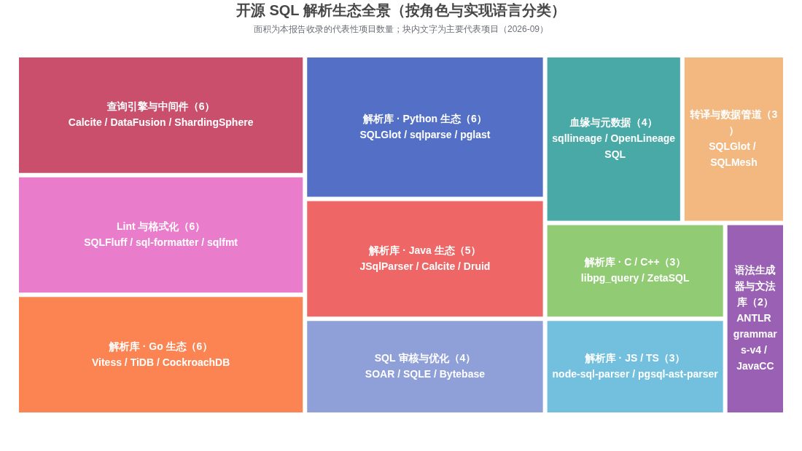
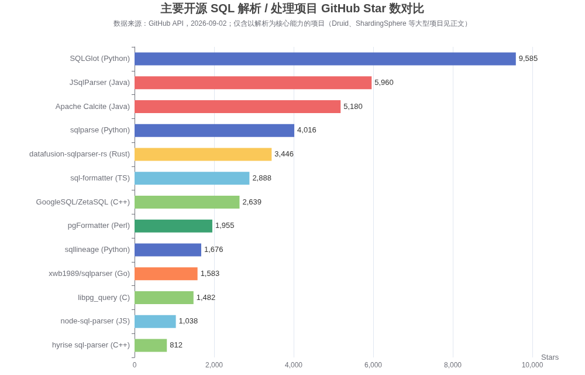

# 开源 SQL 语法解析器与相关项目全景调研报告

## 摘要

开源 SQL 解析器生态在 2026 年已经高度成熟，可以归纳为 **四条技术路线**：手写递归下降/Pratt 解析器（SQLGlot、datafusion-sqlparser-rs、Druid）、解析器生成器（ANTLR + grammars-v4、JavaCC 系的 JSqlParser、Calcite）、复用数据库官方解析器（libpg_query 系列、GoogleSQL/ZetaSQL、Vitess、TiDB），以及只做词法分词的轻量工具（sqlparse）。如果只需要一句话答案：**Python 生态首选 SQLGlot（9.6k stars，31+ 方言、转译与血缘一体化），Java 生态首选 JSqlParser 或 Druid SQL Parser，Rust 生态首选 datafusion-sqlparser-rs，Go 生态直接用 Vitess/TiDB 的解析器，JavaScript 生态用 node-sql-parser 或基于 WASM 的 sqlparser-ts；要 Lint/格式化选 SQLFluff，要血缘选 sqllineage 或 DataHub 的 schema-aware 解析器，要转译选 SQLGlot/SQLMesh，要构建查询引擎选 Apache Calcite 或 DataFusion。**

| 场景 | 推荐项目 | 备选 |
|---|---|---|
| Python，多方言转译/血缘 | SQLGlot | sqlfluff（仅解析） |
| Python，仅分词/格式化 | sqlparse | pglast（PostgreSQL 精确解析） |
| Java，通用解析 | JSqlParser | Druid SQL Parser（国产库方言强） |
| Java，构建查询引擎/优化器 | Apache Calcite | Presto/Trino 解析器 |
| Rust，查询引擎底座 | datafusion-sqlparser-rs | sqloxide（Python 绑定） |
| Go，MySQL 协议系 | Vitess sqlparser、TiDB parser | blastrain/vitess-sqlparser |
| PostgreSQL 精确语法树 | libpg_query（C，多语言绑定） | pglast（Python）、pgsql-parser（Node） |
| JS/浏览器 | node-sql-parser | sqlparser-ts（WASM，16 方言） |
| SQL Lint/风格检查 | SQLFluff | sqruff（Rust 版）、sqlfmt |
| 表级/列级血缘 | sqllineage、sqlglot.lineage | DataHub parser、OpenLineage SQL |
| SQL 审核/优化建议 | SOAR、SQLE | Bytebase、Archery |
| 自定义方言文法 | ANTLR grammars-v4 | JavaCC |

---

## 1. SQL 解析器要解决什么问题

SQL 解析（SQL Parsing）是把一段 SQL 文本经过**词法分析（Lexer）**切成 Token、再经过**语法分析（Parser）**组装成**抽象语法树（AST）**的过程。需要区分的是，解析器（Parser）和查询引擎（Query Engine）不是同一层的东西：解析器的输入是 SQL 字符串、输出是 AST 或错误，**不访问数据、不执行查询**；查询引擎则在此之上做语义分析、逻辑计划、优化和物理执行，SQLGlot、sqlparser-rs、JSqlParser 属于前者，PostgreSQL、DuckDB、Spark、Trino 属于后者 ([Understanding SQL Parsers](https://nishchith.com/sql-parsers/))。

之所以存在如此多的开源 SQL 解析器，根本原因在于 **SQL 方言的高度碎片化**：同一个操作在不同数据库中的函数名和语法各不相同（例如取当前时间，PostgreSQL/MySQL 用 `NOW()`，SQL Server 用 `GETDATE()`，Snowflake 用 `CURRENT_TIMESTAMP()`；空值处理分别有 `IFNULL()`、`ISNULL()`、`NVL()` 等） ([Understanding SQL Parsers](https://nishchith.com/sql-parsers/))。各家解析器处理方言的策略也不同：sqlparser-rs 采用**方言开关**（约 50 个布尔标志位），SQLGlot 采用**参数化文法**（每种方言继承基类 Parser 并重写特定方法），而商业产品 Gudusoft GSP 则是**每个数据库一套独立文法** ([Understanding SQL Parsers](https://nishchith.com/sql-parsers/))。

从实现技术看，开源 SQL 解析器大致分三类。第一类是**手写递归下降**，表达式部分常用 Pratt Parser（自顶向下运算符优先级解析），语句部分用传统递归下降——sqlparser-rs 明确采用这种设计，理由是与解析器生成器相比代码更简洁、性能更好、调试更容易、方言扩展更自由 ([sqlparser-rs GitHub](https://github.com/apache/datafusion-sqlparser-rs))。第二类是**解析器生成器**：ANTLR 通过 `.g4` 语法文件自动生成 Lexer 和 Parser，被 ShardingSphere、Hive、Presto 等项目使用 ([CSDN ANTLR 解析 SQL](https://blog.csdn.net/puhaiyang/article/details/122161809))；JavaCC 则被 JSqlParser 和 Apache Calcite 采用 ([掘金 SQL Parser 项目盘点](https://juejin.cn/post/7372080518130679845))。第三类是**直接复用数据库自身的解析器**：libpg_query 把 PostgreSQL 的 `raw_parser` 抽成独立 C 库，DuckDB 的解析器也是从 libpg_query 起步后来移植到 C++ ([pganalyze 博客](https://pganalyze.com/blog/pg-query-postgres-16), [Firebolt 论文](https://cdmsworkshop.github.io/2022/Proceedings/ShortPapers/Paper1_MoshaPasumansky.pdf))。

## 2. 生态全景与项目热度

下图按“在生态中的角色 × 实现语言”对本报告收录的代表性项目做了分类。可以看到两个明显趋势：一是**独立解析库按宿主语言高度分化**，几乎每个主流语言都有 1~2 个事实标准；二是**解析器之上长出了完整的工具链**，Lint/格式化、血缘分析、方言转译、SQL 审核、查询引擎五类应用构成了 SQL 静态分析的主要落地场景。

下图给出了以 SQL 解析/处理为核心能力的开源项目的 GitHub Star 数对比（数据通过 GitHub API 于 2026-09-02 实测）。需要说明的是，Druid（28,178 stars）、ShardingSphere（20,787 stars）、TiDB（40,480 stars）这类项目的 Star 数反映的是整个数据库/中间件项目的热度而非其解析器模块本身，因此未纳入本图 ([GitHub Druid](https://github.com/alibaba/druid), [GitHub ShardingSphere](https://github.com/apache/shardingsphere))。

整体格局上，**SQLGlot（9,585 stars）和 SQLFluff（9,864 stars）是 Python 系的双龙头**；JSqlParser（5,960 stars）和 Apache Calcite（5,180 stars）统治 Java 系；datafusion-sqlparser-rs（3,446 stars）随 Apache DataFusion 进入 Apache 基金会后成为 Rust 系事实标准 ([GitHub SQLGlot](https://github.com/tobymao/sqlglot), [GitHub SQLFluff](https://github.com/sqlfluff/sqlfluff), [GitHub JSqlParser](https://github.com/JSQLParser/JSqlParser), [GitHub datafusion-sqlparser-rs](https://github.com/apache/datafusion-sqlparser-rs))。

| 项目 | 语言 | 协议 | Stars（2026-09-02） | 定位一句话 |
|---|---|---|---|---|
| [SQLGlot](https://github.com/tobymao/sqlglot) | Python | MIT | 9,585 | 多方言解析+转译+优化+血缘，功能最全 |
| [SQLFluff](https://github.com/sqlfluff/sqlfluff) | Python | MIT | 9,864 | SQL Linter/Formatter，28 种方言 |
| [JSqlParser](https://github.com/JSQLParser/JSqlParser) | Java | Apache-2.0/LGPL | 5,960 | Java 系最成熟的通用解析器 |
| [Apache Calcite](https://github.com/apache/calcite) | Java | Apache-2.0 | 5,180 | 解析+校验+优化器框架 |
| [sqlparse](https://github.com/andialbrecht/sqlparse) | Python | BSD-3 | 4,016 | 非校验型分词/格式化库 |
| [datafusion-sqlparser-rs](https://github.com/apache/datafusion-sqlparser-rs) | Rust | Apache-2.0 | 3,446 | Rust 生态查询引擎的解析底座 |
| [sql-formatter](https://github.com/sql-formatter-org/sql-formatter) | TypeScript | MIT | 2,888 | Web 侧最流行的 SQL 美化库 |
| [GoogleSQL（原 ZetaSQL）](https://github.com/google/googlesql) | C++ | Apache-2.0 | 2,639 | BigQuery/Spanner 同款解析+分析器 |
| [pgFormatter](https://github.com/darold/pgFormatter) | Perl | PostgreSQL | 1,955 | PostgreSQL 专用格式化 |
| [sqllineage](https://github.com/reata/sqllineage) | Python | MIT | 1,676 | 表级/列级血缘分析 |
| [xwb1989/sqlparser](https://github.com/xwb1989/sqlparser) | Go | Apache-2.0 | 1,583 | Vitess 解析器的 Go 独立封装 |
| [libpg_query](https://github.com/pganalyze/libpg_query) | C | BSD-3 | 1,482 | PostgreSQL 官方解析器的独立 C 库 |
| [node-sql-parser](https://github.com/taozhi8833998/node-sql-parser) | JS(PEG.js) | Apache-2.0 | 1,038 | Node/浏览器端多方言解析 |
| [hyrise sql-parser](https://github.com/hyrise/sql-parser) | C++ | MIT | 812 | 学术型 C++ SQL 解析器 |

## 3. 按语言生态划分的独立解析库

### 3.1 Python 生态

**SQLGlot** 是当前 Python 乃至全生态中功能最完整的开源 SQL 解析器：零依赖纯 Python 实现，官方定位为“no-dependency SQL parser, transpiler, optimizer, and engine”，支持在 **24~34 种方言**（不同版本口径，含 DuckDB、Presto/Trino、Spark/Databricks、Snowflake、BigQuery 等）之间互转，并提供 AST 遍历、表达式树编程式构建、语法错误高亮、SQL 优化器和血缘 API ([SQLGlot GitHub README](https://github.com/swesmith/tobymao__sqlglot.036601ba/blob/main/README.md), [Fivetran 博客](https://www.fivetran.com/blog/how-we-accelerated-transpilation-by-compiling-sqlglot-with-mypyc))。它采用参数化文法设计——一个基础 Parser 类加各方言子类的方法重写——因此扩展方言的成本较低 ([Understanding SQL Parsers](https://nishchith.com/sql-parsers/))。其下游用户包括 SQLMesh、Apache Superset、Dagster、Ibis、Fugue、dlt、SQLFrame 等 ([SQLGlot GitHub](https://github.com/tobymao/sqlglot?ref))。性能方面纯 Python 是短板，官方提供了 mypyc 编译版本（sqlglot[c]）和 Rust 分词器（sqlglot[rs]），Fivetran 的测试表明 mypyc 编译可显著加速大规模转译场景；在官方基准中 sqlglot[c] 解析 TPC-H 查询的耗时约为纯 Python 版的 1/4 ([sqlglot 官方 Benchmark](https://sqlglot.com/))。

**sqlparse** 是 Python 生态资格最老的 SQL 库（2012 年起），但它是一个**非校验型（non-validating）解析器**：只负责把 SQL 文本分词并分组为语句/子句/标识符的 Token 树，不校验语法正确性，也不绑定任何方言，因此厂商扩展语法和模板化 SQL 都能“解析”通过 ([sqlparse GitHub](https://github.com/andialbrecht/sqlparse))。它附带 `format()` 和 `sqlformat` 命令行，长期作为 Django Debug Toolbar、ipython-sql 等工具的依赖 ([sqlparse 文档](https://sqlparse.readthedocs.io/en/stable/), [openapps.pro 分析](https://openapps.pro/packages/sqlparse))。需要注意 0.6.0 之前版本存在针对纯注释语句的二次方复杂度拒绝服务风险（CVE，CVSS 8.7），生产使用应升级到 0.6.0+ ([Rapid7 CVE 记录](https://www.rapid7.com/db/vulnerabilities/cve-2026-71491/))。

围绕 PostgreSQL 的精确解析，Python 侧有 **pglast**（libpg_query 的 Python 3 绑定，402 stars）和较新的 **pgparse**（支持 libpg_query 17-latest，提供 Linux/macOS 预编译 wheel） ([pgparse GitHub](https://github.com/gmr/pgparse), [libpg_query 介绍](https://www.neura.market/ai-tools-directory/all/pganalyze-libpg-query))。此外还有 **mo-sql-parsing**（Mozilla 系 moz-sql-parser 的重写分支，原项目已归档，570 stars）、**sql-metadata**（基于 sqlparse 的表名列名提取轻量库）、**sqloxide**（sqlparser-rs 的 Python 绑定，适合追求 Rust 级解析速度的场景） ([GitHub moz-sql-parser](https://github.com/mozilla/moz-sql-parser))。

### 3.2 Java/JVM 生态

**JSqlParser** 是 Java 生态中使用最广的独立 SQL 解析器，基于 JavaCC 构建，把 SQL 语句翻译为可导航的 Java 类层次结构，并通过 Visitor 模式遍历；内置 `TablesNamesFinder` 可直接实现表级血缘 ([JSqlParser GitHub](https://github.com/jsqlparser/jsqlparser), [掘金 SQL Parser 项目盘点](https://juejin.cn/post/7372080518130679845))。5.x 版本重点优化了性能，官方宣称比 5.3 快 11 倍，且在真实 SQL 的跨语言横评中是“所有被测解析器中最快的”，在自有 SELECT 测试集上比 sqlglot[c] 快 19 倍 ([JSqlParser GitHub](https://github.com/jsqlparser/jsqlparser))。短板是方言覆盖相对有限（社区口径约 6 种），对 Oracle MODEL 子句、MERGE LOG ERRORS、BigQuery 过程化 SQL 等深方言支持不足 ([Understanding SQL Parsers](https://nishchith.com/sql-parsers/), [dpriver 对比测试](https://www.dpriver.com/blog/gsp-vs-jsqlparser-vs-sqlglot-sql-parser-comparison-2026/))。

**Apache Calcite** 不只是解析器，而是“动态数据管理框架”：包含行业标准 SQL Parser（JavaCC 生成、可扩展文法）、Validator（结合 Catalog 做语义校验）、可插拔规则与代价模型的优化器（RBO/CBO）、以及把关系表达式翻译回不同方言 SQL 的能力 ([Calcite 论文](https://arxiv.org/pdf/1802.10233v1.pdf), [Baeldung Calcite 教程](https://www.baeldung.com/apache-calcite))。它被 Apache Hive、Flink、Druid（OLAP）、Kylin、MaxCompute、Kafka 等大量系统用作 SQL 层，适合“要自建查询引擎/联邦查询”的团队 ([Baeldung](https://www.baeldung.com/apache-calcite), [Firebolt 论文](https://cdmsworkshop.github.io/2022/Proceedings/ShortPapers/Paper1_MoshaPasumansky.pdf))。缺点是体系庞大、上手成本高，且部分方言（如 Snowflake）支持缺失 ([DataHub 博客](https://datahub.com/blog/extracting-column-level-lineage-from-sql/))。

**Alibaba Druid SQL Parser** 是 Druid 连接池内置的 SQL 解析模块，手工编写、性能极强——官方称简单 SQL 解析约 600 纳秒、单线程每秒可处理 1500 万次以上，比 ANTLR/JavaCC 生成的解析器快 10~100 倍，目标是“可在生产环境链路上直接解析 SQL” ([Druid Wiki](https://github.com/alibaba/druid/wiki/SQL-Parser), [51CTO Druid 介绍](https://blog.51cto.com/u_13416/8892606))。当前版本支持 **30 种数据库方言**，覆盖 MySQL、PostgreSQL、Oracle、SQL Server、DB2 等主流库，达梦、GaussDB 等国产库，以及 ClickHouse、Doris、StarRocks、BigQuery、Snowflake、Hive、Spark、Presto 等分析型引擎，每种方言都有完整的 Lexer/Parser/AST/Visitor 实现 ([Gitee Druid](https://gitee.com/mirrors_alibaba/druid))。它还内置 WallFilter（SQL 注入防御）、SchemaStatVisitor（表/字段/条件统计）、参数合并、方言互译等特色能力，阿里云 Oracle→MySQL 的 SQL 翻译即基于它实现 ([Druid Wiki](https://github.com/alibaba/druid/wiki/SQL-Parser))。国内多项对比测试的共识是“短 SQL 用 JSqlParser 更快，长 SQL 用 Druid 更快，功能上 Druid 更全” ([CSDN 三种 SQL 解析器对比](https://blog.csdn.net/csp_6666/article/details/127718956), [51CTO Java 解析器比较](https://blog.51cto.com/zhjh256/3137401))。

**Apache ShardingSphere** 的解析引擎经历了三代演进：1.4.x 之前用 Druid，1.5.x 起自研“半理解式”解析器只提炼分片所需上下文，3.0.x 起改用 ANTLR 以获得更好的方言兼容性；实测 ANTLR 比自研解析慢 3~10 倍，因此通过 AST 缓存配合 PreparedStatement 来弥补 ([ShardingSphere 官方文档](https://shardingsphere.apache.org/document/current/cn/reference/sharding/parse/))。其解析引擎可独立使用，提供 MySQL、PostgreSQL、Oracle、SQLServer、openGauss、SQL92 等多方言 AST ([SegmentFault ShardingSphere Parser](https://segmentfault.com/a/1190000045230039))。此外，**Presto/Trino、Spark Catalyst、Apache Hive** 也都各自内置基于 ANTLR 的 SQL 解析器，常被单独抽出来复用 ([CSDN ANTLR 解析 SQL](https://blog.csdn.net/puhaiyang/article/details/122161809))。

### 3.3 Rust 生态

**datafusion-sqlparser-rs**（原 sqlparser-rs，2024 年起迁入 Apache 基金会）是 Rust 生态的事实标准 SQL 解析器：目标是兼容 ANSI/ISO SQL（以 SQL-92 为主体，参考 SQL:2016 文法），同时提供可插拔方言机制方便做厂商特定扩展 ([datafusion-sqlparser-rs GitHub](https://github.com/apache/datafusion-sqlparser-rs))。其设计为手写递归下降 + 表达式部分 Pratt Parser，明确反对解析器生成器路线，理由是性能、可调试性和方言扩展性更好 ([datafusion-sqlparser-rs GitHub](https://github.com/apache/datafusion-sqlparser-rs))。它的用户名单几乎就是 Rust 数据生态的名录：Apache DataFusion、Ballista、Polars、GlueSQL、Opteryx、ParadeDB、GreptimeDB、Readyset、PRQL、CipherStash Proxy 等 ([datafusion-sqlparser-rs GitHub](https://github.com/apache/datafusion-sqlparser-rs))。在 sqlglot 官方基准中，基于它的 Rust 绑定（sqloxide）在所有测试查询上都是最快的一档，比纯 Python 的 sqlglot 快约 4 倍、比 sqlfluff 快两个数量级 ([sqlglot Benchmark](https://sqlglot.com/))。

围绕它还有两个值得关注的衍生项目：**sqloxide** 把 sqlparser-rs 封装为 Python 扩展，适合在 Python 管道中追求解析吞吐的场景 ([sqlglot Benchmark](https://sqlglot.com/))；**sqlparser-ts** 则把 datafusion-sqlparser-rs 编译到 WebAssembly，为 JavaScript/TypeScript 提供带完整类型定义的 AST，支持 16 种方言，gzip 后约 600KB，可跑在 Node.js 和浏览器中，2026 年 2 月被 Apache Airflow 正式集成 ([sqlparser-ts GitHub](https://github.com/guan404ming/sqlparser-ts))。

### 3.4 Go 生态

Go 生态没有中立的独立解析器，主流做法是**直接复用云原生数据库项目内生的解析器**。最重要的是 **Vitess 的 sqlparser**（`vitess.io/vitess/go/vt/sqlparser`）：基于 goyacc 的 MySQL 语法解析器，提供完整的 AST、Visitor/Rewriter 代码生成、SQL 归一化（Normalize）、绑定变量提取、语句拆分等生产能力 ([Vitess sqlparser 文档](https://pkg.go.dev/vitess.io/vitess/go/vt/sqlparser))。**TiDB parser**（现已并入 `pingcap/tidb` 仓库）则是 MySQL 协议系中 DDL 支持最完整的 Go 解析器。**CockroachDB** 自带一套 PostgreSQL 风格的 SQL 解析器，auxten/postgresql-parser（313 stars）就是把 CockroachDB 的解析器抽成独立库的早期尝试 ([auxten/postgresql-parser GitHub](https://github.com/auxten/postgresql-parser))。

在独立封装层，**xwb1989/sqlparser**（1,583 stars）是最早流行的 Vitess 解析器独立库，但因定制裁剪导致不支持 offset、批量插入等复杂查询，DDL 支持也有限；**blastrain/vitess-sqlparser**（497 stars，原 knocknote/vitess-sqlparser）则直接用 Vitess 解析 DML、用 TiDB parser 解析 DDL，补齐了两者的盲区 ([blastrain/vitess-sqlparser GitHub](https://github.com/blastrain/vitess-sqlparser))。这一组合思路也被小米 SOAR 采用——SOAR 的语法解析层是松散可插拔的，以 Vitess 解析库为主、TiDB 解析器为辅、再以 MySQL 真实执行结果兜底多方言差异 ([SOAR 架构介绍](https://www.yisu.com/jc/146195.html))。

### 3.5 C/C++ 与“数据库官方解析器”路线

**libpg_query** 是“复用官方解析器”路线的代表作：它从 PostgreSQL 源码中把 `raw_parser` 及其依赖抽取为独立 C 库（借助 libclang 做依赖分析、protobuf 自动生成节点定义），输出与 PostgreSQL 完全一致的解析树（JSON/Protobuf），支持 PostgreSQL 全部语法 ([pganalyze 博客](https://pganalyze.com/blog/pg-query-postgres-16))。基于它的多语言绑定构成一个家族：Ruby 的 pg_query、Go 的 pg_query.go、Rust 的 pg_query.rs、Node 的 pgsql-parser、Python 的 psqlparse/pglast/pgparse ([libpg_query 介绍](https://www.neura.market/ai-tools-directory/all/pganalyze-libpg-query))。最新版本已跟进 PostgreSQL 16/17，支持 Windows 编译、PL/pgSQL 赋值解析模式和 SQL/JSON 新语法 ([pganalyze 博客](https://pganalyze.com/blog/pg-query-postgres-16))。适用场景非常明确：只要目标方言是 PostgreSQL 且要求“与真实数据库行为 100% 一致”（例如 pg_stat_statements 式的指纹归一化、审计、语句重写），libpg_query 是最优解。

**GoogleSQL（原 ZetaSQL）** 是 Google 开源的 SQL 解析器+分析器框架（C++，Apache-2.0，2,639 stars），是 BigQuery、Spanner、Dataflow 及内部 Dremel、F1 等产品所用 GoogleSQL 前端的同源代码，2026 年 2 月正式从 ZetaSQL 更名为 GoogleSQL 以统一品牌 ([Google 更名报道](https://www.developer-tech.com/news/google-open-source-zetasql-project-to-googlesql/), [ZetaSQL GitHub](https://github.com/kaniini/zetasql))。它的独特价值在于不止于语法树：提供 **ResolvedAST**（带类型、名称解析完成的语义分析结果）、类型检查、隐式转换规则、标准函数实现和一个内存参考执行引擎 ([ZetaSQL GitHub](https://github.com/kaniini/zetasql), [CDMS 论文](https://cdmsworkshop.github.io/2022/Proceedings/ShortPapers/Paper1_MoshaPasumansky.pdf))。局限是方言固执（与 PostgreSQL 系差异大）、不接受外部代码贡献（仅 Google 内部导出）、Spanner 的 DDL 并未纳入，且没有查询规划器 ([CDMS 论文](https://cdmsworkshop.github.io/2022/Proceedings/ShortPapers/Paper1_MoshaPasumansky.pdf), [Zenn 分析](https://zenn.dev/apstndb/articles/requirem-for-spansql))。另有学术出身的 **hyrise/sql-parser**（C++，MIT，812 stars）可作为轻量 C++ 选择 ([hyrise/sql-parser GitHub](https://github.com/hyrise/sql-parser))。值得一提的还有 **DuckDB**：它早期直接基于 libpg_query，后来把解析器移植到 C++ 并深度扩展，是“以 PostgreSQL 文法为底座自研演进”的成功案例 ([CDMS 论文](https://cdmsworkshop.github.io/2022/Proceedings/ShortPapers/Paper1_MoshaPasumansky.pdf))。

### 3.6 JavaScript/TypeScript 与其他语言

**node-sql-parser**（1,038 stars，基于 PEG.js 文法）是 Node/浏览器端最知名的独立解析器，支持多语句、SELECT/INSERT/UPDATE/DELETE 及部分 DDL，能输出 AST（astify）并反向生成 SQL（sqlify），还能给出语句访问的表/列清单；浏览器版提供全量 UMD（约 750KB）和按数据库裁剪的 UMD（约 150KB） ([node-sql-parser GitHub](https://github.com/taozhi8833998/node-sql-parser), [node-sql-parser README](https://www.tkcnn.com/github/taozhi8833998/node-sql-parser.html))。PostgreSQL 方向有 **pgsql-ast-parser**（oguimbal，TS 实现，覆盖较全的 PG 语法）。新趋势是前面提到的 **sqlparser-ts**：用 WASM 把 Rust 解析器带进浏览器，兼顾性能与方言覆盖，已被 Apache Airflow 采用 ([sqlparser-ts GitHub](https://github.com/guan404ming/sqlparser-ts))。

其他语言中，PHP 生态有 **phpmyadmin/sql-parser**（484 stars，GPL-2.0），是 phpMyAdmin 团队维护的纯 PHP SQL 解析/词法库 ([phpmyadmin/sql-parser GitHub](https://github.com/phpmyadmin/sql-parser))；Perl 生态的 **pgFormatter**（1,955 stars）虽定位是格式化器，内部也包含完整的 PostgreSQL 语法解析逻辑 ([pgFormatter GitHub](https://github.com/darold/pgFormatter))。

## 4. 语法生成器与文法库：自己造一个解析器

如果现有解析器都不满足需求（例如要支持私有 SQL 方言、极端性能约束或只需要解析 SQL 子集），可以基于**解析器生成器**自建。该路线的事实标准是 **ANTLR4**：编写 `.g4` 文法即可生成 Java/C#/Python/Go/C++/JS 等多语言目标的 Lexer/Parser，Hive、Presto/Trino、Spark、ShardingSphere 都是这条路线 ([dbaplus ANTLR 文章](https://dbaplus.cn/news-155-2261-1.html), [CSDN ANTLR 解析 SQL](https://blog.csdn.net/puhaiyang/article/details/122161809))。配套文法库 **antlr/grammars-v4**（11,052 stars）的 `sql` 目录下提供 MySQL、PostgreSQL、PL/SQL、TSQL、Hive、Snowflake 等十余种现成 SQL 文法，可直接生成或裁剪——ShardingSphere 早期文法即参考于此 ([grammars-v4 GitHub](https://github.com/antlr/grammars-v4), [SegmentFault ShardingSphere 解析](https://segmentfault.com/a/1190000039881002))。ANTLR 的代价是性能低于手写解析器（ShardingSphere 实测慢 3~10 倍），通常需要 AST 缓存配合 PreparedStatement 使用 ([ShardingSphere 官方文档](https://shardingsphere.apache.org/document/4.1.0/cn/features/sharding/principle/parse/))。

另一条老路线是 **JavaCC**（JSqlParser、Calcite 使用）和经典的 **yacc/bison/goyacc**（PostgreSQL、MySQL、Vitess、TiDB 使用） ([掘金 SQL Parser 项目盘点](https://juejin.cn/post/7372080518130679845))。选择思路可以概括为：需要多语言目标或快速原型选 ANTLR；深耕 JVM 且要细粒度控制选 JavaCC；做数据库级严肃产品且有长期维护能力，手写递归下降（参考 sqlparser-rs 的论证）或 yacc 系仍是主流 ([datafusion-sqlparser-rs GitHub](https://github.com/apache/datafusion-sqlparser-rs))。编辑器语法高亮/增量解析场景还有 tree-sitter 系的 tree-sitter-sql 文法可用。

## 5. 解析器的“相关用途”项目

### 5.1 Lint 与格式化

**SQLFluff**（9,864 stars，MIT）是 SQL 界的 ESLint：模块化规则引擎（60+ 规则）、支持 **28 种方言**（ANSI、Athena、BigQuery、ClickHouse、Databricks、Db2、Doris、DuckDB、Exasol、FlinkSQL、Greenplum、Hive、Impala、MariaDB、Materialize、MySQL、Oracle、PostgreSQL、Redshift、Snowflake、SOQL、SparkSQL、SQLite、StarRocks、Teradata、T-SQL、Trino、Vertica），支持 Jinja/dbt/SQLAlchemy 参数等模板，能自动修复大多数风格问题，并提供 CLI、pre-commit 钩子和 VS Code 扩展 ([SQLFluff GitHub](https://github.com/open-metadata/collate-sqlfluff), [DEV.co SQLFluff](https://dev.co/databases/open-source/sqlfluff))。它内置自己的容错解析器（whitespace-aware），`sqlfluff parse` 本身就可作为通用解析器使用，也是 sqllineage 的可选解析后端之一 ([SQLFluff 官网](https://sqlfluff.com/), [塔尔图大学论文](https://dspace.ut.ee/bitstreams/392b32ea-1cfa-4c08-9b8e-d70e647dbcfc/download))。追求速度的团队可以选 **sqruff**（SQLFluff 的 Rust 复刻）或 **sqlfmt**（shandy-sqlfmt/tconbeer，547 stars，dbt 社区出品，主张零配置、gofmt 式风格） ([GitHub tconbeer/sqlfmt](https://github.com/tconbeer/sqlfmt), [LevelUp sqlfmt 实践](https://levelup.gitconnected.com/transforming-vs-code-into-a-powerful-sql-ide-26286a2726bf))。

纯格式化方向：**sql-formatter**（TypeScript，2,888 stars）是 Web IDE 里最常见的 SQL 美化库，9.0 版本增加 Redshift/Snowflake 感知和 WASM 构建 ([GitHub sql-formatter](https://github.com/sql-formatter-org/sql-formatter), [Galaxy 2025 盘点](https://www.getgalaxy.io/learn/data-tools/best-sql-linters-formatters-2025))；**pgFormatter**（Perl，1,955 stars）是 PostgreSQL 社区老牌工具，6.0 引入并行解析与 JSON 规则文件 ([Galaxy 2025 盘点](https://www.getgalaxy.io/learn/data-tools/best-sql-linters-formatters-2025))；T-SQL/PL/SQL 场景还有 Poor Man's T-SQL Formatter；Prettier 用户可用 prettier-plugin-sql ([Galaxy 2025 盘点](https://www.getgalaxy.io/learn/data-tools/best-sql-linters-formatters-2025))。

### 5.2 血缘分析（Lineage）

**sqllineage**（reata，1,676 stars，MIT）是最流行的开源 Python 血缘库：基于 sqlparse/SQLFluff 双解析后端，用 networkx 建图，支持表级与列级血缘、多方言（ANSI/Hive/SparkSQL 等），提供 CLI、Python API 和 DAG 可视化 ([DEV.co sqllineage](https://dev.co/databases/open-source/sqllineage))。**OpenLineage** 则走运行时事件标准路线（2,637 stars），其 openlineage-sql 子包用 Rust 实现并提供 Python 绑定 ([GitHub OpenLineage](https://github.com/OpenLineage/OpenLineage), [DataHub 博客](https://datahub.com/blog/extracting-column-level-lineage-from-sql/))。**DataHub** 自研了 schema-aware 的 SQL 血缘解析器——用 SQLGlot 解析出 AST 后结合元数据图谱解析列引用歧义，在其约 7,000 条 BigQuery SELECT + 2,000 条 CTAS 的测试集上，列级血缘覆盖率显著优于 sqllineage 和 openlineage-sql，支持 30+ 方言 ([DataHub 博客](https://datahub.com/blog/extracting-column-level-lineage-from-sql/))。Rust 侧新秀 **funcpp/sqllineage** 基于 sqlparser-rs 提供库+CLI+Python 绑定，支持 CTE、UNION、窗口函数与可选 Catalog 元数据消歧 ([funcpp/sqllineage GitHub](https://github.com/funcpp/sqllineage))。需要提示的是，对存储过程（PL/SQL、T-SQL TRY/CATCH）内部逻辑的列级血缘，开源方案普遍力不从心，商业的 Gudu SQLFlow 通过每库一套文法和专门的存储过程解析覆盖了这类场景，可作为能力上限的参照 ([dpriver 对比测试](https://www.dpriver.com/blog/gsp-vs-jsqlparser-vs-sqlglot-sql-parser-comparison-2026/), [Gudu 血缘工具横评](https://www.gudusoft.com/best-data-lineage-tools/))。

### 5.3 方言转译与数据管道

转译（transpilation）是 SQLGlot 的主场，也是它被创建的原因——作者 Toby Mao 最初的动机就是在 SparkSQL 与 Presto 之间互转 ([SQLGlot 官方博客](https://sqlglot.com/sqlglot/executor.html))。在此之上，Tobiko Data 的 **SQLMesh** 以 SQLGlot 为内核提供语义理解驱动的数据管道平台（虚拟数据环境、增量模型、列级血缘），公司累计融资 2,180 万美元持续投入这两个开源项目 ([Pulse2 报道](https://pulse2.com/tobiko-data-4-5-million-raised-to-invest-in-open-source-projects-sqlmesh-and-sqlglot/))。同源项目 **SQLFrame** 则把 DataFrame API 翻译成多方言 SQL。Fivetran 也在数据管道中大规模使用 SQLGlot 做跨引擎转译，并通过 mypyc 编译解决纯 Python 的性能瓶颈 ([Fivetran 博客](https://www.fivetran.com/blog/how-we-accelerated-transpilation-by-compiling-sqlglot-with-mypyc))。Java 侧类似能力可由 Druid 的方言 Visitor 输出或 Calcite 的 SqlDialect 体系实现 ([Druid Wiki](https://github.com/alibaba/druid/wiki/SQL-Parser))。

### 5.4 查询引擎与数据库中间件

构建查询引擎时，解析层通常直接选用成熟组件：JVM 系选 **Apache Calcite**（Hive、Flink、Druid OLAP、Kylin、MaxCompute 等采用） ([Baeldung](https://www.baeldung.com/apache-calcite))；Rust 系选 **datafusion-sqlparser-rs**（DataFusion、Polars、GreptimeDB、ParadeDB 等采用） ([datafusion-sqlparser-rs GitHub](https://github.com/apache/datafusion-sqlparser-rs))；Google 系产品选 **GoogleSQL/ZetaSQL** ([ZetaSQL GitHub](https://github.com/kaniini/zetasql))。数据库中间件里，**ShardingSphere**（分库分表，ANTLR 解析引擎）、**Vitess**（MySQL 水平扩展，goyacc 解析器）、**Bytebase**（14,459 stars，数据库变更管理，内部维护多方言解析器用于 SQL 审核与变更预检）都把解析器作为核心组件 ([ShardingSphere 官方文档](https://shardingsphere.apache.org/document/current/cn/reference/sharding/parse/), [Vitess sqlparser 文档](https://pkg.go.dev/vitess.io/vitess/go/vt/sqlparser), [GitHub Bytebase](https://github.com/bytebase/bytebase))。

### 5.5 SQL 审核、优化与安全

SQL 审核类工具的本质是“解析器 + 规则库 + 元数据”。**SOAR（SQL Optimizer And Rewriter）** 是小米 DBA 团队 2018 年开源的 SQL 智能优化与改写工具（Go），支持启发式规则优化、多列索引建议、EXPLAIN 解读、SQL 指纹/压缩/美化、ALTER 合并和自定义改写规则；其解析层采用 Vitess + TiDB + MySQL 真实执行结果三路互补的可插拔架构 ([SOAR 介绍](https://developer.cloud.tencent.com/article/1698411), [SOAR 架构](https://www.yisu.com/jc/146195.html))。**SQLE**（爱可生开源）是覆盖事前/事中/事后全场景的 SQL 质量管理平台，原生支持 MySQL，通过插件扩展到 PostgreSQL、Oracle、SQL Server、DB2，并深度适配 OceanBase、达梦、TDSQL、GoldenDB 等国产库，内置规则库超过 1000 条 ([SQLE GitHub](https://github.com/actiontech/sqle))。同生态还有 Archery（SQL 审核与执行平台）、Yearning（MySQL 审核平台）等。安全方向上，Druid 的 WallFilter 基于解析器做 SQL 注入语义防御，是分词级正则（如 libinjection）之外的解析器级方案 ([Gitee Druid WallFilter](https://gitee.com/mirrors_alibaba/druid/blob/master/doc/wall-security-guide.md))。

## 6. 横向对比与评测证据

### 6.1 方言覆盖与解析深度

不同解析器的能力层次差异很大。下表综合社区评测整理五个代表性项目的能力矩阵（✅ 支持，⚠️ 部分，❌ 不支持）：

| 能力 | SQLGlot | sqlparser-rs | Calcite | JSqlParser | GSP（商业对照） |
|---|---|---|---|---|---|
| Lexer/Parser/AST | ✅ | ✅ | ✅ | ✅ | ✅ |
| 语义分析（名称/类型解析） | ✅ | ❌ | ✅ | ❌ | ✅ |
| 方言转译 | ✅ | ❌ | ⚠️ | ❌ | ⚠️ |
| 列级血缘 | ✅ | ❌ | ⚠️ | ❌ | ✅ |
| SQL 格式化 | ✅ | ⚠️ | ❌ | ⚠️ | ✅ |
| 方言数量（约） | 31 | ~15 | ~10 | ~6 | 25+ |

（矩阵来源：Atlan 工程师的解析器横评 ([Understanding SQL Parsers](https://nishchith.com/sql-parsers/))；GSP 为商业产品，列出仅作能力上限参照。）

解析深度的分水岭在**厂商专有语法与存储过程**。dpriver 2026 年的 14 例实测（覆盖 ANSI、Oracle、T-SQL、PostgreSQL、BigQuery、Snowflake 六种方言）显示：标准 DML 三家（GSP、JSqlParser 5.3、sqlglot 30.2）全部通过；Oracle MODEL 子句与 MERGE LOG ERRORS 只有商业 GSP 通过；T-SQL 存储过程中 sqlglot 会退化为不透明的 Command 节点丢失过程体结构；BigQuery 过程化 SQL（DECLARE/IF）则反过来只有 sqlglot 和 GSP 能解析——最终成绩 GSP 14/14、JSqlParser 与 sqlglot 各 11/14 ([dpriver 对比测试](https://www.dpriver.com/blog/gsp-vs-jsqlparser-vs-sqlglot-sql-parser-comparison-2026/))。这说明“方言数量”之外，更应关注**目标方言里你最依赖的那部分语法**是否被覆盖。

### 6.2 性能基准

性能方面有三组可信数据。其一，sqlglot 官方基准（Python 3.14）：以 TPC-H 查询为例，sqlglot 0.0027s、sqlglot[c] 0.00074s、sqltree 0.0022s、sqlparse 0.014s、sqlfluff 0.24s，Rust 绑定的 sqloxide 0.00066s——即 **Rust/C 级实现比纯 Python 快约一个数量级，比 SQLFluff 的容错解析快两个数量级** ([sqlglot Benchmark](https://sqlglot.com/))。其二，JSqlParser 官方称 5.x 比 5.3 快 11 倍，并在其跨语言横评中领先 sqlglot[c] 19 倍（注意这是厂商自测口径） ([JSqlParser GitHub](https://github.com/jsqlparser/jsqlparser))。其三，国内社区的 Java 横评结论是“短 SQL JSqlParser 更快、长 SQL Druid 更快”，而 Druid 官方宣称单线程每秒可解析 1,500 万条简单 SQL ([CSDN 三种 SQL 解析器对比](https://blog.csdn.net/csp_6666/article/details/127718956), [51CTO Druid](https://blog.51cto.com/u_13416/8892606))。生成器路线的 ANTLR 则公认偏慢（ShardingSphere 实测慢 3~10 倍），靠 AST 缓存弥补 ([ShardingSphere 官方文档](https://shardingsphere.apache.org/document/4.1.0/cn/features/sharding/principle/parse/))。

## 7. 选型建议

综合以上证据，按落地场景给出选型路径。**做 SQL 静态分析工具（表/列提取、改写、审计）**：Python 选 SQLGlot（方言最广、API 最现代）或 sqlparse（只需分词时最轻）；Java 选 JSqlParser（通用）或 Druid（国产库方言、性能与防注入）；Go 选 Vitess/TiDB 解析器或其封装 ([掘金 SQL Parser 项目盘点](https://juejin.cn/post/7372080518130679845))。**做数据血缘**：语句级用 sqllineage 或 sqlglot.lineage 即可；要求高覆盖且已有元数据平台，选 DataHub 的 schema-aware 方案；存储过程密集的存量系统需要商业方案补充 ([DataHub 博客](https://datahub.com/blog/extracting-column-level-lineage-from-sql/), [Gudu 血缘横评](https://www.gudusoft.com/best-data-lineage-tools/))。**做方言迁移/转译**：SQLGlot 是开源唯一成熟选项，Java 栈可用 Druid 方言 Visitor 兜底 ([Fivetran 博客](https://www.fivetran.com/blog/how-we-accelerated-transpilation-by-compiling-sqlglot-with-mypyc))。

**自建查询引擎**：JVM 用 Calcite，Rust 用 datafusion-sqlparser-rs + DataFusion，Go 直接站在 Vitess/TiDB/CockroachDB 的解析器上 ([CDMS 论文](https://cdmsworkshop.github.io/2022/Proceedings/ShortPapers/Paper1_MoshaPasumansky.pdf))。**PostgreSQL 专用且要求与数据库行为严格一致**：libpg_query 家族（pglast/pgparse/pgsql-parser） ([libpg_query 介绍](https://www.neura.market/ai-tools-directory/all/pganalyze-libpg-query))。**SQL 风格治理**：SQLFluff（规则+方言最全）为主，性能敏感用 sqruff/sqlfmt ([SQLFluff GitHub](https://github.com/open-metadata/collate-sqlfluff))。**SQL 审核上线**：国内企业优先考虑 SQLE（国产库适配深、规则库千条级）或 SOAR + 工单平台组合 ([SQLE GitHub](https://github.com/actiontech/sqle))。最后，如果目标语法非常特殊（自研 DSL、极小 SQL 子集、编辑器增量解析），直接基于 ANTLR grammars-v4 的现成文法裁剪生成，往往比改造重型解析器更划算 ([dbaplus ANTLR 文章](https://dbaplus.cn/news-155-2261-1.html))。

## 8. 趋势观察

从近两年的演进看，SQL 解析生态呈现三个明确走向。其一是 **Rust 化与 WASM 化**：sqlparser-rs 迁入 Apache、sqloxide 进入 Python 管道、sqlparser-ts 进入 Apache Airflow，说明高性能解析内核 + 多语言绑定正在取代各语言重复造轮子 ([sqlparser-ts GitHub](https://github.com/guan404ming/sqlparser-ts), [datafusion-sqlparser-rs GitHub](https://github.com/apache/datafusion-sqlparser-rs))。其二是**头部项目的公司化运营**：SQLGlot/SQLMesh 由 Tobiko Data 融资支持、SQLFluff 出现 Pro 层、libpg_query 由 pganalyze 维护，纯社区业余维护的解析器（如 moz-sql-parser 已归档）正在出清 ([Pulse2 报道](https://pulse2.com/tobiko-data-4-5-million-raised-to-invest-in-open-source-projects-sqlmesh-and-sqlglot/))。其三是**AI 场景成为新需求引擎**：Text-to-SQL 的结果校验、AI 生成 SQL 的安全网关、列级血缘驱动的上下文构建都依赖高质量解析，DataHub、Airflow 等平台把解析器作为 AI 数据栈的基础设施正是这一趋势的体现 ([DataHub 博客](https://datahub.com/blog/extracting-column-level-lineage-from-sql/))。可以预见，方言覆盖深度（尤其是存储过程与云数仓新语法）和 schema-aware 语义解析，仍将是开源项目与商业产品角力的主战场 ([dpriver 对比测试](https://www.dpriver.com/blog/gsp-vs-jsqlparser-vs-sqlglot-sql-parser-comparison-2026/))。
