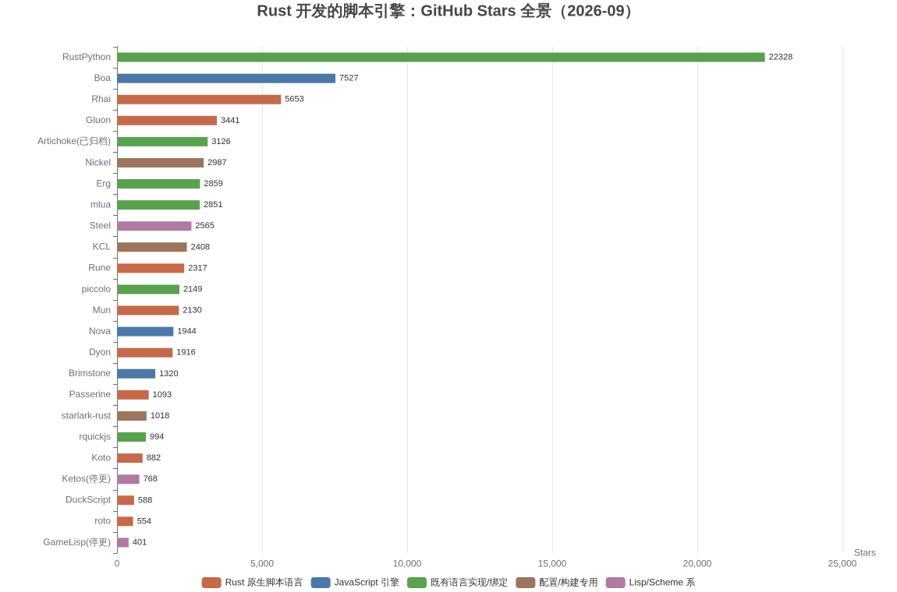
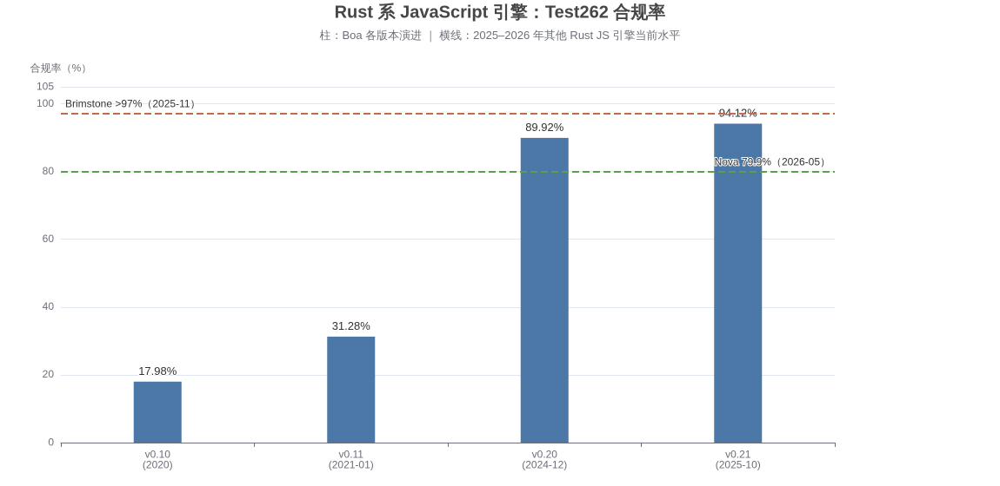
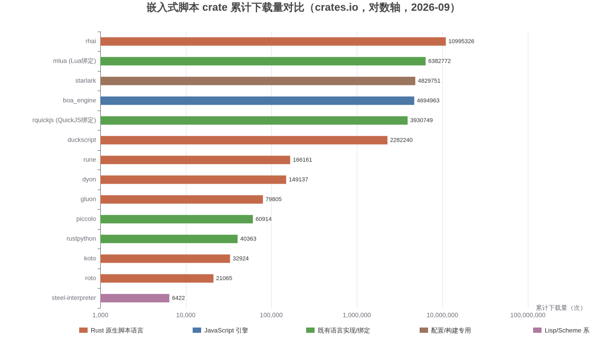

# Rust 开发的脚本引擎全景调研（2026 年 9 月）

> 调研基准日：2026-09-03。Stars 与下载量数据采集自 GitHub API 与 crates.io API 当日实时值，版本号以各项目仓库最新发布为准。

## 摘要

用 Rust 编写的脚本引擎已经形成一个相当繁荣的生态，粗略可以分成五条路线：**Rust 原生脚本语言**（为嵌入 Rust 应用而生的新语言，代表是 **Rhai**、**Rune**、**Koto**、**roto**）、**JavaScript 引擎**（**Boa**、**Nova**、**Brimstone** 三个纯 Rust JS 引擎，外加 rusty_v8/rquickjs 等绑定方案）、**既有语言的 Rust 实现**（**RustPython**、纯 Rust Lua 虚拟机 **piccolo**、已归档的 **Artichoke Ruby**）、**Lisp/Scheme 系**（**Steel**、Ketos），以及**配置与构建专用语言**（**starlark-rust**、**Nickel**、**KCL**）。其中生态位最稳固的是 Rhai（crates.io 累计下载约 **1100 万次**，2026-08-25 刚发布 v1.26.0）与 mlua（Lua 绑定，下载约 **638 万次**）；声量最大的是 RustPython（**2.2 万 stars**）；2025–2026 年最值得关注的变量是单人项目 **Brimstone** 把纯 Rust JS 引擎的 Test262 合规率推到了 **97% 以上**([Brimstone](https://github.com/Hans-Halverson/brimstone))。

如果只要一个快速答案：**嵌入 Rust 应用做扩展脚本，首选 Rhai（动态、安全、生态成熟）或 Koto/Rune（更现代的语言设计）；要跑用户写的 JavaScript，选 Boa（纯 Rust）或 rquickjs/rusty_v8（绑定成熟引擎）；要跑 Lua，选 mlua；要跑不可信脚本且要求严格沙箱，关注 piccolo 与 Starlark；要做高性能过滤器/热路径脚本，关注 JIT 编译的 roto；游戏热重载场景关注 Rune 与 Mun**。

---

## 1. 范围界定与分类框架

"Rust 开发的脚本引擎"这个提法在社区里通常指两类东西：一类是**解释器/虚拟机本身就是用 Rust 写的**（无论它执行的是什么语言），另一类更狭窄，特指**为嵌入 Rust 应用而设计的脚本语言**。本报告以第一类为外延、第二类为重点，因为后者才是 Rust 开发者真正会面对的选型问题。一个实用的判据是：能否 `cargo add` 一个 crate 然后在进程内执行脚本。按此标准，RustPython、Boa、Rhai、Rune、Koto、Steel、starlark、mlua、piccolo、roto、Dyon、Gluon、Mun、DuckScript 等都符合条件；而 Deno、swc、typst 这类"用 Rust 写的运行时/工具链"只在顺带意义上相关（Deno 的 rusty_v8/deno_core 反而是非常重要的嵌入方案，见第 4 节）。

社区已有的清单也印证了这种多样性：GitHub 上的 lang-impls-in-rust 汇总收录了上百个用 Rust 实现的语言项目，其中明确属于脚本/嵌入方向的包括 Rhai、Rune、Dyon、Gluon、Mun、Ketos、Passerine、Boa、Starlight（已演化为 Nova）、starlark-rust、Artichoke、RustPython、goscript、frawk 等 ([lang-impls-in-rust](https://github.com/abs0luty/lang-impls-in-rust))。游戏开发生态站点 AreWeGameYet 的 scripting 专栏则持续跟踪可嵌入 Rust 游戏的脚本语言，显示 Dyon（0.51.2）与 Gluon（0.18.4）这类"老牌"项目在 2026 年仍有发布活动 ([AreWeGameYet](https://arewegameyet.rs/ecosystem/scripting/))。下文按五条技术路线逐一展开，每条路线内部按当前活跃度与影响力排序。

需要预先说明的是"引擎成熟度"的三个层次：**生产可用**（Rhai、mlua、rquickjs、starlark-rust 这类被大量项目依赖的）、**活跃但接口未稳定**（Rune、Koto、Steel、Boa、roto、piccolo，多为 0.x 版本）、**实验/停更**（Ketos、GameLisp、Artichoke、goscript）。这个分层会直接决定选型风险，第 8 节的对比表会逐项标注。

## 2. Rust 原生脚本语言：为嵌入而生的新语言

这一类的共同动机是：Lua 的 C API 与 Rust 的所有权模型格格不入，动态语言的运行时 panic 又会摧毁 Rust 程序的安全性承诺，于是社区干脆从零设计"Rust 味"的脚本语言。它们的语法普遍介于 Rust 与 JavaScript 之间，强调与宿主类型系统的低成本互操作。

### 2.1 Rhai：生态位最稳的默认选项

**Rhai** 是这个生态里事实上的"老大哥"：5,653 stars、crates.io 累计下载约 **1,100 万次**（近 90 天约 392 万次，居所有同类 crate 之首），最新版 v1.26.0 发布于 2026-08-25，项目自 2016 年持续维护至今 ([rhai on GitHub](https://github.com/rhaiscript/rhai))。它的语法是 JavaScript 与 Rust 的混合体，动态类型，官方宣称在单核 2.6 GHz Linux 虚拟机上 100 万次迭代约 0.14 秒，支持全部 Rust 目标平台包括 **WebAssembly 和 no-std**，这使它成为嵌入式场景几乎唯一认真的选择 ([Rhai 项目总结](https://news.miracleplus.com/share_link/55424))。

Rhai 的核心卖点是**安全与可控**：引擎遵循"不 panic"原则，内置沙箱、防栈溢出、可设置操作数与执行时间上限、可手动终止失控脚本，还可以精确禁用关键字与运算符把语言裁剪成 DSL ([Rhai 特性解析](https://blog.csdn.net/gitblog_00193/article/details/143852480))。与宿主的集成方式是把任意 `Clone` 的 Rust 类型直接推入作用域、注册原生函数与 getter/setter，无需实现特殊 trait。它已被 handlebars-rust 模板引擎等成熟项目用作脚本助手，并被 Bevy 脚本生态 bevy_mod_scripting 列为官方支持语言 ([bevy_mod_scripting](https://libraries.io/cargo/bevy_ui_render_bms_bindings))。如果团队今天要给一个严肃的 Rust 产品加脚本能力且不想冒险，Rhai 仍是阻力最小的路径。

### 2.2 Rune：带 async 与热重载的现代挑战者

**Rune**（2,317 stars，最新 0.14.2 发布于 2026-05-22）定位与 Rhai 相近，但设计语言更" Rust 化"：它有结构体与枚举、模式匹配、try 运算符、宏、模板字符串，运行在栈式虚拟机上，并且提供 Rhai 所没有的**一等 async 支持（含生成器）**与多线程执行能力 ([rune on GitHub](https://github.com/rune-rs/rune))。内存安全通过引用计数实现，函数调用之间有栈隔离，动态容器开箱即带 serde 支持。

Rune 最具辨识度的特性是**原生热重载**：脚本修改后无需重启宿主即可生效，这使它长期被游戏开发社区关注（项目早期就与 Bevy 生态绑定）。需要注意的是 0.14 之后项目的 crate 下载量（累计约 16.6 万）与 Rhai 相差两个数量级，且 bevy_mod_scripting 目前把 Rune 支持暂时搁置，理由是 crate 重写期间文档生成与 Rune 集成暂缓 ([bevy_mod_scripting](https://libraries.io/cargo/bevy_ui_render_bms_bindings))。换句话说，Rune 的语言设计更讨人喜欢，但生态成熟度仍明显落后于 Rhai，选型时要权衡的是"语言体验"与"踩坑密度"。

### 2.3 Koto：简洁主义的后起之秀

**Koto**（882 stars，v0.16.1 发布于 2026-01-05）2020 年启动，目标是为动画、游戏引擎这类需要快速迭代的交互系统提供一门"概念与视觉上都尽量简单"的脚本语言 ([Koto 官方介绍](https://github.com/koto-lang/koto/blob/main/crates/cli/docs/about.md))。它受 Lua 的极简定位、CoffeeScript/MoonScript 的低噪音语法、以及 Rust 的迭代器哲学影响，核心库提供了丰富的迭代器生成器与适配器，并内置测试支持。

Koto 的工程化配套在同类新项目里算扎实的：提供 CLI 与 REPL、在线 Playground、Tree-sitter 语法、LSP 实现，VS Code、Zed、Vim/Neovim、Sublime 都有插件，Helix 编辑器自 25.01 起内置支持 ([Koto 官网](https://koto.dev/about/))。已有项目用它做 VST 音乐插件（Kotoist）、构建系统（Metabuild）、音频实时编码 DSL（Ohm）和 Bevy 集成验证（bevy_koto）。短板是**尚不支持 async/await**，也没有 C API，只能在 Rust 里用；多线程运行时以 feature 形式提供，官方提示会带来约 5–10% 的性能开销 ([Koto 官网](https://koto.dev/about/))。

### 2.4 Dyon 与 Gluon：两个"元老"的不同活法

**Dyon**（1,916 stars）是 Piston 游戏引擎生态 2016 年的产物，一门动态类型、带 Rust 语法的脚本语言。出人意料的是它至今仍在维护：crates.io 最新版 0.51.2，2026-08-10 仍有提交，累计下载约 14.9 万次 ([AreWeGameYet](https://arewegameyet.rs/ecosystem/scripting/))。Dyon 的特色设计是"生命链接"（lifetimes 式的链接变量）与"秘密"（secrets，用于定理证明式编程），更接近语言实验而非通用工具，但在 Rust 游戏脚本这个niche里生命力顽强。

**Gluon**（3,441 stars，v0.18.4 发布于 2026-08-06）走的则是另一条路：它是一门**静态类型、类型推导的函数式语言**（类 Haskell/OCaml），专为孩子嵌入设计，能把 Rust 的 `#[derive]` 风格元编程延伸到脚本侧 ([gluon-lang/gluon](https://github.com/gluon-lang/gluon))。Gluon 的理念超前（2015 年启动时 Rust 1.x 刚发布），但也因此长期小众：累计下载约 8 万次。它证明了"静态类型 + 嵌入脚本"在 Rust 里可行，后来者在类型化脚本方向（roto、Starlark 的可选类型）多少继承了这一思路。

### 2.5 Mun 与 roto：编译到机器码的脚本

**Mun**（2,130 stars）要解决的是一个更硬核的问题：**AOT 编译、静态类型语言的函数与数据热重载**。它用 LLVM 把 Mun 代码编译成原生机器码，运行时本身用 Rust 写成（`mun_runtime` crate），可直接嵌入 Rust 应用，也暴露 C API ([Mun v0.1.0 发布公告](https://mun-lang.org/blog/2019/11/11/release-mun-v0-1-0/))。Mun 的愿景是成为游戏行业的迭代利器，但开发一直是核心贡献者的业余项目，进度缓慢——GitHub 组织在 2025–2026 年仍有零星更新，尚无正式发布 ([mun-lang on GitHub](https://github.com/mun-lang))。

**roto**（554 stars，v0.12.x）是这个方向更年轻也更务实的代表：荷兰网络实验室 NLnet Labs 为自己的 BGP 路由引擎 Rotonda 写的**静态类型、经 Cranelift JIT 编译为机器码、可热重载**的嵌入脚本语言 ([Roto 发布公告](https://blog.nlnetlabs.nl/introducing-roto-a-compiled-scripting-language-for-rust/))。宿主注册的 Rust 类型与方法可以被脚本零序列化成本地直接调用，类型错误在编译期捕获并有友好的诊断信息。roto 发布一年内已在 EuroRust 2025 与 FOSDEM 2026 演讲，并被反 AI 爬虫代理 **Iocaine** 选为默认脚本语言——作者的理由是 roto 在它支持的 Roto/Lua/Fennel 三者中性能最好 ([NLnet Labs 博客](https://blog.nlnetlabs.nl/one-year-of-roto-the-compiled-scripting-language-for-rust/))。开发已迁移到 Codeberg。它代表了脚本引擎的一个趋势：**把"脚本"做成接近原生代码性能的热路径组件**，而不是传统意义上的胶水。

### 2.6 DuckScript 与其他轻量选手

**DuckScript**（588 stars，brew 当前版本 0.11.1）是 shell 风格的极简语言：连函数、条件分支都不是语言本体，而是 SDK 里的"命令"，因此宿主可以像搭积木一样定义自己的方言 ([duckscript on GitHub](https://github.com/sagiegurari/duckscript))。它最著名的用户是构建工具 cargo-make，crates.io 累计下载约 **228 万次**（其中相当部分来自 cargo-make 生态），说明"简单到极点"本身也是一种竞争力。类似的轻量探索还有：**Passerine**（1,093 stars，函数式、强调宏扩展，已迁至 vrtbl/passerine，2026-04 仍有提交）、**WLambda**（GPL 协议限制了传播）、**TetherScript**（2026 年新出现的项目，动态类型但带 Rust 式所有权追踪，自带字节码 VM 与 LSP，面向 AI agent 工作流嵌入）([TetherScript](https://github.com/CodeTether/TetherScript))。

这一梯队的共同特征是个人或小型团队驱动、设计语言实验色彩浓。它们适合作为学习解释器实现的范本，或者在个人项目里找乐趣；用于商业产品前要仔细评估维护持续性——脚本引擎是典型的"十年树木"型基础设施。

## 3. JavaScript 引擎：Rust 阵营的三国杀

JS 是世界上脚本需求最大的语言，Rust 社区自然不会缺席。截至 2026 年，纯 Rust 实现的 JS 引擎形成了 Boa、Nova、Brimstone 三家并立的格局，再算上绑定方案（rusty_v8、rquickjs），Rust 开发者跑 JavaScript 的选择比跑任何其他语言都多。

### 3.1 Boa：纯 Rust JS 引擎的旗手

**Boa**（7,527 stars）2017 年由 Jason Williams 在 Servo 工作之余启动，2019 年在 JSConf EU 亮相，是完全从零用 Rust 实现的 ECMAScript 引擎 ([Wikipedia](https://en.wikipedia.org/wiki/Boa_(JavaScript_engine)))。它的合规率曲线相当励志：v0.10（2020）只有 17.98%，v0.11 升到 31.28%，v0.20（2024-12）达到 89.92%，而 2025-10 发布的 **v0.21 达到 94.12%**，其中新日期时间 API Temporal 的合规率接近 97% ([Boa v0.21 发布公告](https://boajs.dev/blog/2025/10/22/boa-release-21))。

v0.21 同时是一次性能大版本：`JsValue` 默认启用 **NaN Boxing**，虚拟机从栈式切换为**寄存器式**，并补上了开发者呼吁多年的错误回溯（error backtrace）与一组 `js_value!`、`js_object!` 之类的便捷宏 ([Boa v0.21 发布公告](https://boajs.dev/blog/2025/10/22/boa-release-21))。crates.io 上 `boa_engine` 已累计下载约 469 万次，最新发布为 0.22.0。Boa 的短板依旧是没有 JIT，绝对性能与 V8/JSC 有量级差距，但对于"在 Rust 程序里跑用户脚本"这个用途，94% 的合规率加内存安全的实现已经相当可用；官方也坦言合规率已与主流浏览器引擎在同一区间，后续增长将趋于平缓 ([Boa v0.21 发布公告](https://boajs.dev/blog/2025/10/22/boa-release-21))。

### 3.2 Nova：数据导向设计的学院派

**Nova**（1,944 stars）由芬兰开发者 Aapo Alasuutari 主导，前身是 Starlight，走一条很不一样的技术路线：**数据导向设计（data-oriented design）**——把所有 JS 值按类型分池存放、句柄即索引，试图用缓存友好的内存布局换取性能 ([aapoalas on GitHub](https://github.com/aapoalas))。这种架构在解释器领域相当激进，Nova 团队也因此在 Rust 社区输出了不少关于 GC 与引擎设计的深度文章。

进度方面，Nova 官网持续跟踪的 Test262 结果显示 2026-05 的快照通过率为 **79.9%**（40,515/50,000+，另有 6.6% 跳过），仍在快速爬升 ([Nova Test262](https://trynova.dev/test262))。它还没有面向嵌入的稳定 crate 发布，更适合作为"观察对象"而非选型对象；但如果你在研究"下一代 JS 引擎该怎么用 Rust 写"，Nova 的代码库是现存最有启发性的样本。

### 3.3 Brimstone：2025 年杀出的黑马

**Brimstone**（1,320 stars）是 2025 年下半年 JS 引擎圈最大的意外：Hans Halverson 一个人、从 2022-11 开始、用三年时间写出的完整 JS 引擎，Test262 合规率 **超过 97%**，支持到 ES2026（仅缺 SharedArrayBuffer 与 Atomics），包含受 V8 Ignition 启发的字节码 VM、压缩式垃圾回收器、自研 RegExp 引擎与自研解析器 ([Brimstone](https://github.com/Hans-Halverson/brimstone))。

圈内人的评价足以说明它的分量：Nova 的核心开发者公开表示"作为一个同行，这个项目让我感到谦卑——它功能近乎完备，性能是 Boa 的两倍，而 Boa 已经是我们引擎的两倍" ([Lobsters 讨论](https://lobste.rs/s/upi3xa/boa_release_v0_21_new_release_boa))。Brimstone 目前明确声明**未到生产可用**，嵌入 API 也不如 Boa 成熟，但它证明了两件事：一是纯 Rust 完全可以支撑起工业级 JS 引擎的复杂度，二是 JS 引擎的"合规率竞赛"在 Rust 阵营已经接近尾声——剩下的是性能与生态的硬仗。

### 3.4 绑定方案：rusty_v8、deno_core 与 rquickjs

如果"引擎本身用 Rust 写"不是硬性要求，实践中更常见的做法是把成熟的 C/C++ 引擎绑进 Rust。**rusty_v8** 是 Deno 团队维护的 V8 零开销绑定，2024-09 宣布稳定并达到生产级，crates.io 下载超 300 万次；其上的 **deno_core** 提供 ops 宏、事件循环与 Promise↔Future 映射，是"自己卷一个 JS 运行时"的标准底座 ([Deno 博客](https://deno.com/blog/open-source), [rusty_v8 稳定公告](https://deno.com/blog/rusty-v8-stabilized))。代价是 V8 的体积与编译时间都非常可观，且交叉编译麻烦。

**rquickjs**（994 stars，crate 累计下载约 393 万次）绑定的是 Fabrice Bellard 的 QuickJS：体积极小（hello-world 约 367 KiB）、启动微秒级、接近完整的 ES2025 支持、MIT 协议，是嵌入式 JS 脚本的"性价比之王" ([rquickjs 集成评估](https://github.com/wesleysimplicio/simplicio-prompt/issues/89))。选型经验法则大致是：要极致兼容性选 rusty_v8，要轻量选 rquickjs，要纯 Rust 依赖树（审计、WASM 目标、交叉编译友好）选 Boa，并在三者间用基准实测一遍——script-bench-rs 项目正好把 boa、rquickjs 与其他主流嵌本方案放在同一基准里对比 ([script-bench-rs](https://github.com/khvzak/script-bench-rs))。

## 4. 既有语言的 Rust 实现

### 4.1 Lua 系：mlua 是现实答案，piccolo 是未来答案

Lua 在 Rust 生态里最主流的形态不是纯 Rust 实现，而是 **mlua**（2,851 stars）：一套支持 Lua 5.1–5.5、LuaJIT 与 Luau 的高级绑定，支持 async/await，crates.io 累计下载约 **638 万次**，几乎是所有需要 Lua 的 Rust 项目的默认选择 ([mlua](https://github.com/mlua-rs/mlua))。建立在 mlua 之上的知名产物是 **Lune**——一个用 Rust 写的独立 Luau 运行时（类似 Node 之于 JS），2026-07 发布 v0.10.5，在 Roblox 开发者社区颇受欢迎 ([Lune](https://github.com/lune-org/lune))。

真正"纯 Rust 的 Lua"是 **piccolo**（2,149 stars，v0.3.x）：rlua 原作者 kyren 重出江湖的作品，一门**无栈（stackless）Lua 虚拟机**，配合自研的 gc-arena 增量式精确 GC ([piccolo](https://github.com/kyren/piccolo))。无栈设计的实际收益是：Lua 执行可以随时暂停并让出控制权、"燃料"机制限制单次执行的指令数、内存使用可精确计量——合起来就是**针对不可信脚本的 CPU/RAM 双重沙箱** ([Piccolo 设计文章](https://kyju.org/blog/piccolo-a-stackless-lua-interpreter/))。它的同胞 gc-arena 已被 Flash 模拟器 Ruffle 用于 ActionScript VM，piccolo 本身也被 Fish Folk 用于游戏脚本，但项目自己仍标注为实验性 WIP ([Rust 论坛发布公告](https://users.rust-lang.org/t/piccolo-stackless-lua-vm-implemented-in-pure-rust/104720))。

### 4.2 RustPython 与 Artichoke：巨人的肩膀与墓碑

**RustPython**（**22,328 stars**，本报告中星数最高的项目）是用 Rust 完整重写的 Python 解释器，覆盖 CPython 3.13 语法子集，可编译到 WASM 在浏览器里跑 Python，2026 年仍保持活跃提交 ([RustPython 组织](https://github.com/rustpython))。不过要清醒认识它的定位：它更像"Python 生态的 Rust 底座实验"（其 parser 已独立成 ruff 等工具的基础设施），作为嵌入式脚本引擎使用时性能与兼容性都不如直接 PyO3 调 CPython；crate 累计下载仅约 4 万次，与星数形成鲜明反差。

**Artichoke**（3,126 stars）则是这条路线上的警示案例：一个目标兼容 MRI 的 Rust 版 Ruby，常年保持精致的工程文档与 WASM Playground，但作者于 **2026-02 正式宣布停更并归档全部仓库**，建议生产用户迁移回 CRuby ([作者停更公告](https://hyperbo.la/w/winding-down-artichoke-ruby/))。类似地，**goscript**（用 Rust 实现的 Go 解释器，曾支持 WASM playground）也已停止维护，作者转向了后继项目 Vo ([goscript](https://github.com/oxfeeefeee/goscript))。这两个项目的共同教训是：**完整复刻一门成熟动态语言的工作量远超想象**，社区项目挑战 Python/Ruby/Go 这种体量的语言，长期胜率很低；相比之下 JS（Boa/Brimstone）是少数例外，因为 JS 的规范完备性与测试套件（Test262）给了追赶者明确的靶子。

### 4.3 周边值得一提的实现

**Erg**（2,859 stars）是一门静态类型但兼容 Python 生态的语言——编译器用 Rust 写成，目标平台是 CPython 字节码，可以零成本 import Python 库，设计上强调副作用标记与可读的错误信息 ([Erg](https://github.com/erg-lang/erg))。它不算典型"脚本引擎"，但代表了"Rust 作为语言实现工具链"的另一类用法：与其复刻宿主语言，不如让新语言寄生在成熟虚拟机上，把 Rust 用在编译器这个自己最擅长的环节。

类似的寄生/共生策略还有 **Passerine**（1,093 stars）这类函数式实验语言，以及游戏脚本 niche 里 fleabitdev 的 **GameLisp**（401 stars，面向 Rust 游戏开发的 Lisp，2022 年后停止更新）。对读者更有实操价值的是识别"信号"：一个既有语言实现是否值得投入，看三点——是否有生产级用户（starlark-rust 有 Buck2）、是否有独特场景（piccolo 的沙箱）、维护者是否还在公开承诺路线图（Artichoke 的作者用一篇长文体面地宣告了终点）。这些数据都来自 2026-09-03 的 GitHub 实时统计，完整图景见报告开篇的全景图。

## 5. Lisp/Scheme 系：小而美的实力派

### 5.1 Steel：离"出圈"最近的 Scheme

**Steel**（2,565 stars，v0.8.x）是一门受 Racket 启发的嵌入式 Scheme：字节码 VM、基本符合 R5RS（仅缺 let-syntax）、R7RS 支持在推进中，提供 syntax-rules 与 syntax-case 宏、高阶契约、内置不可变数据结构（列表、向量、哈希表、哈希集），以及独立的包管理器 forge 和语言服务器 ([Steel](https://github.com/mattwparas/steel))。嵌入方式很直接：`Engine::new()` 之后就能 `run` 任何 Scheme 表达式，也支持通过 FFI 或派生宏把 Rust 函数与结构体暴露给脚本 ([The Steel Book](https://mattwparas.github.io/steel/book/start/embedded.html))。

Steel 获得了一个千载难逢的曝光机会：**Helix 编辑器的插件系统**选择了 Steel 作为扩展语言，相关 PR 由 Steel 作者本人推进，2026 年中社区教程已能指导用户编译带 Steel 插件分支的 Helix ([Helix 社区日报](https://geekinney.com/emacs-daily/2026-06-14/), [Steel+Helix 教程](https://www.tomwaddington.dev/steel-helix-first-steps.html))。参考 Emacs（Elisp）与 Neovim（Lua）的历史，一旦编辑器落地，Steel 将从"有趣的玩具"跃迁为"每天有数万人使用的引擎"。喜欢这个范式的人现在入场正是时候。

### 5.2 Ketos 与其他 Lisp 方言

**Ketos**（768 stars）是更早的 Lisp 方言尝试：编译为字节码、纯 Rust 解释执行，定位为 Rust 程序的脚本与扩展语言 ([Ketos](https://github.com/murarth/ketos))。遗憾的是其最后一次实质提交停留在 2021-05，基本处于休眠状态（2026-09-03 GitHub 数据），文档与生态都停留在 v0.12。如果只需要"给 Rust 程序加一个 S 表达式配置/扩展面"，Ketos 的设计文档仍值得一读，但不建议新项目押注。把 Lisp 用于游戏脚本的 GameLisp（401 stars）同样在 2022 年后停更。

为什么 Lisp 系在 Rust 里始终是小众？一个解释是 Rust 的所有权语义与 Lisp 的运行时自由度过冲突，宿主集成的摩擦比命令式语法更大；另一个解释是纯需求问题——选 Lisp 的团队往往已经投奔 Clojure 或 Fennel（跑在 Lua 上）。Steel 能打破这个局面，靠的不是 Lisp 本身，而是它把宏系统、契约、包管理这些"现代 Lisp 该有的东西"一次做全了，恰好踩中 Helix 需要扩展语言的时机。这个分支的规律很清晰：**Lisp 系在 Rust 生态里是稳定的少数派，Steel 是目前唯一保持高速迭代的项目**。

## 6. 配置与构建专用语言

### 6.1 starlark-rust：构建系统背后的隐形冠军

**starlark-rust**（1,018 stars，crate v0.14.2）是 Meta 维护的 Starlark 实现——Starlark 是 Bazel/Buck/Buck2 构建系统的配置语言，Python3 语法的确定性子集 ([starlark-rust](https://github.com/facebook/starlark-rust))。它被 Meta 的 Buck2 生产级使用，crate 累计下载约 **483 万次**（近 90 天约 186 万次），提供 GC 堆上分配值、可选的运行时类型检查、linter、LSP、DAP 调试支持与 fuzz 测试，工程完成度在本报告所有项目里属第一梯队 ([starlark-rust](https://github.com/facebook/starlark-rust))。

Starlark 的设计哲学对"跑用户脚本"场景极具参考价值：**确定性求值、封闭执行（无法访问文件系统/网络/时钟）、并行安全（共享数据必须不可变）**——这意味着可以安全地执行不可信代码 ([starlark-pyo3 文档](https://github.com/inducer/starlark-pyo3))。如果你的产品是 CI 系统、构建工具或策略引擎，需要一个"用户写逻辑但翻不了天"的语言，starlark-rust 是比通用脚本语言更合适的底座。需要注意官方明确声明不追求版本间 API 稳定，只遵循 SemVer ([starlark-rust](https://github.com/facebook/starlark-rust))。

### 6.2 Nickel 与 KCL：配置即代码

**Nickel**（2,987 stars）是 Tweag 开发的配置语言——"带类型与合同的 JSON"，解释器用 Rust 编写，适合生成复杂的 YAML/JSON 配置 ([Nickel](https://github.com/nickel-lang/nickel))。**KCL**（2,408 stars）是蚂蚁集团开源、CNCF 托管的约束型记录/函数式语言，主要面向云原生配置与策略场景，其 Rust 实现（kclvm）是主仓库 ([KCL](https://github.com/kcl-lang/kcl))。这两个项目把"脚本引擎"的边界往外推了一步：它们不追求图灵完备的表达力，而是追求**配置的可验证性**——类型、约束、合同在求值期就能挡住错误配置。

这一类别与 starlark-rust 的差别在于关注点：Starlark 关心"确定性构建"，Nickel/KCL 关心"大规模配置的抽象与复用"。一个典型判断标准是配置文件的数量级——几十行的应用配置用不上它们，数千行的 Kubernetes/多云部署清单才是它们的主场。对于平台工程团队，这一类"配置语言引擎"往往比通用脚本语言更能解决实际问题；它们也是 Rust 实现的引擎中少数已经拿到企业生产环境门票（CNCF 托管、大公司背书）的分支。

## 7. 广义选手：WebAssembly 运行时

把视角放宽，**WebAssembly 运行时是"脚本引擎"的终极形态**：语言无关、天生沙箱、性能接近原生。Rust 阵营有两个世界级实现：**Wasmtime**（Bytecode Alliance，基于 Cranelift 的 JIT，通过 24/7 fuzzing 与安全 RFC 流程打磨，可嵌入 Rust/C/C++/Python/Go/Ruby 等）([Wasmtime 简介](https://gitee.com/mirrors/Wasmtime), [wasmtime crate 文档](https://docs.wasmtime.dev/api/wasmtime/))，以及 **wasmi**（纯 Rust 的解释器实现，面向确定性执行场景如区块链，Polkadot/Substrate 生态采用）([Rust Wasm 运行时指南](https://wasmruntime.com/en/languages/rust))。

这条路线在脚本基准里的地位越来越实在：script-bench-rs 的最新环境清单（rustc 1.96、M5 Max）同时收录了 wasmi 1.0.9 与 wasmtime 45.0.1，与 rhai、mlua、boa、koto、roto、rquickjs 同台对比 ([script-bench-rs](https://github.com/khvzak/script-bench-rs))。经验判断是：脚本逻辑重计算、且能接受"用户用 Rust/Go/AssemblyScript 等编译到 Wasm"的开发模式，就用 Wasm 运行时；脚本逻辑重交互、需要用户直接写文本代码，就回到传统脚本引擎。燃料计费（fuel）、 epoch 中断这些 Wasm 运行时的标配能力，也正是沙箱化最需要的能力 ([wasmtime crate 文档](https://docs.wasmtime.dev/api/wasmtime/))。

## 8. 横向对比与选型建议

### 8.1 核心项目总览

下表汇总本报告涉及的主要项目（Stars 与最近推送时间采集于 2026-09-03，版本以各仓库最新发布为准）：

| 项目 | 路线 | 语言/方言 | Stars | 最新版本/活动 | 成熟度 |
|---|---|---|---|---|---|
| [Rhai](https://github.com/rhaiscript/rhai) | 原生 | JS+Rust 风，动态 | 5,653 | v1.26.0（2026-08） | **生产可用** |
| [Rune](https://github.com/rune-rs/rune) | 原生 | Rust 风，动态 | 2,317 | 0.14.2（2026-05） | 活跃，0.x |
| [Koto](https://github.com/koto-lang/koto) | 原生 | 简洁风，动态 | 882 | 0.16.1（2026-01） | 活跃，0.x |
| [roto](https://codeberg.org/NLnetLabs/roto) | 原生 | Rust 风，静态+JIT | 554 | 0.12.x（2026） | 活跃，已被 Iocaine 采用 |
| [Mun](https://github.com/mun-lang/mun) | 原生 | Rust 风，静态+LLVM | 2,130 | 无正式发布 | 缓慢推进 |
| [Dyon](https://github.com/PistonDevelopers/dyon) | 原生 | Rust 风，动态 | 1,916 | 0.51.2（2026 仍活跃） | 小众稳定 |
| [Gluon](https://github.com/gluon-lang/gluon) | 原生 | 函数式，静态推导 | 3,441 | 0.18.4（2026-08） | 小众稳定 |
| [DuckScript](https://github.com/sagiegurari/duckscript) | 原生 | Shell 风 | 588 | 0.11.1 | 稳定（cargo-make 使用） |
| [Boa](https://github.com/boa-dev/boa) | JS 引擎 | JavaScript | 7,527 | 0.22.0；v0.21 合规率 94.12% | **可嵌入使用** |
| [Nova](https://github.com/trynova/nova) | JS 引擎 | JavaScript | 1,944 | Test262 约 79.9% | 实验 |
| [Brimstone](https://github.com/Hans-Halverson/brimstone) | JS 引擎 | JavaScript | 1,320 | Test262 >97% | 实验，勿上生产 |
| [mlua](https://github.com/mlua-rs/mlua) | Lua | Lua 5.1–5.5/JIT/Luau | 2,851 | 0.12.1 | **生产可用** |
| [piccolo](https://github.com/kyren/piccolo) | Lua | 纯 Rust Lua VM | 2,149 | 0.3.3 | 实验（Ruffle 在用 gc-arena） |
| [RustPython](https://github.com/RustPython/RustPython) | Python | Python 3 | 22,328 | 持续活跃 | 研究/工具链向 |
| [Artichoke](https://github.com/artichoke) | Ruby | MRI Ruby | 3,126 | **2026-02 已归档** | 停止维护 |
| [Steel](https://github.com/mattwparas/steel) | Lisp | Scheme（R5RS+） | 2,565 | 0.8.x | 活跃，Helix 插件采用中 |
| [Ketos](https://github.com/murarth/ketos) | Lisp | Lisp 方言 | 768 | 2021 年后停更 | 休眠 |
| [starlark-rust](https://github.com/facebook/starlark-rust) | 配置/构建 | Starlark | 1,018 | 0.14.2 | **生产可用（Buck2）** |
| [Nickel](https://github.com/nickel-lang/nickel) | 配置 | Nickel | 2,987 | 活跃 | 活跃 |
| [KCL](https://github.com/kcl-lang/kcl) | 配置 | KCL | 2,408 | 活跃 | 活跃（CNCF） |

读这张表时有两个角度值得注意。横向看，"成熟度"一栏的分布揭示了一个残酷事实：二十余个项目里真正能闭眼上生产的只有四个（Rhai、mlua、starlark-rust 与可嵌入使用的 Boa），其余大多停留在"活跃但未稳定"的 0.x 区间——这正是语言基础设施的典型生命周期。纵向看，Stars 与实用性并不正相关：RustPython 的星数是 Rhai 的四倍，嵌入采用量却相差两个数量级；反过来说，starlark-rust 这种"隐形冠军"星数平平，下载量却稳居前三，因为它的价值体现在 Buck2 这类重型用户身上。评估引擎时请始终把"谁在用、用得有多深"放在"多少人点了星"之前。

### 8.2 嵌入量与性能基准

crates.io 的下载量能从另一个角度反映真实采用度（见下图）：Rhai 以约 1,100 万次断崖领先；mlua、starlark、boa_engine、rquickjs 在 390–640 万区间构成第二梯队；DuckScript 因 cargo-make 的关系达到 228 万；其余原生语言均在 20 万以下。这说明**原生新语言的推广仍然艰难**——生态位被"成熟语言 + 好绑定"牢牢占据，新语言必须在安全性、热重载或性能上给出数量级理由才能翻盘。

性能方面，目前最系统的公开对比是 khvzak 的 script-bench-rs（作者同时是 mlua 维护者，基准涵盖代码求值与 Rust 互操作两个维度）：最新一轮跑在 M5 Max + rustc 1.96 环境上，收录 boa 0.21.1、koto 0.16.1、mlua 0.12-rc.2（Lua 5.4 与 Luau）、rhai 1.25.1、roto 0.11.0、rquickjs 0.12.0、wasmi 1.0.9、wasmtime 45.0.1 ([script-bench-rs](https://github.com/khvzak/script-bench-rs))。综合其结论与社区共识，大致的定性排序是：**wasmtime/JIT 类 ≫ roto（Cranelift JIT）≈ Luau/mlua > rquickjs > Koto ≈ Rhai ≈ Rune > Boa > RustPython**；Boa 在 v0.21 引入寄存器 VM 与 NaN Boxing 后性能翻倍，而 Brimstone 又号称是 Boa 的两倍 ([Boa v0.21 发布公告](https://boajs.dev/blog/2025/10/22/boa-release-21), [Lobsters 讨论](https://lobste.rs/s/upi3xa/boa_release_v0_21_new_release_boa))。需要强调：嵌入场景的真实瓶颈往往在**宿主↔脚本的边界穿越**而非纯求值速度，选型时应以自己的负载模式重跑基准。

### 8.3 场景化选型矩阵

把前面各章的信息压缩成一张可执行的决策表。矩阵的读法是：先定位你的场景行，"首选"列是当前生态位下阻力最小、风险最低的答案；"备选"列则对应你有额外约束（语言偏好、性能上限、沙箱强度）时的替代路径。需要提醒的是，嵌入脚本的决策很少是纯技术决策——团队熟悉度、招聘市场、用户群里已有的脚本知识储备，往往比引擎本身的优劣更影响最终成败。

| 场景 | 首选 | 备选 | 理由 |
|---|---|---|---|
| Rust 应用通用扩展脚本 | **Rhai** | Koto、Rune | 安全可控、no-std/WASM 全平台、生态最成熟 |
| 需要 async/热重载的游戏逻辑 | **Rune** | Koto（bevy_koto）、Mun | Rune 原生 async + 热重载 ([rune](https://github.com/rune-rs/rune)) |
| 热路径高性能过滤/策略 | **roto** | Wasm 运行时 | Cranelift JIT 编译到机器码 ([NLnet Labs](https://blog.nlnetlabs.nl/introducing-roto-a-compiled-scripting-language-for-rust/)) |
| 执行用户提交的 JS | **Boa**（纯 Rust） | rquickjs、rusty_v8 | 94% 合规率，内存安全实现 |
| Lua 生态兼容 | **mlua** | piccolo | 生产验证最充分 |
| 不可信脚本强沙箱 | **starlark-rust** | piccolo、Wasm | 确定性+封闭执行是语言级保证 |
| 编辑器/工具插件系统 | **Steel** | Rhai | Helix 的路径证明，宏系统强大 |
| 构建/CI 配置 | **starlark-rust** | Nickel、KCL | Buck2 生产验证 |
| 语言无关插件（用户自带编译产物） | **Wasmtime/wasmi** | — | 天生沙箱 + 接近原生性能 |

一个值得单独展开的场景是 **AI Agent 工具链**：2026 年的新项目（如 TetherScript）开始把"供 AI 生成并执行的脚本"作为设计目标，要求引擎具备确定执行、能力授予（capability）、资源配额等特性 ([TetherScript](https://github.com/CodeTether/TetherScript))。这类需求与传统的"人类用户写插件"有本质区别——脚本作者不可信且不自知，沙箱与资源限额从加分项变成了底线。若你的产品涉及 LLM 生成代码的执行，优先考察 Starlark 的封闭执行、piccolo 的燃料机制或 Wasm 运行时，而不是通用的动态脚本语言。

### 8.4 风险提示

三个反复出现的历史教训值得写进任何选型文档。其一，**0.x 项目的 API 漂移是常态**：Rune、Koto、Steel、roto 都明确声明破坏性变更随时可能发生，升级成本要计入预算。其二，**个人项目的中止风险真实存在**：Artichoke 于 2026-02 归档、goscript 停更、Ketos 与 GameLisp 休眠多年——押注前看提交频率比看星数更重要 ([Artichoke 停更公告](https://hyperbo.la/w/winding-down-artichoke-ruby/))。其三，**"嵌入绑定"与"纯 Rust 实现"的边界要想清楚**：mlua/rquickjs/rusty_v8 引入了 C 依赖与构建复杂度，但换来成熟生态；纯 Rust 实现（Rhai/Boa/piccolo）构建干净、可上 WASM，却在性能或兼容性上各有天花板。没有银弹，只有与场景匹配的折中。

还有一个容易被忽略的工程风险是**编译时间与二进制体积的连锁反应**。嵌入一个脚本引擎不只是多一个依赖：rusty_v8 会显著拉长 CI 构建并带来数百 MB 级别的产物增量，Boa 全特性开启也会增加可观的编译负载，而 Rhai 这类纯 Rust 小树懒则几乎无感 ([Deno 博客](https://deno.com/blog/rusty-v8-stabilized))。对于库作者（library author）尤其要克制——把脚本引擎做成可选 feature、让用户按需开启，是 Rust 生态公认的礼貌做法；反过来，如果你维护的是终端应用（binary），则可以在 Rhai/mlua/rquickjs 之间更自由地按体验而非构建成本来选择。

## 9. 趋势观察（2025–2026）

从这两年的动态看，Rust 脚本引擎生态有三条清晰的趋势线。**第一条是 JS 引擎的合规率竞赛收官**：Boa 94.12%、Brimstone >97%，纯 Rust JS 引擎已经跨过"能不能用"的临界点，接下来两年看点在 JIT 与嵌入 API 的打磨 ([Boa v0.21](https://boajs.dev/blog/2025/10/22/boa-release-21), [Brimstone](https://github.com/Hans-Halverson/brimstone))。**第二条是"静态类型 + JIT 编译"脚本语言的兴起**：roto 被 NLnet Labs 用于 BGP 热路径并被 Iocaine 外部采用，证明脚本语言不必等于慢 ([NLnet Labs](https://blog.nlnetlabs.nl/one-year-of-roto-the-compiled-scripting-language-for-rust/))；Mun 在热重载方向的持续探索也属于这条线。**第三条是脚本引擎与编辑器/AI 工具链的合流**：Steel 进入 Helix 插件系统、Koto 集齐 LSP 与多编辑器插件、TetherScript 这类新项目直接面向 AI agent 工作流设计——脚本引擎正在从"应用的可选扩展面"变成"工具链的一等公民" ([Helix 讨论](https://geekinney.com/emacs-daily/2026-06-14/), [TetherScript](https://github.com/CodeTether/TetherScript))。

对 Rust 开发者而言，2026 年的局面可以一句话概括：**造轮子的时代结束了，挑轮子的时代开始了**。通用嵌入选 Rhai 不会错，JS 选 Boa 不会错，Lua 选 mlua 不会错；而真正有趣的决策发生在新需求的交界处——需要热重载时看 Rune/Mun，需要热路径性能时看 roto/Wasm，需要沙箱时看 Starlark/piccolo，需要插件生态时看 Steel。这个生态的多样性本身，就是 Rust "内存安全 + 零成本抽象"信念在解释器领域的胜利。
