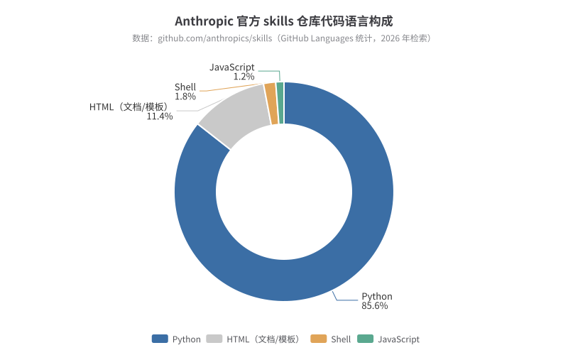
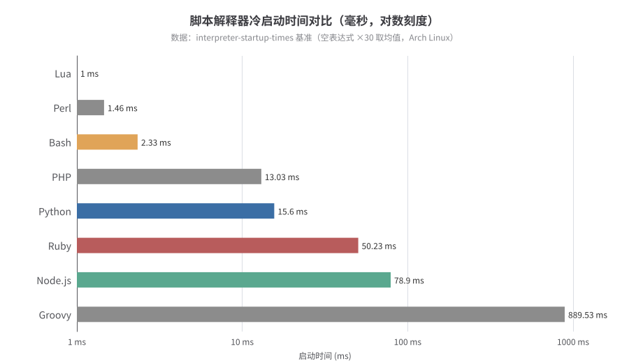
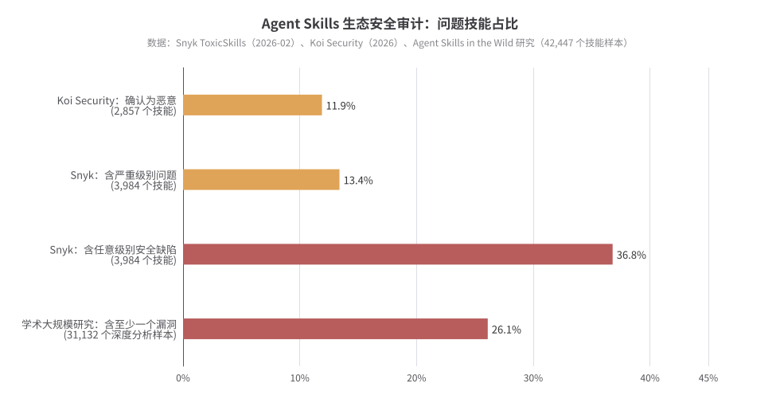
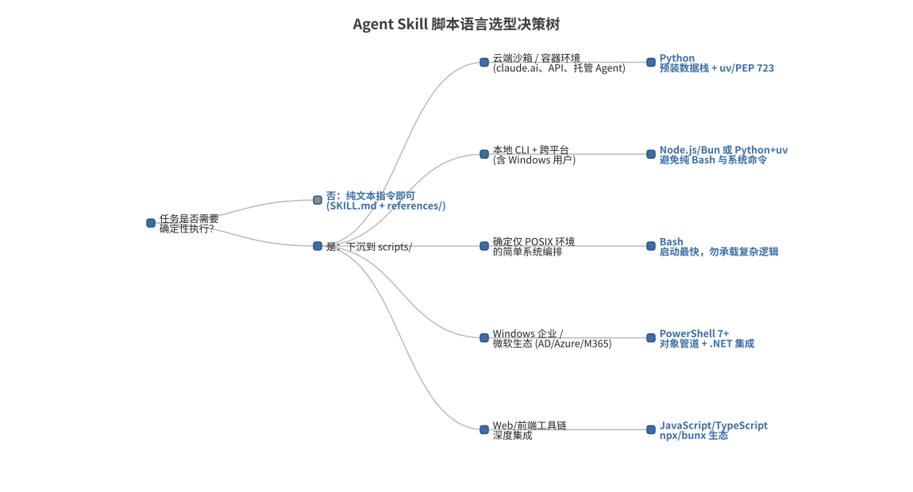
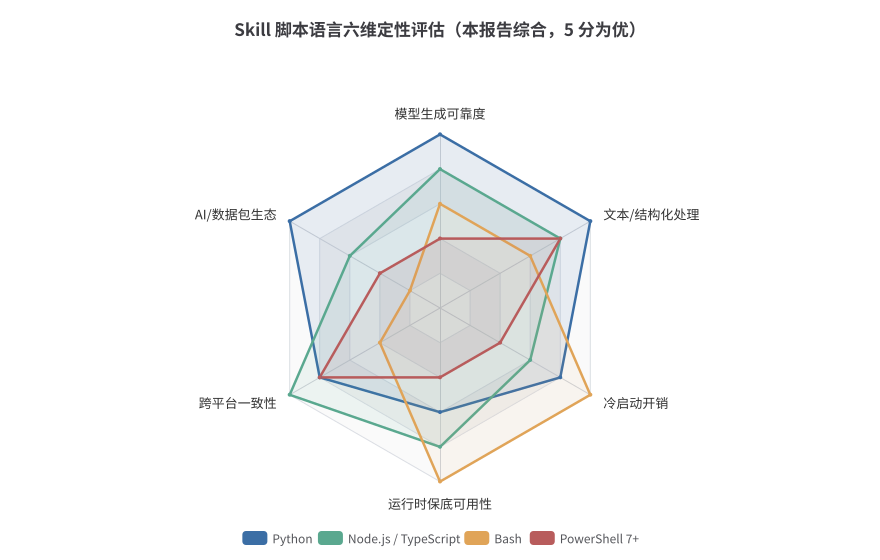

# 开发 Agent Skills 时的脚本语言选择：一份基于官方规范、生态实证与量化数据的深度研究报告

> **直接答案（TL;DR）**：在 2026 年的 Agent Skills 生态中，**Python 是 `scripts/` 目录的事实默认语言**——Anthropic 官方 skills 仓库的代码构成中 Python 占 **85.6%**，官方工具链（skill-creator 的全部辅助脚本）均为 Python，且大模型在语言无关任务中 **90%–97%** 的情况下主动选择 Python。但"默认 Python"只是决策的起点而非终点：**面向含 Windows 用户的跨平台分发，应优先考虑 Node.js/Bun 或"Python + uv/PEP 723"的单文件自包含脚本；Bash 仅适合作为确定 POSIX 环境下的薄胶水层；PowerShell 7+ 则是 Windows 企业/微软生态场景下的合理特例**。语言选择的真正约束不是语言本身的表达力，而是 Agent 执行环境的四个特殊性质：无保底运行时、非交互 Shell、脚本输出直接进入上下文窗口、以及脚本以用户权限执行带来的供应链风险。

---

## 一、问题界定：Skills 架构中脚本的真实角色

### 1.1 渐进式披露与"执行而非加载"原则

Agent Skills 是 Anthropic 于 2025 年 10 月推出、同年 12 月 18 日作为开放标准发布的 Agent 能力打包格式：一个技能就是一个以 `SKILL.md` 为锚点的目录，可附带 `scripts/`（可执行代码）、`references/`（按需加载的文档）与 `assets/`（模板与静态资源）三个可选目录 ([Anthropic](https://www.anthropic.com/engineering/equipping-agents-for-the-real-world-with-agent-skills), [agentskills.io](https://agentskills.io/skill-creation/using-scripts))。其核心设计原则是**渐进式披露（progressive disclosure）**：启动时仅加载每个技能的 `name` 与 `description`（约 100 token）；技能被触发时才加载 SKILL.md 正文（建议 5000 token 以内、500 行以内）；第三层的脚本与资源则只在被引用时才触及 ([Claude Platform Docs](https://platform.claude.com/docs/en/agents-and-tools/agent-skills/overview))。

脚本在这一架构中占据一个特殊位置：**脚本代码通常完全不进入模型的上下文窗口**——Agent 通过 Bash 执行脚本，只有脚本的 stdout/stderr 输出消耗 token ([Claude Platform Docs](https://platform.claude.com/docs/en/agents-and-tools/agent-skills/overview))。这带来两个直接推论。其一，把确定性逻辑下沉到脚本能同时节省 token、消除模型每次重新生成代码的变异，官方最佳实践明确写道"优先为确定性操作编写脚本：写 `validate_form.py` 而不是让 Claude 现场生成校验代码"，因为预制脚本更可靠、更省 token、更省时、且保证跨调用一致性 ([Claude Platform Docs](https://platform.claude.com/docs/en/agents-and-tools/agent-skills/best-practices))。其二，脚本语言的选择因此**不影响上下文成本**，影响的是执行环境的兼容性、失败时的可恢复性与供应链安全——这与普通工程项目选型的考量重心显著不同。

### 1.2 为什么"给 Agent 写脚本"是一个独特问题

在传统工程中，脚本写给人类运维或 CI 系统执行；在 Skills 语境中，脚本的"用户"是一个通过非交互 Shell 调用它、通过阅读 stdout/stderr 决定下一步动作的 LLM Agent。agentskills.io 的《Using scripts in skills》指南将这一差异系统化为脚本接口设计规范：禁止任何交互式提示（Agent 无法应答 TTY 提示，脚本会无限挂起）；`--help` 输出是 Agent 学习脚本接口的主要途径；错误信息必须说明"什么错了、期望什么、可以尝试什么"，因为错误文本直接塑造 Agent 的下一次尝试；优先输出 JSON/CSV 等结构化格式并把诊断信息分流到 stderr；支持幂等重试、有意义的退出码、破坏性操作的 `--dry-run` 与输出分页（许多 Agent 框架在 10–30K 字符处截断工具输出）([agentskills.io](https://agentskills.io/skill-creation/using-scripts))。

更深层的约束是**运行环境不可假设**。Claude Code 仓库中一个高赞特性请求指出：Claude Code 原生安装版内嵌了 Bun 运行时，但用户 PATH 上没有任何 `bun` 或 `node`；"技能可以打包任何语言的脚本，但不存在一个有保证的运行时来执行它们" ([GitHub: claude-code#30465](https://github.com/anthropics/claude-code/issues/30465))。官方最佳实践同样警告不要假设包已安装，而应在 SKILL.md 中显式列出依赖，并注意不同平台的网络与安装能力差异：claude.ai 的代码执行环境可从 npm 和 PyPI 安装包，而 Claude API 的容器**完全没有网络访问、无法在运行时安装任何依赖** ([Claude Platform Docs](https://platform.claude.com/docs/en/agents-and-tools/agent-skills/best-practices), [Claude Platform Docs](https://platform.claude.com/docs/en/agents-and-tools/tool-use/code-execution-tool))。正是这些约束——而非语法偏好——构成了后文全部选型判断的基础。

---

## 二、官方与生态实证：Python 主导格局

### 2.1 官方仓库与工具链的 Python 集中度

衡量"官方倾向"最直接的证据是代码构成。截至本报告检索时，Anthropic 官方 skills 仓库（github.com/anthropics/skills，约 12 万 star）的 GitHub Languages 统计为：**Python 85.6%、HTML 11.4%、Shell 1.8%、JavaScript 1.2%** ([GitHub: anthropics/skills](https://github.com/anthropics/skills))。官方技能（pdf、docx、xlsx、pptx、skill-creator 等）中的脚本——`extract_form_field_info.py`、`fill_form.py`、`validate.py`、`init_skill.py`、`package_skill.py`——全部为 Python ([Claude Platform Docs](https://platform.claude.com/docs/en/agents-and-tools/agent-skills/best-practices))。DeepLearning.AI 与 Anthropic 合作的官方课程也以"为 Claude 配备文件系统与 bash 以执行 Python 脚本"为标准教学路径 ([DeepLearning.AI](https://www.deeplearning.ai/courses/agent-skills-with-anthropic))。

社区已向 Anthropic 正式提议将这一事实固化为文档指引。Claude Code 仓库的 issue #34303《skill-creator: Recommend Python as default language for skill scripts》指出：内置 skill-creator 目前不指定脚本语言，导致 Claude 在 Web 项目中常默认选择 TypeScript，而 TypeScript 脚本需要 `npx tsx` 等额外开销且无法直接使用 Pydantic、LiteLLM 等 Python AI 工具链；该团队在建构 50 余个技能后全面转向 Python-first，开发速度与集成质量均有可见提升 ([GitHub: claude-code#34303](https://github.com/anthropics/claude-code/issues/34303))。这一提议的理由与官方仓库的实际构成互相印证：**Python 不是被迫的遗产选择，而是被官方与重度用户双向确认的默认项**。

### 2.2 多平台采纳：同一格式，不同执行后端

Agent Skills 开放标准自 2025 年 12 月发布后，已被 Claude（网页/Code/API/Agent SDK）、OpenAI Codex CLI、GitHub Copilot、Gemini CLI、Cursor、VS Code、Roo Code、Amp、Goose、Mistral、Databricks 等 26 个以上平台采纳，Atlassian、Figma、Canva、Stripe、Notion、Zapier 等厂商发布了官方技能 ([Strapi](https://strapi.io/blog/what-are-agent-skills-and-how-to-use-them))。值得强调的是：**标准只统一了目录格式与披露层级，并不统一脚本的执行机制**——这意味着同一个 `.py` 脚本在不同平台上的可用性差异巨大，是跨平台选型必须面对的变量 ([The Drop Times](https://www.thedroptimes.com/71574/agent-skills-distribution-conventions))。

| 平台 | 技能发现位置 | 脚本执行机制 | 运行时保底情况 |
|---|---|---|---|
| claude.ai（网页） | 设置 > Capabilities 上传 zip | 托管容器内 Bash，可从 npm/PyPI 装包 ([Claude Platform Docs](https://platform.claude.com/docs/en/agents-and-tools/agent-skills/best-practices)) | Python 及数据科学库**预装** ([Claude Platform Docs](https://platform.claude.com/docs/en/agents-and-tools/tool-use/code-execution-tool)) |
| Claude API（代码执行工具） | `container.skills` 声明 | 沙箱容器内 Bash，**无网络、不可装包** ([Claude Platform Docs](https://platform.claude.com/docs/en/agents-and-tools/tool-use/code-execution-tool)) | 预装 pandas/numpy/pypdf 等 Python 库 |
| Claude Code（CLI） | `.claude/skills/`、插件市场 | 本机 Bash 工具（Windows 上为 Git Bash 或 PowerShell 工具）([Claude Code Docs](https://code.claude.com/docs/en/troubleshoot-install)) | **无保底运行时** ([GitHub: claude-code#30465](https://github.com/anthropics/claude-code/issues/30465)) |
| OpenAI Codex CLI | `.agents/skills/`、`~/.codex/skills/` | 系统提示 + 文件读取工具，脚本经 Shell 执行 ([Simon Willison](https://simonwillison.net/2025/Dec/12/openai-skills/), [blog.fsck.com](https://blog.fsck.com/2025/12/19/codex-skills/)) | 取决于用户本机 |
| GitHub Copilot | `.github/skills/`（兼容 `.claude/`、`.agents/`） | Agent 模式 Shell 工具 ([The Drop Times](https://www.thedroptimes.com/71574/agent-skills-distribution-conventions)) | 取决于用户本机 |
| Gemini CLI | `.gemini/skills/`（工作区 > 用户 > 扩展） | `activate_skill` 授权后读取/执行，支持 shell/Node/Python 辅助脚本 ([damimartinez.github.io](https://damimartinez.github.io/agent-skills-gemini-cli/)) | 取决于用户本机 |
| LangChain Deep Agents | 中间件注入 + 后端文件系统 | 仅沙箱后端可执行脚本；官方列举 Python、Bash、JS/TS 为常见选项 ([LangChain Docs](https://docs.langchain.com/oss/python/deepagents/skills)) | 取决于沙箱镜像 |
| Microsoft Agent Framework | 文件发现（默认 `scripts/`）或代码内定义 | 支持**进程内** code-defined scripts（Python/Go/C# 函数直接注册，无需脚本解释器）([Microsoft Learn](https://learn.microsoft.com/en-us/agent-framework/agents/skills)) | 进程内宿主语言保底 |

LangChain 生态的落地数据可以侧面说明脚本对技能有效性的贡献：LangChain 官方发布的 11 个技能使 Claude Code 在 LangChain/LangGraph/Deep Agents 基础任务上的通过率从 **25% 提升到 95%**（Sonnet 4.6，LangSmith 评测），其技能包即包含 `scripts/` 下的可执行辅助代码 ([LangChain Blog](https://www.langchain.com/blog/langchain-skills))。与此同时，OpenAI Codex 自带 skill-creator 的一个已知缺陷提供了反向教训：其 Python 辅助脚本以非可执行权限位（0644）分发，SKILL.md 却指示 Agent 直接执行，导致 `Permission denied`（退出码 126）——教训是**在 SKILL.md 中始终通过显式解释器调用脚本（如 `python3 scripts/init_skill.py`），而不要依赖 shebang 与可执行位** ([GitHub: openai/codex#36624](https://github.com/openai/codex/issues/36624))。

---

## 三、分语言深度评估

### 3.1 Python：默认答案及其四重理由

Python 成为默认选择的第一重理由是**模型熟悉度偏置**。学术研究《LLMs Love Python》发现，主流 LLM 在解决语言无关的编程任务时有 90%–97% 的概率选择 Python ([arXiv](https://arxiv.org/html/2503.17181v1))；独立基准测试进一步表明，即使算法逻辑完全语言无关，模型的解题成功率仍与语言流行度正相关——Python 与 Java 显著优于 Elixir 等小语种，SWE-bench Multilingual 也观察到非 Python 语言上的性能下滑 ([Hackernoon](https://hackernoon.com/comparing-llms-coding-abilities-across-programming-languages))。对 Skills 而言这至关重要：脚本虽然预先写好，但 Agent 需要**理解报错、修补参数、在边缘场景改写脚本**，模型对该语言的熟练度直接决定失败恢复的质量。

第二重理由是**生态位匹配**。技能脚本的高频任务是文档处理（pypdf、pdfplumber、python-docx、python-pptx、openpyxl）、数据转换与校验（pandas、Pydantic）、API 封装——这些恰好是 Python 包生态最深的领域；PyPI 已托管超过 50 万个包、年下载量超 3000 亿次 ([Articsledge](https://www.articsledge.com/post/python-package-index-pypi))。第三重理由是**托管环境保底**：Claude 的代码执行容器预装了完整的 Python 数据科学栈与文档处理库（pandas、numpy、matplotlib、openpyxl、python-pptx、pypdf、pdfplumber 等），在 claude.ai 与 API 场景下 Python 脚本开箱即用 ([Claude Platform Docs](https://platform.claude.com/docs/en/agents-and-tools/tool-use/code-execution-tool))。第四重理由是**依赖管理的现代化**：PEP 723 内联元数据让单个 `.py` 文件自声明依赖，`uv run script.py` 一条命令完成隔离环境创建、依赖安装与执行，无需 `requirements.txt` 或虚拟环境仪式；agentskills.io 官方指南将 uv 列为 Python 脚本的推荐运行方式 ([agentskills.io](https://agentskills.io/skill-creation/using-scripts))。

Python 的短板同样明确。**冷启动较慢**（详见第四节）；**本地 CLI 场景无保底**——用户机器上可能没有 Python，或 `python` 与 `python3` 指向混乱（一份学术研究技能的 SKILL.md 甚至专门写入"使用 `python3`；`python` 可能不可用"的坑）([arXiv](https://arxiv.org/html/2608.23417v1))；**Windows 上的开箱体验弱于 Unix**（微软商店版、PATH 配置、编码问题都会增加失败面）。因此"默认 Python"的准确表述是：**在环境可控（云端容器、团队统一开发机）时默认 Python；在面向未知终端用户分发时，必须配合 uv/PEP 723 或给出运行时检测与安装指引**。

### 3.2 JavaScript / TypeScript（Node、Bun、Deno）：跨平台保底派

JS/TS 阵营的核心论点不是生态深度，而是**运行时邻近性**：Claude Code 本身运行在 Node/Bun 之上，npm 安装的用户必有 `node`；社区 issue 中明确建议"用 Node.js 替代 bash 编写钩子与脚本，因为 Node.js 原生处理 Windows 路径，且 Claude Code 运行于 Node.js 之上故必然可用" ([GitHub: claude-code#26419](https://github.com/anthropics/claude-code/issues/26419))。生产级技能包的实践印证了这一路线：一份黑客松获奖的 Claude Code 配置集宣布"为最大兼容性，全部钩子与脚本已用 Node.js 重写"，从而实现 Windows/macOS/Linux 全平台支持 ([everything-claude-code](https://gitee.com/haohandongku/everything-claude-code))；egghead 的官方风格教程则演示了将系统 `tar` 命令替换为 Node 跨平台包 `tar-fs`、从而使技能在三大桌面系统一致运行的完整过程 ([egghead.io](https://egghead.io/build-better-tools-in-claude-skills-with-scripts~0oa34))。

JS/TS 在 Skills 语境还有三个结构性优势。其一，`npx`/`bunx` 随 Node/Bun 自带，无需额外安装即可按需运行带版本锁定的 npm 包（如 `npx eslint@9 --fix .`），与 Skills 的"一次性命令"模式天然契合 ([agentskills.io](https://agentskills.io/skill-creation/using-scripts))。其二，Bun 支持在 import 路径中直接钉版本（`import ... from "cheerio@1.0.0"`）并自动安装，Deno 的 `npm:`/`jsr:` 说明符让每个脚本默认自包含——两者都实现了与 PEP 723 类似的单文件自包含体验，且 Bun 原生执行 TypeScript，省去 `tsx` 步骤 ([agentskills.io](https://agentskills.io/skill-creation/using-scripts))。其三，Node 22+ 的 `--experimental-strip-types` 允许直接运行 `.ts` 文件，steipete 等知名开发者的技能库已采用 `node --experimental-strip-types scripts/x.ts` 的调用模式 ([GitHub: steipete/agent-scripts](https://github.com/steipete/agent-scripts/blob/main/skills/skill-cleaner/SKILL.md))。

风险面也不可忽视。Node 版本差异会直接击碎脚本：Shopify 官方技能的 `validate.js`（23 万行的打包文件）在 Node.js 22 上因"Dynamic require of fs is not supported"在每次调用时立即崩溃，且技能目录没有 `package.json` 可锁定环境 ([GitHub: Shopify/agent-skills#5](https://github.com/Shopify/agent-skills/issues/5))。这说明**选择 Node 路线的技能必须声明 Node 版本要求（利用 `compatibility` 字段）并优先纯 ESM、零依赖或自包含 bundle**。此外，npm 生态的供应链暴露面大于 PyPI 的历史印象在 2026 年已被改写——两大注册表同年均遭大规模投毒（详见第六节），依赖锁定与审计在两个生态都是必修课。

### 3.3 Bash / Shell：胶水层，而非承载层

Bash 在 Skills 中扮演双重角色，必须分开评价。作为**调用约定**，Bash 是几乎所有平台的公共通道——Agent 通过 bash 读取 SKILL.md、执行脚本，Anthropic 架构图中 Agent 虚拟机的三大件即 Bash、Python、Node.js ([Anthropic](https://www.anthropic.com/engineering/equipping-agents-for-the-real-world-with-agent-skills))。作为**脚本语言**，Bash 的合法领地是确定 POSIX 环境下的简单系统编排：调用已存在的 CLI 工具、管道拼接、文件移动。agentskills.io 的建议边界是：一次性命令适合直接写进 SKILL.md，"当命令复杂到难以一次写对时，经过测试的 `scripts/` 脚本更可靠" ([agentskills.io](https://agentskills.io/skill-creation/using-scripts))。

Bash 作为承载语言在 Skills 场景有三处硬伤。**跨平台失败面最大**：Claude Code 官方插件的 bash 脚本在 Windows 上因 CRLF 换行（git 默认 `core.autocrlf=true` 把 shebang 变成 `#!/bin/bash\r`）、反斜杠路径被 Git Bash 解释为转义序列、`jq` 等 Unix 工具缺失而成片失败，官方文档技能（document-skills）的 `init-artifact.sh`、`bundle-artifact.sh` 均在受影响列表中 ([GitHub: claude-code#26417](https://github.com/anthropics/claude-code/issues/26417), [GitHub: claude-plugins-official#112](https://github.com/anthropics/claude-plugins-official/issues/112), [GitHub: claude-code#21878](https://github.com/anthropics/claude-code/issues/21878))。**结构化处理能力弱**：JSON 解析依赖外部 `jq`，而 jq 在 Windows 默认缺席。**可审计性差**：混淆的 base64 管道命令（`curl | bash`）是恶意技能最常见的投递手法之一（见第六节）。社区的成熟做法是把 Bash 限制为"严格模式胶水"——`set -euo pipefail`、ShellCheck 校验、函数化组织——专门的技能（Bash Script Stylist、Bash Defensive Patterns）正是为约束 Agent 生成健壮 shell 脚本而存在 ([MCP Market](https://mcpmarket.com/tools/skills/bash-script-stylist), [MCP Market](https://mcpmarket.com/tools/skills/bash-defensive-patterns-5))。

### 3.4 PowerShell：Windows 企业与微软生态的特例

PowerShell 在通用 Agent 技能中几乎不应是首选——模型训练语料中 PowerShell 密度远低于 Python/Bash，非 Windows 平台需要额外安装 PowerShell 7，且其对象管道范式对 Agent 的文本处理习惯不友好。但在两个明确场景下它是**正确**答案。其一，**Windows 企业环境**：PowerShell 7+ 运行于 .NET 10 之上，覆盖 Windows 10/11、Windows Server、主流 Linux 发行版与 macOS，提供对 Active Directory、WMI、注册表的原生访问，这是 Python 只能经第三方库近似的能力 ([4sysops](https://4sysops.com/archives/powershell-76-new-features-install-and-upgrade/), [42Gears](https://www.42gears.com/blog/cross-platform-powershell-vs-python))。其二，**Agent 平台原生支持 PowerShell 的环境**：Claude Code 自 v2.1.84 起提供 PowerShell 工具（Windows 上逐步铺开，Linux/macOS/WSL 可经 `CLAUDE_CODE_USE_POWERSHELL_TOOL=1` 选择加入），直接 spawn `pwsh.exe`/`powershell.exe`，绕开 Git Bash 的路径翻译层 ([agentpatterns.ai](https://agentpatterns.ai/tools/claude/powershell-tool/))；社区也出现了通过钩子将 pwsh 设为全平台默认 shell 的插件方案 ([GitHub: claude-code#35761](https://github.com/anthropics/claude-code/issues/35761))。

选择 PowerShell 的工程要点包括：以 `#!/usr/bin/env pwsh`（或 Ansible 文档建议的 `#!/usr/bin/pwsh`）显式锚定 PowerShell 7 而非 Windows 自带的 5.1；用 `$IsWindows`/`$IsLinux`/`$IsMacOS` 自动变量做平台分支；避免 Windows 专属 cmdlet ([Ansible Docs](https://docs.ansible.com/projects/ansible/latest/os_guide/windows_pwsh.html))。对微软生态技能（如 Azure/M365 自动化），一个务实的混合模式是：SKILL.md 主体用 Python/Node 脚本处理数据与产物，仅在需要 AD/注册表/Azure cmdlet 的步骤调用 `.ps1` 脚本——lobehub 上的 powershell-master 技能即按"PowerShell 7+ 跨平台 + 严格 Windows 路径处理"的定位设计 ([LobeHub](https://lobehub.com/skills/josiahsiegel-claude-plugin-marketplace-powershell-master))。

### 3.5 一次性命令与其他语言：不写脚本也是一种选择

一个常被忽视的选型维度是**是否需要自带脚本**。当成熟 CLI 工具已能完成任务时，最佳实践是直接引用一次性命令而不建 `scripts/` 目录：`uvx ruff@0.8.0 check .`、`npx eslint@9 --fix .`、`deno run`、`go run` 等运行时都能在执行时自动解析依赖 ([agentskills.io](https://agentskills.io/skill-creation/using-scripts))。此时的"语言选择"转化为"工具生态选择"：Python 工具走 uvx/pipx，JS 工具走 npx/bunx，并在 SKILL.md 中钉死版本、在 `compatibility` 字段声明运行时要求。

Ruby（`bundler/inline` 内联 gem 声明）、Go（`go run` 直接编译运行）等语言在技术上同样支持自包含脚本 ([agentskills.io](https://agentskills.io/skill-creation/using-scripts))，但对 Agent 技能的适配度低：模型对它们的语料熟悉度逊于 Python/JS，技能生态中鲜有先例，分发时还会引入额外的运行时假设。编译型语言（Go/Rust 编译产物）适合**性能敏感且分发受控**的企业内部技能——以预编译二进制随 `assets/` 分发可彻底消除运行时依赖，但牺牲了 Agent 阅读与修补脚本的能力，与"脚本应可被 Agent 当作参考阅读"的官方建议相悖 ([Claude Platform Docs](https://platform.claude.com/docs/en/agents-and-tools/agent-skills/best-practices))。综合判断：**Python、JS/TS、Bash、PowerShell 之外的语言仅在组织既有栈强约束时引入**。

---

## 四、量化对比：启动开销、模型偏置与依赖管理

### 4.1 冷启动开销：真实但很少是瓶颈

解释器启动时间在 Skills 场景的意义被时常高估——Agent 一次任务的工具调用往返以秒计，几十毫秒的解释器启动几乎不可感知。但作为选型参数仍值得量化。一份在 Arch Linux 上对空表达式执行 30 次取均值的基准显示：**Bash 约 2.33ms、Python 约 15.6ms、Ruby 约 50.2ms、Node.js 约 78.9ms**（2017 款笔记本）([GitHub: interpreter-startup-times](https://github.com/MaxGyver83/interpreter-startup-times))。另一组在 Gitpod 云环境上的测量给出 Node.js 约 40ms、Python 约 85ms 的相反排序 ([go-on-aws.com](https://www.go-on-aws.com/optimize/poly-start/))。两组数据因硬件、版本与预热差异而不同，但一致的结论是：**Bash 与 POSIX shell 的启动开销最低（个位数毫秒），Python 与 Node 处于几十毫秒量级，Groovy 等 JVM 系语言接近 900ms、完全不适合作为技能脚本运行时**。

真正的延迟大头不在解释器而在**依赖解析**。首次运行 `uv run script.py` 或 `npx package@version` 需要下载依赖，之后才进入缓存快路径——uv 以"激进缓存、重复运行近乎即时"著称 ([agentskills.io](https://agentskills.io/skill-creation/using-scripts))。因此对延迟敏感的技能（如被高频触发的校验脚本）应：优先纯标准库实现；把重依赖收敛到少数脚本；在 SKILL.md 中指示 Agent 对批量输入单次调用脚本而非逐条循环调用。

### 4.2 模型语言偏置：Skills 特有的选型权重

如 3.1 节所述，LLM 在语言无关任务中 90%–97% 选择 Python ([arXiv](https://arxiv.org/html/2503.17181v1))，且模型编码能力与语言流行度正相关 ([Hackernoon](https://hackernoon.com/comparing-llms-coding-abilities-across-programming-languages))。这一偏置对 Skills 的影响是双向的：一方面，Python 脚本的报错堆栈、API 形态对模型而言"最眼熟"，失败恢复成本最低；另一方面，TypeScript 的静态类型能为模型提供结构化约束——在大型应用改造类任务中，类型签名告诉模型"可能出现哪些错误、调用方期望什么"，中文技术社区的对比评测因此将"AI 辅助编码体验"判给 TypeScript ([heyuan110.com](https://www.heyuan110.com/zh/posts/ai/2026-03-10-typescript-vs-python-ai-era/))；而 TypeScript vs Python 的 Agent 工程决策框架普遍建议：ML/数据密集选 Python，产品集成与前端选 TypeScript，两者是分工而非替代 ([Blaxel](https://blaxel.ai/blog/typescript-vs-python-ai-agents), [lamjinlab.com](https://www.lamjinlab.com/blog/ai-agent-programming-language))。

对技能脚本的净结论是：**脚本规模小、强调一次性正确运行时，模型偏置权重高，Python 占优；技能深度嵌入某个 JS/TS 项目（如前端测试、代码mod）时，TS 的类型约束与项目一致性权重反超**。切忌为了"AI 友好"而让技能语言与宿主项目语言分裂——七牛云技术社区的选型讨论同样提醒：不应把 Python 设为所有 Coding Agent 项目的默认答案，成熟项目的领域知识、测试与依赖本身就是重要上下文 ([七牛云](https://news.qiniu.com/archives/1786416111141))。

### 4.3 自包含与依赖管理方案对照

技能分发的核心摩擦是依赖安装。下表汇总各生态的"单文件自包含"能力，这是 2026 年技能脚本工程最重要的技术进步之一：

| 方案 | 生态 | 自包含机制 | 调用方式 | 注意事项 |
|---|---|---|---|---|
| **uv + PEP 723** | Python | 脚本内 TOML 块声明依赖与 Python 版本，可 `uv lock --script` 生成锁文件 ([agentskills.io](https://agentskills.io/skill-creation/using-scripts)) | `uv run scripts/x.py` | uv 需单独安装；SCA 工具对 PEP 723 内联依赖的扫描覆盖不足 ([SafeDep](https://safedep.io/pep-723-inline-metadata-security)) |
| pipx run | Python | 支持 PEP 723 ([agentskills.io](https://agentskills.io/skill-creation/using-scripts)) | `pipx run scripts/x.py` | 系统包管理器可得性更广 |
| npx | Node.js | 按需下载并缓存 npm 包 | `npx eslint@9 --fix .` | 随 Node 自带，零额外安装 |
| Bun | JS/TS | import 路径内钉版本，无 node_modules 时自动安装 | `bun run scripts/x.ts` | 目录上游存在 node_modules 会禁用自动安装 ([agentskills.io](https://agentskills.io/skill-creation/using-scripts)) |
| Deno | JS/TS | `npm:`/`jsr:` 说明符 + 权限标志 | `deno run --allow-read scripts/x.ts` | 原生插件（node-gyp）兼容性差 ([agentskills.io](https://agentskills.io/skill-creation/using-scripts)) |
| bundler/inline | Ruby | 脚本内嵌 gemfile 块 | `ruby scripts/x.rb` | 无锁文件，需显式钉版本 |
| go run | Go | 直接编译运行远程包 | `go run pkg@version` | 编译耗时长，适合一次性命令而非脚本 |

跨生态的共同纪律是：**钉版本、声明前置条件、复杂即脚本化**。agentskills.io 明确要求用 `npx package@version` 形式钉版本以保证时间上的行为一致，在 SKILL.md 写明"Requires Node.js 18+"之类的前置条件，运行时级要求写入 `compatibility` frontmatter 字段（上限 500 字符）([agentskills.io](https://agentskills.io/skill-creation/using-scripts), [beri.net 规范摘要](https://www.beri.net/learning/agentskills-io-specification))。

---

## 五、跨平台策略：Windows 是主要断裂带

### 5.1 Windows 失败模式清单

跨平台痛点的实证几乎全部集中在 Windows。Claude Code 官方仓库与插件仓库的 issue 记录了三类高频失败：**CRLF 换行污染**——Windows 上 git 默认 `core.autocrlf=true` 会把 `.sh` 的 shebang 转为 `#!/bin/bash\r`，导致 `bad interpreter` 或"No such file or directory"，影响包括官方 document-skills 在内的所有含 `.sh` 的插件与技能 ([GitHub: claude-code#26417](https://github.com/anthropics/claude-code/issues/26417))；**路径语义冲突**——`${CLAUDE_PLUGIN_ROOT}` 被解析为 `C:\Users\...` 反斜杠路径，Git Bash 将 `\U`、`\.` 等解释为转义序列，致使全部钩子脚本失败 ([GitHub: claude-code#21878](https://github.com/anthropics/claude-code/issues/21878))；**工具链缺失**——`jq`、`cat` 等 Unix 工具在 cmd/PowerShell 上下文不存在，`.sh` 文件在 Windows 上根本没有文件关联 ([GitHub: claude-plugins-official#112](https://github.com/anthropics/claude-plugins-official/issues/112))。

平台侧的兜底机制正在改善但远未消除问题：Claude Code 官方要求 Windows 上必须存在 Git for Windows（提供 bash）或 PowerShell 二者之一，并提供 `CLAUDE_CODE_GIT_BASH_PATH` 配置 ([Claude Code Docs](https://code.claude.com/docs/en/troubleshoot-install))；PowerShell 工具（v2.1.84+）则为原生 pwsh 路径 ([agentpatterns.ai](https://agentpatterns.ai/tools/claude/powershell-tool/))。社区补位方案包括教授 Agent 正确使用 Windows 命令模式的 windows-shell 技能（正确引用路径、用 `nul` 替代 `/dev/null`、PowerShell 与 Bash 的分工指引）([GitHub: claude-windows-shell](https://github.com/nicoforclaude/claude-windows-shell))。**对技能作者而言，这些修复都不应依赖用户侧配置——可移植性必须在技能内部解决。**

### 5.2 可移植性工程实践

综合官方反模式清单与社区修复经验，跨平台技能脚本应遵守以下工程纪律。官方最佳实践的第一条硬性要求是**永远使用正斜杠路径**（`scripts/helper.py` 而非 `scripts\helper.py`），Unix 风格路径在所有平台均可工作 ([Claude Platform Docs](https://platform.claude.com/docs/en/agents-and-tools/agent-skills/best-practices))。第二条是**显式解释器调用**：SKILL.md 中写 `python3 scripts/x.py`、`node scripts/x.js`、`bash scripts/x.sh`，不依赖 shebang 与可执行位——Codex skill-creator 的 0644 权限事故证明后者在分发链条上不可信 ([GitHub: openai/codex#36624](https://github.com/openai/codex/issues/36624))。

第三条是**用跨平台库替代系统命令**：不要调 `tar`/`jq`/`grep` 等系统二进制，改用语言内实现（Python 的 `tarfile`/`json`、Node 的 `tar-fs`）；egghead 教程将这一替换视为技能跨平台化的最后一步 ([egghead.io](https://egghead.io/build-better-tools-in-claude-skills-with-scripts~0oa34))。第四条针对确需保留的 shell 脚本：仓库内置 `.gitattributes` 写入 `*.sh text eol=lf`，从克隆源头杜绝 CRLF ([GitHub: claude-code#26417](https://github.com/anthropics/claude-code/issues/26417))；脚本开头检测 `OSTYPE`/`WINDIR` 并修正 PATH。第五条是**声明而非假设**：将"Requires Python 3.10+/Node 18+"写入 `compatibility` 字段与 SKILL.md，并在脚本内做运行时自检、以清晰的错误信息引导安装 ([agentskills.io](https://agentskills.io/skill-creation/using-scripts))。

### 5.3 环境-语言适配矩阵

把第二、三章的证据压缩为一张决策表：**行是目标环境，列是推荐语言策略**。

| 目标环境 | 首选 | 次选 | 应避免 | 依据 |
|---|---|---|---|---|
| claude.ai / Claude API 托管容器 | **Python**（预装数据栈） | 一次性 CLI 命令 | 依赖网络安装的脚本（API 容器无网络） | ([Claude Platform Docs](https://platform.claude.com/docs/en/agents-and-tools/tool-use/code-execution-tool)) |
| Claude Code / Codex / Cursor 等本地 CLI，团队统一 macOS/Linux | **Python + uv/PEP 723** | Bash 胶水 | 隐式依赖未声明 | ([GitHub: claude-code#34303](https://github.com/anthropics/claude-code/issues/34303)) |
| 本地 CLI，分发给未知用户（含 Windows） | **Node.js/Bun** 或 Python+uv | 跨平台库封装 | 纯 Bash、系统命令、shebang 直执 | ([GitHub: claude-code#26419](https://github.com/anthropics/claude-code/issues/26419), [everything-claude-code](https://gitee.com/haohandongku/everything-claude-code)) |
| 仅 POSIX 服务器的自动化技能 | **Bash（严格模式）** 承载薄编排 + Python 承载逻辑 | Python 全量 | 在 Bash 中解析 JSON/复杂文本 | ([MCP Market](https://mcpmarket.com/tools/skills/bash-defensive-patterns-5)) |
| Windows 企业 / AD / Azure / M365 | **PowerShell 7+** | Python 调 SDK | Windows PowerShell 5.1 专属写法 | ([Ansible Docs](https://docs.ansible.com/projects/ansible/latest/os_guide/windows_pwsh.html)) |
| Web/前端项目技能 | **TypeScript（Bun/Node 22+）** | JavaScript ESM | 需构建步骤的 TS | ([steipete/agent-scripts](https://github.com/steipete/agent-scripts/blob/main/skills/skill-cleaner/SKILL.md)) |
| 嵌入 Agent 框架（LangChain/MS AF）内部 | **框架宿主语言**（进程内脚本） | 沙箱脚本 | 跨语言混搭 | ([Microsoft Learn](https://learn.microsoft.com/en-us/agent-framework/agents/skills), [LangChain Docs](https://docs.langchain.com/oss/python/deepagents/skills)) |

矩阵的最后一行值得展开：Microsoft Agent Framework 允许用装饰器把 Python/Go/C# 函数直接注册为技能的"进程内脚本"，无需任何脚本解释器 ([Microsoft Learn](https://learn.microsoft.com/en-us/agent-framework/agents/skills))；LangChain Deep Agents 则要求沙箱后端才能执行脚本，并需自定义中间件把技能文件同步进容器 ([LangChain Docs](https://docs.langchain.com/oss/python/deepagents/skills))。**当技能运行在你自己控制的框架内时，最优"脚本语言"往往就是框架的宿主语言**——这消除了全部运行时假设，代价是失去跨 Agent 平台的可移植性。

---

## 六、安全与供应链：语言选择的第四个维度

### 6.1 生态审计数据：技能是新的供应链攻击面

Agent Skills 的安全形势在 2026 年初急剧恶化，且与脚本语言直接相关——因为恶意负载绝大多数就藏在 `scripts/` 里。Snyk 的 ToxicSkills 审计（当时最大规模的技能安全普查）扫描了 ClawHub 与 skills.sh 的 3,984 个技能：**13.4%（534 个）含至少一个严重级安全问题，36.82%（1,467 个）含任意级别安全缺陷，76 个被人工确认为恶意负载**，且 91% 的恶意技能同时使用提示注入与传统恶意软件手法 ([Snyk](https://snyk.io/blog/toxicskills-malicious-ai-agent-skills-clawhub/))。学术界的大样本研究给出相互印证的图景：对 98,380 个技能的运行时验证确认 157 个恶意技能、632 个独立漏洞，覆盖 13 种攻击技术 ([TLDR/论文](https://tldr.takara.ai/p/2602.06547))；另一项对 42,447 个技能的研究发现 **26.1% 含至少一个漏洞**，横跨提示注入、数据外泄、权限提升与供应链四类 ([SafeDep](https://safedep.io/agent-skills-threat-model), [SkillSieve/arXiv](https://arxiv.org/html/2604.06550v1))。

恶意技能的经典手法——base64 混淆的 `curl | bash` 投递、密码保护 zip 绕过扫描、凭据窃取——在 ClawHavoc 行动（1,184 个恶意技能）与 Koi Security 审计（2,857 个中 341 个恶意）中被完整记录 ([Bulwark](https://bulwarkblack.com/clawhavoc-supply-chain-attack-poisons-openclaw-clawhub-with-1184-malicious-ai-agent-skills/), [grith.ai](https://grith.ai/blog/agent-skills-supply-chain))。Anthropic 官方亦明确建议只安装可信来源的技能并审计其文件 ([Analytics India Magazine](https://analyticsindiamag.com/ai-news-updates/anthropic-gives-claude-new-agent-skills-to-master-real-world-tasks/))。

### 6.2 对语言选择的直接含义

安全维度反哺选型的方式有三。**可审计性**：纯文本、短小的 Python/JS 脚本比混淆空间大的 shell 单行命令更易被人工与扫描器审查；Snyk 的 mcp-scan 等工具已支持对技能做静态扫描（`uvx mcp-scan@latest --skills`）([Snyk](https://snyk.io/blog/toxicskills-malicious-ai-agent-skills-clawhub/))，而 PEP 723 内联依赖恰是当前 SCA 工具的盲区——选择 uv 单文件脚本时应同时接受"锁定版本 + 人工审读依赖列表"的补偿控制 ([SafeDep](https://safedep.io/pep-723-inline-metadata-security))。**最小依赖**：每一个第三方包都是信任面，2026 年 npm 与 PyPI 均遭大规模协同投毒（5 月的 TrapDoor/后续行动横跨两大注册表、404 个恶意版本）([SafeDep](https://safedep.io/mass-npm-supply-chain-attack-tanstack-mistral), [byteiota](https://byteiota.com/trapdoor-supply-chain-attack-npm-pypi-crates/))，技能脚本因此应强烈偏好标准库。**收敛执行面**：把复杂命令收进 `scripts/` 不仅更可靠，也让 `allowed-tools` 权限收缩到 `Bash(python scripts/x.py:*)` 这类窄授权 ([egghead.io](https://egghead.io/build-better-tools-in-claude-skills-with-scripts~0oa34), [Claude Code Docs](https://code.claude.com/docs/en/skills))。

企业侧的对策已商品化：Backslash、Cisco、CrowdStrike、NCC Group 等厂商均发布了技能治理产品或威胁报告，核心主张是把技能视同第三方软件依赖——清点、审查、沙箱执行、策略管控 ([Backslash](https://www.backslash.security/use-cases/agent-skills-security), [HiddenLayer](https://www.hiddenlayer.com/research/the-next-ai-supply-chain-risk-malicious-skills-in-agentic-ai))。技能作者的相应义务是：**签名式发布（Git 标签 + 锁定依赖）、在 SKILL.md 中诚实声明网络与文件访问需求、避免一切运行时拉取未固定来源的代码**。

---

## 七、选型决策框架

### 7.1 决策树

综合前文全部证据，脚本语言选择可压缩为以下决策流程。第一层判断**是否需要脚本**——纯文本指令能解决的不写脚本，这符合"脚本只承载确定性逻辑，判断留给模型"的分工原则 ([skillfully.sh](https://www.skillfully.sh/blog/agent-skill-vs-code))；第二层判断**运行环境**，而非语法偏好：

决策树刻意把"云端沙箱/容器"与"本地 CLI"分开：前者环境可控、Python 预装，后者环境异构、保底运行时缺失是核心矛盾 ([GitHub: claude-code#30465](https://github.com/anthropics/claude-code/issues/30465))。若同一技能需同时服务两类环境，实践中的收敛方案是**双轨脚本或单一 Node/Python 自包含脚本**——前者维护成本高，后者成为多数跨平台技能库（如全部脚本 Node 化的 everything-claude-code）的最终答案 ([everything-claude-code](https://gitee.com/haohandongku/everything-claude-code))。

### 7.2 六维定性评估

下图为四种主流选择在六个维度上的定性评分（本报告基于前述引证材料综合，5 分为优）。Python 在模型熟悉度与 AI/数据生态上满分，弱项是本地环境的保底可用性；Bash 是保底可用性与启动开销的极端值，但生态与跨平台垫底；Node/TS 胜在跨平台一致性；PowerShell 仅在对象化系统管理维度有不可替代性。

雷达图的一个有用读法是**短板否决制**：技能脚本语言的选择往往不是选最高分项，而是先否决存在致命短板的选项。面向公开分发的技能，Bash 因 Windows 断裂被否决；面向无网络 API 容器的技能，一切需要运行时安装依赖的方案被否决；面向微软生态自动化的技能，缺少 AD/注册表原语的语言被否决。剩余选项再在模型熟悉度与生态维度比较——这正是 Python 在多数场景胜出的机制，也是"默认 Python，例外有据"这一经验的来源。

---

## 八、落地清单：语言之外的脚本工程规范

### 8.1 面向 Agent 的脚本接口规范

语言选定之后，决定技能成败的是脚本的 Agent 适配质量。依据 agentskills.io 官方指南与 Anthropic 最佳实践，交付前应逐项核对：**输入**——全部经命令行参数/环境变量/stdin 传入，零交互式提示；**自描述**——`--help` 输出是 Agent 的接口文档，保持简洁并含示例；**错误**——报错须说明错误内容、期望值与下一步建议，退出码按失败类型区分并写进 `--help`；**输出**——结构化数据走 stdout、诊断走 stderr，默认输出摘要并支持 `--offset` 分页或 `--output` 文件重定向以防上下文截断 ([agentskills.io](https://agentskills.io/skill-creation/using-scripts))。

**行为安全性**方面：幂等设计（Agent 会重试）；破坏性操作提供 `--dry-run` 与显式 `--confirm`；常量须带注释说明理由（官方称"voodoo constants"为反模式——"如果你不知道正确值，Claude 怎么会知道？"）([Claude Platform Docs](https://platform.claude.com/docs/en/agents-and-tools/agent-skills/best-practices))。**失败处理**方面：脚本应"解决问题而非甩给 Claude"——官方示例中，文件不存在时创建默认文件、权限不足时给出替代路径，优于直接抛出未处理异常 ([Claude Platform Docs](https://platform.claude.com/docs/en/agents-and-tools/agent-skills/best-practices))。对批量/高风险操作，采用 Plan-Validate-Execute 模式：先生成 `changes.json` 计划文件，用校验脚本验证后再执行 ([Claude Platform Docs](https://platform.claude.com/docs/en/agents-and-tools/agent-skills/best-practices))。

### 8.2 分发前检查表

以下检查表综合官方 Checklist 与本报告的跨平台、安全发现，可作为技能发布的门禁：

| 类别 | 检查项 |
|---|---|
| 语言与运行时 | 语言选择与环境矩阵匹配；运行时要求写入 `compatibility` 字段与 SKILL.md 前置条件 ([agentskills.io](https://agentskills.io/skill-creation/using-scripts)) |
| 调用方式 | SKILL.md 中以显式解释器调用（`python3`/`node`/`bash` + 相对路径、正斜杠）；不依赖可执行位 ([GitHub: openai/codex#36624](https://github.com/openai/codex/issues/36624)) |
| 依赖管理 | 优先标准库；第三方依赖钉版本（PEP 723/`uv lock --script`/import 钉版）；列出并人工审读依赖清单 ([agentskills.io](https://agentskills.io/skill-creation/using-scripts)) |
| 跨平台 | 全正斜杠路径；无系统命令硬依赖（用跨平台库替代）；残留 `.sh` 附 `.gitattributes` 强制 LF；在 Windows（Git Bash + PowerShell 双通道）实测 ([GitHub: claude-code#26417](https://github.com/anthropics/claude-code/issues/26417)) |
| Agent 接口 | 无交互提示；`--help` 完备；错误信息可行动；结构化 stdout；幂等；`--dry-run`；输出有界 ([agentskills.io](https://agentskills.io/skill-creation/using-scripts)) |
| 安全 | 无 `curl \| bash` 式运行时拉取；无混淆代码；权限声明与实际行为一致；发布带版本标签与变更记录 ([Snyk](https://snyk.io/blog/toxicskills-malicious-ai-agent-skills-clawhub/)) |
| 验证 | 至少三个评估用例；跨目标模型（Haiku/Sonnet/Opus 或对应平台模型档）实测；观察 Agent 真实使用路径并迭代 ([Claude Platform Docs](https://platform.claude.com/docs/en/agents-and-tools/agent-skills/best-practices)) |

这张检查表的使用方式应与官方"评估先行"的方法论配合：先在不带技能的情况下运行代表性任务、记录具体失败，再写最小够用的脚本与指令去修复这些失败，随后用同一批用例回归 ([Claude Platform Docs](https://platform.claude.com/docs/en/agents-and-tools/agent-skills/best-practices))。语言选择在其中只是第一行——它决定检查表其余各项以何种形式落地，但无法替代逐项核验本身。对团队而言，建议将本表固化为技能仓库的 PR 模板或 CI 门禁（社区已有按评分、token 预算与描述相似度拦截合并的先例 ([skillsllm.com](https://skillsllm.com/skill/awesome-skills))），使"语言—运行时—跨平台—安全"四维约束在每次变更时被自动重审。

---

## 结语

Agent Skills 把"脚本"从工程细节提升为 Agent 能力的第一类载体：它以确定性执行替代 token 生成，以输出而非代码消耗上下文，以文件系统而非协议实现跨平台流动。这一架构红利成立的前提，是脚本语言的选择直面 Skills 语境的四个特殊约束——无保底运行时、非交互 Shell、输出即上下文、用户级权限执行。2026 年的证据收敛于一个分层的答案：**Python 凭借模型熟悉度、数据生态与托管环境保底成为默认项；Node.js/Bun 凭借运行时邻近性与跨平台一致性成为公开分发技能的强替代；Bash 退守薄胶水层；PowerShell 7+ 守住 Windows 企业与微软生态**。真正区分优秀技能与平庸技能的，往往不是这一层语言选择，而是其后的工程纪律：自包含的依赖声明、为 Agent 而非为人类设计的接口、把跨平台与安全视为发布门禁而非事后修补。

> 本报告为技术研究性质的一般性信息，不构成针对具体组织的安全或采购建议；引用的安全统计数据来自各机构在特定时间点对特定样本集的审计，实际风险态势请以其最新发布为准。
