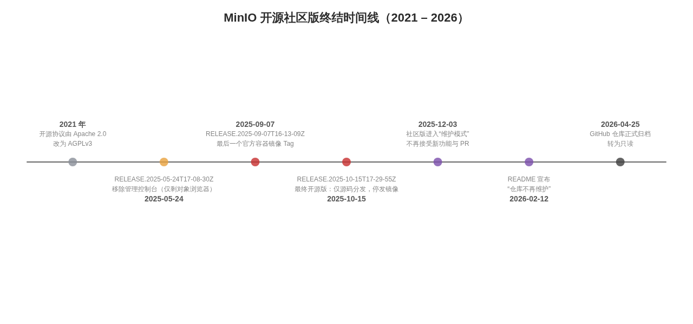

# MinIO 最后的开源版本及容器镜像 Tag

> **TL;DR**：MinIO 开源社区版（Community Edition，AGPLv3）的**最终版本**是 **`RELEASE.2025-10-15T17-29-55Z`**（2025 年 10 月 15 日，CVE 安全修复版），但该版本**只提供源码，官方没有为它发布任何容器镜像**。Docker Hub / Quay 上**最后一个官方容器镜像 Tag** 是 **`minio/minio:RELEASE.2025-09-07T16-13-09Z`**（另有 `-cpuv1` 变体）。若你需要最后一个仍带**完整 Web 管理控制台**的版本，则应选择 **`RELEASE.2025-04-22T22-12-26Z`**。此后 MinIO 于 2025 年 12 月进入维护模式，2026 年 2 月宣布不再维护，2026 年 4 月 25 日仓库正式归档为只读。

## 1. 直接答案

| 你想要的“最后一个” | 版本 / Tag | 说明 |
|---|---|---|
| **最终的开源版本**（GitHub 最后一个 Release） | **`RELEASE.2025-10-15T17-29-55Z`** | 2025-10-15 发布的安全版本，修复 CVE-2025-62506；仅源码分发，**无官方镜像、无二进制**([GitHub Releases](https://github.com/minio/minio/releases), [newreleases.io](https://newreleases.io/project/github/minio/minio/release/RELEASE.2025-10-15T17-29-55Z)) |
| **最后一个官方容器镜像 Tag** | **`minio/minio:RELEASE.2025-09-07T16-13-09Z`** | Docker Hub 与 quay.io/minio/minio 上最后一次推送的官方镜像；另有 `RELEASE.2025-09-07T16-13-09Z-cpuv1` 变体([docker.aityp.com 镜像元数据](http://docker.aityp.com/image/docker.io/minio/minio:RELEASE.2025-09-07T16-13-09Z), [xTag Tag 列表](https://xtag.termiai.cn/zh/registry/docker.io/namespaces/minio/minio/tag-list)) |
| **最后一个带完整管理控制台的版本** | **`minio/minio:RELEASE.2025-04-22T22-12-26Z`** | 自 `RELEASE.2025-05-24T17-08-30Z` 起控制台管理功能被移除，仅剩“对象浏览器”([博客园](https://www.cnblogs.com/whaleX/p/19144972), [Andy's Blog](https://www.andysblog.de/minio-seit-release-2025-05-24t17-08-30z-kein-admin-ui-mehr-vorhanden)) |
| 官方 `latest` 标签现状 | 停更/不再可信 | 镜像自 2025 年 9 月后未再更新，且官方 README 明确社区版改为纯源码分发([GitHub README](https://github.com/minio/minio)) |

## 2. 背景：MinIO 开源版是如何一步步走向终结的

MinIO 曾是全球增长最快的开源对象存储，Docker Hub 上官方镜像累计拉取量超过 **10 亿次**，采用 GNU AGPLv3 协议开源([Chainguard](https://www.chainguard.dev/unchained/secure-and-free-minio-chainguard-containers))。其开源社区版的收缩是一个分阶段推进的过程，而非一次性事件：

**第一阶段是许可证变更。** 项目最初采用 Apache 2.0 协议，2021 年改为 **AGPLv3**，要求以网络服务形式提供修改版时也必须开放源代码，这一变更被普遍认为针对“白嫖”其代码做商业 SaaS 的大公司([36氪](https://eu.36kr.com/zh/p/3521684347706501))。

**第二阶段是功能阉割（2025 年 5 月）。** 自 `RELEASE.2025-05-24T17-08-30Z` 起，社区版移除了 Web 控制台的管理功能（用户管理、策略配置、站点复制、生命周期管理等），只保留基础的“对象浏览器”；这些管理能力被转移至商业产品 AIStor([GitHub Releases](https://github.com/minio/minio/releases), [Andy's Blog](https://www.andysblog.de/minio-seit-release-2025-05-24t17-08-30z-kein-admin-ui-mehr-vorhanden))。官方在 object-browser 仓库的 PR #3509 中给出的理由是社区版管理界面缺乏维护、存在安全风险([GitHub Discussion #21316](https://github.com/minio/minio/discussions/21316))。

**第三阶段是切断分发渠道（2025 年 10 月）。** 2025 年 10 月 15 日，MinIO 发布修复高危漏洞 **CVE-2025-62506**（会话策略绕过导致权限提升，CVSS 8.1）的安全版本 `RELEASE.2025-10-15T17-29-55Z`，但用户发现 Docker Hub 和 Quay.io 上没有对应镜像。核心开发者 Harshavardhana 在 Issue 中回复确认：“MinIO 现在只提供源码分发，如需容器镜像请自行构建”([SegmentFault](https://segmentfault.com/a/1190000047343292), [GitHub Issue #21649](https://github.com/minio/minio/issues/21649))。官方 README 随后明确写道：社区版不再提供预编译二进制，只能通过 `go install` 从源码安装或用官方 Dockerfile 自行构建镜像([GitHub README](https://github.com/minio/minio))。

**第四阶段是彻底停摆（2025 年 12 月 – 2026 年 4 月）。** 2025 年 12 月 3 日，MinIO 通过一次静默的 README 提交宣布社区仓库进入**维护模式**：不再接受新功能、增强或 PR，Issue 与 PR 不再被审阅，关键安全修复“视情况个案处理”，并建议用户迁移至商业版 MinIO Enterprise / AIStor([InfoQ](https://www.infoq.com/news/2025/12/minio-s3-api-alternatives/), [elest.io](https://blog.elest.io/minio-is-in-maintenance-mode-your-guide-to-s3-compatible-storage-alternatives/))。2026 年 2 月 12 日，README 被更新为 “THIS REPOSITORY IS NO LONGER MAINTAINED”；2026 年 4 月 25 日，GitHub 仓库被正式**归档为只读**([elest.io](https://blog.elest.io/self-hosted-weekly-week-9-2026-minio-is-dead-open-source-gets-a-00m-endowment-and-ai-slop-hits-maintainers/), [Storm Developments](https://stormdevelopments.ca/blog/minio-s-community-edition-is-archived-what-still-runs-in-2026/))。需要强调的是，**代码本身仍是 AGPLv3 开源的**——终结的是上游的维护与分发，而非许可证([Storm Developments](https://stormdevelopments.ca/blog/minio-s-community-edition-is-archived-what-still-runs-in-2026/))。

## 3. 关键版本详解

### 3.1 最终开源版：`RELEASE.2025-10-15T17-29-55Z`

这是 minio/minio 仓库的**最后一个 Release**，也是社区版代码的最终形态([GitHub Releases](https://github.com/minio/minio/releases))。它本质上是一个紧急安全版本，修复了 **CVE-2025-62506 / GHSA-jjjj-jwhf-8rgr**——服务账户与 STS 中的会话策略绕过漏洞，受限账户可借此创建不受限账户，CVSS 评分 8.1([DevPro](https://devpro.fr/minio-container-images-gone-best-alternatives-2025/), [Minimus](https://www.minimus.io/post/minio-docker-image-changes-how-to-find-a-secure-minio-alternative))。该版本的发布说明不再提供二进制下载，而是指导用户用 `go install -v github.com/minio/minio@RELEASE.2025-10-15T17-29-55Z` 安装，或克隆源码后用 `make docker` 自行构建容器([newreleases.io](https://newreleases.io/project/github/minio/minio/release/RELEASE.2025-10-15T17-29-55Z))。换言之，**这个版本没有、也永远不会有一个对应的 `minio/minio:RELEASE.2025-10-15T17-29-55Z` 官方镜像**——任何声称是该 Tag 的镜像都来自第三方构建。

### 3.2 最后一个官方容器镜像：`RELEASE.2025-09-07T16-13-09Z`

Docker Hub 上 `minio/minio`（以及 quay.io/minio/minio）的最后一个官方 Tag 是 **`RELEASE.2025-09-07T16-13-09Z`**，推送于 2025 年 9 月 7 日，覆盖 linux/amd64、linux/arm64、linux/ppc64le 三个架构，并附带一个针对旧 CPU（无 AVX2 等新指令集）优化的 `RELEASE.2025-09-07T16-13-09Z-cpuv1` 变体([docker.aityp.com 镜像元数据](http://docker.aityp.com/image/docker.io/minio/minio:RELEASE.2025-09-07T16-13-09Z), [xuanyuan.cloud](https://xuanyuan.cloud/quay.io/minio/minio?tag=RELEASE.2025-09-07T16-13-09Z))。这也是官方 `latest` 标签实际停留的位置。

需要特别注意：该镜像**未包含 CVE-2025-62506 的修复**，存在已知高危漏洞([Minimus](https://www.minimus.io/post/minio-docker-image-changes-how-to-find-a-secure-minio-alternative), [DevPro](https://devpro.fr/minio-container-images-gone-best-alternatives-2025/))。因此在生产环境直接钉死这个 Tag 虽然可行，但等同于接受一个无人修复的安全敞口；若必须使用，应配合网络隔离、严格 IAM 策略等补偿性控制措施。

### 3.3 管理控制台的“最后晚餐”：`RELEASE.2025-04-22T22-12-26Z`

如果你的诉求是“最后一个带完整 Web 管理界面（用户、策略、监控、复制配置等）的开源版”，那要回退到 **`RELEASE.2025-04-22T22-12-26Z`**([博客园](https://www.cnblogs.com/whaleX/p/19144972))。2025-05-24 版本是一次 Breaking Release，内嵌控制台被弃用并替换为仅有浏览/下载功能的对象浏览器，LDAP/OIDC 登录等能力被划入 AIStor 商业产品([GitHub Releases](https://github.com/minio/minio/releases))。回退到此版本意味着同时放弃之后近半年的所有 bug 修复与安全补丁，只适合内网测试等低风险场景。

## 4. 现状下的获取与替代路径

| 路径 | 具体方式 | 特点 |
|---|---|---|
| **官方源码自建** | `go install github.com/minio/minio@latest`；或 `git clone` 后 `git checkout RELEASE.2025-10-15T17-29-55Z`，再 `TAG=myregistry/minio:RELEASE.2025-10-15T17-29-55Z make docker`([newreleases.io](https://newreleases.io/project/github/minio/minio/release/RELEASE.2025-10-15T17-29-55Z), [GitHub README](https://github.com/minio/minio)) | 最“正统”，但需自建 Go 工具链与镜像流水线，后续 CVE 需自行跟踪 |
| **社区自动构建** | `ghcr.io/golithus/minio:RELEASE.2025-10-15T17-29-55Z` 等 nightly 构建([golithus/minio-builds](https://newreleases.io/project/github/golithus/minio-builds/release/RELEASE.2025-10-15T17-29-55Z)) | 免费现成镜像，但属于个人/社区项目，供应链信任需自评估 |
| **第三方安全镜像** | `cgr.dev/chainguard/minio`（Chainguard 免费层，从源码持续构建、SLSA L3）([Chainguard](https://www.chainguard.dev/unchained/secure-and-free-minio-chainguard-containers))；另有 elestio、alpine/minio 等([DevPro](https://devpro.fr/minio-container-images-gone-best-alternatives-2025/)) | 省去构建成本，部分提供 0-CVE 镜像；多数只提供 latest |
| **社区分叉** | OpenMaxIO（恢复了管理控制台）、Silo / pgsty/minio（恢复控制台 + 二进制分发）([Andy's Blog](https://www.andysblog.de/minio-seit-release-2025-05-24t17-08-30z-kein-admin-ui-mehr-vorhanden), [Derails](https://derails.dev/blog/rustfs-audit-ring-5/)) | 延续 MinIO 代码与协议；由志愿者维护，长期可持续性待观察 |
| **替代对象存储** | RustFS、Garage、SeaweedFS、Ceph 等([InfoQ](https://www.infoq.com/news/2025/12/minio-s3-api-alternatives/), [Alarik](https://alarik.io/minio-alternative)) | S3 兼容、社区活跃；需评估功能差异与迁移成本（部分新项目成熟度较低） |

## 5. 实践建议

对于**存量部署**，正在运行的 MinIO 实例不会立刻失效，AGPLv3 代码也仍然可用，但上游已经归零：下一个 CVE 的发现、修补、构建、发布将全部落在使用者自己身上([Storm Developments](https://stormdevelopments.ca/blog/minio-s-community-edition-is-archived-what-still-runs-in-2026/))。短期可采取的动作包括：将镜像 Tag 固定到 `RELEASE.2025-09-07T16-13-09Z`（而不是会漂移的 `latest`）、把镜像转存到私有仓库以防 Docker Hub 侧进一步清理、并对 CVE-2025-62506 做风险处置。对于**新建项目**，不建议再选择 MinIO 社区版作为默认 S3 后端——包括 ragflow、Apache Iceberg 在内的多个开源项目已启动替换评估([GitHub ragflow #13840](https://github.com/infiniflow/ragflow/issues/13840), [Derails](https://derails.dev/blog/rustfs-audit-ring-5/))。

最后澄清一个常见误解：MinIO **没有更换许可证**，服务端代码自始至终（2021 年后）都是 AGPLv3，法律意义上它依然是开源软件；真正终结的是**上游维护与官方分发渠道**([Storm Developments](https://stormdevelopments.ca/blog/minio-s-community-edition-is-archived-what-still-runs-in-2026/))。因此“最后的开源版本”在代码层面是 `RELEASE.2025-10-15T17-29-55Z`，在可直接拉取的官方镜像层面则停留在 `minio/minio:RELEASE.2025-09-07T16-13-09Z`——两者相差一个版本，而这个差值正是整个事件的核心。
