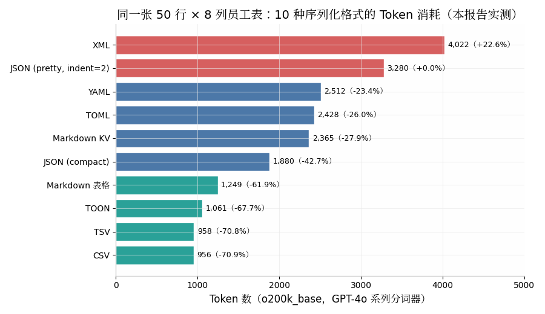
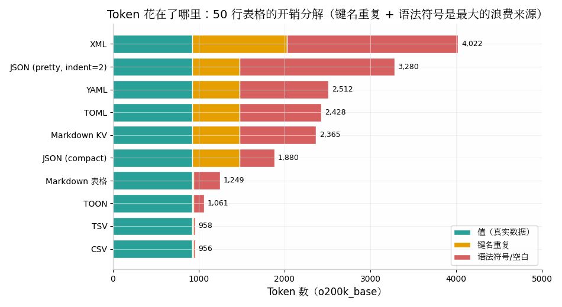
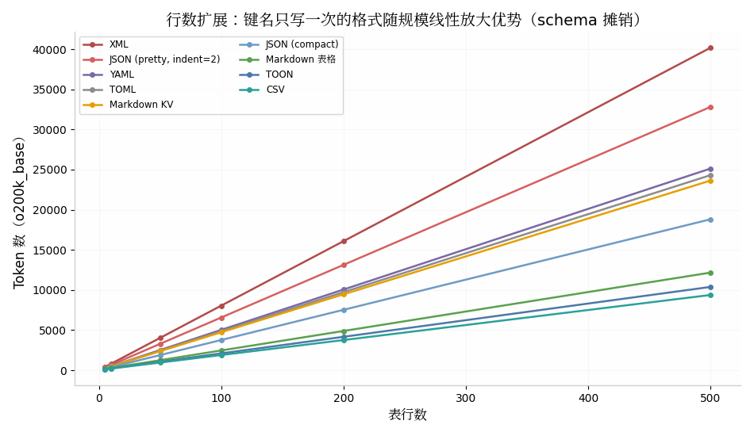
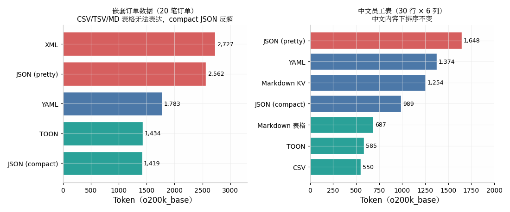
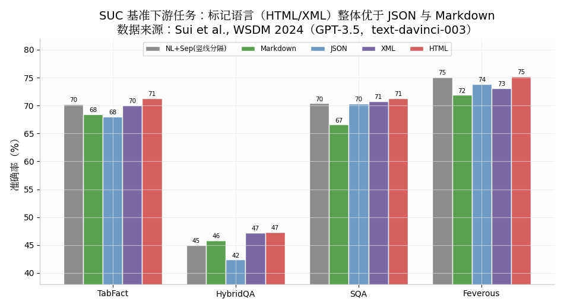
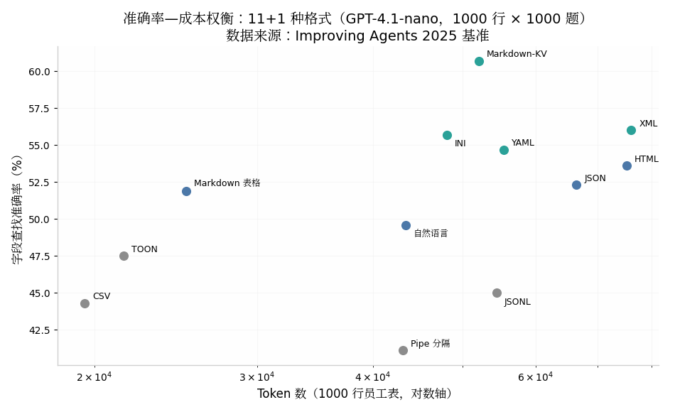

# 数据格式对 AI Agent 理解与 Token 消耗的影响：系统性调研与实测报告

> **调研范围**：JSON、YAML、TOML、XML、TSV、CSV、Markdown KV、Markdown 表格，以及 2025 年后新兴的 Token 优化格式（TOON、TRON、JTON、ONTO、ISON 等）。
> **方法**：10 轮迭代文献检索（学术基准 + 厂商文档 + 社区实测）＋ 本报告独立完成的分词器实测（tiktoken，cl100k_base / o200k_base）。
> **完成时间**：2026 年 9 月。

---

## 摘要（TL;DR）

对于**数据表展示**这一核心场景，结论可以压缩为四条：

1. **Token 消耗差距极大且确定**：同一张 50 行 × 8 列的表格，CSV 只需约 **956 token**，而 pretty JSON 需要 **3,280 token**（3.4 倍），XML 需要 **4,022 token**（4.2 倍）——差距来自键名重复与语法符号，而非数据本身（本报告实测）。
2. **准确率与 Token 成本正相关但不线性**：在 1000 行大表上，"每个值都带标签"的 Markdown-KV 准确率最高（60.7%），最省 Token 的 CSV 反而垫底（44.3%）；Markdown 表格是性价比拐点（51.9%，Token 仅为 Markdown-KV 的一半）([Improving Agents](https://www.improvingagents.com/blog/best-input-data-format-for-llms))。
3. **不存在"全能最优格式"**：模型能力对准确率的影响远大于格式（前沿模型与开源模型相差 21 个百分点，而格式效应通常只有几个百分点）；格式选择应遵循"**均匀行用表格系（CSV/TSV/Markdown 表格），嵌套数据用 compact JSON，准确率敏感的大表用 Markdown-KV**"的分层规则（[arXiv:2605.29676](https://arxiv.org/abs/2605.29676)）。
4. **Agent 场景有特殊风险**：在工具调用回路中替换 JSON 虽可省 Token，但多轮解析失败会级联放大，甚至让总 Token 不降反升；TOON 等新格式在"读懂"上可用，在"生成"上尚不可靠（[arXiv:2605.29676](https://arxiv.org/abs/2605.29676)）。

---

## 1. 研究方法与证据来源

本报告的证据分为三类。第一类是**学术基准研究**，包括微软/NUS 的 SUC 结构理解基准（WSDM 2024，GPT-3.5/GPT-4，7 类结构任务）（[arXiv:2305.13062](https://arxiv.org/abs/2305.13062)）、TQA-Bench 多表问答基准（22 个模型，8K–64K 上下文，对比 Markdown/CSV/JSON/HTML）（[arXiv:2411.19504](https://arxiv.org/html/2411.19504v2)）、提示格式敏感性研究（He et al. 2024；Sclar et al. FormatSpread, ICLR 2024）（[arXiv:2411.10541](https://arxiv.org/abs/2411.10541), [arXiv:2310.11324](https://arxiv.org/abs/2310.11324)），以及 2026 年针对智能体工具调用回路的 "Notation Matters" 基准（[arXiv:2605.29676](https://arxiv.org/html/2605.29676v2)）。第二类是**工程界对照实验**，以 Improving Agents 的三组实验（11 种表格格式、4 种嵌套格式、TOON 专项）和 TOON 官方基准为代表（[Improving Agents](https://www.improvingagents.com/blog/best-input-data-format-for-llms), [TOON GitHub](https://github.com/toon-format/toon)）。第三类是**本报告自主实测**：用 tiktoken 的 cl100k_base 与 o200k_base 分词器，对同一份合成数据做 10 种格式的序列化与 Token 统计，覆盖扁平表格、嵌套数据、中文内容与规模扩展四个维度。

需要预先说明的是本报告的边界。第一，**理解准确率的数据全部来自外部基准**，本报告实测只覆盖 Token 消耗维度（准确率实测需要调用真实模型 API，超出本环境能力）；不同基准使用的模型（GPT-3.5/4、GPT-4.1-nano、GPT-5-nano、Qwen 等）、数据规模、任务类型各不相同，跨基准的数字不可直接比较，只能比较同一基准内部的相对排序。第二，Token 计数依赖具体分词器，本报告以 OpenAI 两代主流分词器为准；Claude、Llama、Qwen 等模型的分词器会有数值差异，但相对排序通常稳定（TOON 官方基准同样注明其数字基于 cl100k/o200k 风格分词器）（[toonconverter.app](https://www.toonconverter.app/what-is-toon)）。第三，"理解"与"生成"是两个方向：模型读懂某格式的能力 ≠ 模型可靠地输出该格式的能力，本报告在第 5 章分别讨论。

---

## 2. Token 消耗：机制与实测

### 2.1 为什么格式会显著影响 Token 数

LLM 不直接"读"字符，而是先把文本切分为 token。对结构化数据而言，token 由三部分构成：**真实数据值**、**重复的键名/schema**、**语法符号与空白**（引号、冒号、花括号、缩进、分隔符、换行）。BPE 分词器对高频字符组合有合并优化（例如 `", "`、`": `、换行加缩进往往各自是独立 token），这使得格式层面的冗余会被逐 token 计费（[The Neural Base](https://theneuralbase.com/cheatsheet/tokenization/)）。DeepSeek-V3 的技术报告也印证了这一点：其分词器专门引入了"标点 + 换行"的组合 token 来优化结构化文本的效率（[DOCSAID](https://docsaid.org/en/papers/deepseek/deepseek-v3/)）。

更关键的是**键名重复**问题。JSON、YAML、TOML、Markdown-KV 这类"每条记录自带 schema"的格式，会把 `salary`、`department` 这样的键名在每行重复一次；N 行 × K 列的表就要为键名支付 N×K 次 token。而 CSV、TSV、Markdown 表格、TOON 这类"表头只声明一次"的格式，键名成本是固定的 1×K，行数越多，摊销优势越大。学术界对此有一致结论：ONTO 论文的消融实验显示，消除键名重复贡献了超过 100% 的总节省（约 41,979 token），标点精简只贡献约 15,300 token——**键名重复才是主要矛盾，标点只是次要矛盾**（[arXiv:2604.17512](https://arxiv.org/html/2604.17512v1)）。

### 2.2 实测一：扁平数据表的全格式对比（本报告实测）

本报告构造了一张确定性的合成员工表（50 行 × 8 列：id、name、age、city、department、salary、years_experience、project_count），分别序列化为 10 种格式，用 cl100k_base 与 o200k_base 统计 token。结果如下表与图 1：

| 格式 | 字符数 | cl100k token | o200k token | 相对 pretty JSON |
|---|---|---|---|---|
| **CSV** | 2,377 | 967 | **956** | **−70.9%** |
| **TSV** | 2,377 | 966 | **958** | **−70.8%** |
| TOON | 2,493 | 1,072 | 1,061 | −67.7% |
| Markdown 表格 | 3,345 | 1,248 | 1,249 | −61.9% |
| JSON (compact) | 6,813 | 1,843 | 1,880 | −42.7% |
| Markdown KV | 6,772 | 2,315 | 2,365 | −27.9% |
| TOML | 7,461 | 2,391 | 2,428 | −26.0% |
| YAML | 6,812 | 2,462 | 2,512 | −23.4% |
| JSON (pretty, indent=2) | 9,514 | 3,243 | 3,280 | 基线 |
| **XML** | 13,086 | 3,948 | **4,022** | **+22.6%** |

三个值得注意的细节。其一，**TSV 与 CSV 几乎无差异**（958 vs 956，差 0.2%）：制表符并不比逗号更省 token，单字符分隔符的 BPE 合并效果基本相同，这与独立实测的结论一致——选择"表头一次 + 只排值"这个大决定占了 95% 的收益，选 tab 还是逗号只是 5% 的噪声（[jangwook.net](https://jangwook.net/zh/blog/zh/llm-token-cost-data-format-experiment/)）。其二，**YAML 并不比 JSON 省多少**（−23.4%）：它省掉了引号和括号，但键名照常被逐行重复，且缩进本身要占 token；JTON 论文同样指出 YAML 相比 JSON 只有 1–6% 的边际节省（紧凑基线下），"YAML 既易读又省 token"是常见误解（[arXiv:2604.05865](https://arxiv.org/html/2604.05865), [jangwook.net](https://jangwook.net/zh/blog/zh/llm-token-cost-data-format-experiment/)）。其三，**XML 是最昂贵的格式**：每个字段被开闭标签写两遍，使其比 pretty JSON 还要贵 22.6%；Improving Agents 的嵌套数据实验也测出 XML 比 Markdown 多 80% token（[Improving Agents](https://www.improvingagents.com/blog/best-nested-data-format/)）。

### 2.3 实测二：Token 到底浪费在哪里（开销分解）

把 50 行表格的 token 分解为"值 / 键名 / 语法符号"三部分（近似方法：单独统计全部值与全部键名的 token，余项记为语法开销；BPE 跨边界合并会带来小误差，仅作数量级参考），得到图 2：

| 格式 | 总 token | 值 | 键名 | 语法符号(≈) | 开销占比 |
|---|---|---|---|---|---|
| CSV | 956 | 927 | 11 | 18 | **3%** |
| TSV | 958 | 927 | 11 | 20 | 3% |
| TOON | 1,061 | 927 | 11 | 123 | 13% |
| Markdown 表格 | 1,249 | 927 | 11 | 311 | 26% |
| JSON (compact) | 1,880 | 927 | 550 | 403 | 51% |
| Markdown KV | 2,365 | 927 | 550 | 888 | 61% |
| TOML | 2,428 | 927 | 550 | 951 | 62% |
| YAML | 2,512 | 927 | 550 | 1,035 | 63% |
| JSON (pretty) | 3,280 | 927 | 550 | 1,803 | **72%** |
| XML | 4,022 | 927 | 1,100 | 1,995 | **77%** |

分解结果把机制讲得很清楚：在 pretty JSON 中，**只有 28% 的 token 承载真实数据**，其余 72% 花在键名重复（550 token）和引号/冒号/括号/缩进（约 1,800 token）上；XML 因闭合标签使键名成本翻倍，开销占比达 77%。作为交叉验证，社区有人对紧凑 KV 风格做了逐 token 拆解，发现结构 token 占比可从 JSON 的 24% 降到 0.78%（[zenn.dev](https://zenn.dev/hanako_tech/articles/25d05ba8f124a4?locale=en)）；TabLib 数据集构建时也发现 JSON 语法符号本身约占 token 的 10%（[arXiv:2310.07875](https://arxiv.org/html/2310.07875v1)）。一个立即可用的零成本优化是：**给模型喂 JSON 时去掉 indent**，仅此一项就在本实测中省下 42.7% 的 token——两空格缩进 `"  "` 本身就是独立 token，50 行 × 8 列时会被铺 400 次。

### 2.4 实测三：规模扩展——键名摊销的线性放大

把行数从 5 扩展到 500，各格式的 token 增长曲线如图 3。所有格式都近似线性增长，但**斜率（每行边际 token）相差 4.3 倍**：

| 格式 | 每行边际 token（o200k） | 格式 | 每行边际 token（o200k） |
|---|---|---|---|
| CSV | **18.7** | JSON (compact) | 37.6 |
| TSV | 18.8 | Markdown KV | 47.3 |
| TOON | 20.7 | TOML | 48.6 |
| Markdown 表格 | 24.3 | YAML | 50.3 |
| — | — | JSON (pretty) | 65.6 |
| — | — | XML | **80.4** |

这张图的工程含义非常直接：表格类格式的表头成本是固定的（一行 schema），数据行只带纯值；而记录类格式的每行都要重新支付全套键名。行数从 50 涨到 500，CSV 与 pretty JSON 的差距从 2,324 token 拉大到 23,431 token。**数据越大，格式选择的代价越悬殊**——这正是 TOON 设计者强调的"效率遵循行数的幂律"：3 行省 57%，50 行省 64.7%，行数越多比例节省越大（[CSDN 译 TOON 设计文](https://blog.csdn.net/sinat_26917383/article/details/154241220)）。对 Agent 而言这个效应还会复利：若表格被钉在系统提示里跑 30 轮对话，每轮都要重发，50 行 pretty JSON（3,280 token）改 TSV（958 token）意味着 30 轮累计省约 7 万 token（[jangwook.net](https://jangwook.net/zh/blog/zh/llm-token-cost-data-format-experiment/)）。

### 2.5 实测四：嵌套数据——结论反转

表格系格式的致命弱点是**无法表达嵌套结构**：当记录里含有子对象或变长数组（如订单含客户对象与条目列表）时，CSV/TSV/Markdown 表格彻底出局。本报告用 20 笔嵌套订单实测了剩余格式的对决（图 6 左）：

| 格式 | o200k token | 相对 pretty JSON |
|---|---|---|
| **JSON (compact)** | **1,419** | **−44.6%** |
| TOON | 1,434 | −44.0% |
| YAML | 1,783 | −30.4% |
| JSON (pretty) | 2,562 | 基线 |
| XML | 2,727 | +6.4% |

嵌套场景下 compact JSON 反超 TOON 登顶（TOON 对非均匀嵌套数组要退回逐条缩进表示，失去表格化红利），YAML 依然因缩进成本不占便宜。这与独立实测的结论完全一致："**均匀的行用表格系（CSV/TSV/Markdown），嵌套就用 compact JSON**"是跨实验复现的最实用规则（[jangwook.net](https://jangwook.net/zh/blog/zh/llm-token-cost-data-format-experiment/)）。IBM 社区的文章也指出 TOON 目前只在扁平对象上优势明显，深层嵌套时消耗与 JSON 相当（[IBM Community](https://community.ibm.com/community/user/blogs/ranjeet-kumar/2025/11/20/json-vs-toon-token-oriented-object-notation-choosi)）。

### 2.6 实测五：中文内容与分词器差异

中文内容不改变格式排序，但改变绝对数值（图 6 右）。30 行 × 6 列的中文员工表上，排序与英文一致（CSV 550 < TOON 585 < Markdown 表格 687 < compact JSON 989 < Markdown KV 1,254 < YAML 1,374 < pretty JSON 1,648）。值得注意的是 **o200k_base 对中文的效率明显优于 cl100k_base**（如 pretty JSON：1,648 vs 1,937 token，省 15%），因为 o200k 词表翻倍后收录了更多中文合并项。这提示两点：一是跨模型比较格式时必须用模型对应的分词器，Claude 的 WordPiece 系分词器对数字、空白的切分与 OpenAI BPE 差异不小（[The Neural Base](https://theneuralbase.com/cheatsheet/tokenization/)）；二是中文场景下格式的相对优劣结论依然稳健，可直接套用英文场景的规则。

---

## 3. AI 理解准确率：基准证据

### 3.1 格式确实影响理解——而且影响不小

"格式是否影响 LLM 的理解"这个问题，学术界给出的答案是明确肯定的。Sui 等人的 SUC 基准（WSDM 2024）设计了 7 类结构理解任务（表格分割、尺寸检测、单元格查找、反向查找、列/行检索、合并单元格检测），在 GPT-3.5 和 GPT-4 上系统对比了 NL+Sep、Markdown、JSON、XML、HTML 五种序列化方式，发现**输入格式的选择会造成显著的性能差异，即使 GPT-4 也不例外**（[arXiv:2305.13062](https://arxiv.org/abs/2305.13062)）。更激进的证据来自提示格式敏感性研究：He et al.（微软）发现仅把同一份内容在纯文本/Markdown/JSON/YAML 模板间切换，GPT-3.5-turbo 在代码翻译任务上的性能波动可达 **40%**；Sclar et al. 的 FormatSpread 研究在 few-shot 提示上仅改动分隔符、大小写、条目格式，就观测到最高 **76 个百分点**的准确率极差（[arXiv:2411.10541](https://arxiv.org/abs/2411.10541), [alphaxiv 摘要](https://www.alphaxiv.org/abs/2310.11324)）。

但这些研究同时给出两个重要限定。第一，**模型越大越鲁棒**：GPT-4 对格式变化的敏感度显著低于 GPT-3.5，GPT-4-turbo 又优于早期 GPT-4；格式选择对弱模型是"生死攸关"，对强模型是"锦上添花"（[arXiv:2411.10541](https://arxiv.org/abs/2411.10541)）。第二，**不存在通吃的最优格式**：He et al. 发现 GPT-3.5 偏好 JSON，而 GPT-4 偏好 Markdown——即便同一家族的模型，最优格式也会漂移（[awesome-agent-experience](https://github.com/alexngai/awesome-agent-experience/blob/main/research/file-type-agent-accessibility.md)）。这意味着任何"XX 格式最好"的结论都必须绑定具体模型与任务。

### 3.2 SUC 基准：标记语言整体占优，JSON 在精确定位上不弱

SUC 基准的分格式结果（Table 2/5）揭示了任务类型与格式的交互。在下游任务层面（图 5），HTML 在 TabFact（71.33%）、HybridQA（47.29%）、SQA（71.31%）、Feverous（75.20%）上全面居首或并列居首，作者认为这与预训练语料中海量网页数据使模型更熟悉 HTML/XML 标记有关；JSON 与 Markdown 整体落后 1–3 个百分点（[arXiv:2305.13062](https://arxiv.org/abs/2305.13062)）。

| 格式 | TabFact Acc | HybridQA Acc | SQA Acc | Feverous Acc | ToTTo BLEU-4 |
|---|---|---|---|---|---|
| NL + Sep（竖线分隔） | 70.26% | 45.02% | 70.41% | 75.15% | 12.70 |
| Markdown | 68.40% | 45.88% | 66.59% | 71.88% | 8.57 |
| JSON | 68.04% | 42.40% | 70.39% | 73.84% | 8.82 |
| XML | 70.00% | 47.20% | 70.74% | 73.14% | 8.82 |
| **HTML** | **71.33%** | **47.29%** | **71.31%** | **75.20%** | 12.30 |
| GPT-4 + HTML | 78.40% | 56.68% | 75.35% | 83.21% | 20.12 |

（数据来源：Sui et al. Table 5，GPT-3.5 text-davinci-003；[arXiv:2305.13062](https://arxiv.org/html/2305.13062v4)）

在细粒度结构任务上结论更微妙：表格分割任务中 XML（96.0%）与 HTML（96.7%）优于 Markdown（92.3%）和 JSON（94.0%）；尺寸检测中 HTML 以 67.0% 大幅领先（其余格式仅 40–44%）——因为 `<tr>`/`<td>` 标签是天然的行列计数锚点。但研究还发现两个反直觉结论：**加分隔符标记和格式说明反而会损害单元格查找等检索任务**（结构信息会"带偏"注意力），而换成 GPT-4 后所有格式的差距收窄、HTML 组合方案整体准确率最高达 65.43%（[arXiv:2305.13062](https://arxiv.org/html/2305.13062v4)）。此外，0-shot 相比 1-shot 平均暴跌 30 个百分点，说明结构理解高度依赖上下文学习，给一个格式示例比换格式本身收益更大。

### 3.3 Improving Agents 十一格式基准：准确率—成本的核心权衡图

工程界引用最广的是 Improving Agents 2025 年 9 月的实验：1000 条合成员工记录 × 1000 个数值查找问题，GPT-4.1-nano，对比 11 种格式（后追加 TOON 共 12 种）。完整结果（图 4）是理解"准确率—成本权衡"的核心素材（[Improving Agents](https://www.improvingagents.com/blog/best-input-data-format-for-llms), [TOON 专项](https://www.improvingagents.com/blog/toon-benchmarks)）：

| 格式 | 准确率 | 95% 置信区间 | Token（1000 行） | 每千 token 答对数 |
|---|---|---|---|---|
| **Markdown-KV** | **60.7%** | 57.6–63.7% | 52,104 | 11.6 |
| XML | 56.0% | 52.9–59.0% | 76,114 | 7.4 |
| INI | 55.7% | 52.6–58.8% | 48,100 | 11.6 |
| YAML | 54.7% | 51.6–57.8% | 55,395 | 9.9 |
| HTML | 53.6% | 50.5–56.7% | 75,204 | 7.1 |
| JSON | 52.3% | 49.2–55.4% | 66,396 | 7.9 |
| Markdown 表格 | 51.9% | 48.8–55.0% | 25,140 | **20.6** |
| 自然语言 | 49.6% | 46.5–52.7% | 43,411 | 11.4 |
| TOON | 47.5% | 44.4–50.6% | 21,518 | **22.1** |
| JSONL | 45.0% | 41.9–48.1% | 54,407 | 8.3 |
| CSV | 44.3% | 41.2–47.4% | **19,524** | 22.7 |
| Pipe 分隔 | 41.1% | 38.1–44.2% | 43,098 | 9.5 |

这个实验的三条结论值得反复咀嚼。第一，**"每个值都带标签"是准确率的制胜机制**：Markdown-KV 每条记录都把 `salary: 67896` 写全，模型不需要"数列"就能把值和表头关联；而 CSV、Markdown 表格这类位置索引格式，在 1000 行的大表里极易丢失"第 7 个值对应第 7 列"的对应关系——作者明确指出，较小的表格加上重复表头会显著改善 CSV/Markdown 表格的表现（[Improving Agents](https://www.improvingagents.com/blog/best-input-data-format-for-llms), [paperdown 文档](https://github.com/atsyplenkov/paperdown)）。第二，**准确率与成本总体正相关但远非线性**：Markdown-KV 比 CSV 准确率高 16.4 个百分点，代价是 2.7 倍 token；而 XML、HTML 是"双输"——最贵却不最准；Markdown 表格是公认的性价比拐点（51.9% 准确率，token 只有 Markdown-KV 的 48%）。第三，**规模会颠覆排序**：Hacker News 社区用同样方法在仅 100 行时复测，排名完全反转——CSV 84.25% > Markdown 表格 82.65% > Markdown-KV 79.83%；表越小，列对齐的"视觉"结构越有效，标签冗余越没必要（[gist 汇总](https://gist.github.com/sabriguenes/90e663262c0f403d9688155795177f30)）。

### 3.4 TQA-Bench：复杂多表问答中 Markdown 表格最优

TQA-Bench（22 个模型，多表问答，8K–64K 上下文规模）对比 Markdown、CSV、JSON、HTML 四种格式，结论与上面互为补充（[arXiv:2411.19504](https://arxiv.org/html/2411.19504v2)）：

| 模型 | 上下文 | Markdown | CSV | 差值 |
|---|---|---|---|---|
| GPT-4o | 8K | 78.68% | 72.96% | +5.7 |
| GPT-4o | 16K | 72.29% | 70.29% | +2.0 |
| Qwen2.5-7B | 8K | 49.86% | 40.57% | **+9.3** |
| Qwen2.5-7B | 32K | 41.57% | 33.71% | +7.9 |
| Llama3.1-8B | 64K | 35.86% | 35.71% | ≈0 |

作者结论是："**Markdown 是复杂多表问答中明显更优的序列化格式**"，其优势跨模型、跨规模一致存在；CSV 依然是最省 token 的（HTML 约为其 3 倍，64K 规模数据库用 HTML 序列化会超过 128K token 而爆窗）；JSON 则"一致性地最弱"，因为半结构化语法 token 太多（[arXiv:2411.19504](https://arxiv.org/html/2411.19504v2), [gist 汇总](https://gist.github.com/sabriguenes/90e663262c0f403d9688155795177f30)）。另一个有趣发现是代码增强模型对格式更不敏感：Qwen2.5-Coder-7B 在 CSV 上全面反超同规模通用模型，说明训练语料的格式分布会直接塑造模型的格式偏好。

### 3.5 嵌套数据的准确率：YAML/Markdown 好于 JSON，XML 垫底

对嵌套数据（API 响应、配置文件、商品目录），Improving Agents 用 GPT-5-nano、Llama-3.2-3B、Gemini-2.5-Flash-Lite 三个模型做了 1000 题测试（[Improving Agents](https://www.improvingagents.com/blog/best-nested-data-format/)）：

| 格式 | 准确率（GPT-5-nano） | Token | 说明 |
|---|---|---|---|
| **YAML** | **62.1%** | 42,477 | 准确率最高 |
| Markdown | 54.3% | **38,357** | **最省 token**（比 JSON 少 34–38%） |
| JSON | 50.3% | 57,933 | 对 Llama 最好，对 GPT/Gemini 偏差 |
| XML | 44.4% | 68,804 | 双输：最贵且最不准 |
| TOON | 43.1% | 45,436 | 嵌套场景垫底 |

模型偏好差异同样显著：GPT-5-nano 和 Gemini 有明显的格式敏感性（推荐 YAML/Markdown），Llama-3.2-3B 则几乎"格式免疫"（JSON 略优但不显著）。另一组数字（SKILLCOMPILER 论文引用）给出了不同模型下的嵌套解析准确率：YAML 51.9% > JSON 43.1% > XML 33.8%，方向一致（[OpenReview](https://openreview.net/pdf?id=baOeYyuxty)）。两组实验共同支持：**嵌套数据默认给 YAML 或 Markdown，而不是 JSON**——除非下游需要程序直接解析。

### 3.6 格式效应 vs 模型效应：哪个是大头

把以上证据汇总，可以得到一个"效应量级"的排序，这对工程决策至关重要。McMillan 2026 年在 SQL 生成任务上跑了 9,649 次试验（11 个模型 × 4 种格式：YAML/Markdown/JSON/TOON），发现**格式对总体准确率无显著影响（χ²=2.45, p=0.484）**，个别模型的格式敏感度在 −7.7% 到 +2.7% 之间，而前沿模型与开源模型之间有 21 个百分点的能力鸿沟——模型能力是主导因素，格式效应被其掩盖（[The Moonlight 综述](https://www.themoonlight.io/en/review/notation-matters-a-benchmark-study-of-token-optimized-formats-in-agentic-ai-systems)）。Masciari et al. 的多格式生成基准同样发现，大模型能弥合格式差距，没接触过 TOON 的小模型则结构正确率明显下降（[arXiv:2605.29676](https://arxiv.org/pdf/2605.29676)）。

由此可以画出一条清晰的决策边界：**弱模型/小模型 + 大表 + 精确检索**的场景，格式选择的收益最大（最高可达 16 个百分点甚至更多）；**强推理模型 + 小表 + 一般问答**的场景，格式效应可能被压缩到统计不显著。这与 Improving Agents 的自我限定一致——他们只用 GPT-4.1-nano 单模型、单 schema、纯查找题型做了压力测试，换更强的模型、更小的表或重复表头，结论的绝对值都会变化（[OSCHINA 编译](https://my.oschina.net/IDP/blog/18725043)）。

---

## 4. 逐格式评析

下表汇总八种主流格式（外加 TOON）在"AI 理解"与"Token 消耗"两个维度上的表现定位，详细分析随后展开。

| 格式 | Token 效率（扁平表，实测） | 理解准确率（文献综合） | 嵌套表达 | 类型保真 | 训练语料曝光 | 一句话定位 |
|---|---|---|---|---|---|---|
| CSV | ★★★★★（−70.9%） | 大表弱/小表强 | ✗ | ✗（全字符串） | 高 | 最省 token 的默认之选，大表需防列错位 |
| TSV | ★★★★★（−70.8%） | 与 CSV 同级 | ✗ | ✗ | 中 | 含逗号文本的免转义版 CSV |
| Markdown 表格 | ★★★★（−61.9%） | 平衡点；多表 QA 最优 | ✗ | ✗ | 极高 | 性价比拐点，可视化友好 |
| Markdown KV | ★★（−27.9%） | **大表查找最高** | 弱 | 弱 | 高（非标准） | 准确率优先时的大表方案 |
| JSON (compact) | ★★★（−42.7%） | 中等，模型差异大 | ★★★★★ | ★★★★★ | 极高 | 嵌套数据与程序互操作的通用解 |
| JSON (pretty) | ★（基线） | 与 compact 相当 | ★★★★★ | ★★★★★ | 极高 | 只该出现在给人读的场合 |
| YAML | ★★（−23.4%） | 嵌套数据最高 | ★★★★☆ | ★★★★☆ | 高 | 嵌套配置类数据的准确率之选 |
| TOML | ★★（−26.0%） | 证据最少 | ★★★★☆ | ★★★★☆ | 中 | 配置文件出身，LLM 场景无优势证据 |
| XML | ☆（+22.6%） | 任务依赖（分割/计数强） | ★★★★★ | ★★☆ | 极高 | 最贵；结构化提示分隔的好材料 |
| TOON | ★★★★（−67.7%） | 结论冲突，模型依赖 | ★★★☆ | ★★★★☆ | 极低 | 大均匀数组的省 token 新锐 |

**CSV/TSV** 是 token 效率的地板，也是理解准确率的"双面刃"：小表上它们是王者（100 行复测中 CSV 84.25% 居首），但上千行无表头重复时列关联会系统性丢失（44.3% 垫底）。TSV 相比 CSV 的唯一实质优势是**免转义**——真实数据里逗号常见而制表符罕见，TSV 几乎不需要引用机制，且是 Excel 剪贴板的原生格式；两者在 token 上的差异属噪声级别（[file-extensions.com](https://file-extensions.com/docs/tsv), [jangwook.net](https://jangwook.net/zh/blog/zh/llm-token-cost-data-format-experiment/)）。

**Markdown 表格**是研究中最一致的"甜点"：TQA-Bench 里它跨模型最优，Improving Agents 里它以一半 token 拿到接近 KV 的准确率。其竖线和 `| --- |` 分隔行提供了强列对齐信号，但它同样有位置索引格式的规模病，且无法表达合并单元格与嵌套——科研 PDF 转换工具 paperdown 因此选择保真度更高的内联 HTML 作为默认（[paperdown](https://github.com/atsyplenkov/paperdown)）。**Markdown-KV** 则是大表准确率的冠军：每行自带全部键名，使查找彻底摆脱"数列"负担；代价是 2.7 倍于 CSV 的 token，且它并非标准格式，生态与可解析性弱（[Improving Agents](https://www.improvingagents.com/blog/best-input-data-format-for-llms)）。

**JSON** 的处境最微妙：它是训练语料中曝光度最高的结构化格式、是工具调用 API 的唯一事实标准、是程序互操作的不二之选，类型系统（数字/布尔/null）完整；但在纯"喂给模型看"的场景里，它的键名重复税最重，pretty 版尤甚。实践规则是：**程序到程序用 JSON，程序到模型至少改 compact，表格数据优先考虑表格系格式**。**YAML** 是嵌套数据准确率的意外赢家（62.1%），靠缩进层级贴合模型的结构先验；但它对扁平表既不省 token 也无准确率优势。**TOML** 在所有调研基准中证据最稀薄——它出现在 StructEval 的 18 种生成格式中（[ModelScope](https://modelscope.cn/datasets/TIGER-Lab/StructEval)），本报告实测其 token 与 YAML 同档（−26.0%），但没有任何公开基准显示它对 LLM 理解有独特价值，其设计目标是人类可写的配置文件而非 LLM 输入。

**XML** 值得单独澄清一个常见混淆：作为**数据表载体**，XML 是最差选择之一（最贵、嵌套测试垫底）；但作为**提示词的结构分隔符**（`<instructions>`、`<document>` 这类标签），它是 Anthropic 官方推荐的一等公民——Claude 文档明确指出 XML 标签能帮助模型区分提示中的指令、上下文与示例，减少误解析，且建议嵌套使用、命名一致（[Anthropic Docs](https://docs.anthropic.com/en/docs/build-with-claude/prompt-engineering/use-xml-tags), [Claude Platform](https://platform.claude.com/docs/en/build-with-claude/prompt-engineering/claude-prompting-best-practices)）。BPMN 生成的对照研究也给出量化：JSON 输出比 XML 输出延迟低近一半（13.42s vs 24.82s），输出 token 少 62%（688 vs 1,832）（[arXiv:2509.24592](https://arxiv.org/html/2509.24592v2)）。一句话：**用 XML 组织提示，不用 XML 承载数据**。

---

## 5. Agent 场景专题：输入、输出与工具调用回路

### 5.1 工具调用回路中的格式替换：收益真实，但有"解析级联"陷阱

Agent 系统的结构化数据流有三个注入点：工具 schema（输入）、工具结果（输入）、工具调用本身（输出）。2026 年的 "Notation Matters" 基准首次在真实 agentic 回路（BFCL、MCPToolBenchPP、MCP-Universe、StableToolBench，5 个开源模型）中系统评估了把 JSON 换成 TOON/TRON 的效果（[arXiv:2605.29676](https://arxiv.org/html/2605.29676v2)）：

| 结论 | 细节 |
|---|---|
| 仅替换输入侧（schema + 工具结果） | TOON 省 2–18% 总 token，TRON 省 0–27%；工具结果压缩最多可达 −32% |
| 准确率代价 | TOON 平均掉 1–9 个百分点，TRON 在 +3 到 −14 之间；格式×模型交互的强度与格式选择本身相当 |
| 多轮"解析级联" | 一次工具调用解析失败会触发额外推理轮，新轮的 thought+action+observation 载荷会**吃掉全程节省**——Qwen3-32B 在全量 TOON 下总 token 反而 +8%~+11% |
| 并行调用崩溃 | BFCL 的 parallel/parallel_multiple 类别中，多数模型在替代格式下准确率崩到接近 0：模型的"JSON 工具调用先验"太深，替代格式无法可靠表达并行结构 |
| 推理模式的保护作用 | 开启 thinking 的 Qwen3-32B 是唯一 TOON 准确率追平 JSON 基线的配置；显式推理能补偿陌生格式 |

这条证据链的实践含义是：**压缩应该发生在"工具结果回传"这一侧，而不是"模型生成工具调用"这一侧**。工具结果（尤其是 MCP 返回的大块查询结果）是纯输入、可确定性编码、不占生成可靠性，是格式优化的安全区；让模型直接生成 TOON 调用则是危险区——Matveev 的生成基准同样发现，教会模型 TOON 语法需要一次性"提示税"，输出太短时不划算，只有输出足够长、累计节省覆盖固定成本后 TOON 才划算（[arXiv:2603.03306](https://arxiv.org/abs/2603.03306)）。Halodoc 的生产实践提供了落地参照：他们从 JSON 切到 TOON 后整体 LLM token 成本降了 5–15%（注意：远小于微基准的 30–60%，因为真实 prompt 里数据载荷只占一部分），TOON 在其加权评估中得分 4.0，仅次于 JSON 的 4.1，差距几乎全在生态成熟度（[Halodoc Blog](https://blogs.halodoc.io/reducing-llm-token-costs-by-5-15-by-switching-from-json-to-toon-format/)）。

### 5.2 生成方向：让模型"输出"结构化数据的可靠性

本报告此前的讨论聚焦"输入理解"，但 Agent 还频繁要求模型**生成**结构化数据。这里有三条独立证据。其一，格式限制本身会伤害推理：EMNLP 2024 的 "Let Me Speak Freely" 研究发现，强制模型输出 JSON 等受限格式时，推理类任务的表现显著下降，越严格的格式约束伤害越大——原因被归结为格式约束压缩了模型自由推理的空间（[arXiv:2408.02442](https://arxiv.org/abs/2408.02442)）。其二，约束解码（structured output）是双刃剑：Matveev 的基准显示受约束 JSON 生成 token 最少，但准确率略有下降且对部分模型退化显著；对于简单结构，受约束 JSON 甚至比 TOON 更省 token（[arXiv:2603.03306](https://arxiv.org/abs/2603.03306)）。其三，小众格式的生成可靠性远低于理解可靠性：JTON 报告其格式在 12 个模型上零样本/少样本生成 100% 语法有效（因它是 JSON 严格超集），而 TOON 对"训练中没见过它"的模型结构正确率明显下降——**训练语料曝光度决定了生成侧的可靠性排序：JSON ≫ YAML > Markdown > 小众格式**（[arXiv:2604.05865](https://arxiv.org/html/2604.05865)）。

综合而言，生成方向的稳妥策略是：能用厂商原生 structured output / function calling（强制 JSON Schema）就不要发明新格式；需要在自由文本通道里生成结构化数据时选 JSON 或 YAML；TOON 类格式目前只适合"输入压缩"，除非配套验证—重试回路。

### 5.3 厂商与生态实践信号

生态层面的信号也支持"分场景选格式"而非"一刀切"。Anthropic 官方提示词指南推荐用 XML 标签组织提示结构、用嵌套标签表达文档层级，并建议长文档放在提示顶部（[Anthropic Docs](https://docs.anthropic.com/en/docs/build-with-claude/prompt-engineering/use-xml-tags)）；OpenAI 生态的工具调用 API 则把 JSON 锁定为唯一接口格式，使格式替换只能发生在 prompt 模式下（[arXiv:2605.29676](https://arxiv.org/html/2605.29676v2)）。Claude 的 Agent Skills 标准用 "YAML frontmatter + Markdown 正文" 组织技能文件，正是"元数据用 YAML、指令用自然语言 Markdown"的分工实践（[Cor-Incorporated/claude-code-skills](https://github.com/Cor-Incorporated/claude-code-skills)）。npm 上的 llm-md 等转换库则把"按数据形状自动选格式"产品化：深层嵌套转 YAML（其引用基准称准确率 62%）、均匀数组转表格、查找型数据转 KV（[socket.dev](https://socket.dev/npm/package/llm-md)）。

---

## 6. 新兴 Token 优化格式：TOON 及其竞品

2025 年底以来，"专为 LLM 省 token 的格式"成为一个小赛道，值得 Agent 开发者关注。它们的共同思想是**schema 只声明一次**：

| 格式 | 核心机制 | 宣称节省 | 验证情况 |
|---|---|---|---|
| **TOON**（Token-Oriented Object Notation） | YAML 式缩进 + CSV 式表格行（`users[3]{id,name}:`） | 比 pretty JSON 省 30–60% | 官方 209 题基准：准确率 73.9% vs JSON 69.7%，token 省 39.6%（[TOON 基准](https://byteiota.com/toon-format-cuts-llm-token-costs-30-60-complete-guide/)）；但 Improving Agents 复测表格任务仅 47.5%、嵌套任务 43.1% 垫底，结论冲突（[Improving Agents](https://www.improvingagents.com/blog/toon-benchmarks)） |
| **TRON**（Token Reduced Object Notation） | 类定义 + 实例：重复结构声明一次 | Agent 回路最高 −27% | 同批次 4 个 agentic 基准验证；但工具少时会倒贴 +21%（[arXiv:2605.29676](https://arxiv.org/html/2605.29676v2)） |
| **JTON**（Zen Grid） | JSON 严格超集，表头因式分解 + 分号分隔 | 15–60%（平均 28.5%） | 10 个模型理解测试净 +0.3pp，12 个模型生成 100% 有效（[arXiv:2604.05865](https://arxiv.org/html/2604.05865)） |
| **ONTO** | 竖线分隔列式记号，实体字段声明一次 | 46–51%（IoT 数据） | Qwen2.5-7B 理解无损，TTFT 改善 5–7%（[The Moonlight 综述](https://www.themoonlight.io/en/review/onto-a-token-efficient-columnar-notation-for-llm-input-optimization)） |
| **ISON** | 表式声明 + 类型标注 | 比 JSON 省 72%（300 题基准） | 准确率 88.3% vs JSON 84.7%（[腾讯云社区](https://cloud.tencent.com/developer/article/2695769)） |

对 TOON 的评价需要保持平衡。它的设计（键名一次声明、明确长度标记 `[3]` 使模型能自检行数）确实切中要害，社区实测（含本报告）也复现了 60%+ 的 token 节省；但两方面的保留意见同样有据：一是**理解准确率的证据冲突**——官方基准里 TOON 最高，独立复测里它从未拿过第一，差异可能来自数据形状与提问方式；二是**"CSV 比 TOON 更省也更被理解"的批评**——法国技术播客社区尖锐指出，TOON 的营销对比常拿 pretty JSON 当靶子，而同样数据的 CSV 会做得更好、模型理解也更成熟（[Les Cast Codeurs](https://lescastcodeurs.com/2025/12/15/lcc-333-a-vendre-oss-primitif-tbe/)）。TOON 官方自己也承认：纯表格数据 CSV 更紧凑，深层嵌套或半均匀数组（表格化率 40–60%）不适合 TOON（[toonconverter.app](https://www.toonconverter.app/what-is-toon)）。理性的定位是：TOON 适合"JSON 数据模型 + 大量同构数组 + 输入侧"的窄场景，是手术刀而非锤子（[byteiota](https://byteiota.com/toon-format-cuts-llm-token-costs-30-60-complete-guide/)）。

---

## 7. 综合选型决策框架

把全部证据收敛成可操作的分层决策规则（以数据表场景为主线）：

**第一层：看数据形状。**
- 扁平均匀表 → 表格系格式候选（CSV/TSV/Markdown 表格/TOON）
- 嵌套/异构结构 → JSON (compact) 或 YAML；CSV 系直接出局
- 混合场景 → 按最大数据块决定，或分块混排（Markdown 文档里嵌 CSV 块完全合法）

**第二层：看表规模与任务类型。**
- 小表（<100 行）+ 一般问答 → CSV/Markdown 表格即可，格式效应不显著
- 大表（数百行以上）+ 精确查找/检索 → Markdown-KV 优先；预算有限时 Markdown 表格
- 多表关联问答 → Markdown 表格（TQA-Bench 证据）
- 结构计数类任务（多少行多少列）→ 带显式标签的格式（HTML/XML 在 SUC 中占优）或直接在文本中声明尺寸

**第三层：看模型强弱与方向。**
- 弱模型/小模型 → 格式选择收益最大，优先 KV/带标签格式；给 1-shot 格式示例
- 强推理模型 → 格式效应收窄，可按 token 成本自由优化
- 输入侧（喂数据给模型）→ 可大胆压缩（TOON/CSV）
- 输出侧（模型生成结构化数据）→ 保守，JSON/约束解码优先

**零成本的通用优化清单**（任何场景都适用）：JSON 去 indent（−42.7%）；缩短键名（`employee_name`→`name`）；表格数据避免 pretty JSON 直喂；Agent 循环中压缩工具返回值；开启提示缓存与格式优化并用（互补而非互斥——缓存不减少 token 占用上下文窗口，且工具结果等动态数据进不了缓存）（[jangwook.net](https://jangwook.net/zh/blog/zh/llm-token-cost-data-format-experiment/)）。

---

## 8. 结论

数据格式对 AI Agent 的影响是真实、可测量且双向的。在 **Token 消耗**维度，结论高度确定：格式的选择可以在同一份数据上造成 4 倍以上的成本差异，其机制（键名重复与语法符号）已被消融实验量化证实，且随数据规模线性放大——这是本报告实测与多篇独立研究的一致结论。在**理解准确率**维度，结论是条件化的：格式效应在弱模型、大表、精确检索场景下可达十几个百分点（Markdown-KV 夺冠，CSV 垫底），但在强模型、小表、生成任务上可能缩小到统计不显著；"每个值都带标签"与"表头只写一次"分别代表准确率优先与成本优先的两个极点，Markdown 表格位于两者间的性价比拐点。对 **Agent 工程**而言，最关键的三条行动建议是：把格式压缩施加在工具结果等输入侧而非模型生成侧；嵌套数据用 compact JSON、均匀大表用表格系、准确率敏感的大表检索用 Markdown-KV；并且永远在切换格式前用自己的数据和模型跑一次 A/B——因为所有基准都反复证明，格式与模型的交互强度不亚于格式选择本身。

---

## 附录 A：本报告实测方法与复现说明

实测使用 Python + tiktoken 0.14，分词器为 cl100k_base（GPT-3.5/4 计费口径）与 o200k_base（GPT-4o/o1 口径）。数据集为确定性生成的合成数据：扁平员工表（英文 50/100/200/500 行 × 8 列；中文 30 行 × 6 列）与嵌套订单数据（20 笔，含客户对象与 1–4 个条目的变长数组）。10 种序列化均按各格式惯例手工实现：JSON（indent=2 / compact）、YAML（块式）、TOML（`[[employees]]` 数组表）、XML（元素嵌套）、CSV/TSV（RFC 4180 风格 + 表头）、Markdown 表格（GFM 管道表）、Markdown-KV（每条记录 `key: value` 块，仿 Improving Agents 定义）、TOON（`employees[N]{fields}:` 表头 + 缩进行）。Token 开销分解为近似方法（值与键名单独计数，余项记为语法开销），受 BPE 跨边界合并影响存在小误差，仅用于数量级比较。所有图表基于实测数据或文中所引基准的公开数值绘制，未做任何修饰性调整。

## 附录 B：关键基准的局限性与冲突一览

| 基准 | 局限 | 使用时的注意 |
|---|---|---|
| SUC（Sui et al. 2024） | GPT-3.5 时代的模型，2026 年模型能力已大变 | 结论方向（标记语言的结构优势、1-shot 的重要性）仍有参考价值，绝对数字已过时 |
| Improving Agents 11 格式 | 单模型（GPT-4.1-nano）、单 schema、纯查找题、1000 行无表头重复的极端压力测试 | 小表/强模型下排序会反转；TOON 结论与官方基准冲突 |
| TQA-Bench | 多表 QA 任务特化 | 对"复杂推理"场景的代表性好，对简单查找的代表性弱 |
| TOON 官方基准 | 利益相关方发布；209 题、4 模型 | 第三方复测（Improving Agents）未复现其准确率优势；token 节省幅度可信 |
| Notation Matters | 5 个开源模型，prompt 模式（非原生 function calling API） | 对闭源前沿模型的外推需谨慎；"解析级联"机制具有普遍性 |
| He et al. / FormatSpread | 测量的是提示模板敏感性，非纯数据格式 | 用于佐证"格式效应真实存在"，不能直接外推到数据表序列化 |

---

*本报告为技术研究综述，所引第三方基准的数值均以其原始发布为准；实测部分可在附录 A 的方法下复现。格式生态演进迅速（TOON/TRON/JTON/ISON 均为 2025–2026 年新事物），落地前建议针对自有数据与目标模型重新验证。*
