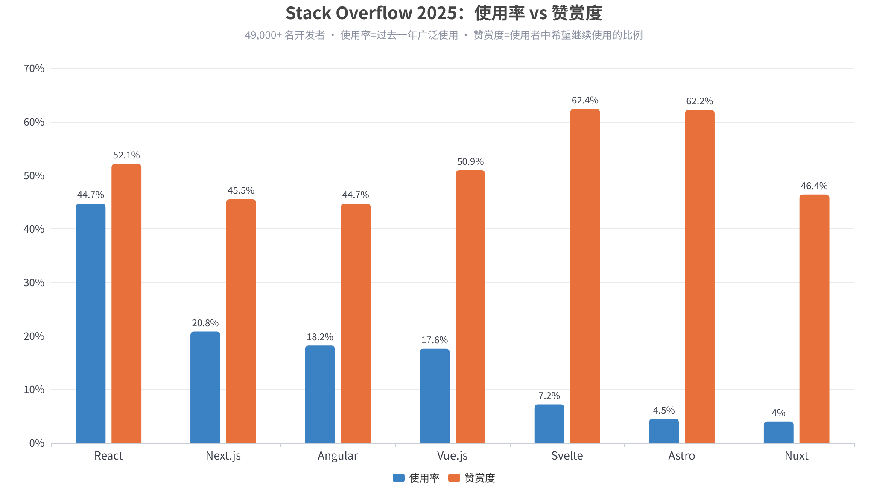
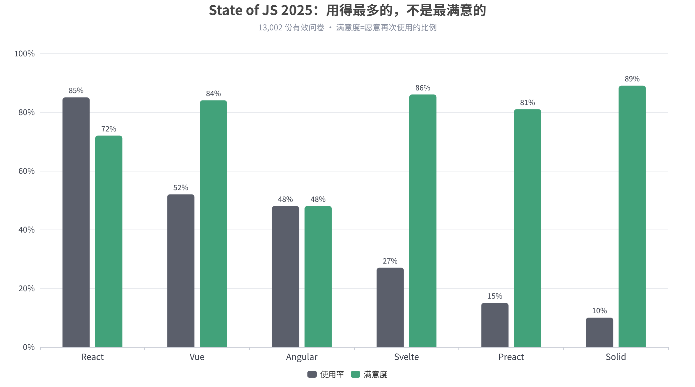
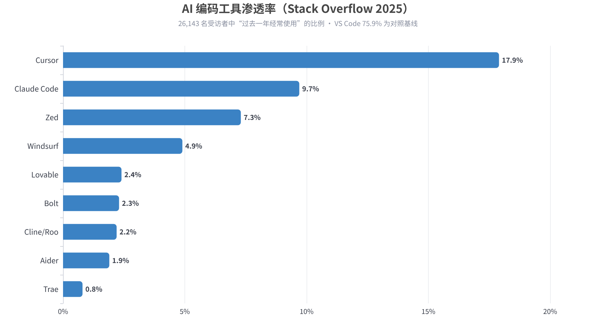
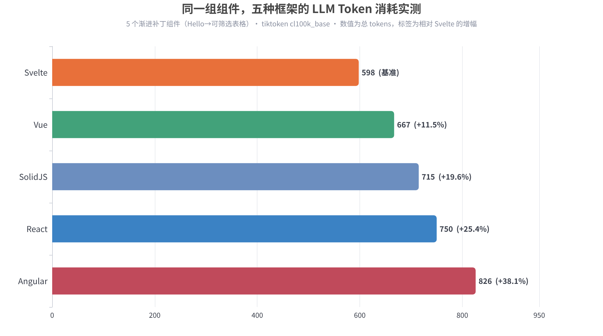
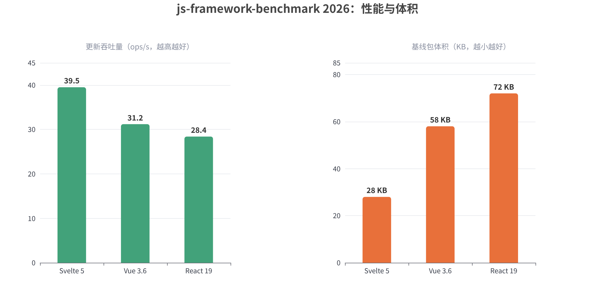
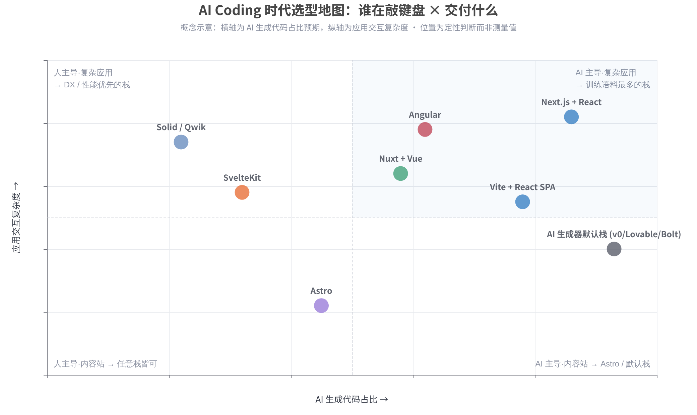

# AI Coding 时代的网页前端技术栈选型：全方位比较与决策指南（2026）

> 数据截至 2026 年 9 月。本报告基于 Stack Overflow 2025 开发者调查（49,000+ 受访者）、State of JS 2025（13,002 份问卷）、GitHub Octoverse 2025、State of CSS 2025、WebDev Arena 基准及多组 2026 年实测数据撰写，所有关键数据均附内联来源。

## 执行摘要

AI Coding 的普及没有推翻前端技术栈的基本格局，但**重排了选型维度的权重**。2025–2026 年的核心事实是：Cursor、Claude Code、GitHub Copilot 等工具已承担许多团队 **30%–60% 的前端代码产出**，而 AI 模型对不同框架的"熟练度"差异悬殊——这取决于各框架在训练语料中的占比、代码的 token 效率、类型系统的护栏强度，以及 AI 生成工具链默认输出什么。结果是选型逻辑从"哪个框架最好"变成了三个新问题：**谁在敲键盘（人还是模型）、模型最熟悉什么、同样的代码喂给模型要花多少 token**。

综合全部维度，本报告的核心结论如下表所示。**没有单一"赢家"，但存在清晰的"默认答案"与"偏离默认所需的正当理由"**。

| 维度 | 第一梯队选择 | 关键依据 |
|---|---|---|
| AI 生成可靠性 | **React + Next.js** | 训练语料最大；WebDev Arena 等主流 AI 评测环境仅支持 Next.js/React（[LMArena](https://lmarena.github.io/blog/2025/webdev-arena/)）；约 78% 的新 React 应用使用 Next.js（[Intuz](https://www.intuz.com/best-frontend-frameworks/)） |
| Token 效率 | **Svelte > Vue > Solid > React > Angular** | 同组件实测：Svelte 598 tokens 为基准，Angular 高出 **38.1%**（[Hackernoon](https://hackernoon.com/we-measured-the-llm-token-cost-of-5-frontend-frameworks-angular-costs-38percent-more-than-svelte)） |
| 开发者满意度 | **Solid 89% / Svelte 86% / Vue 84%** | State of JS 2025 满意度；React 仅 72%、Angular 48%（[tkrotoff 汇编](https://gist.github.com/tkrotoff/b1caa4c3a185629299ec234d2314e190)） |
| 市场规模与招聘 | **React 一骑绝尘** | SO 2025 使用率 44.7%；全球前端岗位占比约 60%–74%（[Stack Overflow](https://survey.stackoverflow.co/2025/technology), [Kanopy](https://kanopylabs.com/blog/angular-vs-react-vs-vue-enterprise-apps)） |
| 语言基座 | **TypeScript（strict）** | 2025 年 8 月成为 GitHub 第一语言（月贡献者 264 万，+66%）；94% 的 LLM 编译错误是类型检查失败（[MG Software](https://www.mgsoftware.nl/en/blog/typescript-overtakes-python-as-most-used-language-on-github), [Techbytes](https://techbytes.app/posts/typescript-overtakes-python-github-2025/)） |
| 样式/组件 | **Tailwind CSS v4 + shadcn/ui** | State of CSS 2025 框架第一；v0/Cursor/Bolt/Lovable 全部默认生成该组合（[Pangea](https://pangea.app/glossary/shadcn-ui)） |
| 构建工具 | **Vite**（Next.js 内为 Turbopack） | 2025 年 7 月 npm 周下载量超越 Webpack（[TechnologyChecker](https://technologychecker.io/technology/vite)） |
| 内容型站点 | **Astro** | 同内容站点主包 14KB vs Next.js 67KB；团队 2026 年 1 月并入 Cloudflare（[EOX Scriptum](https://eoxscriptum.com/blog/nextjs-vs-sveltekit-vs-astro-headless-cms-comparison-2026), [Coding Capybaras](https://codingcapybaras.com/blog/nextjs-vs-remix-vs-astro-2026)） |

一句话建议：**AI 主导产出、需要快速交付与招聘 → React + Next.js + TypeScript + Tailwind + shadcn/ui 是 2026 年的"默认栈"；人类高手在环、追求 DX 与性能 → Svelte/SvelteKit 或 Vue/Nuxt 回报更高；内容站 → Astro；强规范大型企业 → Angular；国内团队 → Vue 3 生态依然是最务实的选择**。偏离默认栈需要具体理由，而不是因为新框架更有意思。

---

## 一、范式转移：AI Coding 如何改写前端选型逻辑

### 1.1 从"哪个框架最好"到"谁在敲键盘"

三年前，前端选型的问题框架是"React 还是 Vue 还是 Svelte"；到 2026 年，这个问法几乎失去意义——**真正的选择是先选渲染模型，框架只是渲染模型的载体**（[ChaosAndOrder](https://www.youngju.dev/blog/culture/2026-05-16-frontend-frameworks-react-vue-svelte-solid-qwik-astro-htmx-next-nuxt-angular-tailwind-2026-deep-dive.en)）。虚拟 DOM 协调（React 19）、细粒度信号响应式（Solid 2、Svelte 5 runes、Vue 3.6 Vapor、Angular signals）、可恢复性（Qwik 2）、岛屿架构（Astro 5）与 HTML-over-the-wire（HTMX 2）五条技术路线各有明确的适用域，而 2025–2026 年间的 React Compiler GA、Vue Vapor 转正、Next.js 16 PPR 稳定、Remix 并入 React Router 7 等事件，又让各路线之间的体验差距大幅收窄。

更深刻的变化在于"键盘"的归属。一篇被频繁引用的 2026 年选型文章把决策归结为一个问题：**你的团队里谁在敲键盘？** 如果人类工程师强大且始终在环，SvelteKit 是礼物——最好的 DX、最精简的产出、最少的框架噪音；如果模型在承担主要产出（vibe coding、团队非前端背景、需要快速交付与快速招聘），React + Next.js 是唯一理性的默认——"不是因为它在真空中更好，而是因为 AI 已经读过十年的 React，只读过一个季度的现代 Svelte"（[Skcript](https://www.skcript.com/blog/react-vs-nextjs-vs-svelte)）。这个判断在本报告后续各维度中会得到数据层面的反复印证。

值得强调的是，AI 编码的渗透已经到了必须当作"一等约束"而非加分项的程度。Intuz 的 2026 年生产环境指南估计，**许多团队中 AI 工具正在编写 30%–60% 的前端代码**，且 React/Next.js 因训练语料最大而受益最多，形成复利优势（[Intuz](https://www.intuz.com/best-frontend-frameworks/)）。当一半代码由模型生成时，"模型写哪种代码更少出错"就不再是锦上添花，而是直接决定返工率、审查成本与线上事故率的核心变量。

### 1.2 默认栈收敛与训练语料飞轮

AI 时代最反直觉的现象是：**工具越多样，产出越同质**。几乎所有主流 AI 应用构建器都收敛到同一个技术组合——v0 自始至今**只**生成 React + Next.js + Tailwind + shadcn/ui；Lovable 的文档化默认栈是 React + Vite + Tailwind + shadcn + Supabase；Bolt.new 理论上框架无关，实际默认输出 Vite + React 或 Next.js；Google AI Studio 的 Build 模式同样以 React 为默认前端（[Saschb2b](https://saschb2b.com/blog/llm-default-react-stack), [Webtwizz](https://webtwizz.com/blog/what-ai-app-builders-actually-use-under-the-hood)）。甚至出现了给这套组合命名的情况：TRAINS（Tailwind v4 + React 19 + AI + Next.js 16 + Shadcn/ui）作为"AI 增强开发"的标准脚手架在 2026 年被正式提出（[GitHub](https://github.com/JimFlannery/tailwind-react-ai-nextjs-shadcn/blob/main/README.md)）。

收敛的机制是一个自我强化的飞轮。v0 把 shadcn/ui 从"流行组件库"变成了"AI 生成界面的默认标准"：更多开发者使用 v0 → 产生更多 shadcn/ui 代码 → 训练出更擅长生成 shadcn/ui 的模型 → AI 生成质量进一步提高（[Vibecoder](https://blog.vibecoder.me/shadcn-ui-component-library-ai-development)）。shadcn/ui 的"复制源码进项目"模式与 AI 的工作方式天然契合：当用户要求"把按钮改大并加加载动画"时，AI 可以直接编辑项目里的 `components/ui/button.tsx`；而面对 Material UI 这类黑盒依赖，AI 必须记忆版本相关的 API 与主题覆盖机制，训练数据稍有过期就会生成无法运行的代码（[Vibecoder](https://blog.vibecoder.me/shadcn-ui-component-library-ai-development), [Pangea](https://pangea.app/glossary/shadcn-ui)）。这一机制解释了为什么"组件库的所有权形态"在 AI 时代第一次成为选型变量。

### 1.3 新权重：Token 经济学、类型护栏与可验证性

AI Coding 给选型公式加入了三个传统对比文章从不讨论的变量。**第一是 token 成本**：喂给模型的每一行代码都消耗 token——token 是金钱、是延迟，更是上下文窗口的占用；当你让 Claude 或 GPT"修复这个 React 组件"时，请求中约 30%–60% 是代码本身，代码量翻倍意味着模型能容纳的周边上下文减半（[Hackernoon](https://hackernoon.com/we-measured-the-llm-token-cost-of-5-frontend-frameworks-angular-costs-38percent-more-than-svelte)）。框架语法的"冗长度"由此第一次有了美元标价。**第二是类型护栏**：GitHub Octoverse 2025 显示 TypeScript 于 2025 年 8 月超越 Python 与 JavaScript 成为平台第一语言，核心动因正是静态类型为 AI 生成代码提供了编译期护栏——一项 2025 年的学术研究甚至发现 **94% 的 LLM 生成代码编译错误是类型检查失败**（[MG Software](https://www.mgsoftware.nl/en/blog/typescript-overtakes-python-as-most-used-language-on-github), [Techbytes](https://techbytes.app/posts/typescript-overtakes-python-github-2025/)）。

**第三是可验证性与可约束性**：框架是否容易被自动化检查（strict typecheck、bundle size budget、ESLint 规则）约束，决定了 AI 产出能否在 CI 中被低成本地"守门"。2026 年的团队普遍在 CI 中增加更严格的 typecheck 与包体积预算，因为 AI 生成代码推高了类型与 lint 错误率（[黑豹](https://www.heibaos.com/post/369563007320074/frontend-framework-comparison-2026)）。与此同时，AGENTS.md / CLAUDE.md / .cursor/rules 等"给 AI 读的项目说明书"成为跨工具标准，仓库对 AI 的"可指导性"（是否有清晰的架构规则、可复制的命令、明确的禁区）开始直接影响 AI 在该技术栈上的产出质量（[VibeCoding.app](https://vibecoding.app/blog/agents-md-guide), [The Prompt Shelf](https://thepromptshelf.dev/blog/agents-md-vs-claude-md-vs-cursorrules-three-way-2026)）。选型的对象因此从"框架"扩大为"框架 + 类型 + 工具链 + AI 可读性"的完整系统。

---

## 二、市场格局：数据里的 2026 前端版图

### 2.1 使用率与满意度：两条曲线的背离

Stack Overflow 2025 开发者调查（49,000+ 受访者）给出的使用率排序毫无悬念：**React 44.7%** 居首，其后依次是 jQuery 23.4%（遗产代码的体量证明）、Next.js 20.8%、Angular 18.2%、Vue.js 17.6%、Svelte 7.2%、Astro 4.5%、Nuxt 4.0%（[Stack Overflow](https://survey.stackoverflow.co/2025/technology)）。但同一份调查的"赞赏度"（Admired，即使用者中希望继续使用的比例）呈现出几乎反转的排序：**Svelte 62.4% 最高**，Astro 62.2% 次之，React 52.1%、Vue 50.9% 居中，Angular 44.7% 垫底（[tkrotoff 汇编](https://gist.github.com/tkrotoff/b1caa4c3a185629299ec234d2314e190)）。使用率与满意度的系统性背离是理解 2026 年格局的关键：React 的统治是生态与招聘的统治，不是体验的统治。

State of JS 2025（2026 年 2 月发布，13,002 份问卷）在更偏前端专业的样本中确认了同一模式：**React 使用率 85% 但满意度仅 72%；Vue 52%/84%；Angular 48%/48%；Svelte 27%/86%；Solid 10%/89%**（[tkrotoff 汇编](https://gist.github.com/tkrotoff/b1caa4c3a185629299ec234d2314e190)）。Angular 48% 的满意度在所有主流框架中垫底且连续多年低迷，解释了为何它在新建项目中的份额持续被侵蚀，仅靠企业存量维持。Svelte 与 Solid 的"高满意、低使用"组合则说明：阻碍它们的从来不是技术体验，而是生态厚度与招聘市场——而这恰恰是 AI 时代可能改写的变量。

### 2.2 npm 与 GitHub：生态规模量化

npm 下载量是生态规模最硬的指标。2026 年各来源的口径虽有差异，但数量级一致：**React 周下载量约 2,400 万–4,000 万次**，Vue 约 600 万次，Svelte 约 110 万–180 万次（[MG Software](https://www.mgsoftware.nl/en/tools/best-frontend-frameworks), [ZTABS](https://ztabs.co/compare/svelte-vs-react), [Fueldigi](https://www.fueldigi.com/react-vs-vue-vs-svelte-comparison-web-development-in-chennai/)）。React 对 Vue 的下载量比约 4–6 倍、对 Svelte 约 20 倍；GitHub Star 数 React 约 23.8 万、Vue（vuejs/core）约 20.8 万、Svelte 约 8 万–8.75 万（[ZTABS](https://ztabs.co/compare/svelte-vs-react), [Tech Duel](https://www.tech-duel.com/compare/svelte-vs-vue/)）。另一组常被引用的事实是：npm 上以 React 为前提的包数量是 Vue 的五倍以上（[李文康](https://www.liwenkang.space/blog/2026%E5%89%8D%E7%AB%AF%E6%8A%80%E6%9C%AF%E9%80%89%E5%9E%8B%E5%AF%B9%E6%AF%94)）。

这些数字在 AI 语境下有了新的读法：**下载量 ≈ 训练语料量 ≈ AI 生成可靠性**。Stack Overflow 2025 同时显示 TypeScript 使用率已达 43.6%（同比 +2.5%），而 GitHub 侧的数据更激进——TypeScript 月活跃贡献者 2,636,006，超过 Python 约 4.2 万登顶；GitHub 官方分析将其归因于"类型契约为 AI 辅助团队提供安全网"，并指出**几乎所有主流前端框架（Next.js 15、Nuxt 4、SvelteKit 2、Astro、Angular、Qwik、SolidStart、Remix）现在默认以 TypeScript 脚手架生成项目**（[Techbytes](https://techbytes.app/posts/typescript-overtakes-python-github-2025/), [MeteoraWeb](https://meteoraweb.com/en/news/github-octoverse-2025-typescript-takes-the-top-spot-as-developers-are-surrounded-by-ai-agents)）。生态规模、类型化与 AI 熟练度三者已经缠绕成同一根绳索。

### 2.3 AI 工具渗透率：编码入口的迁移

要理解"AI Coding 时代"的选型，必须先看清 AI 工具本身的渗透格局。Stack Overflow 2025 首次将 AI 编码编辑器纳入调查：**Cursor 以 17.9% 的经常使用率领跑，Claude Code 9.7% 次之**，其后是 Zed 7.3%、Windsurf 4.9%，以及应用生成器类的 Lovable 2.4%、Bolt 2.3%；作为对照，VS Code 仍以 75.9% 居绝对主导（[Stack Overflow](https://survey.stackoverflow.co/2025/technology)）。同一调查中，54.1% 的开发者用 AI 寻找解决方案，但只有 3.1% 完全信任 AI 的准确性（[TechRecruiting](https://techrecruiting.io/en/stack-overflow-developer-survey-2025/)）——**高渗透、低信任**的组合，正是"框架 + 类型 + 测试"这些机器可验证护栏变得重要的社会背景。

GitHub 侧的宏观数据补充了增长斜率：平台 2025 年新增 3,600 万开发者（每秒约 1 人），**80% 的新开发者在注册第一周就使用 Copilot**；超过 110 万个公开仓库引用了 LLM SDK（同比 +178%），生成式 AI 相关仓库达 430 万个（[WebProNews](https://www.webpronews.com/github-octoverse-2025-630m-repos-ai-fuels-developer-surge/), [老布](https://www.laobu.com/ai/blog/20251224_github_octoverse_2025.html)）。编码入口正在从"编辑器 + 文档"迁移到"编辑器 + Agent + 规则文件"，技术栈是否适配这个新入口，直接决定了团队能从这个浪潮中兑现多少生产力。

---

## 三、AI 友好度：新时代的第一比较维度

### 3.1 训练语料与生成可靠性

AI 友好度的第一性原理很朴素：**模型生成某框架代码的可靠性，与该框架在公开语料中的规模与一致性正相关**。React/Next.js 拥有最大的训练语料，AI 工具生成 React 代码的准确率最高；Vue 与 Svelte 的语料更小但一致性更高——框架本身更有主见（opinionated），写法变体少，幻觉空间反而更小；Astro 与 Qwik 语料有限，AI 工具在新 API 上更容易犯错，需要更多人工修正（[Intuz](https://www.intuz.com/best-frontend-frameworks/)）。WebDev Arena 的设计选择为此提供了一个隐喻式的证据：这个 LMArena 旗下、累计 80,000+ 社区投票的真实 Web 开发评测平台，**其评测环境被刻意限定为 Next.js 的 React 应用**——Vue、Svelte 等框架被官方列为"当前约束之外"的范围（[LMArena](https://lmarena.github.io/blog/2025/webdev-arena/), [Arena.ai](https://arena.ai/blog/webdev-arena)）。当评测机构测量"AI 的 Web 开发能力"时，它们测量的实际上就是"AI 的 React/Next.js 能力"。

另一面同样真实：语料规模只能保证"大概率能跑"，不能保证"写法现代"。React 语料横跨十余年，类组件、老 Hooks 模式与 RSC 并存，模型可能给出过时模式；而 Svelte 5 runes 这类 2024 年底才定型的 API，语料薄、出错率更高——这就是 Skcript 所说的"AI 只读过一个季度的现代 Svelte"（[Skcript](https://www.skcript.com/blog/react-vs-nextjs-vs-svelte)）。实践中出现了明确的补偿手段：为 Agent 配置"只用 runes"的规则集、收紧设计系统约束、对模型产出做全量人工审查——选择非默认栈的团队实际上是在支付一笔"AI 适配税"，换取 DX 与性能的长期收益。值得注意的是，中文社区 2026 年的一项开发者调研（N=80）显示，Cursor、通义灵码、Copilot 对 React TSX 与 Vue SFC 的补全质量差距已缩小至 10% 以内，提示该差距正在快速收敛、不应作为唯一决策依据（[黑豹](https://www.heibaos.com/post/369563007320074/frontend-framework-comparison-2026)）。

### 3.2 Token 成本实测：框架语法的美元标价

2026 年 6 月发表的"The Tokenomics of Web Development"系列首次系统测量了框架语法的 token 成本：用 5 个从平凡到非平凡的组件（Hello、计数器、Todo、带加载态的数据获取、可筛选排序表格），以 tiktoken `cl100k_base` 编码统计各框架惯用写法的总 token 数。结果如下——**Svelte 598 tokens 最省，Vue 667（+11.5%），SolidJS 715（+19.6%），React 750（+25.4%），Angular 826（+38.1%）**（[Hackernoon](https://hackernoon.com/we-measured-the-llm-token-cost-of-5-frontend-frameworks-angular-costs-38percent-more-than-svelte)）。

机制解释与数据同样重要。Svelte 和 Vue 省 token 是因为**编译器承担了响应式的簿记工作**——你写 `count++`，编译器生成响应式管线；React 和 Solid 要求你手写这些管线（`setCount(count + 1)`、`createSignal`、`useEffect`），重复代码直接体现为 token。Angular 的冗长是结构性的：每个组件都携带 `@Component({ standalone: true, imports: [...], template: ... })` 装饰器元数据，这些对工具有用的信息冗余，对 token 却是纯粹的税（[Hackernoon](https://hackernoon.com/we-measured-the-llm-token-cost-of-5-frontend-frameworks-angular-costs-38percent-more-than-svelte)）。换算成钱：在 100 万 token 的代码库规模上，Angular 相对 Svelte 的"冗长税"约为 Claude Sonnet 每次全量喂入 +$1.14、Opus 4 +$5.72；一个 200 组件的中型项目，Angular 与 Svelte 的代码量差约 8 万 tokens——这直接决定项目能否整个塞进长上下文模型。

但该系列同时给出了两个必要的提醒。其一，**排名在单个样本上会翻转**：SolidJS 在数据获取样例中凭 `createResource`（一个原语折叠 loading/error/data 三态）击败 Svelte——不存在普适赢家，只有针对特定代码模式的赢家；异步数据密集的代码库中 Solid 的优势真实存在，表单与模板密集的代码库中 Svelte 的领先会扩大（[Hackernoon](https://hackernoon.com/we-measured-the-llm-token-cost-of-5-frontend-frameworks-angular-costs-38percent-more-than-svelte)）。其二，系列第二篇测量语言维度时发现 **TypeScript 类型标注本身也有约 +63% 的 token 溢价**——类型护栏与 token 成本之间存在真实张力。工程上的正解不是放弃类型，而是把类型当作"错误检测器"而非"喂给模型的上下文"：用 strict typecheck 在 CI 中守门，用精确的接口定义减少模型猜测，同时控制喂入上下文的代码切片粒度。

### 3.3 AI 应用构建器的默认栈解剖

AI 应用构建器（prompt-to-app）是 2025–2026 年前端生产关系变化最大的品类，也是观察"产业默认栈"的最佳切片。下表汇总三大主流构建器 2026 年中的实际输出栈：

| 工具 | 前端输出 | 后端/数据 | 定位与注意点 |
|---|---|---|---|
| **v0（Vercel）** | Next.js App Router + RSC + Tailwind + shadcn/ui，2026 年 2 月起支持全栈（API 路由、Server Actions、数据库连接）（[BuildThisNow](https://www.buildthisnow.com/blog/tools/extensions/bolt-vs-lovable-vs-v0)） | Supabase/Neon/Upstash 经 Vercel Marketplace 接入 | UI 质量三者最佳；与 Vercel/Next.js 深度耦合；Premium $20/月，按 credit 计费（[Stackmaven](https://stackmaven.io/tools/v0/)） |
| **Lovable** | React + Vite + Tailwind + shadcn/ui（固定组合，不支持 Vue/Svelte/Next.js）（[Till Freitag](https://till-freitag.com/en/blog/lovable-vs-bolt-vs-v0-en)） | Supabase 默认，或 Lovable Cloud | 面向非技术创始人；2025 年 ARR 达 3 亿美元、估值 66 亿美元（[汇智网](https://vibe.hubwiz.com/article/vibe-coding-tools)）；历史上 Supabase 表默认不开 RLS，生产化需安全加固（[BuildThisNow](https://www.buildthisnow.com/blog/tools/extensions/bolt-vs-lovable-vs-v0)） |
| **Bolt.new** | WebContainers 浏览器内运行真实 Node.js，框架可按需指定（Next.js、Vite、Astro、SvelteKit 均可），实际默认 React 系（[Webtwizz](https://webtwizz.com/blog/what-ai-app-builders-actually-use-under-the-hood)） | 自带薄后端层，可接 Supabase | 灵活度最高但浏览器沙箱有上限；代码质量评级中等，生产前需审查（[汇智网](https://vibe.hubwiz.com/article/vibe-coding-tools)） |

放眼更大的 vibe coding 版图，运行时栈的收敛更加明显：前端 React 或 Next.js，后端 Supabase 或 Firebase，支付 Stripe，身份 Clerk/Auth0/Supabase Auth，AI 能力 OpenAI/Anthropic，托管 Vercel/Cloudflare/Replit——五类工具（Cursor、Lovable、Bolt、v0、Replit Agent）在这套组合上几乎完全一致（[Cybersecify](https://cybersecify.com/blog/pentest-checklist-vibe-coded-saas-cursor-lovable-bolt/)）。对选型者而言，这意味着两件事：**选择这套栈，等于让整条 AI 工具链为你免费打工**；反之，选择栈外技术（如 Angular、Java 后端），等于主动放弃这条流水线的杠杆。

同样需要直视的是默认栈的批评声音。教育界知名作者 Maximilian Schwarzmüller 在"AI Has A Favorite Tech Stack. That's A Problem!"中主张：LLM 的默认栈偏好正在削弱框架竞争与创新多样性，新项目被引力拉回同一组合，与"这项技术是否最适合这个问题"无关（[Saschb2b](https://saschb2b.com/blog/llm-default-react-stack)）。GitHub Octoverse 2025 的数据从侧面印证了这一"便利循环"：近 80% 的新仓库只使用六种核心语言（Python、JavaScript、TypeScript、Java、C++、C#）（[Ahmed Atoui](https://ahmedatoui.com/en/articles/github-octoverse-2025-ai-repositories)）。**默认栈是理性个体的局部最优，却可能是生态整体多样性的税**——这是每一个 2026 年的选型者应当知情的权衡。

### 3.4 AI 工程化配套：AGENTS.md、llms.txt 与"可被指导的仓库"

AI 时代的第三个新议题是：技术栈选定后，仓库本身是否"对 AI 友好"。截至 2026 年中，**AGENTS.md 已成为跨工具的 Markdown 配置公约**，被 Claude Code（经 import）、Codex CLI、Gemini CLI、OpenCode、Cursor 原生读取；Claude Code 自家的 CLAUDE.md 支持四级作用域（企业托管策略、用户全局、项目级、本地级）与子目录懒加载，Anthropic 官方建议单文件不超过 200 行——更长会降低遵循率（[The Prompt Shelf](https://thepromptshelf.dev/blog/agents-md-vs-claude-md-vs-cursorrules-three-way-2026), [VibeCoding.app](https://vibecoding.app/blog/agents-md-guide)）。经验法则是约 70% 的规则会被遵循，真正的红线必须靠 hooks 与权限系统做硬阻断，而非自然语言请求。

文档侧的变化同样深刻。llms.txt（2024 年 9 月由 Answer.AI 联合创始人 Jeremy Howard 提出）已成为文档站面向 AI 读者的事实标准——它告诉 LLM 该读什么、按什么优先级读；2025 年起 LLM 对文档的段落级索引成为常态，文档结构（小标题、代码块、表格）直接决定 AI 回答的准确性，"文档是新的分发渠道"（[Mintlify](https://www.mintlify.com/blog/ai-documentation-trends-whats-changing-in-2025)）。需要澄清的是，截至 2026 年 Q1，OpenAI、Google、Anthropic、Meta 均未承诺在生产系统中读取 llms.txt，Google 2025 年 12 月曾短暂在 Search Central 文档站上线该文件又悄然移除；其最确定的价值场景是开发者工具链——Cursor、Copilot、Claude 实时抓取文档时减少 token 浪费（[Derivatex](https://derivatex.agency/blog/llms-txt-guide/), [Cloudex](https://cloudexmarketing.com/blogs/llms-updates-and-key-takeaways/)）。对框架与组件库的维护者而言，"是否提供 AI 可读的文档与规则文件"正在成为生态竞争力的一部分；对选型者而言，一个框架的文档对 AI 越友好，团队用 AI 开发该框架的实际体验就越好——这是一个此前从未出现在任何对比表中的维度。

---

## 四、技术维度：性能、渲染模型与 2025–2026 关键更新

### 4.1 渲染模型：先选范式，再选框架

2026 年的技术选型应首先回答"要哪种渲染模型"，框架只是该模型的实现。五条主流路线如下表所示：

| 渲染模型 | 代表框架 | 核心机制 | 适用域 |
|---|---|---|---|
| 虚拟 DOM + 协调 | React 19、Preact | 内存中 diff，批量提交 DOM | 通用，生态最深；配合 RSC 可把数据层移到服务端（[MG Software](https://www.mgsoftware.nl/en/tools/best-frontend-frameworks)） |
| 细粒度信号响应式 | Solid 2、Svelte 5 runes、Vue 3.6 Vapor、Angular 19 signals | 编译期/运行期建立依赖图，精确更新 | 性能敏感、高频更新场景；2025–2026 年已成为各框架的共同方向（[ChaosAndOrder](https://www.youngju.dev/blog/culture/2026-05-16-frontend-frameworks-react-vue-svelte-solid-qwik-astro-htmx-next-nuxt-angular-tailwind-2026-deep-dive.en)） |
| 可恢复性 | Qwik 2 | 服务端序列化状态，客户端"续跑"而非重跑 | 极致 TTI 场景；约 1KB 可交互包（[Nunuqs](https://www.nunuqs.com/blog/react-vs-vue-vs-svelte-vs-qwik-2026-framework-comparison-saas-teams)） |
| 岛屿架构 | Astro 5、Fresh | 默认零 JS，仅水合交互岛屿 | 内容站、营销页、文档（[Coding Capybaras](https://codingcapybaras.com/blog/nextjs-vs-remix-vs-astro-2026)） |
| HTML-over-the-wire | HTMX 2、Hotwire | 服务端返回 HTML 片段 | 交互轻、后端主导的系统 |

从落地路径看，渲染模型的选择往往由内容形态反向决定：内容为主、交互为点缀的页面（文档、博客、营销站）天然属于岛屿架构与 HTML-over-the-wire；交互密度高、状态复杂的应用（仪表盘、协作工具、设计器）则属于虚拟 DOM 与信号阵营；介于其间的电商、内容社区等混合形态，正是 Next.js PPR、SvelteKit 混合渲染、Astro 岛屿 + 客户端路由等"逐段决策"方案争夺的地带。AI 生成器默认输出 React/Next.js 的事实（见 3.3 节）也强化了这一点——当你的主要"生产者"是模型时，选择的实际上不是一个渲染模型，而是模型最熟悉的那条路径及其全部生态惯性。

信号化是这五年最重要的收敛趋势：Vue 的 Vapor、Svelte 的 runes、Angular 的 signals、Solid 的基因，本质上都是"绕开虚拟 DOM、精确投递更新"。React 阵营的回答则是 React Compiler——不改编程模型，用编译器自动完成 memoization。两条路线的竞争在 2026 年仍未分出胜负，但**"框架替你优化"已取代"你自己优化"成为默认预期**，这对 AI 生成代码尤其友好：AI 写出的朴素代码在信号框架或 Compiler 下自动获得接近手写优化的性能，人工性能调优的权重下降。

### 4.2 性能与体积实测

在 js-framework-benchmark 2026 年数据中，**Svelte 5 以 39.5 ops/s 领先，Vue 3.6 为 31.2，React 19 为 28.4——最快与最慢之间约 39% 的差距**；基线包体积同向分化：Svelte 28KB、Vue 58KB（Vapor 模式下可降至 10KB 以下）、React 72KB；Lighthouse 分数则咬得很紧（96/94/92）（[ByteIota](https://byteiota.com/react-19-vs-vue-3-6-vs-svelte-5-2026-framework-convergence/)）。VueConf US 2026（5 月，亚特兰大）正式将 Vue 3.6 Vapor Mode 出货为稳定的可选编译目标——逐组件以 `<script setup vapor>` 开启，同一应用内虚拟 DOM 与 Vapor 组件可混存；厂商微基准宣称运行时包缩减约 50%、内存降低 30%、热路径更新快 2–3 倍，而首批生产遥测更诚实地落在**真实世界 TTI 改善 15%–25%**（[ScriptWalker](https://scriptwalker.app/blog/vueconf-us-2026-vue-3-6-vapor-mode-stable-atlanta)）。

元框架层面的差异同样可测。对同一套 Headless CMS 内容（1,000 页）的构建测试显示：**Astro 平均构建 12.3 秒、主包 14KB、FCP 0.8s；SvelteKit 18.7 秒、28KB、1.1s；Next.js 24.1 秒、67KB、1.4s**——Astro 的岛屿架构在内容场景优势明确，Next.js 因携带 React 运行时即使静态内容也更大（[EOX Scriptum](https://eoxscriptum.com/blog/nextjs-vs-sveltekit-vs-astro-headless-cms-comparison-2026)）。独立的 Lighthouse 移动实测（12 页营销站 + 交互组件）给出 Astro 99 / SvelteKit 97 / Next.js 92 的性能分与 0.9s / 1.1s / 1.4s 的 LCP（[Kanopy](https://kanopylabs.com/blog/astro-vs-sveltekit-vs-nextjs-framework-comparison)）。结论不是"React/Next.js 慢"，而是**性能余量已成为可购买的商品**：为这份余量支付的货币是生态厚度与 AI 语料。对企业级内部系统，React 的 72KB 基线可以忽略；对 3G 网络下的移动端电商结账页，Svelte 的 39% 速度与 2.5 倍体积优势就是真金白银（[ByteIota](https://byteiota.com/react-19-vs-vue-3-6-vs-svelte-5-2026-framework-convergence/)）。

### 4.3 各框架 2025–2026 关键动态

**React** 的两件大事是 19 系列定型与 Compiler 转正。React 19（2024 年 12 月稳定）把 Server Components、Actions、乐观更新带入主线；React Compiler 在 Instagram.com 生产环境中将重渲染削减 25%–40%，但独立测试提醒它并非银弹——有开发者报告十个重渲染问题中只有两个被自动修复，且 Compiler 严格假设代码遵循 React 规则，直接突变对象等在旧代码中"能跑"的写法会暴露为真实 bug（[ByteIota](https://byteiota.com/react-19-vs-vue-3-6-vs-svelte-5-2026-framework-convergence/), [LogRocket](https://blog.logrocket.com/react-compiler-memoization-what-actually-broke/)）。Next.js 16（2025 年 10 月）将 Turbopack 设为默认打包器（构建提速 2–5 倍）并稳定了 PPR；Remix 则已并入 React Router v7，"2026 年再谈用 Remix"通常指的是 React Router v7 的框架模式（[Coding Capybaras](https://codingcapybaras.com/blog/nextjs-vs-remix-vs-astro-2026)）。

**Vue** 的 Vapor Mode 已在 4.2 节详述；配合 `<script setup>` 与 `defineModel` 稳定后的父子通信简化，Vue 3.x 的 DX 口碑继续走高，中文社区评价其配合 Volar 的 IDE 体验"已超过 React + VSCode 的原生体验"（[李文康](https://www.liwenkang.space/blog/2026%E5%89%8D%E7%AB%AF%E6%8A%80%E6%9C%AF%E9%80%89%E5%9E%8B%E5%AF%B9%E6%AF%94)）。**Svelte 5** 的 runes（`$state`/`$derived`/`$effect`）用显式信号替换了隐式响应式，实现了组件内、store、工具函数中通用的响应式能力，官方演示可约 100 毫秒挂载 10 万组件（[ByteIota](https://byteiota.com/react-19-vs-vue-3-6-vs-svelte-5-2026-framework-convergence/)）。**Angular** 在 signals 稳定后响应式性能与 React/Vue 差距已不大，其真正卖点回到强约束——依赖注入、路由、HTTP、表单全内置，百人团队代码风格可保持高度一致（[李文康](https://www.liwenkang.space/blog/2026%E5%89%8D%E7%AB%AF%E6%8A%80%E6%9C%AF%E9%80%89%E5%9E%8B%E5%AF%B9%E6%AF%94)）。**Astro** 的团队于 2026 年 1 月被 Cloudflare 收购，其未来与 Cloudflare 边缘平台绑定（[Coding Capybaras](https://codingcapybaras.com/blog/nextjs-vs-remix-vs-astro-2026)）。

---

## 五、企业与人才维度

### 5.1 全球招聘市场：React 的"安全垫"

框架是技术选择，更是人才市场选择。2026 年的全球数据高度一致：**React 出现在约 60%–74% 的前端岗位中**（印度约 60%，美国/欧洲产品公司 65%–70%，LinkedIn 2026 年 Q3 职位数据约 74%），Angular 约 20%–38%，Vue 约 10%–18%，Svelte 小而增长（[CarrerLens](https://www.carrerlens.com/blog/react-angular-vue-which-to-learn-2026), [Kanopy](https://kanopylabs.com/blog/angular-vs-react-vs-vue-enterprise-apps)）。区域样本进一步验证这一结构：德国 React 出现于约 70%–75% 的前端职位，Vue 在汉堡电商与媒体领域保有份额，Angular 集中在慕尼黑企业与汽车行业（[ReadyToDev](https://readytodev.pro/jobs/frontend-developer-in-germany)）；迪拜市场 React/Next.js 约占 65%、Vue 18%、Angular 15%（政府与银行）（[HireDeveloper.ae](https://hiredeveloper.ae/blog/hire-senior-frontend-developer-dubai-2026)）；印度 Naukri 上 React 岗位约为 Angular 的 2.5 倍、Vue 的 6 倍（[Rajesh Nair](https://rajeshrnair.com/blog/web-development/frontend/react-vs-angular-vs-vue-2026-india-frontend-choice.html)）。

薪酬与要求结构同样值得纳入决策。**TypeScript 已出现在 85% 以上的远程前端岗位要求中**，React + TypeScript 组合相对纯 JavaScript 候选人在中高级岗位有 10%–15% 的溢价（[RoamJobs](https://803631c6.roamjobs.pages.dev/guides/getting-hired/remote-frontend-developer-jobs), [ResumeOptimizerPro](https://resumeoptimizerpro.com/blog/frontend-developer-resume-examples)）。美国劳工统计局预测 2024–2034 年 Web 开发与数字设计岗位增长 7%、年均约 14,500 个空缺（[Coderio](https://www.coderio.com/software-development-news/guide-frontend-frameworks-2025/)）。对雇主的实操建议是"按能力招聘、按框架描述"：框架间概念高度互通（组件模型、状态、生命周期、响应式），一个强 Vue 工程师转 React 的生产力爬坡远快于一个平庸的 React 工程师变好——把框架写成岗位的上下文而非门槛（[Kore1](https://www.kore1.com/frontend-developer-job-description-template/)）。

### 5.2 中国市场的特殊性

中国前端市场有着与欧美不同的重力场：**Vue 生态的深度与中文资料、组件库供给、招聘市场形成了自洽闭环**。阿里巴巴、百度、小米等企业曾大规模部署 Vue，Vue 在亚太市场份额显著高于欧美（[Veroscale](https://veroscale.au/insights/astro-svelte-performance-benchmarks/)）。一则 2026 年 8 月的典型国内招聘需求可窥见国内事实栈：**Vue 3 + Composition API、Vue Router、Pinia、Axios、Element Plus / Ant Design Vue、Vite、TypeScript、ESLint/Prettier**，并偏好有 Vue 2 迁移维护经验者（[智联招聘](https://jobs.zhaopin.com/CCL1500077730J40877099413.htm)）。中文选型报告的建议也趋同：国内团队默认 Vue 3 + Nuxt 4，理由是学习曲线平缓、Vue 外包供给充足、中文文档丰富、与国产运行时兼容性好（[黑豹](https://www.heibaos.com/post/369563007320074/frontend-framework-comparison-2026), [李文康](https://www.liwenkang.space/blog/2026%E5%89%8D%E7%AB%AF%E6%8A%80%E6%9C%AF%E9%80%89%E5%9E%8B%E5%AF%B9%E6%AF%94)）。

但 AI Coding 正在松动这个闭环。国产 AI 编码工具（通义灵码、Trae 等）与全球工具共享同一个"React 语料最多"的底层事实；出海团队与全球化产品则更频繁地选择 Next.js——RSC 生态、Vercel 部署体验、国际 npm 包优先适配 React，适合英文内容与全球 CDN 场景（[黑豹](https://www.heibaos.com/post/369563007320074/frontend-framework-comparison-2026)）。此外，大型组织存量系统中微前端（qiankun 4.x、Module Federation 2.0）在 2026 年的大型门户项目仍然常见，实践建议是"壳应用 + 子应用同大版本框架"，避免双运行时把首屏 JS 推过 800KB（gzip 前）（[黑豹](https://www.heibaos.com/post/369563007320074/frontend-framework-comparison-2026)）。对国内团队的结论是：**存量与中后台系统继续 Vue 闭环；面向全球用户的新产品、重度依赖 AI 生成的项目，React/Next.js 的权重应显著上调**。

### 5.3 长期维护、迁移成本与治理

选型决策中最常被低估的是切换成本。行业估算是 **Nuxt ↔ Next 之间的业务代码几乎不可移植，切换等价于 60%–80% 的重写**——数据库、支付、邮件服务等数据层资产可以带走，框架层不能（[黑豹](https://www.heibaos.com/post/369563007320074/frontend-framework-comparison-2026), [Coding Capybaras](https://codingcapybaras.com/blog/nextjs-vs-remix-vs-astro-2026)）。这反过来抬高了"默认栈"的期权价值：选择 React/Next.js 意味着三年后仍然容易找到接手的人、容易买到现成的解决方案、容易被新一波 AI 工具优先支持。

治理维度在 AI 时代被显著放大。AI 生成代码推高了类型与 lint 错误率，2026 年的团队普遍在 CI 中加入更严格的 typecheck 与 bundle size budget（[黑豹](https://www.heibaos.com/post/369563007320074/frontend-framework-comparison-2026)）；架构纪律（目录结构、组件设计规则、状态归属、测试、可访问性、design token 规范）与框架本身同等重要——好框架无法补偿弱工程约定（[Coderio](https://www.coderio.com/software-development-news/guide-frontend-frameworks-2025/)）。一句被中文社区反复引用的话概括了这个立场：**"选型最大的风险不是选错框架，而是选了一个团队没能力维护、或三年后没人接手的框架"**（[李文康](https://www.liwenkang.space/blog/2026%E5%89%8D%E7%AB%AF%E6%8A%80%E6%9C%AF%E9%80%89%E5%9E%8B%E5%AF%B9%E6%AF%94)）。

---

## 六、配套栈：语言、样式、状态与构建

### 6.1 TypeScript：AI 时代的必选项

TypeScript 在 2026 年已不是"升级项"而是"默认基座"。三组事实构成完整证据链：其一，GitHub 数据——TypeScript 月贡献者 2,636,006（+66%），2025 年 8 月超越 Python 与 JavaScript 登顶；80% 新开发者第一周就用 Copilot，而类型系统让 Agent 辅助编码在生产环境更可靠（[Techbytes](https://techbytes.app/posts/typescript-overtakes-python-github-2025/), [Polomodov](https://polomodov.tech/en/book-cube/2-3-octoverse-2025-a-new-developer-joins-4240/)）。其二，机制——类型定义为 AI 提供约束：当 AI 知道函数期望一个具有特定字段的 User 对象时，生成质量显著提高；类型在编译期捕获 LLM 错误、作为活文档降低审查负担、在 AI 大面积改写时保障重构安全（[MG Software](https://www.mgsoftware.nl/en/blog/typescript-overtakes-python-as-most-used-language-on-github), [PulsarTech](https://pulsartech.news/en/articles/what-the-fastest-growing-tools-reveal-about-how-software-is-being-built-ml6wmgej)）。其三，框架默认——Next.js、Nuxt 4、SvelteKit 2、Astro、Angular、Qwik、SolidStart 全部默认生成 TypeScript 脚手架（[Techbytes](https://techbytes.app/posts/typescript-overtakes-python-github-2025/)）。

各框架的 TypeScript 成熟度仍有梯度：Angular 最强（框架自始以 TS 构建，DI 与装饰器围绕类型契约设计）；Next.js 内置 TS 支持并自动生成 tsconfig，RSC、API 路由、数据获取均有类型；React 本体依赖社区维护的 @types/react，架构层面的类型一致性需要团队纪律；Vue 3 以 TS 重写、组合式 API 与类型开发更契合；SvelteKit 默认脚手架为 TS，但生态中部分三方库的类型覆盖弱于 React/Angular（[Coderio](https://www.coderio.com/software-development-news/guide-frontend-frameworks-2025/)）。对把"类型成熟度"作为首要标准的团队——在 AI 时代这越来越是正确姿势——Angular 与 Next.js 提供最成型的类型工作流。一个值得注意的反向数据是类型标注约 +63% 的 token 溢价（见 3.2 节）：**类型的收益在 CI 与编译器，不必把整个类型宇宙都塞进每次对话的上下文**。

### 6.2 样式与组件库：Tailwind + shadcn/ui 的格局与隐忧

样式层的 AI 时代答案已经收敛：**Tailwind CSS 是默认，shadcn/ui 是 React 生态的组件默认**。State of CSS 2025 中 Tailwind 位列 CSS 框架第一（2,041 名受访者使用，领先 Bootstrap 的 1,194；采用率约 51%），npm 周下载量 2026 年初达约 3,000 万–3,640 万（v4 单版本单周 1,770 万）；v4.0（2025 年 1 月）的 Rust Oxide 引擎带来 5 倍全量构建、100 倍以上增量构建提速（[Programming Helper](https://www.programming-helper.com/tech/tailwind-css-2026-most-popular-css-framework-developers-python), [TechnologyChecker](https://technologychecker.io/technology/tailwindcss), [Matthew Wong](https://www.matthewswong.com/en/blog/tailwindcss-vs-css-modules/)）。按存量站点计 Bootstrap 仍以 46.55% 对 22.94% 领先，但两者间的迁移流向为 2.2:1 偏向 Tailwind（[TechnologyChecker](https://technologychecker.io/technology/tailwindcss)）。AI 亲和的机制很直接：utility class 是"就近、自包含、无级联"的文本模式，模型生成与修改都无需理解跨文件的 CSS 上下文——"为什么 LLM 对 Tailwind 上瘾"已有专文分析（[Saschb2b](https://saschb2b.com/blog/llm-default-react-stack)）。

但 2026 年 1 月发生的事件值得每个选型者记录：**Tailwind Labs 裁掉了 4 名工程师中的 3 名——AI 工具直接生成 Tailwind 代码、绕过文档站，导致文档流量下降 40%、公司收入骤降近 80%；48 小时内 Google AI Studio、Vercel、Lovable、Supabase 进场赞助**（[TechnologyChecker](https://technologychecker.io/technology/tailwindcss)）。这是 AI 时代开源可持续性的标志性案例：框架使用量创历史新高，商业化路径却被 AI 拦腰截断。对使用者的现实含义有二：开源项目本身健康（3,000 万+ 周下载、v4.1 持续演进、多家巨头赞助），选型无需恐慌；但"依赖 AI 友好型小团队开源项目"作为一整个类别，其长期治理风险应进入技术雷达。组件库一侧，shadcn/ui 的"复制拥有"模式已成 React 无样式组件事实标准；Vue 侧对应的是 shadcn-vue 等移植（质量参差），国内团队则继续以 Element Plus、Vant、Ant Design Vue 为主（[李文康](https://www.liwenkang.space/blog/2026%E5%89%8D%E7%AB%AF%E6%8A%80%E6%9C%AF%E9%80%89%E5%9E%8B%E5%AF%B9%E6%AF%94)）；Svelte 侧 2026 年的选项是 shadcn-svelte、DaisyUI、Skeleton（[Svelte Starters](https://sveltestarters.com/blog/shadcn-svelte-vs-daisyui-vs-skeleton/)）。

### 6.3 状态管理与数据请求

状态管理在 2026 年的共识是"按状态类型选工具"而非"选一个框架"。React 生态的实用配方为：**服务端状态一律 TanStack Query**（缓存、去重、后台刷新、分页），表单用 React Hook Form + Zod，可分享的 URL 状态用 useSearchParams，全局客户端状态用 Zustand（约 2,000 万+ 周下载），需要原子粒度时选 Jotai，复杂企业场景才回到 Redux Toolkit（[NextFuture](https://nextfuture.io.vn/blog/ultimate-guide-react-state-management-2026), [TechVisionEra](https://techvisionera.com/blog/state-management-react-2026/)）。TanStack Query 已提供 React/Vue/Angular/Solid/Svelte 全平台适配器且 API 一致，并与 RSC 共存——服务端组件直接取数，客户端交互组件用 Query（[CoderCops](https://blog.codercops.com/blog/tanstack-query-server-state-2026)）。

跨框架的 TanStack Store（约 3KB，React/Vue/Solid/Svelte 适配器）与 Nanostores（<1KB，多框架原子 store）代表了岛屿架构与微前端场景下的新选项；Vue 侧 Pinia 为官方统一答案，Svelte 侧内置 store 已足够大多数场景（[PkgPulse](https://www.pkgpulse.com/guides/tanstack-store-vs-zustand-vs-nanostores-2026)）。从 AI 视角看，这一层的关键是**模式收敛**：TanStack Query 把"缓存、失效、重试"命名成了一个公共词汇表，AI 生成数据请求代码时不再各造各的轮子、各带各的 bug——可预测的公共模式越少分叉，模型幻觉越少。

### 6.4 构建与测试

构建工具的代际更替已经完成：**Vite 在 2025 年 7 月 npm 周下载量超越 Webpack（现超 8,400 万），是 Vue、Svelte、Solid、Astro、Qwik 官方脚手架的共同基础，React 社区（Next.js 之外）也以 Vite 为主**；State of JS 2024 给予其 75% 满意度，为构建工具中最高（[TechnologyChecker](https://technologychecker.io/technology/vite)）。其余生态位分别是：Turbopack 随 Next.js 16 成为默认（大型项目冷启动从 30 秒级降至 3 秒级）；Rspack 作为字节跳动开源的 Webpack 兼容替代，是存量 Webpack 项目零成本迁移、获得 5–10 倍提速的最优路径；Webpack 5 不再进入新项目讨论（[李文康](https://www.liwenkang.space/blog/2026%E5%89%8D%E7%AB%AF%E6%8A%80%E6%9C%AF%E9%80%89%E5%9E%8B%E5%AF%B9%E6%AF%94), [PkgPulse](https://www.pkgpulse.com/guides/state-of-javascript-build-tools-2026)）。Vite 的商业实体 VoidZero 已获 Accel 与 Peak XV 1,710 万美元投资，并于 2026 年 3 月发布统一工具链 Vite+（[TechnologyChecker](https://technologychecker.io/technology/vite)）。

测试层的答案在 AI 时代反而更重要——**AI 产出越快，自动化验证越成为瓶颈**。2026 年的标配是：单元与组件测试用 Vitest（速度为 Jest 的 3–5 倍且 API 兼容，新项目无理由再用 Jest），E2E 用 Playwright（CI 稳定性与并发速度优于 Cypress），视觉回归用 Storybook 8 + Chromatic（[李文康](https://www.liwenkang.space/blog/2026%E5%89%8D%E7%AB%AF%E6%8A%80%E6%9C%AF%E9%80%89%E5%9E%8B%E5%AF%B9%E6%AF%94)）。这与 3.4 节的 AGENTS.md 实践构成闭环：规则文件告诉 AI"做什么、不做什么"，测试与 CI 负责"证明做对了"。

综合本章，2026 年的"默认答案"可以完整写出：**Next.js 16 + TypeScript strict + Tailwind CSS v4 + shadcn/ui + TanStack Query + Zustand + Vitest + Playwright + Vite/Turbopack**——这套组合拥有最好的生态支撑、最多的生产案例与最容易招聘的工程师（[李文康](https://www.liwenkang.space/blog/2026%E5%89%8D%E7%AB%AF%E6%8A%80%E6%9C%AF%E9%80%89%E5%9E%8B%E5%AF%B9%E6%AF%94)）。

---

## 七、场景化决策矩阵

### 7.1 决策地图：谁在敲键盘 × 交付什么

把前六章的证据压缩成两个轴——**AI 生成代码的预期占比**与**应用的交互复杂度**——即可得到 2026 年的选型地图。右下象限（AI 主导 + 内容/中等交互）是 AI 生成器默认栈与 Astro 的主场；右上象限（AI 主导 + 复杂应用）几乎被 React + Next.js 独占；左侧象限（人类工程师主导）则是 SvelteKit、Solid/Qwik 等 DX 与性能优先栈兑现价值的区域（[Skcript](https://www.skcript.com/blog/react-vs-nextjs-vs-svelte)）。

这张地图同时解释了"为什么网上的框架之争变少了"：各框架技术上都已"足够好"，产品成败越来越多由选题、交付速度与品味决定——**2026 年变化的不是框架，是键盘**（[Skcript](https://www.skcript.com/blog/react-vs-nextjs-vs-svelte)）。选择的标准由此从"框架能力排名"转向"我的生产方式与哪个框架的语料、工具链、人才池对齐"。

### 7.2 八类典型场景对照表

下表把本报告的全部证据折叠为可直接执行的答案。使用方式建议分两步：先在表中找到与自己最接近的场景行，理解其"核心理由"一栏引用的证据链；再回到对应章节核对该理由在你的约束下是否依然成立——表格是地图，章节是地形。需要特别提醒的是"备选"一栏的含义：它不是次优解的安慰奖，而是当推荐栈的某个前提（例如"团队无人懂 React"或"必须自托管"）不成立时的正式替代路径。

| 场景 | 推荐栈 | 备选 | 核心理由 |
|---|---|---|---|
| 创业 MVP / vibe coding（非技术创始人） | **Lovable/Bolt/v0 默认栈：React + Vite/Next.js + Tailwind + shadcn/ui + Supabase** | Webtwizz 等 | 让整条 AI 工具链免费为你打工；RLS 等安全配置需人工加固（[Cybersecify](https://cybersecify.com/blog/pentest-checklist-vibe-coded-saas-cursor-lovable-bolt/)） |
| AI 主导开发的中大型 Web 应用 | **Next.js 16 + TS strict + Tailwind + shadcn/ui** | React Router v7 | 训练语料与文档最多、AI 生成最可靠、招聘最容易（[Coding Capybaras](https://codingcapybaras.com/blog/nextjs-vs-remix-vs-astro-2026)） |
| 高手在环、追求 DX/性能的产品团队 | **SvelteKit（Svelte 5 runes）** | Vue 3.6 Vapor + Nuxt | 最省 token（-25% vs React）、包体积最小、满意度最高；需接受较小生态与"AI 适配税"（[Hackernoon](https://hackernoon.com/we-measured-the-llm-token-cost-of-5-frontend-frameworks-angular-costs-38percent-more-than-svelte), [ByteIota](https://byteiota.com/react-19-vs-vue-3-6-vs-svelte-5-2026-framework-convergence/)） |
| 内容站 / 博客 / 文档 / 营销页 | **Astro 5** | SvelteKit（静态导出） | 默认零 JS；同内容主包 14KB vs Next.js 67KB；可与 React/Vue/Svelte 组件混用（[EOX Scriptum](https://eoxscriptum.com/blog/nextjs-vs-sveltekit-vs-astro-headless-cms-comparison-2026)） |
| 大型企业 / 银行保险 / 强治理团队 | **Angular（signals，TS 原生）** | Next.js + 严格工程约定 | 全内置强约束，百人团队风格一致；注意满意度仅 48% 与最陡学习曲线的代价（[李文康](https://www.liwenkang.space/blog/2026%E5%89%8D%E7%AB%AF%E6%8A%80%E6%9C%AF%E9%80%89%E5%9E%8B%E5%AF%B9%E6%AF%94), [tkrotoff 汇编](https://gist.github.com/tkrotoff/b1caa4c3a185629299ec234d2314e190)） |
| 国内团队 / 中后台系统 | **Vue 3 + Vite + Pinia + Element Plus/Ant Design Vue**（需 SSR 上 Nuxt 4） | React + Ant Design | 中文资料、组件库、招聘供给闭环；出海产品改判 React/Next.js（[智联招聘](https://jobs.zhaopin.com/CCL1500077730J40877099413.htm), [黑豹](https://www.heibaos.com/post/369563007320074/frontend-framework-comparison-2026)） |
| 存量 Webpack 项目现代化 | **保留框架 + 迁移 Rspack/Vite** | qiankun / Module Federation 微前端渐进改造 | 迁移构建链获得 5–10 倍提速，比重写框架便宜得多；框架切换 = 60%–80% 重写（[李文康](https://www.liwenkang.space/blog/2026%E5%89%8D%E7%AB%AF%E6%8A%80%E6%9C%AF%E9%80%89%E5%9E%8B%E5%AF%B9%E6%AF%94), [黑豹](https://www.heibaos.com/post/369563007320074/frontend-framework-comparison-2026)） |
| 个人开发者 / 职业学习 | **先 React + TypeScript（就业面 60%+），再 Svelte/Vue 作第二框架** | — | React 对 Svelte 的岗位量比约 40:1；React 熟手一周内可上手 Svelte（[Precision AI Academy](https://precisionaiacademy.com/blog/svelte-guide-2026), [CarrerLens](https://www.carrerlens.com/blog/react-angular-vue-which-to-learn-2026)） |

无论落入哪个场景，有三条横切建议适用于所有团队。**第一，无论选什么栈，都配置 AGENTS.md/CLAUDE.md 并把红线交给 hooks 与 CI**——约 70% 的自然语言规则会被遵循，剩下 30% 需要技术强制（[Redreamality](https://redreamality.com/blog/claude-md-agents-md-deep-dive/)）。**第二，开启 TypeScript strict 并在 CI 加入 bundle size budget**，这是对 AI 产出最便宜的两道闸门（[黑豹](https://www.heibaos.com/post/369563007320074/frontend-framework-comparison-2026)）。**第三，让 AI 同时输出两个框架的同一需求做对照**——AI 把框架试错成本降到了接近零，"对比验证"第一次成为可行的选型方法（[腾讯云](https://cloud.tencent.com/developer/article/2680194)）。

### 7.3 反共识与风险清单

**风险一：默认栈同质化。** 当所有 AI 工具都生成同一个栈，个体的局部最优叠加为生态的多样性损失；新框架获取语料冷启动更难，竞争与创新被结构性抑制（[Saschb2b](https://saschb2b.com/blog/llm-default-react-stack)）。对选型者的启示不是"刻意选小众栈"，而是**知情地选择**：知道自己在为期权价值付费（选默认栈）或为性能/DX 付费（选非默认栈）。

**风险二：AI 生成代码的安全与质量债。** Lovable 历史上默认不开 Supabase 行级安全（RLS），WebDev Arena 数据显示 18% 的投票落在"两个都差"（依赖幻觉、状态管理错误、TS 编译失败），且 54.1% 使用 AI 的开发者中仅 3.1% 完全信任其准确性（[BuildThisNow](https://www.buildthisnow.com/blog/tools/extensions/bolt-vs-lovable-vs-v0), [Arena.ai](https://arena.ai/blog/webdev-arena), [TechRecruiting](https://techrecruiting.io/en/stack-overflow-developer-survey-2025/)）。**"AI 写的"不是上线标准，"通过验证的"才是**——技术栈的可验证性（类型、测试、lint）因此就是安全性的一部分。

**风险三：厂商与平台锁定的新形态。** v0 深度耦合 Vercel/Next.js；Lovable Cloud 是软锁定；Astro 团队并入 Cloudflare 后其路线与边缘平台绑定；Base44 类封闭运行时甚至不提供代码导出（[BuildThisNow](https://www.buildthisnow.com/blog/tools/extensions/bolt-vs-lovable-vs-v0), [Webtwizz](https://webtwizz.com/blog/what-ai-app-builders-actually-use-under-the-hood), [Coding Capybaras](https://codingcapybaras.com/blog/nextjs-vs-remix-vs-astro-2026)）。AI 时代的锁定不再只是"代码跑在哪朵云"，还包括"你的工作流依赖哪家的模型与生成管道"——选择可导出、可自托管、标准代码形态的栈（Next.js 可自托管、SvelteKit/Astro 适配器无关部署），是为未来保留退出权。

---

## 八、结论与展望

回到最初的问题——AI Coding 时代的网页前端技术栈怎么选？本报告的答案是分层的。**基座层已无争议**：TypeScript（strict）、Vite/Turbopack、Tailwind、组件源码拥有制（shadcn/ui 模式）、TanStack Query + Zustand/Pinia、Vitest + Playwright、AGENTS.md 规则文件——这套配套几乎与框架无关，任何栈都应先把它配齐。**框架层存在明确默认**：AI 产出占比越高、交付与招聘压力越大，越应选 React + Next.js——这不是技术优越性的胜利，而是语料规模、工具链对齐与人才市场的复利（[Intuz](https://www.intuz.com/best-frontend-frameworks/)）。**偏离默认的理由同样明确**：人类高手主导追求 DX 与性能选 SvelteKit 或 Vue/Nuxt，内容站选 Astro，强治理企业选 Angular，国内中后台选 Vue 3 闭环。

展望 2026–2027，三个趋势值得跟踪。**其一，"AI 友好度"将被量化并进入框架竞争的主战场**：svelte-bench 这类框架专用 LLM 基准已经出现（[GitHub](https://github.com/khromov/svelte-bench)），框架官方开始直接为 Agent 提供规则文件与 Skills（如 shadcn 官方 Claude Skill 每轮注入项目上下文），"对 AI 友好的文档与约束"会成为框架的标配特性（[Saschb2b](https://saschb2b.com/blog/llm-default-react-stack)）。**其二，编译器持续吃掉手写优化**：React Compiler 自动 memo、Vue Vapor 逐组件编译、Svelte runes 普及——AI 生成的朴素代码将自动获得接近专家手调的性能，性能维度的框架差异会进一步收窄，选型权重继续向生态与语料倾斜。**其三，语料飞轮是否会反转**：如果 Svelte/Vue 社区持续向 AI 工具"投喂"高质量现代语料（llms.txt、官方 Skills、基准套件），"React 默认"的护城河会被逐渐填平；中文社区已观察到 React TSX 与 Vue SFC 的 AI 补全质量差距收窄至 10% 以内（[黑豹](https://www.heibaos.com/post/369563007320074/frontend-framework-comparison-2026)）。技术史上，默认栈从来都不是终态——它只是当前生产关系的快照。保持栈的可替换性、资产的与框架无关性（数据层、设计 token、测试用例），才是穿越下一个范式转移的真正保险。

---

*说明：本报告引用的第三方实测数据（token 成本、性能基准、构建时间等）均为特定样本与方法下的结果，用于趋势判断而非精确承诺；市场与招聘数据来自 2025–2026 年公开调查与职位统计，不同区域与样本存在口径差异，已在文中标注来源。*
