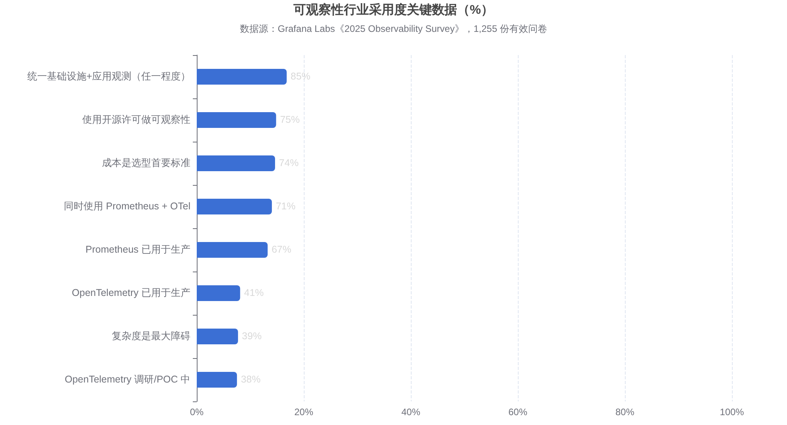
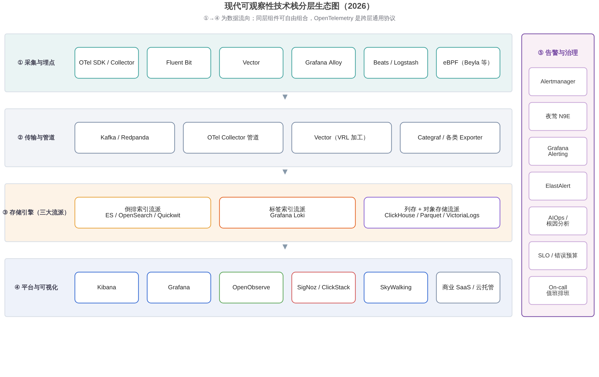
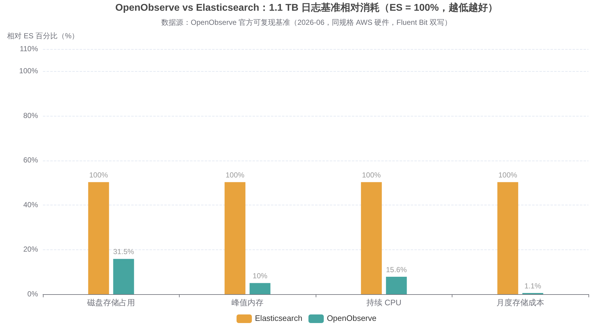
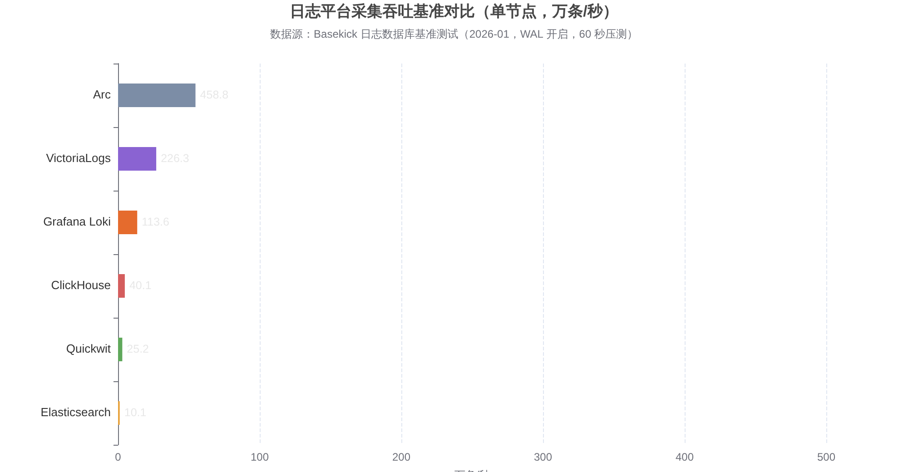
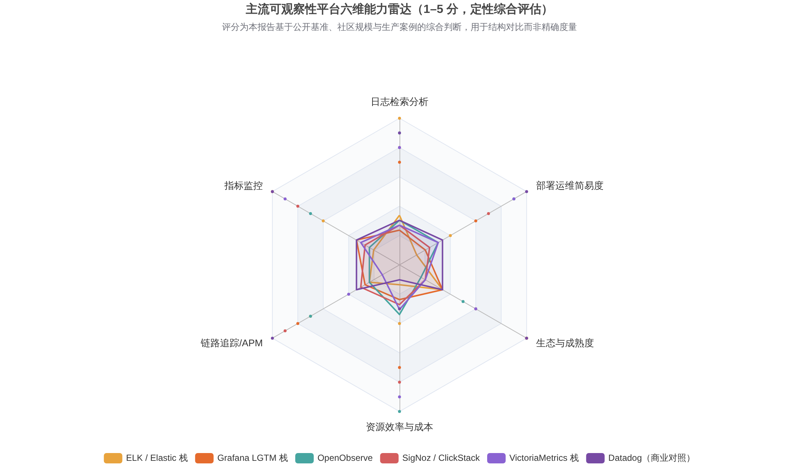
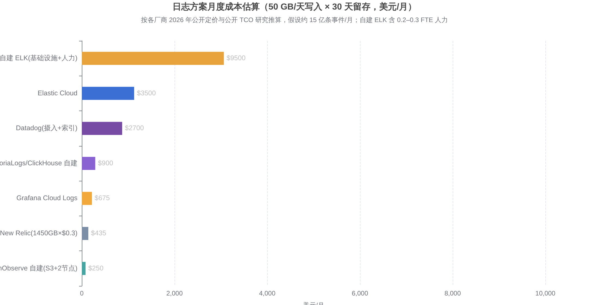

# 运维可观察性体系全面对比与选型指南（2026）

> 覆盖 Elasticsearch/Kibana、OpenObserve、Loki、ClickHouse 系、VictoriaMetrics 系、SkyWalking、Datadog 等商业 SaaS 及国内云厂商方案的全维度对比，附性能基准、成本测算与分场景选型决策框架。

---

## 摘要（TL;DR）

**可观察性没有"万能最优解"，但有清晰的"场景最优解"。** 综合 2025–2026 年的技术演进、公开基准与成本数据，本报告的核心结论如下：

1. **日志平台正处于代际更替期**。以 Lucene 倒排索引为核心的 ELK 在全文检索能力与生态成熟度上仍是标杆，但在压缩率（约 1.14x 对新一代方案的 9.5x–28x）、资源消耗与存储成本上已全面落后于"列存 + 对象存储"新架构。OpenObserve 官方可复现基准显示，相同 1.1 TB K8s 日志下，其存储成本比 Elasticsearch 低 **87 倍**，峰值内存低 **10 倍**（[OpenObserve](https://openobserve.ai/blog/elasticsearch-openobserve-benchmarking/)）。
2. **OpenTelemetry 已成为不可回避的采集层标准**。Grafana Labs 2025 年调查（1,255 份问卷）显示，**71%** 的组织同时使用 Prometheus 与 OpenTelemetry，仅 **6%** 表示完全没有采用 OTel 的计划；**74%** 的组织把"成本"列为选型首要标准（[Grafana Labs](https://grafana.com/observability-survey/2025/)）。选型时应坚持"埋点归一化（OTel）、后端可替换"原则，避免把赌注押在任一后端上。
3. **分场景速选**：中小团队/成本敏感选 **OpenObserve** 或 **VictoriaLogs + VictoriaMetrics**；已深度使用 Grafana/Prometheus 选 **LGTM 栈（Loki + Tempo + Mimir）**；OTel 原生一体化 APM 选 **SigNoz / ClickStack**；国内 Java 微服务 APM 选 **SkyWalking**；日志超大量（PB 级）检索评估 **Quickwit**；预算充足、追求省心与全功能选 **Datadog**；单云深度绑定选**云厂商托管**（阿里云 SLS/ARMS、腾讯 CLS 等）；政企信创选**夜莺私有化 / 华为 AOM / 观测云私有化**。
4. **不要忽视隐性 TCO**。自建 ELK 在 50–100 GB/天规模下，计入基础设施与 0.2–0.3 个人力后，真实月成本约 **7,000–12,000 美元**，远高于"软件免费"的直觉（[Atatus](https://www.atatus.com/guides/elk-stack-vs-atatus/)）；而 Datadog 类商业 SaaS 在百人团队规模下年账单普遍达 **10 万美元量级**（[Hyperping](https://hyperping.com/blog/datadog-pricing)）。**自建 vs 托管的盈亏平衡点通常在 50–100 GB/天日志量附近**，本报告第 6 章给出了完整测算模型。

**一页速选表**（详细论证见第 7 章）：

| 你的情况 | 首选方案 | 次选/补充 |
|---|---|---|
| 初创/中小团队，想一套系统搞定日志+指标+链路 | **OpenObserve**（单二进制、存储成本极低） | SigNoz（OTel 原生、MIT 许可） |
| 已有 Prometheus + Grafana，渐进扩展 | **+ Loki + Tempo（LGTM）** | VictoriaLogs 替换 Loki 提升检索 |
| 日志量 > 500 GB/天，成本敏感 | **OpenObserve / Quickwit / ClickHouse** | 云 SLS 冷热分层 |
| 国内 Java 微服务，要 APM + 拓扑 | **SkyWalking** | 阿里 ARMS（托管省心） |
| 大型企业，预算充足，重效率轻成本 | **Datadog / Dynatrace 类 SaaS** | Grafana Cloud、Elastic Cloud |
| 政企/金融，信创与数据不出域 | **夜莺私有化 / 观测云私有化 / 华为 AOM** | 自建 LGTM（信创 OS 适配） |
| 全文检索为核心诉求（审计、取证、业务搜索） | **Elasticsearch / OpenSearch** | Quickwit（只读日志场景） |

---

## 1. 可观察性体系：概念、信号与 2026 年市场格局

### 1.1 从"监控"到"可观察性"：三支柱与第四信号

可观察性（Observability）区别于传统监控的核心，在于它回答的不是"系统是否活着"，而是"系统为什么异常"。其数据基础是三大遥测信号：**指标（Metrics）**回答"整体表现如何"（QPS、延迟、错误率、饱和度），**日志（Logs）**回答"具体发生了什么"（离散的、带上下文的事件记录），**链路（Traces）**回答"一次请求经过了哪里、慢在哪一环"。三者的价值在于**关联**——通过一条 Trace ID 从告警跳到链路、再跳到对应日志与资源指标，把排障从"多个工具间来回切换"变成"一条证据链顺藤摸瓜"。近年**持续剖析（Continuous Profiling）**被视为第四信号，用于定位代码级热点，Grafana（Pyroscope）、Datadog、Coroot 等均已将其纳入产品主线。

工程落地时，三支柱对应的技术栈长期是"拼装式"的：指标用 Prometheus，日志用 ELK 或 Loki，链路用 Jaeger 或 SkyWalking，可视化靠 Grafana 或 Kibana 各自为战。这种拼装的最大问题不是功能缺失，而是**数据孤岛与上下文切换成本**——调查显示团队平均在用的可观察性相关技术多达 101 种，39% 的组织认为"复杂度"是可观察性的最大障碍（[Grafana Labs](https://grafana.com/observability-survey/2025/)）。这正是"一体化平台"（Unified Observability）在 2025–2026 年强势崛起的动因：85% 的组织已在某种程度上统一基础设施与应用观测（[Grafana Labs](https://grafana.com/observability-survey/2025/)）。

### 1.2 2026 年市场三大趋势：开放标准、成本治理、AI 原生

市场规模层面，IT 可观察性平台市场预计从 2025 年的 **29.1 亿美元**增长到 2031 年的 **69.3 亿美元**，年复合增长率约 **15.6%**；其中遥测数据的存储与摄入消耗了约 **70%** 的可观察性预算（[Mordor Intelligence](https://www.mordorintelligence.com/industry-reports/it-observability-platforms-market)）。IBM 对 2026 年的趋势判断归纳为三条：平台更智能化以跟上 AI 系统的复杂性、可观察性成为整体成本管理策略的一部分、开放标准加速普及（[IBM](https://www.ibm.com/think/insights/observability-trends)）。

**趋势一：OpenTelemetry 完成"采集层统一"。** Grafana Labs 2025 年调查显示 75% 的组织在使用开源许可的可观察性工具，Prometheus 生产使用率达 67%，OTel 生产使用率 41% 且 38% 正在调研/POC，连续两年超半数组织增加对两者的投入（[Grafana Labs](https://grafana.com/about/press/2025/03/25/grafana-labs-unveils-2025-observability-survey-findings-and-open-source-updates-at-kubecon-europe/)）。到 2026 年调查时，OTel 在指标、链路、日志三个信号上的使用率已分别达到 57%、50%、48%（[Grafana Labs](https://grafana.com/observability-survey/)）。这意味着"用哪家的 Agent"不再构成锁定——Grafana 甚至把自己的 eBPF 自动埋点工具 Beyla 捐赠给了 OpenTelemetry（更名为 OpenTelemetry eBPF Instrumentation）（[Grafana Labs](https://grafana.com/about/press/2025/11/05/grafana-labs-launches-mimir-3.0-expanding-open-observability-at-scale-at-kubecon--cloudnativecon-north-america-2025/)）。**对选型的直接启示：无论选哪个后端，埋点层一律用 OTel SDK/Collector，保留随时双写、切换后端的能力。**

**趋势二：成本成为第一决策变量。** 74% 的组织把成本列为选型首要标准，超过易用性与互操作性（[Grafana Labs](https://grafana.com/observability-survey/2025/)）。商业 SaaS 的账单失控案例（Datadog 百人团队年账单约 10 万美元、500+ 服务企业超 50 万美元）与 ELK 的存储膨胀，共同催生了"列存 + 对象存储"新架构的爆发——OpenObserve、ClickStack、VictoriaLogs、Quickwit 都把"成本降低一个数量级"作为核心卖点，且均有公开基准或大规模生产案例背书。

**趋势三：行业整合与 AI 原生。** 2025 年发生多起标志性并购：Datadog 收购 Quickwit（1 月）、ClickHouse 收购 HyperDX 并推出 ClickStack（3 月）、Palo Alto Networks 收购 Chronosphere，ServiceNow 的 Lightstep（Cloud Observability）则宣布 2026 年 3 月停服（[Augment Code](https://www.augmentcode.com/tools/best-observability-platforms)、[Mordor Intelligence](https://www.mordorintelligence.com/industry-reports/it-observability-platforms-market)）。供应商整合意味着"今天选的平台，续约时可能已不存在"，**采购风险与厂商存续能力应正式进入选型评分表**。

### 1.3 技术栈分层与存储引擎的三大流派

理解选型本质上是理解**存储引擎的架构流派**，因为采集层已被 OTel 标准化、可视化层（Kibana/Grafana）高度可互换，真正决定成本、性能与运维模式的是存储层。当前日志/遥测存储可分为三大流派：

**倒排索引流派（Lucene 系）**：Elasticsearch、OpenSearch、Quickwit（Tantivy，Rust 版 Lucene 思路）。对每行日志的每个词建立倒排索引，全文检索与相关度能力最强，代价是索引体积常为原始数据的数倍、写入放大严重、JVM 调优复杂。**标签索引流派**：Grafana Loki 是唯代表，只索引标签（namespace、pod 等元数据），正文存压缩块，写入便宜但无标签锚点的全文搜索退化为逐行扫描。**列存 + 对象存储流派**：ClickHouse（及 SigNoz/ClickStack）、OpenObserve（Parquet + DataFusion）、VictoriaLogs（列存 LSM + 全字段 token 索引），压缩率高一个数量级、聚合分析快、可直接落在 S3 上把存储成本打到最低，短板是单条记录的精确检索与成熟度积累时间较短。

值得注意的是三大流派正在互相渗透：Loki 3.x 引入布隆过滤器加速文本过滤，Elasticsearch 9.x 优化了聚合与向量化执行，OpenObserve/VictoriaLogs 则补上了全文索引能力。**选型的分水岭不在"谁全能"，而在"你的主导负载是什么"**：以关键词取证搜索为主 → 倒排系；以标签明确的 K8s 应用日志为主 → 标签系；以聚合分析、大屏、长留存为主 → 列存系。第 2 章将逐一展开。

---

## 2. 日志平台深度对比（ELK / OpenSearch / Loki / OpenObserve / VictoriaLogs / ClickHouse 系 / Quickwit）

日志是可观察性三支柱中**数据量最大、成本占比最高**的一环，也是 ES、Kibana、OpenObserve 等关键词所处的核心战场。本章逐一分析七个主流选项，再以基准数据与总表收束。

### 2.1 Elasticsearch / ELK（含 Kibana）：生态标杆，成本痛点

ELK（Elasticsearch + Logstash + Kibana，采集端常用 Beats/Fluent Bit 替代 Logstash 构成 EFK）过去十年几乎是"日志平台"的同义词。其优势至今仍然真实：**全文检索能力业界最强**（分词、模糊匹配、相关度评分）、**生态与人才储备最厚**（Kibana 可视化、ElastAlert、无数教程与最佳实践）、功能边界远超日志（业务搜索、向量检索、SIEM 安全分析均可复用同一集群）。对合规审计、故障取证这类"必须搜到任意字段任意关键词"的场景，倒排索引仍是结构性最优解。

但 ELK 的成本与运维痛点在日志场景被持续放大。**其一，存储膨胀**：Lucene 倒排索引体积常为原始数据的数倍，压缩率通常仅 1–3 倍，ClickHouse 官方测算 100 TB/天的日志负载在 Elasticsearch 上月成本可超 **10 万美元**（[ClickHouse](https://clickhouse.com/resources/engineering/best-open-source-observability-solutions)）。**其二，高基数聚合乏力**：按 container_id、user_id 做 GROUP BY 式分析时 JVM 内存压力巨大，慢查询、超时甚至 OOM 宕节点并不少见。**其三，运维复杂**：分片规划、ILM 生命周期、堆内存调优、扩容再均衡，本质上是在长期运营一个有状态分布式数据库。OpenObserve 的 1.1 TB 对比基准中，ES 因 mapping 冲突直接丢弃了 62% 的写入数据、持续 CPU 打满至 96% 并返回 429，是这些痛点的一次集中展演（[OpenObserve](https://openobserve.ai/blog/elasticsearch-openobserve-benchmarking/)）。

**许可与发行版现状**（选型必须纳入考量）：Elastic 于 2021 年将许可从 Apache 2.0 改为 SSPL/Elastic License 双许可，引发 AWS 分叉出 OpenSearch；2024 年 8 月 Elastic 又宣布新增 **AGPLv3** 选项（2024 年 11 月 12 日正式生效于源码），使 Elasticsearch 与 Kibana 重新满足 OSI 开源定义（[Techzine](https://www.techzine.eu/blogs/analytics/127883/elastic-shows-the-power-of-search-ai-platform/)、[Market Inference](https://marketinference.com/analysis/r/2026/06/09/ESTC/)）。但需注意：**官方预编译发行包仍按 Elastic License 分发**，AGPL 仅覆盖源码，云厂商托管商不能直接使用预编译包提供商业托管（[Upsun](https://devcenter.upsun.com/posts/psh-elastic-love-loss-licensing/)）。X-Pack 高级功能（SSO、细粒度 RBAC、ML 异常检测、跨集群复制）仍需付费订阅。

**OpenSearch** 是 AWS 主导、2024 年 9 月移交 Linux 基金会的 ES 7.10 分叉，基金会创始白金成员包括 AWS、SAP、Uber，累计下载超 7 亿次（[Happy Coding](https://www.happycoding.agency/en/blog/elasticsearch-alternatives)）。OpenSearch 3.x 补齐了 GPU 加速向量检索、SIMD/FP16 优化等能力，且为 Apache 2.0 许可、无商用限制。性能上双方基准互有胜负：AWS 委托 Trail of Bits 的独立测试显示 OpenSearch 2.17 在 Big5 混合负载上整体快 1.56 倍，而 Elasticsearch 8.15 在纯文本查询上快 2.42 倍（[Coralogix](https://coralogix.com/guides/elasticsearch/elasticsearch-vs-opensearch-key-differences/)）。**实务建议**：需要 Lucene 系能力时，自研自用选 ES（AGPL）或 OpenSearch 均可——ES 新特性更快、OpenSearch 许可更干净且 AWS 托管成熟；若日志是唯一用途，则应先读完本章其余选项再决定。

### 2.2 Grafana Loki：标签索引的极简主义，Grafana 栈的天然拼图

Loki 的设计哲学是"**不为日志内容建索引，只索引标签**"：日志流按标签集（如 `namespace`、`app`、`pod`）组织，正文以 snappy 压缩块存入对象存储，查询时先按标签定位流、再对流内做逐行 grep（LogQL 的 `|=`、`|~` 操作符）。这使 Loki 的写入路径极轻、存储成本逼近 S3 底价（约 $0.02/GB 对 ES 本地 SSD 的约 $0.10/GB），单节点内存 1–4 GB 即可运行，而 ES 节点通常需要 16–64 GB JVM 堆（[Luca Berton](https://lucaberton.com/blog/loki-vs-elasticsearch-2026/)）。与 Prometheus 相同的标签模型 + Grafana 统一可视化，让"指标图表上的尖刺 → 一键跳到对应日志"的体验非常顺滑，这是 Loki 在 K8s 环境渗透率极高的根本原因。

代价同样结构化：**一旦查询无法用标签缩小范围**（比如"全集群搜某段错误堆栈"），就退化为解压全部压缩块逐行扫描，延迟与 I/O 急剧上升。TrueFoundry 的实测显示，500 GB/7 天数据集上"大海捞针"式单行搜索 Loki 耗时 12 秒（VictoriaLogs 约 0.9 秒），而搜索一个不存在字符串触发的全扫描在 500 GB 时 Loki 直接超时（[TrueFoundry](https://www.truefoundry.com/blog/victorialogs-vs-loki)）。Loki 的另一隐性成本是**标签基数治理**——把 trace_id、user_id 误设为标签会撑爆索引，团队需要纪律约束。Loki 3.x 引入布隆过滤器与结构化元数据缓解全文过滤，但"标签先行"的使用范式不变。结论：**Loki 适合标签体系规范的 K8s 应用日志、且团队已是 Grafana 用户；把它当作"日志版 Prometheus"而非"便宜版 ES"来用，预期就是对的。**

### 2.3 OpenObserve：Rust + Parquet + S3 的降维打击者

OpenObserve 是 2022 年起步的一体化可观察性平台，技术选型完全是"云原生二代"思路：**Rust 编写单二进制**，存储用 **Parquet 列存直接落 S3/MinIO**，查询引擎基于 Apache Arrow + DataFusion，支持标准 SQL 与 PromQL，覆盖日志、指标、链路、RUM、前端会话回放与告警（[GitHub](https://github.com/openobserve/openobserve)）。部署形态从"两分钟跑起来的单容器"到 Router/Querier/Ingester/Compactor 角色分离的无状态 HA 集群，官方宣称单客户验证规模达 **4 PB/天以上**（[OpenObserve](https://openobserve.ai/blog/openobserve-vs-signoz/)）。

其 2026 年 6 月发布的对 ES 可复现基准（同规格 AWS 硬件、Fluent Bit 双写、固定随机种子）是本领域引用率最高的一组数据：1.1 TB 原始日志，ES 实际压缩率仅 **1.14x**（落盘 375 GB），OpenObserve 达 **9.5x**（落盘 118 GB）；峰值内存 19 GB vs 1.9 GB；持续 CPU 96% vs 15%；15 个典型查询 OpenObserve 赢下 14 个（聚合类最高快 31.8 倍，ES 仅在 COUNT(*) 上依靠预计算文档数占优）；计入 ES 三副本与 S3 单价差后，**月度存储成本 $236.16 vs $2.71，相差 87 倍**（[OpenObserve](https://openobserve.ai/blog/elasticsearch-openobserve-benchmarking/)，[GitHub 基准仓库](https://github.com/openobserve/o2-vs-elasticsearch-benchmark)）。需要客观指出：该基准由 OpenObserve 官方设计，且 ES 丢数据的主因（动态 mapping 冲突）在精心调优的 ES 集群上可缓解——但即便把 ES 侧的调优做到位，**压缩率与单位成本的数量级差距来自架构而非参数**。

**短板与风险必须说清**：① 许可为 **AGPL-3.0**，将其改造后对外提供 SaaS 服务有开源传染义务，自用无影响但商用嵌入需法务评估（[DEV.co](https://dev.co/observability/open-source/openobserve)）；② 版本仍为 0.x（v0.91 前后），Issue 数量较多，API 与配置存在破坏性变更风险，生产上需接受"快速迭代"的代价（[DEV.co](https://dev.co/observability/open-source/openobserve)）；③ S3 原生架构的查询延迟依赖对象存储与本地缓存命中率，跨区域/频繁导出场景需核算 egress 成本；④ SSO、细粒度 RBAC、审计、跨集群联邦查询属于**企业版**功能，开源版虽"功能完整"但企业治理项需付费；⑤ 生态、文档与中文社区积累远不及 ELK/Grafana。**适合：日志量大、成本敏感、愿意尝鲜的工程团队，以及需要"一套系统替代 ELK+Prometheus+Jaeger"三件套的中小团队。**

### 2.4 VictoriaLogs：单节点效率之王，VictoriaMetrics 的日志姊妹篇

VictoriaLogs 出自以"极致资源效率"著称的 VictoriaMetrics 团队，架构为列存 LSM + **全字段 per-token 索引** + SIMD 加速 + zstd 压缩，单二进制零配置即可运行，查询语言为类 SQL 的 LogsQL，并提供 Grafana 插件。官方口径是比 Elasticsearch 和 Loki 省 **30 倍内存、15 倍磁盘**，并收录了"用单节点 VictoriaLogs 替换 27 节点 ES 集群"的用户案例（[VictoriaMetrics Docs](https://docs.victoriametrics.com/victorialogs/)）。

第三方实测数据同样亮眼：TrueFoundry 在 500 GB/7 天、4 vCPU/8 GiB 的同等条件下对比 Loki，VictoriaLogs 查询延迟降低 **70–94%**、磁盘占用减少 **37%**、峰值摄入高 **3 倍**（66 MB/s vs 20 MB/s）且 CPU 少用 72%、内存少用 87%（[TrueFoundry](https://www.truefoundry.com/blog/victorialogs-vs-loki)）。2026 年 1 月 Basekick 的多系统横评中，VictoriaLogs 以 **226 万条/秒**的单节点摄入吞吐仅次于新锐 Arc，是 Loki 的 2 倍、ClickHouse 的 5.6 倍、Elasticsearch 的 22 倍，且多数查询类型延迟最低（[Basekick](https://basekick.net/blog/arc-log-benchmark-2026)）。

短板在于**生态年轻**：采集链路通常需配合 Vector/Fluent Bit，原生集成与告警能力弱于 Loki 与 ES，集群版（vlinsert/vlselect/vlstorage）的运维文档与社区案例积累有限，企业版功能边界需要逐条确认。**适合：追求单机/小规模集群极致性价比、日志以检索排障为主的团队；与 VictoriaMetrics 搭配可组成"指标 + 日志"双引擎的极简栈，再补一个 Tempo 或 Jaeger 即覆盖三支柱。**

### 2.5 ClickHouse 系：通用 OLAP 底座衍生的日志新势力（ClickStack / SigNoz / 自建表）

ClickHouse 本身不是日志平台，但其列存、高压缩、向量化执行的特性与日志分析高度契合，围绕它已形成三条产品化路径。**第一条是 ClickStack**：ClickHouse 公司于 2025 年 3 月收购 HyperDX，5 月推出由"定制 OTel Collector + ClickHouse + HyperDX UI"组成的开源可观察性栈，OTLP 原生，日志、指标、链路、会话回放一体，官方称 OTel 格式日志可达成 **90% 压缩率**，托管版存储单价低至 **$0.03/GB/月**以下且无按席位收费（[ClickHouse Docs](https://clickhouse.com/docs/clickstack/overview)、[UptimeRobot](https://uptimerobot.com/knowledge-hub/comparisons-and-alternatives/top-new-relic-alternatives/)）。**第二条是 SigNoz**（详见第 5 章一体化平台）。**第三条是工程师自建**：用 Kafka + ClickHouse 物化视图 + Grafana/自研前端搭日志系统，DoorDash、eBay 等超大规模团队均走过此路，灵活度最高但等同于自研产品。

ClickHouse 系的共性优势是**聚合分析性能与压缩率**（同为 Lucene 替代品，对 OTel 日志普遍比 ES 省一个数量级存储），共性短板是：单行精确检索（"找到那一条"）需行重建，弱于倒排索引；MergeTree 的合并压力在高频小批写入下需要喂养（攒批写入是必修课）；集群运维（含 Keeper 协调）有真实门槛——OpenObserve 对 SigNoz 的对比中特别点出"merge pressure、慢异步删除、存算不分离"三个 ClickHouse 运维痛点，虽有立场但也确为社区共识（[OpenObserve](https://openobserve.ai/blog/openobserve-vs-signoz/)）。**适合：已有 ClickHouse 运维能力或数据团队的组织，以及选 SigNoz/ClickStack 成品方案的用户。**

### 2.6 Quickwit：S3 上的亚秒全文检索，PB 级日志的成本杀手

Quickwit 用 Rust 基于 Tantivy 构建，把**倒排索引直接放在对象存储上**——这打破了"倒排索引必须配本地 SSD"的传统约束，实现了存算完全分离：索引器与搜索器均无状态，秒级扩缩容，冷启动通过 hotcache 优化到 70ms 级。它原生支持 OTLP 日志与链路摄入、可充当 Jaeger 后端、提供 Elasticsearch 兼容 API 与 Grafana 数据源（[GitHub](https://github.com/quickwit-oss/quickwit)）。币安（Binance）的公开案例是其能力上限的最好证明：将多个 PB 级 ES 集群迁移至 Quickwit 后，索引规模达 **1.6 PB/天**、搜索集群管理 **100 PB 日志**，**计算成本降低 80%、存储成本降低 20 倍**，年节省数百万美元（[CSDN 译文](https://blog.csdn.net/o__cc/article/details/141235213)）。

风险项同样明确：Quickwit 于 **2025 年 1 月被 Datadog 收购**（随后许可从 AGPL 改为 Apache 2.0），虽然仓库至今保持活跃，但核心团队的重心已转向 Datadog 商业产品，项目的长期独立性存在不确定性（[elest.io](https://blog.elest.io/quickwit-s3-sub-second-log-search-without-elasticsearch/)）。功能上它专注"日志与链路的 append-only 检索"，不支持文档更新、不做相关性排序、聚合能力弱于 ES，冷查询依赖 S3 延迟与缓存预热。**适合：日志量 TB/PB 级、以合规留存和偶发检索为主、追求"倒排检索体验 + 对象存储成本"的团队；它是 ELK 的"手术刀式"替代品，而非全家桶。**

### 2.7 商业与云托管日志：Splunk、Datadog、阿里云 SLS、腾讯云 CLS

**Splunk** 是日志商业化的鼻祖，SPL 与 SIEM 积淀深厚，被 Cisco 收购后整合进其安全与可观察性版图；其按摄入量的高价计费长期被诟病，Splunk Observability Cloud 改为按主机分层计价（$15–75/主机/月），适合已深度绑定 Splunk 生态的大型企业（[DoiT](https://www.doit.com/blog/datadog-pricing-explained)）。**Datadog 日志**采取"摄入 + 索引"双重计费：$0.10/GB 摄入，再加 $1.70/百万事件索引（15 天留存），即"先付钱收日志，再付钱让它能被搜到"，500 GB/天的团队仅摄入即约 $1,500/月（[Hyperping](https://hyperping.com/blog/datadog-pricing)）。

**国内云日志服务**是务实的高性价比选项：阿里云 SLS 官方宣称相较自建 ELK 总成本可下降约 **50%**，支持 PB 级数据秒级检索、SQL 分析、热温冷分层（冷归档省约 60%）与内置 AIOps 巡检，按量付费起步约 ¥30/月（[阿里云](https://www.alibabacloud.com/help/zh/sls/what-is-log-service)、[阿里云 SLS](https://www.aliyun.com/product/sls)）。腾讯云 CLS 定位类似，与 TKE 等云产品一键打通。云日志服务的真实优势是**零运维 + 弹性 + 与云内资源（ECS、K8s、数据库）的深度集成**，真实代价是**跨云能力弱、数据格式与 API 锁定、长期大量数据的累计费用可能反超自建**——业内共识是其适合"单云为主、不想养平台团队"的组织，通常比 Splunk 类国际 SaaS 便宜 50% 以上（[腾讯云社区](https://cloud.tencent.com/developer/article/2567932)）。

### 2.8 日志平台总对比表

| 维度 | ES / ELK | OpenSearch | Loki | OpenObserve | VictoriaLogs | ClickHouse 系（ClickStack/SigNoz） | Quickwit |
|---|---|---|---|---|---|---|---|
| 架构流派 | 倒排索引 | 倒排索引 | 标签索引 | 列存 Parquet + S3 | 列存 LSM + token 索引 | 列存 MergeTree | 倒排索引 + S3 |
| 许可 | AGPL/ELv2/SSPL（[Techzine](https://www.techzine.eu/blogs/analytics/127883/elastic-shows-the-power-of-search-ai-platform/)） | Apache 2.0 | AGPLv3 | AGPL-3.0 | Apache 2.0 | Apache 2.0（CH）/ MIT（HyperDX） | Apache 2.0（[7wData](https://7wdata.be/tool/quickwit/)） |
| 压缩率（日志） | ~1–3x | ~1–3x | 中（标签+压缩块） | **9.5–10x**（[基准](https://openobserve.ai/blog/elasticsearch-openobserve-benchmarking/)） | 高（比 Loki 省 37%） | 高（OTel 日志至 90%） | 高（币安：存储省 20x） |
| 单节点摄入 | ~10 万条/秒 | ~10 万条/秒 | ~114 万条/秒 | ~9.5 万条/秒（官方基准，低 CPU） | **~226 万条/秒**（[Basekick](https://basekick.net/blog/arc-log-benchmark-2026)） | ~40 万条/秒 | ~25 万条/秒 |
| 全文检索 | ★★★★★ | ★★★★★ | ★★（行扫描） | ★★★★（含二级索引） | ★★★★（token 索引） | ★★★（跳数索引） | ★★★★ |
| 聚合分析 | ★★★（高基数弱） | ★★★ | ★★★ | ★★★★★ | ★★★★ | ★★★★★ | ★★★ |
| 运维复杂度 | 高（JVM/分片/ILM） | 高 | 中（微服务组件多） | **低（单二进制）** | **低（单二进制）** | 中高（Keeper/合并） | 中（无状态+PG 元数据） |
| 可视化 | Kibana | OS Dashboards | Grafana | 自带 UI + 插件 | 自带 UI / Grafana | HyperDX / SigNoz UI / Grafana | Grafana / ES 兼容客户端 |
| 典型规模验证 | 极多 | 多（AWS 托管） | 极多 | 4 PB/天（厂商宣称） | 27 节点 ES→单节点（用户案例） | DoorDash/eBay 等 | 币安 100 PB（[案例](https://blog.csdn.net/o__cc/article/details/141235213)） |
| 最佳场景 | 全文取证、业务搜索、SIEM | 同左，要 Apache 许可 | K8s 应用日志、Grafana 栈 | 大数据量低成本一体化 | 极致性价比检索 | 聚合分析/已有 CH 能力 | PB 级留存 + 偶发全文检索 |

---

## 3. 指标体系对比：Prometheus 生态、VictoriaMetrics 与传统监控

### 3.1 Prometheus：事实标准与其边界

Prometheus 是云原生指标的绝对事实标准：CNCF 毕业项目、pull 模型 + 服务发现与 K8s 天然契合、PromQL 成为行业通用语、Exporter 生态覆盖几乎所有软硬件。调查显示 **67%** 的组织在生产中使用 Prometheus，且仅 7% 在减少投入（[Grafana Labs](https://grafana.com/observability-survey/2025/)）。它的边界也同样清晰：**单机架构**（无原生集群与多租户）、本地 TSDB 不适合长留存与高可用、全局视图需要额外拼装。因此"Prometheus 长期存储与扩展方案"本身形成了一个子市场，主流三选一：

| 方案 | 架构要点 | 优势 | 代价 | 适合 |
|---|---|---|---|---|
| **Thanos** | Sidecar 模式，块存对象存储，全局查询 | 不改 Prometheus 写入路径，渐进式接入 | 组件多、对象存储查询延迟高 | 已有 Prometheus 舰队的平滑扩容（[TigerData](https://www.tigerdata.com/learn/prometheus-long-term-storage)） |
| **Grafana Mimir** | Cortex 继任者，微服务化多租户；3.0（2025-11）引入 Kafka 解耦读写路径（[Grafana Labs](https://www.morningstar.com/news/business-wire/20251105571677/new-grafana-labs-launches-mimir-30-expanding-open-observability-at-scale-at-kubecon-cloudnativecon-north-america-2025)） | 十亿级 series、强租户隔离、Grafana 原生 | 运维复杂度最高，需专职平台团队 | SaaS 级多租户大规模 |
| **VictoriaMetrics** | 自研列存 TSDB，remote-write 兼容，MetricsQL（PromQL 超集） | 同负载比 Mimir 省 **5 倍内存、1.7 倍 CPU**（[sanj.dev](https://sanj.dev/post/prometheus-storage-scaling-thanos-cortex-mimir-cost-models/)）；压缩率比 Prometheus 高至 10x；单机 8 核可达 100 万 samples/s（[Onidel](https://onidel.com/blog/prometheus-storage-comparison-2025)） | 块存储为主（非对象存储原生），集群版运维另有一套 | 成本敏感、追求简单的中小到大规模 |

社区实践经验可概括为一句话：**"数据量不大、求稳选 Thanos；多租户海量选 Mimir；性价比与简单优先选 VictoriaMetrics"**。国内不少团队干脆以 VictoriaMetrics 单机/小集群完全替代 Prometheus 服务端（协议兼容、可视为"分布式 Prometheus"），仅在采集端保留 Exporter 生态（[博客园](https://www.cnblogs.com/ulricqin/p/20812211)）。

### 3.2 传统与传统强项：Zabbix 与夜莺（Nightingale）

**Zabbix** 在传统主机、网络设备（SNMP）、IDC 资产监控上依然无可替代——模板成熟、开箱即用、自动发现完善。它的短板是数据模型陈旧：面对 K8s 动态标签、微服务指标爆炸时力不从心，与 Prometheus 生态割裂。**夜莺（Nightingale）**则是国内云原生监控治理的代表：滴滴开源、2022 年捐赠给中国计算机学会开源发展委员会（CCF ODC）的首个项目，All-in-One 集成采集（Categraf）、多数据源（Prometheus/VictoriaMetrics/ES/Loki/SLS 等）告警、仪表盘与业务组权限管理，告警治理能力是其十年沉淀的核心卖点（[夜莺文档](https://n9e.github.io/zh/docs/prologue/introduction/)、[掘金](https://juejin.cn/post/7255126807551819835)）。选型建议是务实的"组合而非替换"：Zabbix 继续管网络设备与传统资产，Prometheus/VictoriaMetrics 管云原生指标，夜莺或 Grafana 做统一告警与展示层——明确"同一条规则由谁执行"，避免迁移期重复告警（[Flashcat](https://flashcat.cloud/blog/prometheus-zabbix-nightingale-comparison/)）。

---

## 4. 链路追踪与 APM 对比：Jaeger、Tempo、SkyWalking 与 eBPF 新势力

### 4.1 Jaeger 与 Tempo：索引换搜索，还是对象存储换成本

链路追踪后端的根本分歧与日志如出一辙。**Jaeger**（Uber 开源、CNCF 毕业）把 span 索引进 Cassandra/Elasticsearch，换来按服务、操作、标签、时长的丰富搜索与自带 UI、服务依赖图；代价是你要长期运营一个随流量增长的索引数据库。**Grafana Tempo** 走向另一极：不建全文索引，trace 以 Parquet 块直写对象存储，按 trace_id 秒级取回，配合 TraceQL 做属性过滤——同等 trace 量下存储成本通常比 Jaeger 低 **10–100 倍**，且与 Loki/Mimir 在 Grafana 内天然互跳（[Last9](https://last9.io/blog/grafana-tempo-vs-jaeger/)、[performance.qa](https://performance.qa/blog/jaeger-vs-tempo/)）。在 100 亿 span/月的量级上，自托管 Tempo + S3 约 $500 对 Datadog APM $30,000+ 的对比被广泛引用（[youngju.dev](https://www.youngju.dev/blog/culture/2026-04-15-distributed-tracing-opentelemetry-jaeger-tempo-guide-2025.en)）。

两个时效性事实必须注意：**Jaeger v1 已于 2025 年 12 月 31 日 EOL**，所有存量部署应尽快迁移到 v2——v2 是基于 OpenTelemetry Collector 框架重构的单二进制，官方推荐 OpenSearch 作为大规模生产后端，ClickHouse 后端仍在实验阶段（[groundcover](https://www.groundcover.com/guides/opentelemetry-backend-architecture)）。Red Hat 等厂商已发布从 Jaeger 到 Tempo 的迁移指南，"先用 Jaeger 起步、量涨后为成本迁 Tempo"是被文档化的真实路径（[Red Hat](https://developers.redhat.com/articles/2025/04/09/best-practices-migration-jaeger-tempo)）。**Zipkin** 则已基本退出新项目视野，仅适合教学与极简场景。

### 4.2 SkyWalking：国内 Java 微服务的 APM 主场

Apache SkyWalking 与 Jaeger/Tempo 不是同一物种——它是**完整的 APM 平台**：Java Agent 字节码增强零侵入埋点、服务拓扑自动构建、端点级 RED 指标、JVM/中间件监控、告警与日志上下文打通一应俱全，存储可选 ES、MySQL、TiDB、BanyanDB，探针官方口径开销约 3%（[OpenObserve](https://openobserve.ai/blog/opensource-apm-tools/)）。在国内，它的采用度显著高于 Jaeger/Zipkin：中文社区活跃、文档友好、对 Spring Cloud/Dubbo 等国产主流框架支持开箱即用，且符合国产化合规叙事。局限在于：探针模型以 Java 为中心（其他语言覆盖参差）、全量部署资源消耗偏高、OTel 兼容是"接收方"而非原生（[Trae](https://www.trae.cn/article/1190656)）。生产经验是把采样率控制在 10%–50% 经压测取值，存储务必配置保留上限（[魔乐社区](https://modelers.csdn.net/69a547517bbde9200b9b5496.html)）。**同生态的 Pinpoint（HBase 存储、字节码级 Java tracing）适合超大规模 Java 集群；DeepFlow 则以 eBPF 无侵入网络/应用流观测见长，适合"网络 + APM"一体化诉求。**

### 4.3 采样策略：链路成本的总阀门

链路数据的成本失控几乎总源于"全量采集"的默认值：1 万 QPS、每请求 10 个 span 的系统，一天产生 **86.4 亿 span**，任何后端都扛不住裸奔（[quant67](https://quant67.com/post/observability/10-traces/traces.html)）。工程上的标准答案是**头部采样控量 + 尾部采样保质**：头部按概率（如 10%）在请求入口决策，简单但会丢掉 90% 的错误链路；尾部在 OTel Collector 侧缓存完整链路后按策略保留（错误 100%、慢请求 100%、正常流量 1%），是大规模场景的标配。**传播协议统一走 W3C TraceContext（`traceparent`）**，并在网关、消息队列（Kafka/RabbitMQ 需手动 inject/extract）等边界做全链路验证——traceparent 在网关被 strip 是最常见的断链事故（[quant67](https://quant67.com/post/observability/10-traces/traces.html)）。

### 4.4 链路/APM 方案总对比表

| 维度 | Jaeger v2 | Grafana Tempo | SkyWalking | Elastic APM | Pinpoint | DeepFlow |
|---|---|---|---|---|---|---|
| 定位 | 纯链路后端 | 纯链路后端 | 全栈 APM 平台 | ELK 生态 APM | 大规模 Java APM | eBPF 网络+应用观测 |
| 存储 | OpenSearch（推荐）/Cassandra；CH 实验 | 对象存储（无索引） | ES / MySQL / TiDB / BanyanDB | Elasticsearch | HBase | ClickHouse |
| 埋点方式 | OTel SDK | OTel SDK | **Java Agent 零侵入** + OTel 接收 | Agent / OTel | Java Agent | eBPF 无侵入 |
| 搜索能力 | 强（索引） | 中（TraceQL 进步快） | 强（APM 语义） | 强 | 强 | 中（流日志 SQL） |
| 存储成本 | 高 | **极低（低 10–100x）**（[Last9](https://last9.io/blog/grafana-tempo-vs-jaeger/)） | 中高（取决于后端） | 高 | 中高 | 中 |
| 服务拓扑 | 有 | 无（借 Grafana） | **强** | 有 | 强 | 强（网络视角） |
| 多语言 | 全（OTel） | 全（OTel） | Java 最强，其他次之 | 全 | Java 为主 | 语言无关 |
| 适合 | 独立链路系统、强搜索 | Grafana 栈、海量低成本 | 国内 Java 微服务 | 已有 ELK | 超大规模 Java | K8s 网络可观察+APM 融合 |

---

## 5. 一体化平台与商业方案：从"拼装三件套"到"一个后端"

### 5.1 开源一体化：SigNoz、OpenObserve、ClickStack、LGTM、Elastic Observability

**SigNoz** 是 OTel 原生一体化的标杆：MIT 许可（企业目录另计）、ClickHouse 单后端承载三信号、查询构建器 + ClickHouse SQL + PromQL，GitHub 约 **3.2 万 star**、周级发版，企业口径验证规模 10 TB+/天（[performance.qa](https://performance.qa/blog/signoz-vs-uptrace-vs-hyperdx/)，[OpenObserve](https://openobserve.ai/blog/openobserve-vs-signoz/)）。代价是要运维 ClickHouse + Keeper + PostgreSQL 的多组件栈，且 RUM 仅有 Web Vitals、无会话回放。**OpenObserve**（见 2.3）部署最简、成本最低但 AGPL + 0.x 版本需接受迭代风险。**ClickStack**（见 2.5）背后有 ClickHouse 公司背书、会话回放是差异化能力，但 2025 年才发布、生态最年轻。**LGTM**（Loki+Grafana+Tempo+Mimir/Prometheus+Pyroscope）胜在模块化与社区厚度——Grafana 是全球装机量最大的可观察性可视化层，各组件可独立替换，代价是"全家桶"实为五六个分布式系统，自托管规模化的运维投入不可低估（[OpenObserve](https://openobserve.ai/blog/top-10-observability-tools/)）。**Elastic Observability** 适合已重仓 ELK 的组织顺势扩展 APM/指标，一份集群多种用途，但信号间的统一体验与成本结构不如专用方案。

### 5.2 国际商业 SaaS：Datadog、New Relic、Splunk 的定价解剖

商业 SaaS 的价值主张是"拿工程效率换账单"：免运维、全信号开箱即用、AI 异常检测与根因分析领先。2026 年价格面关键数据如下：

| 平台 | 计费模型 | 关键单价（年付，2026 公开价） | 账单陷阱 |
|---|---|---|---|
| **Datadog** | 按主机 + 按量多维叠加 | 基础设施 $15/主机/月；APM $31/主机/月；日志 $0.10/GB 摄入 + $1.70/百万事件索引；自定义指标超额 $5/百个（[Hyperping](https://hyperping.com/blog/datadog-pricing)、[Motadata](https://www.motadata.com/blog/datadog-pricing)） | 高水位主机计费；Prometheus/OTel 指标全部计入自定义指标；日志"摄入+索引"双重收费；500+ 服务企业年账单普遍超 $50 万（[Hyperping](https://hyperping.com/blog/datadog-pricing)） |
| **New Relic** | 按用户席位 + 按摄入 GB | 免费档 100 GB/月；超出约 $0.30/GB；全平台用户 ~$99/席/月、核心用户 ~$49（[SigNoz](https://signoz.io/blog/datadog-vs-newrelic/)） | 大团队的席位费；海量日志摄入费 |
| **Splunk Observability** | 按主机分层打包 | $15–75/主机/月（Starter→Enterprise，高层含 APM/RUM）（[DoiT](https://www.doit.com/blog/datadog-pricing-explained)） | 层级选择、年涨幅条款 |
| **Elastic Cloud** | 按资源（内存/计算）或 Serverless | Serverless 可观察性约 $0.07/GB 摄入起（[DoiT](https://www.doit.com/blog/datadog-pricing-explained)） | 资源计费难预估；同等部署约 $2,000–5,000/月（[Atatus](https://www.atatus.com/guides/elk-stack-vs-atatus/)） |
| **Grafana Cloud** | 平台费 + 按量 | 免费档 1 万 series + 50 GB 日志/链路；Pro $19/月 + series $6.50/千 + 日志 $0.05/GB 处理 + $0.40/GB 写入（[CloudZero](https://www.cloudzero.com/blog/grafana-cloud-pricing/)） | 每个产品线独立收 $19 平台费；高基数标签静默推高 series 计费 |

经验法则：**小团队起步 SaaS 几乎总是划算（Datadog 免费档 5 主机、Grafana Cloud 免费档、New Relic 100 GB 免费），但从 50 主机/数百 GB 日志每天开始，SaaS 账单会以超线性速度反超自建成本**。Grafana Cloud 侧的一个参照点：10 主机、月 1.1 TB 遥测的小团队月账单约 $721（[Motadata](https://www.motadata.com/blog/grafana-cloud-pricing)）；100 主机、30 TB/月遥测的估算约 $16,000/月（[CubeAPM](https://cubeapm.com/blog/hybrid-cloud-monitoring-tools/)）。

### 5.3 国内方案：云厂商托管、创业平台与开源治理的三条路线

国内可观察性市场可清晰分为三条路线，差异不在"档次"而在"约束匹配"（[quant67](https://quant67.com/post/observability/23-china-vendors/china-vendors.html)）：

| 路线 | 代表 | 核心卖点 | 核心风险 | 适配 |
|---|---|---|---|---|
| 云厂商托管 | 阿里 ARMS / SLS、腾讯 APM / CLS、华为 AOM / LTS | 云产品联动、等保合规背书、免运维；SLS 宣称 TCO 低于自建 50%（[阿里云](https://www.aliyun.com/product/sls)） | 跨云弱、格式与 DSL 锁定 | 单云深度用户 |
| 创业 SaaS/私有化 | 观测云（Guance）、DeepFlow、博睿 Bonree ONE | 专项体验、OTel 友好、私有化交付；观测云按 $0.60/百万条/天计费（30 天留存）可预测（[观测云](https://www.guance.com/learn/articles/enterprise-log-platform-selection-2026)） | 生态规模与持续运营能力 | 多云混合、要服务响应 |
| 开源自建/包装 | 夜莺、LGTM、SkyWalking | 数据自主、深度定制 | 需 0.3–0.5 个专职 SRE 人力（[quant67](https://quant67.com/post/observability/23-china-vendors/china-vendors.html)） | 有平台工程能力 |

政企与金融客户还有两个硬筛选器：**信创适配**（鲲鹏/飞腾 CPU、麒麟/统信/openEuler OS——务必在目标 OS 内核上做 Agent/eBPF POC，而非仅在 x86 Ubuntu 上演示）与**数据驻留**（数据不出域、写入前脱敏）。华为全栈信创叙事最完整，夜莺等开源方案可自行编译适配，观测云/博睿提供私有化交付（[quant67](https://quant67.com/post/observability/23-china-vendors/china-vendors.html)）。

---

## 6. 成本与 TCO 分析：自建、托管与 SaaS 的盈亏平衡

### 6.1 显性价格只是冰山一角

可观察性的真实成本结构可拆为五层：**摄入与存储的介质成本**（S3 vs 本地 SSD vs 厂商托管）、**索引与计算成本**（倒排索引的写入放大 vs 列存的压缩红利）、**留存策略成本**（热/温/冷分层）、**人力成本**（集群运维、升级、容量规划、告警治理，通常 0.2–1 个 FTE）、**风险成本**（平台自身故障导致的"盲人时刻"）。Grafana 2025 调查中 74% 的组织把成本列为首要选型标准，但只有不到三分之一担心"花太多"——说明成熟组织关注的是**单位数据价值**而非绝对低价（[Grafana Labs](https://grafana.com/observability-survey/2025/)）。

三份公开 TCO 研究足以校准直觉：自建 ELK 在 50–100 GB/天摄入、30 天留存的规模下，生产级（含冗余）基础设施约 $3,000–6,000/月，叠加每月 20–30 小时高级工程师维护（约 $4,000–6,000），**真实 TCO 约 $7,000–12,000/月**；同规模 Elastic Cloud 约 $2,000–5,000/月（[Atatus](https://www.atatus.com/guides/elk-stack-vs-atatus/)）。CHAOSSEARCH 的三年模型则显示，大规模 DIY ELK 三年 TCO 可达 **400 万美元量级**（[CHAOSSEARCH](https://resources.enterprisetalk.com/ebook/CHAOSSEARCH-EN-1.pdf)）。另一极，Datadog 的模拟账单显示 100 人工程团队（50 主机 + 200 GB/天日志 + APM + RUM + 合成监控）月账单约 $8,265、年约 10 万美元，且未含 Profiling 与安全产品（[Hyperping](https://hyperping.com/blog/datadog-pricing)）。

### 6.2 统一场景的成本测算（50 GB/天日志 × 30 天留存）

为横向可比，统一假设：日志 50 GB/天（约 15 亿事件/月）、30 天留存、生产可用（含冗余）、不含告警通知类增值服务。结果如下图所示（假设与出处见图注与正文）：

测算口径说明：自建 ELK 取上述 TCO 研究中值 $9,500（含 0.2–0.3 FTE 人力）；Datadog 为摄入 $150 + 索引 15 亿事件 × $1.70/百万 ≈ $2,700（[Motadata](https://www.motadata.com/blog/datadog-pricing)）；Grafana Cloud Logs 为 1,500 GB × ($0.05 处理 + $0.40 写入) ≈ $675（[CloudZero](https://www.cloudzero.com/blog/grafana-cloud-pricing/)）；New Relic 按 1,450 GB 计费部分 × $0.30 ≈ $435（[SigNoz](https://signoz.io/blog/datadog-vs-newrelic/)）；OpenObserve 自建为 2 台中等规格云主机 + S3（1.5 TB 原始按 10x 压缩后约 150 GB，介质费不足 $10）≈ $250 量级，这与官方"存储成本较 ES 低 87–140 倍"的口径一致（[OpenObserve](https://openobserve.ai/blog/elasticsearch-openobserve-benchmarking/)、[Techzine](https://www.techzine.eu/blogs/analytics/140020/openobserve-lowers-observability-storage-costs-by-140x/)）。

**三个结论**：① 存储介质与压缩率的差异（ES 三副本本地 SSD + 1.14x 压缩 vs 列存单副本 S3 + 10x 压缩）本身就能造成**两个数量级**的介质成本差；② 任何方案里**人力都是最大隐性项**——0.25 个高级工程师的年成本（约 $35K–45K）常常超过中小型自建集群的全部基础设施费（[Keel](https://keel.infranexis.com/vs-elk.html)）；③ **盈亏平衡点大约在 50–100 GB/天**：低于此，Grafana Cloud/云日志服务/小规格自建（OpenObserve、VictoriaLogs 单节点）都远比 ELK 集群或 Datadog 划算；高于此数倍后，自建列存系方案的成本优势开始碾压一切托管计费。

### 6.3 成本优化的通用杠杆（与选型正交）

无论选哪个平台，以下杠杆都能立刻生效：**采集侧降噪**（丢弃 DEBUG/健康检查日志，Grafana Adaptive Logs 宣称可省 50% 摄入费）；**基数治理**（标签白名单，Grafana Adaptive Metrics 宣称省 80% 指标费）；**采样策略**（链路尾部采样保错误、放量正常流量）；**留存分层**（热 7 天 + 温 30 天 + 冷归档 1 年，SLS 冷归档省约 60%（[CSDN](https://blog.csdn.net/bkmsyz720709/article/details/163646600)））；**索引分级**（Datadog Flex Logs、ES 仅对必要字段建索引）。一个反直觉但重要的提醒：厂商控制台里的"全量采集"默认值往往是账单陷阱，选型 POC 时就应把"默认值下的账单"列为验收项（[quant67](https://quant67.com/post/observability/23-china-vendors/china-vendors.html)）。

---

## 7. 选型决策框架：维度、场景与落地路径

### 7.1 决策维度与评分建议

建议按八个维度对候选方案打分（权重按组织情况调整）：**业务适配性**（主导负载是全文检索、聚合分析还是 APM？）、**数据统一与关联性**（三信号能否一键互跳）、**性能与规模验证**（目标数据量 3 倍压测，而非厂商宣称值）、**总拥有成本**（5 层成本模型，见第 6 章）、**运维复杂度与团队匹配**（有状态集群数量、升级频率、是否需要专职人力）、**生态与开放标准**（OTel 原生程度、查询语言通用性、迁出难度）、**企业治理**（SSO/RBAC/审计/多租户——注意这些常是企业版分水岭，如 OpenObserve 的 SSO 与联邦查询）、**供应商存续与采购风险**（并购整合期的产品尤需评估，如 Lightstep 2026 年 3 月停服的前车之鉴）（[Augment Code](https://www.augmentcode.com/tools/best-observability-platforms)）。

### 7.2 分场景推荐（核心决策表）

| # | 场景画像 | 推荐栈 | 理由与关键动作 |
|---|---|---|---|
| 1 | **初创/中小团队**（< 20 人，K8s，日志 < 50 GB/天，预算紧） | **OpenObserve 单机/小集群**（日志+指标+链路一体）或 Grafana Cloud 免费档 | 单二进制两分钟上线，存储成本可忽略；埋点一律 OTel SDK，保留未来迁出能力。Grafana Cloud 免费档（1 万 series + 50 GB 日志/链路）适合更想"零运维"的团队（[CloudZero](https://www.cloudzero.com/blog/grafana-cloud-pricing/)） |
| 2 | **已有 Prometheus + Grafana**（渐进路线） | **+ Loki + Tempo（LGTM）**，日志检索要求高则 **Loki → VictoriaLogs** | 复用 Grafana 统一视图与团队肌肉记忆；VictoriaLogs 对 Loki 的实测延迟降 94%、存储省 37%（[TrueFoundry](https://www.truefoundry.com/blog/victorialogs-vs-loki)） |
| 3 | **日志量大且成本敏感**（> 500 GB/天，长留存/合规） | **OpenObserve / Quickwit / ClickStack**，S3 打底 | 列存/倒排 + 对象存储把介质成本打到最低；Quickwit 已有币安 100 PB 先例（[CSDN](https://blog.csdn.net/o__cc/article/details/141235213)）；全文检索刚需选 Quickwit，一体化诉求选 OpenObserve/ClickStack |
| 4 | **国内 Java 微服务，要 APM + 拓扑 + 告警** | **SkyWalking**（存储配 ES/BanyanDB），或托管 **阿里 ARMS** | 零侵入探针 + 中文社区 + 国产化合规；采样率 10–50% 压测取值；指标侧补 VictoriaMetrics |
| 5 | **中大型企业，效率优先、预算充足** | **Datadog**（全功能）或 **Grafana Cloud / Elastic Cloud** | 百人团队年预算按 $10 万级评估；签约时锁定自定义指标与日志索引配额，警惕高水位计费（[Hyperping](https://hyperping.com/blog/datadog-pricing)） |
| 6 | **政企/金融，信创 + 数据不出域** | **夜莺私有化 + VictoriaMetrics + OpenObserve/SLS 私有化**；或华为 AOM、观测云私有化 | 目标 OS 内核上做 Agent POC；核验国产 CPU/OS/数据库兼容清单；合同明确数据驻留与迁出条款 |
| 7 | **多云/混合云** | **LGTM 自建或观测云/华为 AOM**，采集层 OTel Collector 统一 | 避免单云日志服务锁定；用 Collector 双写过桥，逐步收敛 |
| 8 | **全文取证/审计/业务搜索为刚需** | **Elasticsearch 或 OpenSearch** 保留，日志量大侧挂 **Quickwit/列存系** 做冷数据层 | 倒排索引是该负载的结构性最优；热数据 ES、冷数据 S3 化是业界通行折中 |

### 7.3 三套参考组合架构

**参考栈 A——极简性价比栈（中小团队）**：OTel Collector → **OpenObserve**（日志+指标+链路+RUM 一体），告警用其内置 Alertmanager 兼容层；或 OTel Collector → **VictoriaMetrics（指标）+ VictoriaLogs（日志）+ Tempo（链路）+ Grafana**。两个选项共同点：单节点起步、无 JVM、S3 或本地盘皆可、月基础设施成本可压至 $100–300。

**参考栈 B——Grafana 全家桶栈（成长型/中大型）**：Grafana Alloy（采集）→ **Mimir/VictoriaMetrics（指标）+ Loki 或 VictoriaLogs（日志）+ Tempo（链路）+ Pyroscope（剖析）+ Grafana（统一视图）+ 夜莺或 Grafana Alerting（告警治理）**。模块化、每一层可独立扩展替换，社区案例最多；代价是组件多，建议 Helm + GitOps 管理并预留 0.5 个平台人力。

**参考栈 C——企业混合栈（大型/合规敏感）**：云内负载用**云厂商托管**（SLS/ARMS 或 CLS），核心交易链路用 **SkyWalking/Datadog APM**，日志冷数据归档至 **OpenObserve/Quickwit + 对象存储**，统一告警与值班用**夜莺/Flashcat 或 PagerDuty 类**——"热数据托管求省心、冷数据自建求省钱、告警层统一求秩序"。

### 7.4 POC 验证清单与迁移路径

POC 不要用演示数据，要用**真实生产回放**：选 2–3 个最近的真实故障作为评估样本，验证平台能否从告警一路下钻到服务、日志、Trace、Pod、主机（[观测云](https://www.guance.com/lp/top-observability-platforms)）。量化验收项建议包括：① 3 倍预期峰值写入 24 小时无丢数、无限流；② 典型排障查询（关键词、Trace ID、高基数聚合）P95 延迟；③ 原始/落盘压缩比与月度成本推演（含人力）；④ 默认值下的账单模拟（防"全量采集"陷阱）；⑤ 双写与迁出演练——OTel Collector 改 exporter 即可切换后端者应视为加分项；⑥ 企业治理项（SSO、RBAC、审计、数据脱敏）核对开源/企业版边界。

迁移路径遵循"采集先行、双写过桥、按信号收敛"：第一步统一埋点到 OTel Collector/Alloy；第二步新后端与老系统**双写并行 2–4 周**，用真实负载对比查询体验与成本；第三步按"日志 → 指标 → 链路"顺序切换查询入口；第四步老系统降级为只读归档直至留存期结束。Jaeger→Tempo、Loki→VictoriaLogs、ES→ClickHouse/OpenObserve 均有公开迁移指南可循（[Red Hat](https://developers.redhat.com/articles/2025/04/09/best-practices-migration-jaeger-tempo)、[OneUptime](https://oneuptime.com/blog/post/2026-03-31-clickhouse-how-to-migrate-from-elasticsearch-to-clickhouse/view)）。

---

## 8. 风险提示与 2026–2027 趋势展望

**风险一：基准营销的幸存者偏差。** 本报告引用的 OpenObserve vs ES（87 倍成本差）、VictoriaLogs vs Loki（94% 延迟下降）等数据均来自厂商或迁移受益方，测试条件对其架构有利。正确用法是把它们当作"架构差异的方向与量级"参考，在自己的数据模型上复测，而非直接当采购依据。**风险二：新版本蜜月期。** OpenObserve 仍是 0.x、ClickStack 发布刚满一年、Mimir 3.0 的 Kafka 架构刚刚落地——新架构的成本优势真实，但边缘场景的稳定性和升级兼容性需要时间，核心生产系统建议慢半拍。**风险三：供应商整合。** Datadog 收购 Quickwit、ClickHouse 收购 HyperDX、Palo Alto 收购 Chronosphere、Lightstep 停服——并购可能带来资源注入，也可能带来路线图漂移，合同中应写入数据可迁出与格式开放条款。

展望未来 12–18 个月，三个方向值得押注：**其一，"S3 即数据库"架构继续吞噬市场**——从 Quickwit、OpenObserve 到 Tempo、Mimir 3.0，对象存储原生 + 无状态计算已成为新一代遥测存储的共识底座，自建与托管的成本曲线都会因此继续下移（[EMQX](https://www.emqx.com/zh/blog/s3-ai-era-infrastructure-revolution)）。**其二，eBPF 与 OTel 合流**——Beyla 已捐赠为 OpenTelemetry eBPF Instrumentation，"零代码埋点"将显著降低链路覆盖率的落地门槛（[Grafana Labs](https://grafana.com/about/press/2025/11/05/grafana-labs-launches-mimir-3.0-expanding-open-observability-at-scale-at-kubecon--cloudnativecon-north-america-2025/)）。**其三，AI 原生运维从噱头走向标配**——自然语言查询（Grafana Assistant、各厂商 MCP Server）、自动根因分析、LLM 应用自身的可观察性（token 消耗、模型漂移、Agent 决策链）将成为平台差异化的新战场（[IBM](https://www.ibm.com/think/insights/observability-trends)）。对今天做选型的团队而言，最稳妥的策略依然是那条主线：**埋点归一 OpenTelemetry，存储按负载选流派，平台按团队配复杂度，成本按 6.2 节的模型算总账**——这样无论哪一家厂商兴衰，你的可观察性体系都握在自己手里。

---

*本报告基于 2026 年 9 月前公开资料撰写，所引价格、基准与版本信息以各厂商官方页面为准；报告内容仅供技术选型参考，不构成采购建议。*
