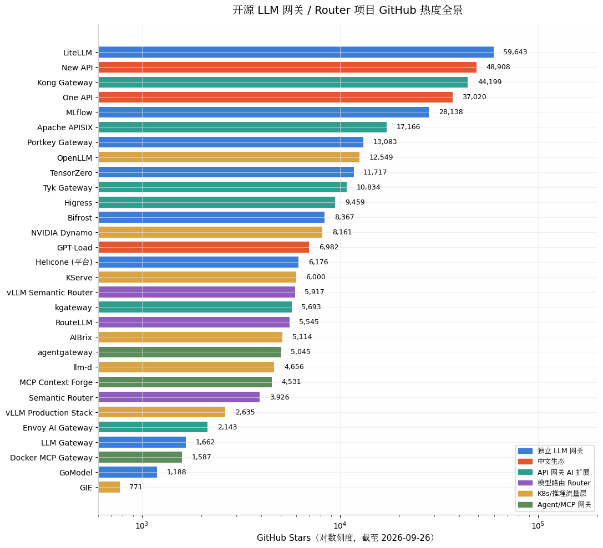
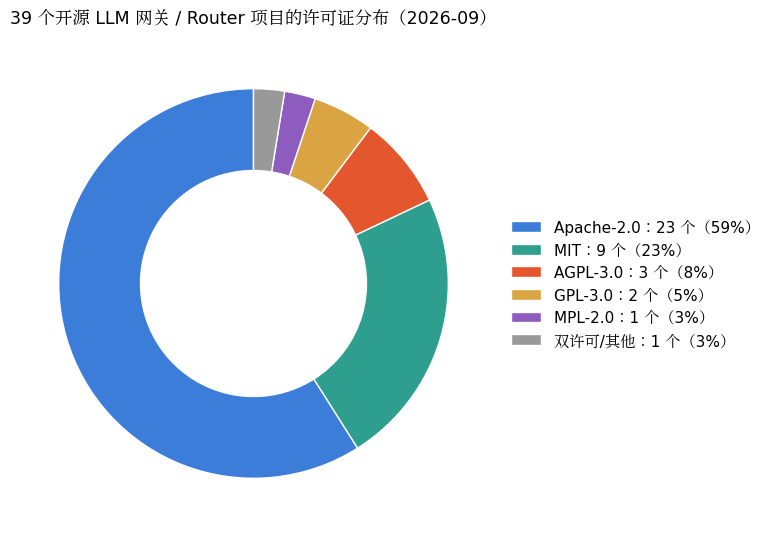

# 开源 LLM API 网关 / 集成 Router 项目全景报告（2026 年 9 月）

## 摘要

本报告系统性盘点了截至 **2026 年 9 月**可查证的 **39 个开源 LLM API 网关 / 模型路由（Router）项目**，并将它们划分为六大类别：独立 LLM 网关、中文分发生态、传统 API 网关的 AI 扩展、智能模型路由框架、Kubernetes 推理流量层、以及 MCP/Agent 网关。所有项目的 **GitHub star 数、许可证、最近提交时间均于 2026-09-26 通过 GitHub API 逐一核实**。

核心结论：**LiteLLM（约 59.6k stars）仍是绝对的开源事实标准**；中文生态的 **New API（约 48.9k stars）已反超其上游 One API**；Rust/Go 高性能网关（Bifrost、agentgateway、AISIX）是 2025–2026 年最活跃的新势力；需要特别警惕的是 **TensorZero 仓库已于 2026 年 6 月归档（只读）**、**Portkey 被 Palo Alto Networks 收购后仓库自 2026 年 5 月起停止更新**。选型时务必区分「网关（管访问、密钥、预算、回退）」与「Router（管每次请求选哪个模型）」两个层次——大多数生产场景先需要网关，再视成本结构叠加 Router。

---

## 一、概念界定：Gateway 与 Router 不是一回事

在 LLM 基础设施语境下，「网关」与「Router」经常被混用，但二者解决的问题层次不同。**LLM 网关（Gateway）管访问控制**：统一 API 格式、虚拟密钥、预算与限流、缓存、故障转移、审计日志，代表是 LiteLLM 与 Portkey；**Router 管模型选择**：对每个请求判断其复杂度与意图，把简单请求路由到便宜模型、复杂请求路由到强模型，代表是 RouteLLM 与 vLLM Semantic Router（[nevercodealone](https://nevercodealone.de/de/glossare/ki-tools-2026/llm-routing)）。2026 年的明显趋势是两层正在融合：LiteLLM、Bifrost、APISIX 等网关开始内置语义路由，而 vLLM Semantic Router 等 Router 也开始内置安全插件与缓存。

综合各厂商与社区的共识，一个完整的 AI 网关通常提供五类核心能力：跨供应商路由与故障转移、响应缓存（含语义缓存）、按 token 的限流与预算、全链路可观测性、以及安全控制（提示注入扫描、输出过滤）（[guptadeepak](https://guptadeepak.com/tools/top-5-ai-gateways-2026/)）。本报告按项目的主定位将 39 个项目划分为六类，分类仅反映主要用途，跨界项目会在文中注明。

| 类别 | 解决的问题 | 代表项目 |
|---|---|---|
| 独立 LLM 网关 | 统一 API、密钥/预算管理、回退、缓存 | LiteLLM、Portkey、Bifrost、Helicone AI Gateway |
| 中文分发生态 | 多渠道 Key 聚合分发、计费、公益站/中转站 | New API、One API、GPT-Load |
| API 网关 AI 扩展 | 在成熟网关上叠加 LLM 流量治理 | Kong、APISIX、Higress、Envoy AI Gateway |
| 模型路由 Router | 按请求智能选模型，降本提质 | RouteLLM、vLLM Semantic Router |
| K8s 推理流量层 | 集群内推理实例的 KV 感知调度 | llm-d、AIBrix、GIE、Dynamo |
| MCP/Agent 网关 | 工具调用与 Agent 流量的治理 | agentgateway、MCP Context Forge |

---

## 二、独立开源 LLM 网关（11 个项目）

这一类是本报告的核心：专为 LLM 流量设计的、可自托管的代理网关。它们普遍对外暴露 OpenAI 兼容端点，把多家模型供应商聚合到一个入口之后，再叠加虚拟密钥、预算、缓存与可观测性。

### 2.1 第一梯队：成熟主流

**LiteLLM（BerriAI）** 是整个领域的事实标准：MIT 许可的开源核心（企业功能另需商业许可），支持 100+ 供应商，提供 Python SDK 与代理服务两种形态，虚拟密钥、按 key 预算、支出追踪、语义缓存一应俱全，还内置了开源世界最成熟的 MCP 网关（[Kosmoy](https://www.kosmoy.com/resources/blog/portkey-vs-litellm/), [Braintrust](https://www.braintrust.dev/articles/openrouter-alternatives-2026)）。截至 2026-09-26 其仓库约 **59,643 stars、11,787 forks**，且保持每日提交（[GitHub](https://github.com/BerriAI/litellm)）；2026 年的版本已将核心性能路径改写为 Rust，Python 保留为 SDK 层。主要代价是运维负担：虚拟密钥与用量追踪需要 PostgreSQL，多 worker 部署需要 Redis，且历史上其代理层每请求会增加 50–200ms 延迟（[Requesty](https://www.requesty.ai/blog/litellm-vs-portkey-vs-openrouter-best-llm-gateway-2026)）。

**Portkey Gateway** 是 TypeScript 编写、主打「配置驱动路由 + 护栏（guardrails）」的网关，其开源网关层于 2026 年 3 月以 MIT 许可完全开放，官方口径支持 1,600+ 模型（[Atlan](https://atlan.com/know/litellm-vs-portkey-vs-bedrock-gateway/), [GitHub](https://github.com/Portkey-AI/gateway)）。它的差异化在于重试、回退、负载均衡、超时的声明式配置和请求级护栏。需要提示的风险信号：**Portkey 于 2026 年 4 月宣布被 Palo Alto Networks 收购**，作为 Prisma AIRS 平台的 AI 安全底座，且其公开仓库自 2026 年 5 月 25 日后再无提交，社区对未来开源路线存在观望情绪（[DevTune](https://devtune.ai/verticals/llm-observability-evals-gateways/portkey/pricing), [Kosmoy](https://www.kosmoy.com/resources/blog/portkey-vs-litellm/)）。截至 2026-09-26 仓库约 13,083 stars。

**Helicone AI Gateway** 出自可观测性平台 Helicone（Y Combinator W23），网关本体是独立的 Rust 二进制，OpenAI 兼容、覆盖 100+ 模型，官方宣称 P50 延迟约 8ms，并与 Helicone 观测平台无缝集成（[llms3](https://llms3.com/node/helicone-ai-gateway), [Helicone](https://www.helicone.ai/blog/top-llm-gateways-comparison-2025)）。需要注意许可证差异：观测平台主仓库 Helicone/helicone 为 Apache-2.0（约 6,176 stars），而独立网关仓库 Helicone/ai-gateway 在 GitHub 上标注为 **GPL-3.0**（约 632 stars，且 2025 年 11 月后提交放缓），商业嵌入前务必自行核对（[GitHub](https://github.com/Helicone/ai-gateway)）。

### 2.2 高性能新势力（Rust / Go）

**Bifrost（Maxim AI）** 是 2025 年 3 月才创建的 Go 网关，增长极快，截至 2026-09-26 约 **8,367 stars**，Apache-2.0 许可，官方宣称比 LiteLLM 快 50 倍（[GitHub](https://github.com/maximhq/bifrost)）。其核心卖点是多 API Key 维度的负载均衡与自动回退——请求会在多个供应商密钥间摊薄，规避单 key 限流；同时内置语义缓存、MCP 支持（同时可作 MCP client 与 server）、虚拟密钥/团队/客户三级预算、Prometheus 指标与分布式追踪（[API7](https://api7.ai/litellm-alternative), [Maxim](https://www.getmaxim.ai/articles/top-5-llm-gateways-in-2025-the-definitive-guide-for-production-ai-applications/)）。可通过 npx、Docker 部署，也可作为 Go SDK 直接嵌入应用。

**AISIX（API7）** 是 Apache APISIX 母公司 API7 于 2026 年 4 月新开源的 Rust 网关（Apache-2.0），把语义路由与模型集成（ensemble）放进开源核心，同时支持 OpenAI 与 Anthropic 双客户端协议，并用一个策略层统一治理 LLM、MCP、A2A 三类流量（[API7](https://api7.ai/litellm-alternative), [GitHub](https://github.com/api7/aisix)）。项目非常年轻（约 167 stars），适合关注而非直接押注生产。

**TensorZero** 曾是这一类中最受瞩目的项目：Rust 编写、Apache-2.0、约 11,717 stars，定位不止是网关而是统一「网关 + 观测 + 评估 + 优化」的 LLMOps 平台，宣称 10k+ QPS 下 p99 额外延迟小于 1ms，比 LiteLLM 低 25–100 倍（[TensorZero](https://github.com/tensorzero/tensorzero), [Agenta](https://agenta.ai/blog/top-llm-gateways)）。**但务必注意：其 GitHub 仓库已于 2026 年 6 月 11 日被归档为只读，项目不再维护**（[GitHub](https://github.com/tensorzero/tensorzero), [API7](https://api7.ai/litellm-alternative)）。存量用户可继续自托管使用，新项目不建议选用——这是开源基础设施选型中「厂商生存性」风险的典型案例。

### 2.3 轻量与特色项目

其余独立网关项目体量较小但各有特色。**LLM Gateway（TheOpenCo，llmgateway.io）** 是 AGPLv3 许可的「开源版 OpenRouter」：一条 Docker 命令即可自托管完整平台（网关 + 仪表盘 + Redis 缓存 + 成本分析），覆盖 200+ 模型、40+ 供应商，BYOK 时零加价，约 1,662 stars（[llmgateway.io](https://llmgateway.io/blog/open-source-openrouter-alternatives), [GitHub](https://github.com/theopenco/llmgateway)）。**GoModel（ENTERPILOT）** 是 MIT 许可的 Go 单文件 AI 代理/控制面，约 1,188 stars，定位极简（[GitHub](https://github.com/ENTERPILOT/GoModel)）。**Routerly（Inebrio）** 的特色是「网关自身具备智能」——内置 LLM 驱动的动态路由策略，可让模型实时评估每个请求并选路，同时原生支持 Anthropic `/v1/messages` 格式，AGPL-3.0，约 96 stars（[GitHub](https://github.com/Inebrio/Routerly)）。**OpenZiti llm-gateway** 把零信任网络作为底座：网关可以不监听任何端口运行，基于 OpenZiti/zrok 覆盖网络做端到端加密，并带三层级联的语义路由，Apache-2.0，约 96 stars（[OpenZiti Blog](https://blog.openziti.io/comparing-open-source-llm-gateways), [GitHub](https://github.com/openziti/llm-gateway)）。**LunarGate** 是 2026 年 3 月出现的 Go 轻量网关（约 10–12MB 单二进制），带加权/条件路由、重试、熔断与流式支持，MIT 许可，目前仅约 23 stars（[GitHub](https://github.com/lunargate-ai/gateway)）。此外，**MLflow**（Apache-2.0，约 28,138 stars）内置的 Deployments Server（原 MLflow AI Gateway）也提供统一的 LLM 端点代理能力，适合已经在用 MLflow 做模型管理的团队顺带使用（[GitHub](https://github.com/mlflow/mlflow)）。

---

## 三、中文开源生态：One API 系与多渠道分发网关

中文社区围绕「多渠道 API Key 聚合 + 分发 + 计费」发展出了独特且体量巨大的网关生态，主要服务于需要统一管理国内外多家模型（OpenAI、Claude、Gemini、DeepSeek、豆包等）的团队、公益站与中转站运营者。这一生态的项目在全球范围内的 star 体量仅次于 LiteLLM。

**One API** 是生态的奠基者，由 JustSong 于 2023 年 4 月开源，MIT 许可，Go 后端单二进制部署，提供渠道管理、令牌分发、额度控制与统一的 OpenAI 格式出口，截至 2026-09-26 约 **37,020 stars**（[GitHub](https://github.com/songquanpeng/one-api), [ofoxcoding](https://gitcode.csdn.net/69b1090054b52172bc60822e.html)）。其已知短板包括高并发下需要调优、版本升级可能破坏数据库结构，且 2026 年起维护节奏明显放缓（最近一次提交为 2026 年 1 月）。

**New API** 是 One API 最成功的增强分支，现由 QuantumNous（锟腾科技）维护，许可证为 **AGPL-3.0**，截至 2026-09-26 约 **48,908 stars、11,743 forks，已反超 One API 成为中文生态第一大项目**（[GitHub](https://github.com/QuantumNous/new-api), [aiboss88](https://www.aiboss88.com/en/news/project-new-api)）。相比上游它增加了 Midjourney/Suno 等非聊天模型支持、更完善的在线充值与更现代的 UI，以及 OpenAI↔Claude、OpenAI→Gemini 的跨格式转换，官方口径支持 30+ 主流服务商。选型共识是：追求稳定选 One API，需要多模态渠道与活跃迭代选 New API（[ofoxcoding](https://gitcode.csdn.net/69b1090054b52172bc60822e.html)）；商用场景需注意 AGPL-3.0 的传染性条款。

**GPT-Load** 是 2025 年 6 月出现的新一代 Go 网关（MIT 许可，约 6,982 stars），定位「多渠道、多凭证的密钥池网关」：把同一供应商的多个 API Key / OAuth 订阅账号组成资源池做透明负载均衡与熔断，支持 OpenAI、Gemini、Anthropic 及兼容端点，还提供原生 Responses API 与 WebSocket 透传（[GitHub](https://github.com/tbphp/gpt-load)）。周边还有大量衍生项目：New API 的下游再分发 fork（如 Veloera、VoAPI）、面向订阅制模型（Codex、Claude Code、Grok）做协议转换的 **AIClient2API**（GPL-3.0，约 8,817 stars）（[GitHub](https://github.com/justlovemaki/AIClient2API)）、以及为 New API 补支付通道的适配网关等——GitHub 的 `new-api` topic 下已聚集 116 个公开仓库（[GitHub Topics](https://github.com/topics/new-api)）。这类项目迭代快、合规风险（上游 ToS）需自行评估。

---

## 四、传统 API 网关的 AI 化（7 个项目）

如果你的组织已经在运行某个 API 网关，边际成本最低的路径往往是直接启用它的 AI 插件，而不是新引入一套 LLM 专用网关——这是 2026 年多家对比报告的共同建议（[Turion](https://turion.ai/blog/llm-gateway-pricing-comparison-june-2026/)）。这一类项目的特点是把 LLM 流量治理做成插件或扩展，复用既有网关的认证、限流与审计体系。

**Kong Gateway**（Apache-2.0，约 44,199 stars）通过 ai-proxy、ai-semantic-prompt-guard 等一组 AI 插件提供 LLM 代理、语义缓存与提示词防护，其仓库描述已直接改为「The API and AI Gateway」（[GitHub](https://github.com/kong/kong)）。**Apache APISIX**（Apache-2.0，约 17,166 stars，ASF 顶级项目）拥有同类中最完整的开源 AI 插件矩阵：`ai-proxy`（协议转换，OpenAI/Anthropic/Gemini/DeepSeek 等）、`ai-proxy-multi`（多实例负载均衡/语义路由、429/5xx 自动重试与节点降级）、`ai-rate-limiting`（按 token 限流）、`ai-cache`（Redis 精确+语义缓存）、`ai-prompt-guard`、`ai-rag`、`ai-lakera-guard` 等（[APISIX 官网](https://apisix.apache.org/ai-gateway/), [APISIX 月报](https://apisix.apache.org/zh/blog/2025/09/30/2025-sep-monthly-report/), [GitHub](https://github.com/apache/apisix)）。**Higress**（阿里巴巴开源，Apache-2.0，约 9,459 stars）则是「AI 原生 API 网关」定位：统一协议对接多模型、语义缓存、token 限流，并带 MCP 市场，已在阿里集团、蚂蚁、携程、快手等生产环境使用（[APISeven](https://www.apiseven.com/higress-vs-apisix), [GitHub](https://github.com/alibaba/higress)）。**Tyk Gateway**（MPL-2.0，约 10,834 stars）也在开源核心中提供 AI/MCP 流量支持（[GitHub](https://github.com/TykTechnologies/tyk)）。

云原生阵营则围绕 Kubernetes Gateway API 形成了另一支。**Envoy AI Gateway** 是 CNCF 旗下 Envoy 社区的官方项目（Apache-2.0，约 2,143 stars），构建于 Envoy Gateway 之上统一管理 GenAI 服务访问，2026 年 6 月达成 v1.0（[Kosmoy](https://www.kosmoy.com/resources/blog/best-ai-gateways-2026/), [GitHub](https://github.com/envoyproxy/ai-gateway)）。**kgateway**（前 Gloo，CNCF Sandbox，约 5,693 stars）是 Gateway API 的完整实现，同时支持 Envoy 与 agentgateway 两种数据面；值得注意的变化是其原生的 Envoy 版「AI Gateway」功能已在 v2.1（2025 年 11 月）标记弃用、计划于 v2.2 移除，AI 流量能力全面转向 agentgateway（[ThinkIT](https://thinkit.co.jp/article/38921), [GitHub](https://github.com/kgateway-dev/kgateway)）。**agentgateway** 是 Solo.io 用 Rust 从零打造的 Agent 原生数据面，2025 年 8 月捐赠给 Linux 基金会（AWS、微软、Red Hat、IBM、思科均参与贡献），2026 年初发布 v1.0，原生理解 LLM API（token 计量、预算、提示防护、语义缓存、跨供应商故障转移）、MCP（工具联邦、按工具 RBAC）与 A2A 三类流量，约 5,045 stars，Apache-2.0（[vCluster](https://www.vcluster.com/blog/building-a-mini-ai-platform-llm-routing-mcp-tools-and-agent), [Liquid Reply](https://liquidreply.net/blog/the-ai-gateway-landscape-agentgateway-litellm), [GitHub](https://github.com/agentgateway/agentgateway)）。

---

## 五、模型路由 Router：智能选模型的开源框架（5 个项目）

这一类项目不做密钥与账单管理，专注「这个请求该发给哪个模型」。它们的共同目标是：把简单请求路由到便宜/本地模型，把复杂请求路由到旗舰模型，从而在不显著损失质量的前提下大幅降本——公开基准显示这类路由可在保持约 95% GPT-4 水平表现的同时削减 35%–85% 的成本（[Zylos](https://zylos.ai/research/2026-01-29-llm-routing-intelligent-model-selection/)）。

**RouteLLM** 由 UC Berkeley 的 LMSYS 团队与 Anyscale 合作开发（ICLR 2025），Apache-2.0，约 5,545 stars，是学术与工业界引用最广的开源路由框架。它用人类偏好数据训练路由模型，提供四种路由器：相似度加权排名、矩阵分解（仅用 26% 的 GPT-4 调用即达到 95% 的 GPT-4 性能，比随机基线便宜 48%）、BERT 分类器与因果 LLM 分类器；可作为 OpenAI 客户端的直接替换或启动 OpenAI 兼容服务（[Zylos](https://zylos.ai/research/2026-01-29-llm-routing-intelligent-model-selection/), [Zilliz](https://medium.com/@zilliz_learn/routellm-an-open-source-framework-for-navigating-cost-quality-trade-offs-in-llm-deployment-7c4ee2158835), [GitHub](https://github.com/lm-sys/RouteLLM)）。注意它是研究框架而非产品：故障转移、密钥管理与计量都需要搭配网关使用，且仓库自 2024 年 8 月起基本停止更新（[nevercodealone](https://nevercodealone.de/de/glossare/ki-tools-2026/llm-routing), [GitHub](https://github.com/lm-sys/RouteLLM)）。

**vLLM Semantic Router**（vLLM 项目官方，Red Hat 深度参与）是 2025–2026 年上升最快的路由项目，Apache-2.0，约 5,917 stars，Go+Rust 实现，定位为异构推理基础设施上的「可编程混合模型（Mixture-of-Models）路由层」（[GitHub](https://github.com/vllm-project/semantic-router), [Red Hat](https://www.redhat.com/en/blog/bringing-intelligent-efficient-routing-open-source-ai-vllm-semantic-router)）。它从每个请求提取六类信号（关键词、嵌入、MMLU 领域、事实核查、用户反馈、偏好），经布尔决策树触发路由与插件（语义缓存、越狱检测、PII 保护、HaluGate 幻觉检测），并以 Envoy ext_proc 方式接入云原生体系；配套论文报告在 MMLU-Pro 上准确率提升 10.2 个百分点、延迟降低 47.1%、token 消耗降低 48.5%（[arXiv](https://arxiv.org/html/2510.08731v1)）。版本节奏很快（v0.1 Iris 于 2026 年 1 月、v0.3 于 2026 年 6 月发布），但 1.0 之前不承诺接口稳定（[Ginger Labs](https://gingerlabs.ai/blog/routellm-vs-vllm-semantic-router), [nevercodealone](https://nevercodealone.de/de/glossare/ki-tools-2026/llm-routing)）。

**Semantic Router（aurelio-labs）** 是轻量的 Python 路由库（MIT，约 3,926 stars）：用向量嵌入与余弦相似度在本地毫秒级完成意图分类，无需任何外部 API 调用，适合实时聊天机器人、语音 Agent 与气隙环境（[Inferensys](https://inferensys.com/differences/private-rag-vs-fully-local-ai-architectures/hybrid-ai-routing-gateways/semantic-router-vs-routellm), [GitHub](https://github.com/aurelio-labs/semantic-router)）。**GPTRouter（Writesonic）** 是早期的多模型路由库（MIT，约 456 stars），支持 OpenAI/Anthropic/Azure 与图像模型的统一调用与回退，但 2024 年 4 月后已停止维护（[GitHub](https://github.com/Writesonic/GPTRouter)）。作为对照，商业侧的智能路由器 **Martian**（号称可降本 20–97%）与公有云托管路由器（Amazon Bedrock Intelligent Prompt Routing、Azure AI Foundry Model Router）均不开源（[llmreference](https://www.llmreference.com/router/routellm)）。

---

## 六、Kubernetes 推理流量层（7 个项目）

当你在集群里自托管模型（vLLM/SGLang 等）时，「网关」的含义会发生变化：核心问题从跨供应商管理变成**跨推理实例的智能调度**——KV cache 亲和、队列深度感知、LoRA 适配器感知、Prefill/Decode 分离编排。这是 2025 年以来开源界增长最快的子领域。

**llm-d** 是 Red Hat、Google、IBM、NVIDIA 等联合发起的 CNCF 生态项目（Apache-2.0，主仓库约 4,656 stars），提供「推理感知的请求调度器」：其 Endpoint Picker（EPP）通过 Envoy ext-proc 协议评估 KV-cache 局部性、负载与优先级，为每个请求选择最优推理 Pod，并支持 P/D、E/P/D 分离编排（[GitHub](https://github.com/llm-d/llm-d-router), [Datadog](https://www.datadoghq.com/blog/llm-routing-kubernetes-inference-extension/)）。**Gateway API Inference Extension（GIE）** 是 Kubernetes SIG 制定的底层标准（InferencePool、InferenceModel 等 CRD，约 771 stars），llm-d、kgateway、Envoy AI Gateway 都是它的实现方（[GitHub](https://github.com/kubernetes-sigs/gateway-api-inference-extension), [kgateway](https://kgateway.dev/blog/llm-d-kgateway/)）。**AIBrix** 由字节跳动开源（Apache-2.0，约 5,114 stars），是这一阵营中最完整的一体化方案：LLM 网关与路由、高密度 LoRA 管理、推理感知自动扩缩、分布式 KV cache、异构 GPU 混部，已在字节多条业务线生产验证（[GitHub](https://github.com/vllm-project/aibrix), [NeuReality](https://www.neureality.ai/blog/scaling-llm-inference-with-llm-d-and-neureality-inference-software-serving-stack)）。

其余项目中，**vLLM Production Stack**（约 2,635 stars）是 vLLM 官方的 K8s 参考部署，用 Python 实现了自己的 KV 感知路由器；**NVIDIA Dynamo**（约 8,161 stars，Rust 实现 KV-aware Smart Router）面向数据中心级分布式推理，处于快速迭代期；**KServe**（约 6,000 stars，CNCF）是标准化的分布式生成式+预测式推理平台，其 LLM 路由基于 Envoy AI Gateway 体系；**OpenLLM（BentoML）**（Apache-2.0，约 12,549 stars）则把任意开源模型（DeepSeek、Llama 等）一键封装为 OpenAI 兼容端点，是「模型即网关」的轻量路径（[NeuReality](https://www.neureality.ai/blog/scaling-llm-inference-with-llm-d-and-neureality-inference-software-serving-stack), [GitHub](https://github.com/bentoml/OpenLLM)）。

---

## 七、MCP / Agent 网关（3+1 个项目）

随着 Agent 工作负载兴起，网关的治理对象从「模型调用」扩展到「工具调用」。这一类项目在 LLM 网关之外提供 MCP（Model Context Protocol）与 A2A 流量的联邦、鉴权与审计，是 2026 年最拥挤的新赛道之一。除前文已详述的 **agentgateway**（同时覆盖 LLM/MCP/A2A，见第四节）外，还有三个值得关注的开源项目。

**IBM MCP Context Forge**（Apache-2.0，约 4,531 stars）定位「AI 网关 + 注册表 + 代理」，可以统一挡在任意 MCP、A2A 或 REST/gRPC 服务之前，提供工具发现、协议转换与访问策略（[GitHub](https://github.com/IBM/mcp-context-forge)）。**Docker MCP Gateway**（MIT，约 1,587 stars）是 Docker 官方的 MCP CLI 插件/网关，把 MCP 服务器容器化运行并统一出口（[GitHub](https://github.com/docker/mcp-gateway)）。**Lunar.dev**（MIT，约 499 stars）走「Agent 原生 API 消费治理」路线：Lunar Proxy 治理包括 LLM 在内的全部第三方 API 出站流量，Lunar MCPX 做多个 MCP 服务器的零代码聚合；注意其 MIT 许可仅覆盖非生产/个人用途，生产部署需要商业 onboarding（[BrightCoding](https://www.blog.brightcoding.dev/2026/07/18/thelunarcompanylunar-open-source-mcp-gateway-for-ai-agent-governance), [GitHub](https://github.com/TheLunarCompany/lunar)）。

---

## 八、闭源对照：这些常被提到，但不是开源

为避免选型混淆，以下高频出现的名字**不是开源项目**（部分提供自托管或 BYOK，但代码不开放）：**OpenRouter**（托管模型市场，5.5% 充值手续费，无自托管）、**Cloudflare AI Gateway**（绑定 Cloudflare 边缘网络）、**Vercel AI Gateway**（绑定 Vercel 平台）、**Martian**（商业智能路由器）、**Requesty**（托管网关，PAYG +5%）、**TrueFoundry LLM Gateway**（可部署进自有 VPC 但无公开开源仓库）、**Amazon Bedrock Intelligent Prompt Routing** 与 **Azure AI Foundry Model Router**（云厂商托管）（[BenchLM](https://benchlm.ai/openrouter-alternatives), [GetAutonoma](https://getautonoma.com/blog/openrouter-alternatives), [llmreference](https://www.llmreference.com/router/routellm)）。此外 Braintrust Gateway 的自托管版本仅限企业计划。

---

## 九、全景对比与热度图谱

下表汇总全部核实项目（star 数据截至 2026-09-26，来源为 GitHub API 与对应仓库页）。许可证一栏以 GitHub 仓库标注为准；「活跃度」依据最近一次代码推送时间。

### 9.1 独立 LLM 网关与中文生态

| 项目 | 语言 | 许可证 | Stars | 最近推送 | 一句话定位 |
|---|---|---|---|---|---|
| [LiteLLM](https://github.com/BerriAI/litellm) | Python+Rust | MIT 核心+企业版 | 59,643 | 2026-09-26 | 开源事实标准，100+ 供应商，虚拟密钥/MCP 网关 |
| [New API](https://github.com/QuantumNous/new-api) | Go | AGPL-3.0 | 48,908 | 2026-09-25 | One API 增强分支，多模态渠道+计费 |
| [One API](https://github.com/songquanpeng/one-api) | Go | MIT | 37,020 | 2026-01-09 | 中文生态奠基者，渠道/令牌分发 |
| [MLflow](https://github.com/mlflow/mlflow) | Python | Apache-2.0 | 28,138 | 2026-09-26 | 内置 Deployments Server 统一 LLM 端点 |
| [Portkey Gateway](https://github.com/Portkey-AI/gateway) | TypeScript | MIT | 13,083 | 2026-05-25 | 配置驱动路由+护栏；被 PANW 收购后停更 |
| [TensorZero](https://github.com/tensorzero/tensorzero) | Rust | Apache-2.0 | 11,717 | 2026-06-11 | LLMOps 一体栈；**仓库已归档，停止维护** |
| [AIClient2API](https://github.com/justlovemaki/AIClient2API) | JS | GPL-3.0 | 8,817 | 2026-09-24 | 订阅制模型多协议代理转换 |
| [Bifrost](https://github.com/maximhq/bifrost) | Go | Apache-2.0 | 8,367 | 2026-09-26 | 多 Key 负载均衡，MCP/语义缓存 |
| [GPT-Load](https://github.com/tbphp/gpt-load) | Go | MIT | 6,982 | 2026-09-26 | 多渠道密钥池透明负载均衡 |
| [Helicone 平台](https://github.com/Helicone/helicone) | TS/Rust | Apache-2.0 | 6,176 | 2026-09-16 | 可观测性优先，附 AI Gateway |
| [LLM Gateway](https://github.com/theopenco/llmgateway) | TypeScript | AGPL-3.0 | 1,662 | 2026-09-25 | 自托管版 OpenRouter，含完整仪表盘 |
| [GoModel](https://github.com/ENTERPILOT/GoModel) | Go | MIT | 1,188 | 2026-09-25 | 极简 Go 单文件 AI 代理 |
| [Helicone AI Gateway](https://github.com/Helicone/ai-gateway) | Rust | GPL-3.0 | 632 | 2025-11-21 | 独立 Rust 网关二进制 |
| [GPTRouter](https://github.com/Writesonic/GPTRouter) | Python | MIT | 456 | 2024-04-10 | 早期多模型路由库，已停更 |
| [Routerly](https://github.com/Inebrio/Routerly) | TypeScript | AGPL-3.0 | 96 | 2026-08-16 | LLM 驱动的动态路由策略 |
| [OpenZiti llm-gateway](https://github.com/openziti/llm-gateway) | Go | Apache-2.0 | 96 | 2026-09-15 | 零信任网络底座+语义路由 |
| [AISIX](https://github.com/api7/aisix) | Rust | Apache-2.0 | 167 | 2026-09-25 | API7 新作，LLM/MCP/A2A 统一策略层 |
| [LunarGate](https://github.com/lunargate-ai/gateway) | Go | MIT | 23 | 2026-09-17 | 10MB 级轻量网关 |

### 9.2 API 网关 AI 扩展、Router、K8s 与 MCP 层

| 项目 | 类别 | 许可证 | Stars | 最近推送 | 一句话定位 |
|---|---|---|---|---|---|
| [Kong](https://github.com/kong/kong) | API 网关 | Apache-2.0 | 44,199 | 2026-09-24 | AI 插件套件（ai-proxy 等） |
| [Apache APISIX](https://github.com/apache/apisix) | API 网关 | Apache-2.0 | 17,166 | 2026-09-24 | 最完整开源 AI 插件矩阵 |
| [Tyk](https://github.com/TykTechnologies/tyk) | API 网关 | MPL-2.0 | 10,834 | 2026-09-25 | 开源核心含 AI/MCP 支持 |
| [Higress](https://github.com/alibaba/higress) | API 网关 | Apache-2.0 | 9,459 | 2026-09-25 | 阿里 AI 原生网关+MCP 市场 |
| [kgateway](https://github.com/kgateway-dev/kgateway) | API 网关 | Apache-2.0 | 5,693 | 2026-09-25 | CNCF，Gateway API 实现 |
| [vLLM Semantic Router](https://github.com/vllm-project/semantic-router) | Router | Apache-2.0 | 5,917 | 2026-09-26 | 信号驱动的混合模型路由层 |
| [RouteLLM](https://github.com/lm-sys/RouteLLM) | Router | Apache-2.0 | 5,545 | 2024-08-10 | LMSYS 学术路由框架，ICLR 2025 |
| [agentgateway](https://github.com/agentgateway/agentgateway) | MCP/Agent | Apache-2.0 | 5,045 | 2026-09-25 | Linux 基金会，LLM/MCP/A2A 数据面 |
| [llm-d](https://github.com/llm-d/llm-d) | K8s 推理 | Apache-2.0 | 4,656 | 2026-09-26 | KV 感知推理调度（EPP） |
| [AIBrix](https://github.com/vllm-project/aibrix) | K8s 推理 | Apache-2.0 | 5,114 | 2026-09-26 | 字节开源一体化推理基座 |
| [MCP Context Forge](https://github.com/IBM/mcp-context-forge) | MCP/Agent | Apache-2.0 | 4,531 | 2026-09-25 | IBM 的 MCP/A2A/REST 统一网关 |
| [Semantic Router](https://github.com/aurelio-labs/semantic-router) | Router | MIT | 3,926 | 2026-09-12 | 本地嵌入毫秒级意图路由库 |
| [NVIDIA Dynamo](https://github.com/ai-dynamo/dynamo) | K8s 推理 | Apache-2.0 | 8,161 | 2026-09-26 | 数据中心级分布式推理+KV 路由 |
| [KServe](https://github.com/kserve/kserve) | K8s 推理 | Apache-2.0 | 6,000 | 2026-09-25 | CNCF 标准化推理平台 |
| [OpenLLM](https://github.com/bentoml/OpenLLM) | K8s 推理 | Apache-2.0 | 12,549 | 2026-09-21 | 任意开源模型→OpenAI 端点 |
| [vLLM Production Stack](https://github.com/vllm-project/production-stack) | K8s 推理 | Apache-2.0 | 2,635 | 2026-09-22 | vLLM 官方 K8s 参考部署 |
| [Envoy AI Gateway](https://github.com/envoyproxy/ai-gateway) | API 网关 | Apache-2.0 | 2,143 | 2026-09-26 | CNCF 官方，2026 年 6 月 v1.0 |
| [Docker MCP Gateway](https://github.com/docker/mcp-gateway) | MCP/Agent | MIT | 1,587 | 2026-09-23 | Docker 官方 MCP 网关插件 |
| [GIE](https://github.com/kubernetes-sigs/gateway-api-inference-extension) | K8s 推理 | Apache-2.0 | 771 | 2026-09-25 | K8s 推理路由标准（CRD） |
| [llm-d Router](https://github.com/llm-d/llm-d-router) | K8s 推理 | Apache-2.0 | 360 | 2026-09-25 | llm-d 的 EPP 路由组件 |
| [Lunar](https://github.com/TheLunarCompany/lunar) | MCP/Agent | MIT（生产需商用） | 499 | 2026-09-25 | Agent 出站流量+MCP 聚合 |

### 9.3 热度与许可证图谱

从热度分布看，梯队分化极为明显：LiteLLM 一枝独秀（约 6 万 stars）；第二梯队（3–5 万）由中文生态的 New API、One API 与传统网关 Kong 占据；1 万上下聚集了 Portkey、MLflow、OpenLLM、TensorZero、Tyk、Bifrost 等中坚项目。许可证方面（下图），**Apache-2.0 占 59%**、MIT 占 23%，宽松许可合计超过八成；但三个高热度项目采用 copyleft 许可——New API（AGPL-3.0）、Helicone AI Gateway（GPL-3.0）、AIClient2API（GPL-3.0），商用集成时需法务评估。

---

## 十、选型建议

按场景给出收敛路径。**需要供应商覆盖最广、社区最大的通用网关**：选 LiteLLM，这是 2026 年多家对比报告的共同起点（[Turion](https://turion.ai/blog/llm-gateway-pricing-comparison-june-2026/)）。**追求极致性能或多 Key 摊薄限流**：选 Bifrost 或 AISIX 这类 Rust/Go 新网关；其毫秒级额外延迟相对 LiteLLM 的 50–200ms 在高 QPS 下差异显著（[Requesty](https://www.requesty.ai/blog/litellm-vs-portkey-vs-openrouter-best-llm-gateway-2026)）。**已有 Kong/APISIX/Higress/Envoy 体系**：直接用对应 AI 插件或 Envoy AI Gateway，避免平行建设一套网关基础设施。**中文多渠道分发/计费/运营场景**：New API（功能全、AGPL）或 One API（稳定、MIT）+ GPT-Load（密钥池）。**想按请求智能降本**：网关（LiteLLM/Bifrost）之上叠加 vLLM Semantic Router；研究/实验性质需求用 RouteLLM 或 Semantic Router 库。**自托管模型的 K8s 集群推理调度**：看 llm-d（行业标准 EPP 方向）或 AIBrix（字节验证的一体化方案）。**Agent/MCP 工具流量治理**：agentgateway（Linux 基金会背书）或 IBM MCP Context Forge。

最后三条风险提示：其一，**厂商生存性**——TensorZero 归档、Portkey 被收购后停更是 2026 年的现实教训，关键路径项目应优先选择基金会托管（Envoy AI Gateway、agentgateway、llm-d、APISIX、KServe）或社区驱动的项目；其二，**copyleft 许可证**（New API 的 AGPL-3.0、Helicone AI Gateway 的 GPL-3.0）在 SaaS 与分发场景有合规约束；其三，**学术路由器的基准数字不可直接迁移**——85% 的成本节省来自特定评测集，在 Coding Agent 等复杂负载上收益可能为负，必须在自己的流量上实测（[nevercodealone](https://nevercodealone.de/de/glossare/ki-tools-2026/llm-routing)）。

---

*数据说明：本报告所有 star/fork/许可证/活跃度数据均于 2026-09-26 通过 GitHub REST API 实时核实；性能与功能描述引用自各项目官方仓库、文档及第三方对比报告，厂商自报数字（如「快 50 倍」）未做独立复测。本报告仅供技术选型参考，不构成任何商业建议。*
