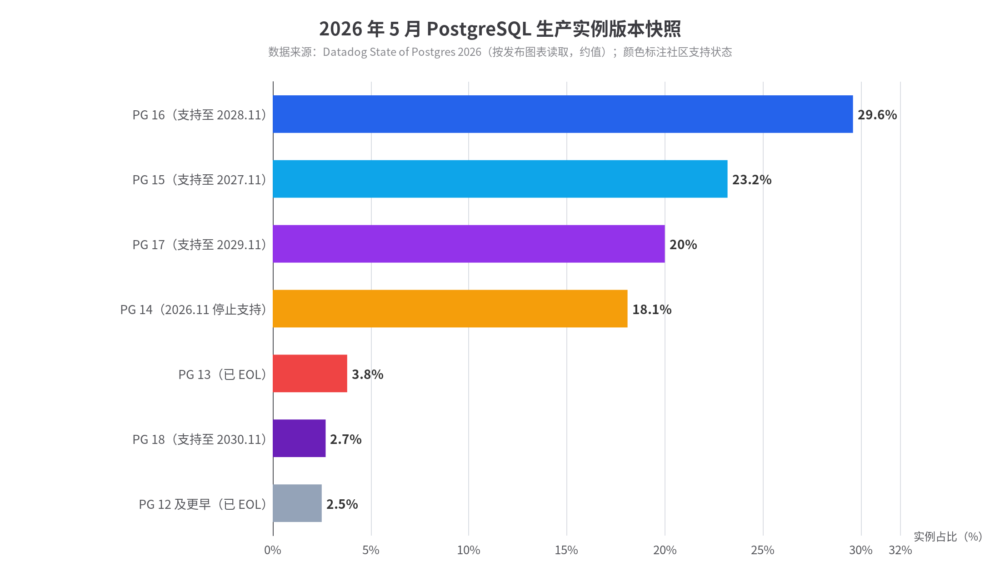
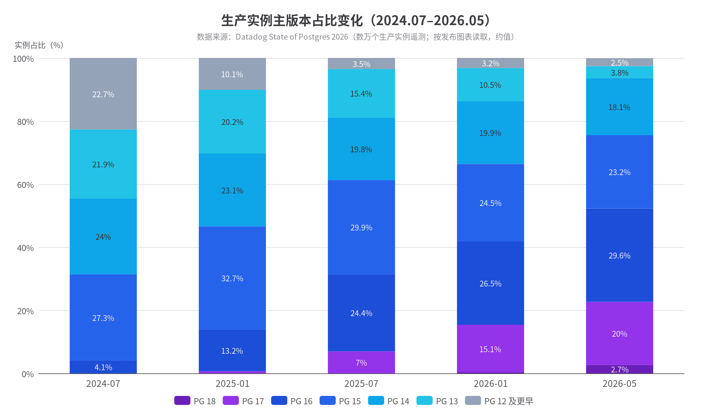
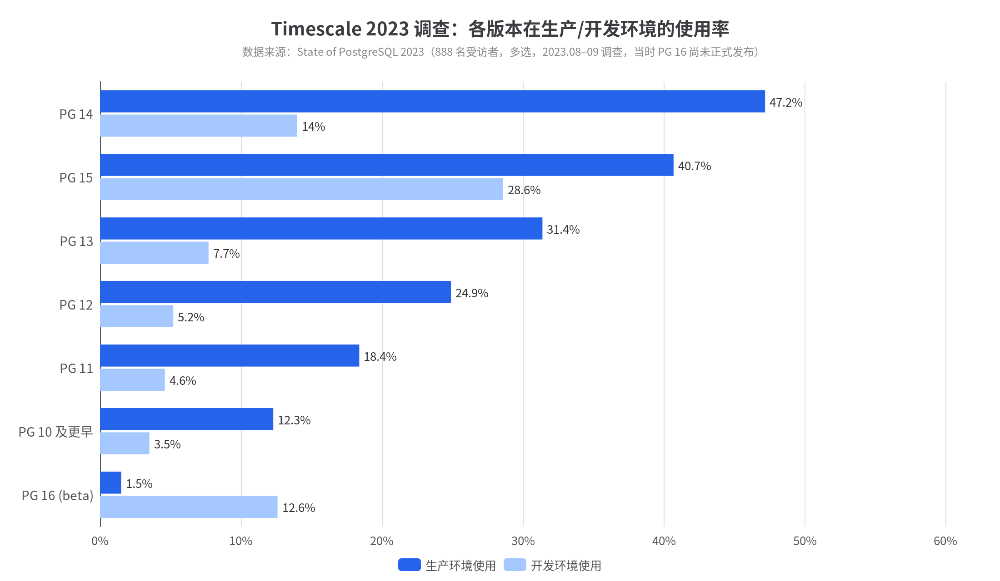
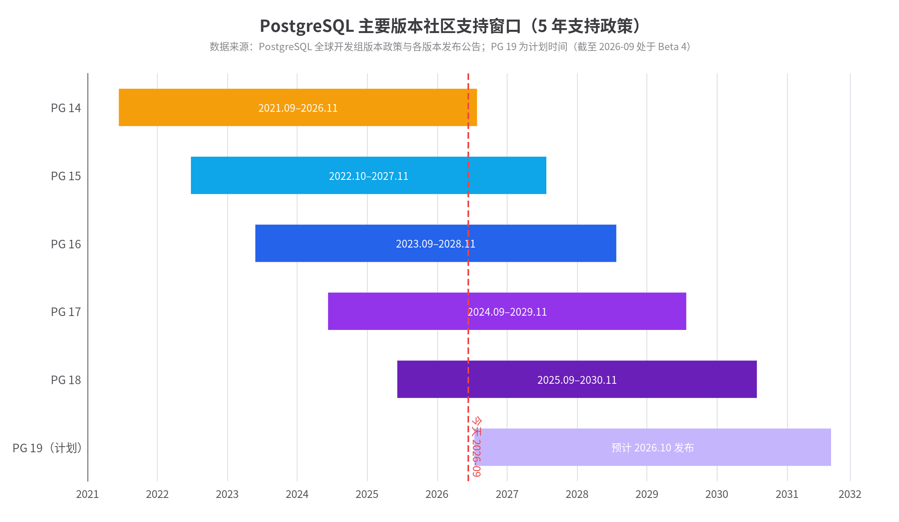

# PostgreSQL 各主要版本市场使用情况研究报告

**数据截止：2026 年 9 月 · 核心数据源：Datadog 生产遥测（数万个实例）、Timescale/TigerData 社区调查、各云厂商官方文档、PostgreSQL 官方发布政策**

---

## 摘要（TL;DR）

**一句话结论：截至 2026 年 5 月，PostgreSQL 生产实例的版本分布呈现"中位集中"格局——约 94% 的实例运行在 PG14–18 这五个仍在支持期内的版本上，其中 PG16（约 29.6%）与 PG15（约 23.2%）合计占据半壁江山，是最主流的两大生产版本；最新版 PG18 发布八个月份额仅约 2.7%，而已 EOL 的 PG12 及更早版本已被压缩到约 2.5%**（依据 Datadog 2026 年报告图表量化读取）。

关键发现：

| # | 发现 | 依据 |
|---|---|---|
| 1 | **生产实例高度集中在支持期内版本**：PG14–18 合计约 **94%**，远超 2024 年的 85%，版本碎片化显著收敛 | Datadog 生产遥测（图表量化），并与原文"over 94%"表述交叉验证 |
| 2 | **PG15 + PG16 是当下事实上的"主力双版本"**，合计约 52.8%；约半数实例已运行在 PG16 及以上 | Datadog：原文明确"roughly half of all instances"及"half of instances now run PostgreSQL 16 and up" |
| 3 | **新版本渗透周期约 2 年**：PG16 发布 20 个月后达约 26–30%，PG18 发布 8 个月仅约 2.7%——PG18 正处于 PG16 两年前的位置 | Datadog 图表时序量化 |
| 4 | **EOL 长尾真实存在但快速收窄**：PG13 于 2025-11-13 EOL，半年后仍占约 3.8%；PG12 及以下从 2024 年的约 20% 降至约 2.5% | Datadog + Percona 遥测 |
| 5 | **云厂商供给决定升级下限**：RDS/Aurora/Cloud SQL/Azure 均已 GA PG18，且 Cloud SQL 已将 PG18 设为默认；RDS 对 PG13 收取约 6 倍价格的扩展支持费，强力驱离 EOL 版本 | 各云厂商官方文档 |
| 6 | **PG14 将于 2026 年 11 月 12 日 EOL，目前仍占约 18.1%**，是 2026–2027 年最大规模的被迫迁移潮 | PostgreSQL 官方版本政策 + Datadog |

> **方法论说明**：PostgreSQL 官方**不发布**任何版本市场份额统计。本报告的核心量化数据来自 Datadog《State of Postgres 2026》——基于其客户"数万个生产实例"的真实遥测（数据窗口 2026-05-01 至 05-16，发布于 2026 年 8 月），是目前公开资料中规模最大、最接近"生产真实分布"的来源。Datadog 未公布逐版本精确数字，本报告对其官方发布的堆叠面积图进行了像素级量化读取，并用报告原文的文字断言做了三点交叉验证（均吻合），读数误差估计 ±1–2 个百分点。Timescale/TigerData 年度调查（2023 年 888 人、2024 年 688 人）作为社区口径的补充对照，两者口径差异在正文中明确标注。

---

## 1. 背景：PostgreSQL 的市场地位与版本生态

### 1.1 整体市场：第四大数据库，且是前十中增长最快的

在讨论"版本分布"之前，需要先锚定 PostgreSQL 的整体市场体量——版本分布是"蛋糕如何切"，而蛋糕本身在持续做大。根据 DB-Engines 2026 年 9 月排名，PostgreSQL 以 **683 分位居第四**，排在 Oracle（1122）、MySQL（845）与 Microsoft SQL Server（699）之后（[DB-Engines](https://db-engines.com/en/ranking)）。更值得注意的是增长动能：DB-Engines 官方在 2026 年上半年报告中指出，PostgreSQL 以 **+21.97 分成为前十名中涨幅最大的数据库**，Oracle、MySQL、SQL Server 同期均为负增长（[DB-Engines](https://db-engines.com/en/blog_post/131)）。在流行度奖项上，PostgreSQL 已四度当选 DB-Engines 年度 DBMS（2017、2018、2020、2023），为获奖次数最多的数据库。

开发者侧的采用率更能预示未来生产侧的结构。Stack Overflow 2025 年开发者调查显示，PostgreSQL 以 **55.6%** 的使用率连续第三年成为最受欢迎的数据库，在专业开发者中达到 **58.2%**，领先第二名 MySQL（40.5%）超过 15 个百分点（[Stack Overflow](https://survey.stackoverflow.co/2025/technology/)）。JetBrains《State of Developer Ecosystem 2025》同样录得 PostgreSQL **55%** 的使用率，稳居第一（[JetBrains](https://www.jetbrains.com/zh-cn/lp/devecosystem-2025/databases/)）。这意味着进入生产环境的新系统绝大多数默认选择 PostgreSQL，其版本生态的健康度直接影响行业的基础设施水位。在云原生方向上，Timescale 2024 年调查还显示 44% 的受访者在生产中使用 Kubernetes 运行 PostgreSQL，比 2021 年增长 25%（[TigerData](https://www.tigerdata.com/state-of-postgres/2024)），云托管与容器化部署正是新版本扩散的主要通道。

### 1.2 版本政策：一年一个大版本、五年支持期、无 LTS——理解分布的钥匙

PostgreSQL 全球开发组（PGDG）的版本政策是理解一切版本分布数据的前提：**每年发布一个主要版本**（通常在 9–10 月），**每个主要版本自发布之日起支持 5 年**，期间每季度发布一个小版本（补丁）更新；5 年期满即 EOL，官方不再提供任何安全或缺陷修复（[PostgreSQL 官方版本政策](https://www.postgresql.org/support/versioning/)）。与 MySQL 在 8.x 时代引入的 LTS/Innovation 双轨制不同，PostgreSQL **没有 LTS 概念**，所有主要版本待遇相同。这一政策叠加社区高度保守的兼容性文化，造就了独特的市场结构：任一时刻通常有 **5 个主要版本并存且都被视为"合规选择"**，用户的升级决策因而高度依赖云厂商支持节奏、扩展兼容性和组织自身的变更窗口，而非上游压力。

这一政策直接解释了本报告将反复出现的现象：新版本发布第一年份额极低（开发者观望、扩展未适配、云厂商未 GA），第二年进入放量期，第三至四年达到峰值，第五年随着 EOL 临近快速衰减。PGDG 在 2026 年 8 月的安全更新公告中确认，PG14 的最终版本为 14.20（2026-08-13），并将于 **2026 年 11 月 12 日正式 EOL**；同时提醒 PG13 已在 2025-11-13 EOL，仍在运行的实例"将不再收到安全补丁"（[PostgreSQL 全球开发组](https://www.postgresql.org/about/news/postgresql-182-177-1611-1515-1420-and-1323-released-3145/)）。另外，下一代 PG19 原定 2026 年 9 月发布，但因 SQL/PGQ 图查询等多项重磅特性在最后阶段被回退，GA 推迟至 2026 年 10 月，Beta 4 已于 2026 年 9 月 24 日发布（[PostgreSQL 官方新闻](https://www.postgresql.org/about/news/postgresql-19-beta-4-released-3184/)），这将是本报告数据窗口之外的下一个版本变量。

### 1.3 主要版本生命周期一览

下表汇总当前市场可见的全部主要版本的生命周期状态，是后文所有分布数据的解读基准。EOL 日期依据 PostgreSQL 官方版本政策及各发布说明整理，最新小版本号以各云厂商 2026 年 9 月文档为准（[PostgreSQL 版本政策](https://www.postgresql.org/support/versioning/)、[Herodevs EOL 追踪](https://www.herodevs.com/vulnerability-directory/postgresql-versions-end-of-life)、[Azure 版本支持文档](https://learn.microsoft.com/en-us/azure/postgresql/flexible-server/concepts-supported-versions)）。

| 版本 | GA 日期 | 官方 EOL | 2026-09 云侧最新小版本（Azure 口径） | 生命周期状态 | 生产份额（Datadog 2026-05，约） |
|---|---|---|---|---|---|
| PostgreSQL 12 | 2019-10 | **2024-11-21** | —（云平台已下架或仅扩展支持） | ❌ EOL 近两年 | 2.5%（与更早版本合并计） |
| PostgreSQL 13 | 2020-09 | **2025-11-13** | —（RDS 已转入付费扩展支持） | ❌ EOL 十个月 | 3.8% |
| PostgreSQL 14 | 2021-09-30 | **2026-11-12**（剩余约 1.5 个月） | 14.24 | ⚠️ 临期 | **18.1%** |
| PostgreSQL 15 | 2022-10-13 | 2027-11 | 15.19 | ✅ 支持中（第五年） | **23.2%** |
| PostgreSQL 16 | 2023-09-14 | 2028-11 | 16.15 | ✅ 支持中（峰值年） | **29.6%** |
| PostgreSQL 17 | 2024-09-26 | 2029-11 | 17.11 | ✅ 支持中（放量期） | **20.0%** |
| PostgreSQL 18 | 2025-09-25 | 2030-11 | 18.6 | ✅ 最新 GA（导入期） | **2.7%** |
| PostgreSQL 19 | 预计 2026-10（Beta 4 已发布） | — | — | 🧪 测试阶段 | — |

需要特别强调表格最后一列与倒数第二列的张力：**当前约 18.1% 的生产实例运行在仅剩约 1.5 个月官方支持寿命的 PG14 上**。按 Datadog 数万个实例的基数折算，这意味着数千个生产实例将在 2026 年第四季度面临"不升级即失去官方安全补丁"的处境。历史经验（PG12/13 的 EOL 衰减曲线）表明，其中相当一部分会转入云厂商的付费扩展支持或索性继续裸奔，这将是 2026–2027 年 PostgreSQL 版本市场最重要的单一事件。

---

## 2. 生产环境版本分布全景（Datadog 遥测）

### 2.1 当前快照：PG16 登顶，PG15/17 紧随，新版仍在爬坡

Datadog《State of Postgres 2026》基于 2026 年 5 月 1 日至 16 日对其客户生产数据库实例的遥测，是本报告的核心数据源（[Datadog](https://www.datadoghq.com/state-of-postgres/)）。报告原文给出三个关键断言：其一，**超过 94% 的实例运行在仍受支持的 PG14–18 上**，而两年前（2024 年报告）该口径仅为 85%；其二，**PG15 与 PG16 合计约占全部实例的一半**；其三，**约半数实例已运行在 PG16 及更高版本**，凸显 PG16 的"异常吸引力"。本报告对 Datadog 官方发布的版本份额堆叠面积图进行了像素级量化（图例取色 + 逐列最近邻分类），得到的 2026 年 5 月快照与上述三条断言全部吻合（94% 口径实测 93.6%，15+16 实测 52.8%，16+ 实测 52.3%），量化读数的可信度因此较高。

从快照看，生产市场的"重心"非常清晰：**PG16 以约 29.6% 成为第一大版本**，PG15（约 23.2%）与 PG17（约 20.0%）构成第二梯队，三者合计约 72.8%。PG14 虽临期仍占约 18.1%，反映大量 2022–2023 年上线的系统尚未排期升级。两个 EOL 版本合计仅约 6.3%（PG13 约 3.8% + PG12 及以下约 2.5%），相比两年前的长尾（彼时 PG12 及以下约 20%）已大幅收敛——Datadog 明确指出，云厂商的托管升级与 EOL 政策是长尾收窄的主要推手（[Datadog](https://www.datadoghq.com/state-of-postgres/)）。值得注意的是 PG18 发布八个月仅约 2.7%，并非接受度差，而是完全符合历史导入曲线（PG16 在发布后第 8 个月份额也仅约 4%），其放量将发生在 2026–2027 年。

### 2.2 两年演变：从"五代同堂"到"三强格局"

将 2024 年 7 月至 2026 年 5 月的五个时点量化值连成时序，可以完整看到一条标准的版本更替曲线（数据均为对 Datadog 官方图表的像素级量化读取，误差 ±1–2 个百分点）：

| 时点 | PG18 | PG17 | PG16 | PG15 | PG14 | PG13 | PG12 及以下 | 支持期内版本占比 |
|---|---|---|---|---|---|---|---|---|
| 2024-07 | — | — | 4.1% | 27.3% | 24.0% | 21.9% | 22.7% | ~77% |
| 2025-01 | — | 0.7% | 13.2% | 32.7% | 23.1% | 20.2% | 10.1% | ~90% |
| 2025-07 | — | 7.0% | 24.4% | 29.9% | 19.8% | 15.4% | 3.5% | ~81% |
| 2026-01 | 0.3% | 15.1% | 26.5% | 24.5% | 19.9% | 10.5% | 3.2% | ~86% |
| 2026-05 | 2.7% | 20.0% | **29.6%** | 23.2% | 18.1% | 3.8% | 2.5% | **~94%** |

（注：2025-07 与 2026-01 两行中 PG13 仍处于支持期、PG14 亦在支持期，"支持期内占比"按当时口径计算；像素量化存在 ±1–2pp 误差，个别列合计略偏离 100%。）

两个结构性变化最值得记录。第一，**长尾清洗速度远超直觉**：PG12 及以下从 2024-07 的约 22.7% 跌至 2026-05 的约 2.5%，PG13 也从约 22% 跌至约 3.8%——这背后是 RDS 对 PG13 于 2026 年 2 月 28 日结束标准支持并转入约 6 倍价格的扩展支持、Azure 在 2025 年 11 月强制升级 PG13 实例至 14/15 等平台级动作的集中生效（[AWS re:Post](https://repost.aws/knowledge-center/rds-postgresql-13-eol)、[Azure 退役公告](https://learn.microsoft.com/en-us/azure/postgresql/flexible-server/concepts-supported-versions)）。第二，**主力版本交接节奏稳定**：PG15 在 2025 年初见顶（约 32.7%）后让位于 PG16，PG16 于 2026 年上半年登顶，而 PG17 正沿着几乎相同的斜率爬坡（发布 8 个月约 7%、20 个月约 20%），与 PG16 的历史轨迹高度一致。Datadog 特别指出 PG16 的成功部分源于其"恰好落在多数企业上一个升级周期的甜点区"——PG14/15 用户在 2025 年规划升级时，PG16 已足够成熟，而 PG17 尚未被云厂商广泛支持（[Datadog](https://www.datadoghq.com/state-of-postgres/)）。

### 2.3 新版渗透的"两年定律"

把三个版本的导入曲线对齐到各自的 GA 时间点，可以归纳出 PostgreSQL 生产市场稳定的渗透规律：

| 版本 | GA | GA+8 个月份额（约） | GA+20 个月份额（约） | 登顶时点 |
|---|---|---|---|---|
| PG16 | 2023-09 | ~4%（2024-07 实测 4.1%） | ~26%（2025-05 区间） | 2026 上半年，发布约 2.5 年 |
| PG17 | 2024-09 | ~7%（2025-07 实测 7.0%） | ~20%（2026-05 实测 20.0%） | 预计 2027 年 |
| PG18 | 2025-09 | ~2.7%（2026-05 实测） | 预计 2027 年中达 20% 量级 | 预计 2028 年前后 |

这一规律对从业者的实际意义在于：**"最新版发布一年后份额仍只有个位数"是常态而非异常**。PG18 的异步 I/O（I/O 深度最高 3 倍提升）、原生 OAuth 等特性并未改变导入曲线的形状，因为生产升级的瓶颈从来不是特性吸引力，而是扩展兼容性验证、云厂商 GA 节奏与企业变更窗口（[Crunchy Data PG18 特性分析](https://www.crunchydata.com/blog/postgres-18-features-we-love)、[Datadog](https://www.datadoghq.com/state-of-postgres/)）。同理，PG19 因特性回退推迟至 2026 年 10 月 GA（[PostgreSQL 官方](https://www.postgresql.org/about/news/postgresql-19-beta-4-released-3184/)），其生产份额在 2027 年底之前大概率仍低于 10%，不影响未来两年的版本格局判断。

---

## 3. 社区调查口径：Timescale/TigerData 年度调查（2023/2024）

### 3.1 2023 年调查：多选口径下的"同时使用多版本"现实

Timescale（现 TigerData）的年度 State of PostgreSQL 调查是社区口径最重要的补充。2023 年调查于 2023 年 8 月 1 日至 9 月 15 日进行，回收 **888 份有效问卷**（[Timescale 2023 报告](https://assets.tigerdata.com/pdfs/state-of-postgres/State-of-PostgreSQL-2023.pdf)）。需要明确口径差异：该调查问的是受访者（个人/团队）**在开发和生产环境中"使用哪些版本"的多选分布**，而非实例级份额，且受访者以 PostgreSQL 深度用户为主，系统性偏新版本。这一口径恰好揭示了实例遥测看不到的事实：**同一团队同时运行多个版本是普遍现象**——开发环境追新、生产环境求稳。

| 版本 | 生产中使用 | 开发中使用 | 不使用 |
|---|---|---|---|
| PG16（当时 Beta） | 1.5% | 12.6% | 85.9% |
| PG15（当时最新 GA） | 40.7% | 28.6% | 30.7% |
| PG14 | **47.2%** | 14.0% | 38.9% |
| PG13 | 31.4% | 7.7% | 60.9% |
| PG12 | 24.9% | 5.2% | 69.9% |
| PG11（EOL） | 18.4% | 4.6% | 77.0% |
| PG10 及更早（EOL） | 12.3% | 3.5% | 84.2% |

（数据来源：[Timescale 2023 报告](https://assets.tigerdata.com/pdfs/state-of-postgres/State-of-PostgreSQL-2023.pdf)第 32 页，原图为横向条形图，数值为视觉读数。）

这张表与 Datadog 实例数据互为印证又各有增量：当时生产侧"使用率最高"的是 PG14（47.2%）而非最新版 PG15（40.7%），与实例侧"PG15 于 2025 年初才见顶"的时序一致；同时仍有 **30.7% 的受访者承认生产中运行着 EOL 版本**（PG11 18.4% + PG10 及更早 12.3%，多选有重叠），说明 2023 年时点社区口径的 EOL 长尾比实例口径更厚——这与 Timescale 受访者包含大量自建/私有化部署（无平台强制升级）有关。开发环境的分布则展示了"影子未来"：PG16 尚在 Beta 就有 12.6% 的开发使用率，预示了它两年后的登顶。

### 3.2 2024 年调查：口径变更与读数警示

2024 年调查回收 **688 份问卷**，版本问题的图表改为"在使用该版本的受访者中，用于开发与生产的占比"的条件分布（即每行合计 100%），不再提供绝对使用率（[TigerData 2024 报告](https://assets.tigerdata.com/pdfs/state-of-postgres/State-of-PostgreSQL-2024.pdf)，第 30 页）。这一口径变更导致网上大量转引出现误读（把条件百分比当成绝对份额），本报告特此按原始口径呈现：

| 版本 | 使用者中用于开发 | 使用者中用于生产 | 正确解读 |
|---|---|---|---|
| PG17（当时 Beta） | 95.9% | 4.1% | Beta 版几乎无人敢上生产 |
| PG16 | 38.8% | 61.2% | 新版仍以开发验证为主 |
| PG15 | 14.0% | 86.0% | 进入生产成熟期 |
| PG14 | 8.9% | 91.1% | 生产主力 |
| PG13 | 6.9% | 93.1% | 高度生产化 |
| PG12 | 13.1% | 86.9% | 存量维护 |
| PG11（EOL） | 15.8% | 84.2% | 少量新开发仍在旧版上进行 |
| PG10 及更早 | 12.2% | 87.8% | 长尾存量 |

条件分布的价值在于刻画"版本成熟度生命周期"：一个版本从"95.9% 用于开发"（PG17 Beta）到"91% 用于生产"（PG14）的迁移，正是第 2 节实例份额曲线在团队行为侧的微观投影。将两年调查对照还可看出升级波次的推进：2023 年生产使用率最高的是 PG14，2024 年 PG16 已进入 61.2% 生产化阶段——与 Datadog 观测到的"PG16 于 2024 年中开始放量"完全同步。两个独立来源在趋势方向上的一致性，是本报告对"PG16 为 2025–2026 年事实主力版本"结论的主要信心来源。

### 3.3 其他遥测对照：Percona 的 EOL 观测

Percona 作为第三方支持商，其遥测提供了又一个独立切片：在 PG12 于 2024 年 11 月 EOL 的时点，Percona 观测到其监控中**约 10% 的活跃实例仍运行在 PG12**（[Percona](https://www.percona.com/blog/postgresql-12-end-of-life-what-are-your-options)）。该比例高于同期 Datadog 口径（约 10.1%，2025-01 实测，竟高度一致），且 Percona 客户画像偏向自建与混合部署，再次印证"平台托管比例越低、EOL 长尾越厚"的规律。Percona 同期的升级调查还显示，EOL 后用户的三大去向是：升级到受支持版本（多数）、购买第三方扩展支持、或维持现状自担风险——这三种选择在 2026-11 PG14 EOL 时将原样重演，且规模更大（当前 PG14 份额约 18.1%，远超 PG12 当时的约 10%）。

将 Datadog、Timescale、Percona 三个独立来源放在同一时间轴上对照，可以得到一张互相咬合的证据链：2023 年中，Timescale 受访者生产侧以 PG14 为最高（47.2%），同期实例侧 PG14 占约 24%、PG15 正在爬坡；2024 年 11 月 PG12 EOL 时，Percona 与 Datadog 各自独立测得"约 10% 的实例仍在 PG12"，两个口径几乎完全一致；到 2026 年 5 月，实例侧 PG16 登顶、EOL 长尾收窄至约 6.3%。三家数据在采集方式（问卷自报 vs 实例遥测 vs 支持商监控）与用户画像上差异明显，却在每个可对照的时点上指向同一方向，这种跨来源一致性说明 PostgreSQL 版本市场的宏观结构是稳健可测的，而非单一渠道的统计幻觉。

---

## 4. 供给侧：云厂商的版本目录与生命周期政策

### 4.1 三大云厂商版本供给对比

托管 RDS 是生产 PostgreSQL 的主要载体，云厂商"支持哪些版本、何时 GA、何时强制退役"在很大程度上塑造了版本市场的上下边界。截至 2026 年 9 月：

| 云厂商 | 当前支持的版本 | 最新版 GA 时点 | GA 滞后（相对上游） | EOL 处置政策 |
|---|---|---|---|---|
| AWS RDS | 13（扩展支持）–18 | PG18：2025-11-13/14 | ~7 周 | 标准支持结束后转付费扩展支持，价格约为标准实例 6 倍（[AWS re:Post](https://repost.aws/knowledge-center/rds-postgresql-13-eol)） |
| AWS Aurora | 13–18 | PG18：2026-02-26 | **~5 个月** | 随社区 EOL 结束标准支持（[endoflife.date](https://endoflife.date/amazon-aurora-postgresql)） |
| Azure Database for PostgreSQL（Flexible Server） | 11–18 | PG18：2025 年 11 月（Ignite，GA）；10 月先行预览 | ~2 个月 | 社区 EOL 后强制升级（PG13 已于 2025-11 强制升至 14/15）（[Azure 文档](https://learn.microsoft.com/en-us/azure/postgresql/flexible-server/concepts-supported-versions)） |
| GCP Cloud SQL | 13–18，**PG18 已是默认版本**（18.6） | PG18：2026 年初 GA；PG17 自 2024-10-22 起支持 | PG17 滞后仅 ~1 个月 | 随社区 EOL 退役（[GCP 文档](https://docs.cloud.google.com/sql/docs/postgres/db-versions)） |
| 阿里云 RDS | 10–18 | PG18：2025-12-12 | ~2.5 个月 | 提供到期前提醒与升级工具（[阿里云文档](https://www.alibabacloud.com/help/en/rds/apsaradb-rds-for-postgresql/product-overview/lifecycle-of-apsaradb-rds-for-postgresql-instances)） |

供给侧有两大看点。其一，**GA 滞后正在系统性缩短**：PG17 时代 Aurora 滞后数月、Cloud SQL 仅滞后一个月；PG18 时代 RDS 压到 7 周，Azure 甚至以预览形式在上游 GA 后一个月内跟进。滞后越短，新版导入曲线的斜率越陡——PG17 发布 20 个月达 20% 略快于 PG16 同期，供给侧改善是原因之一。其二，**各厂商小版本同步非常及时**：2026 年 9 月 Azure 目录中的 18.6/17.11/16.15/15.19/14.24 与上游 8 月季度补丁完全对齐（[Azure 发布说明](https://learn.microsoft.com/en-us/azure/postgresql/flexible-server/release-notes)），说明"小版本升级"在托管侧已基本是自动化无感操作，版本市场的博弈全部集中在**大版本升级**上。

### 4.2 平台政策如何"制造"版本市场

Datadog 数据中最戏剧性的变化——PG12 及以下两年内从约 22.7% 跌至约 2.5%、PG13 从约 22% 跌至约 3.8%——本质上不是用户自发行为，而是平台政策的结果。AWS 于 2026 年 2 月 28 日结束 RDS PG13 标准支持，之后继续运行的实例自动转入扩展支持并按约 6 倍价格计费（[AWS re:Post](https://repost.aws/knowledge-center/rds-postgresql-13-eol)）；Azure 更激进，在 2025 年 11 月直接对存量 PG13 实例执行强制升级（[Azure 文档](https://learn.microsoft.com/en-us/azure/postgresql/flexible-server/concepts-supported-versions)）。这种"经济杠杆 + 强制升级"的组合拳，使托管实例的 EOL 长尾被压缩到远低于自建环境的水平，也解释了 Datadog（客户以云托管为主）与 Timescale 受访者（自建比例高）之间长尾厚度的系统性差异。

由此可以预测 PG14 的退出路径：社区 EOL 为 2026-11-12，RDS 大概率在 2027 年初结束标准支持并开出 6 倍账单，Azure 可能在 2026 年底至 2027 年初执行强制升级。当前约 18.1% 的 PG14 实例中，托管部分将在 6–9 个月内被政策驱离，自建部分则会形成新的长尾。**对仍在 PG14 上的团队而言，2026 年第四季度是升级窗口的最后甜区**——跳过 PG15（2027-11 EOL）直上 PG16/17/18 可显著摊薄升级成本。

---

## 5. 版本生命周期全景与风险图谱

上图把第 1.3 节的表格可视化：绿色区间为各版本的 5 年官方支持期，红色虚线为今天（2026-09）。可以直观看到三个"风险簇"：**PG14 的支持期只剩约 1.5 个月**却承载着约 18% 的生产实例；PG13 已 EOL 十个月仍有约 3.8% 的存量在裸奔或付费续命；PG12 及更早的约 2.5% 则是真正的"化石层"，多为无人敢动的遗留系统。与此同时，PG19 预计 2026 年 10 月 GA（[PostgreSQL 官方](https://www.postgresql.org/about/news/postgresql-19-beta-4-released-3184/)），届时市场将短暂出现 7 个主要版本并存（14–19 + 长尾）的局面，随后 PG14 退出，回到 6 版本并存的常态。

EOL 的真实代价往往被低估。官方 EOL 意味着零日漏洞不再有上游补丁，合规审计（等保、PCI-DSS、SOC2）通常直接判定 EOL 组件不合规。云厂商扩展支持的定价（RDS 约 6 倍实例价格）实质上是把"拖延的利息"显性化（[AWS re:Post](https://repost.aws/knowledge-center/rds-postgresql-13-eol)）；第三方支持商（Percona、Instaclustr、HeroDevs 等）则提供了另一条续命通道，Instaclustr 与 Herodevs 均维护公开的版本 EOL 追踪页（[Instaclustr](https://www.instaclustr.com/support/support-operations/release-notes/end-of-life-announcements/)、[Herodevs](https://www.herodevs.com/vulnerability-directory/postgresql-versions-end-of-life)）。综合各来源，**生产版本选择的合规安全区是"最新版减 1 至减 3"**：即当前时点 PG15–17 是风险与成熟度的最优平衡，PG18 适合新项目与先锋团队，PG14 应立即排期升级，PG13 及以下应立即处置。

---

## 6. 升级行为：谁在升、升向哪里、为什么

Datadog 在 2026 年报告中对升级路径的观察提供了行为侧的关键证据：升级并非逐版本爬行，而是**跳跃式收敛到"成熟甜点"**——PG13/14 用户在 2025 年升级时大量直跳 PG16，因为彼时 PG16 已发布近两年、扩展生态完备、云平台全面支持，而 PG17 尚新（[Datadog](https://www.datadoghq.com/state-of-postgres/)）。这解释了 PG16 登顶速度为何快于 PG15：它不是承接了 PG15 的自然老去，而是虹吸了 PG13/14 两代用户的集中迁移。同理可以预测，2026-11 PG14 EOL 驱动的下一波迁移潮中，**PG17（届时发布满两年）将是最大受益者，而非 PG18**。

阻碍升级的因素在社区调查中常年稳定：Timescale 2024 显示用户最担忧的是**停机时间与兼容性验证成本**，而非新特性不足（[TigerData 2024](https://www.tigerdata.com/state-of-postgres/2024)）。这也是逻辑复制（PG16 起支持从备库做逻辑复制、PG17 大幅增强 failover slot 保持）成为近年最重要的升级助推器的原因——它把大版本升级的停机窗口从小时级压到分钟级。新版本自身的吸引力同样真实存在：PG18 的异步 I/O 子系统在 I/O 密集负载下可达约 3 倍吞吐提升（[Crunchy Data](https://www.crunchydata.com/blog/postgres-18-features-we-love)），PG16 的逻辑复制与并行化改进、PG17 的增量备份（pg_basebackup --incremental）都被 Datadog 列为驱动对应版本渗透率的关键特性（[Datadog](https://www.datadoghq.com/state-of-postgres/)）。综合判断：**升级决策 = 平台政策压力 × 兼容性成本 ÷ 新特性拉力**，三者中平台政策是近两年权重上升最快的变量。

---

## 7. 区域视角：中国与俄罗斯的特殊市场结构

### 7.1 中国：信创驱动的"影子 PostgreSQL 市场"

中国市场的 PostgreSQL 渗透很难用官方统计刻画，但多个社区信号一致指向高速增长。PostgreSQL 中文社区与 Pigsty 作者冯若航的持续观测显示，国内 PostgreSQL 用户规模近年成倍增长，**MySQL 与 PostgreSQL 的用户比例已从约 5:1 收窄到约 2:1**（[冯若航/Pigsty 博客](https://vonng.com/blog/)）。更关键的是结构性因素：信创目录中的大量国产数据库——openGauss（华为）、PolarDB-PG（阿里云）、TDSQL-PG（腾讯）、KingbaseES（人大金仓）、瀚高等——**均基于 PostgreSQL 内核或兼容其协议**，它们的版本演进跟随上游但通常滞后 1–3 个大版本（如 openGauss 长期基于 PG9.2/13 系内核演进）。这意味着中国存在一个规模可观的"影子版本市场"：名义上运行的是国产库，实际版本水位对应的是 PG 老版本。

这种结构带来两个后果。其一，国内 PostgreSQL 版本分布的长尾必然厚于全球平均——大量基于老内核的信创部署没有平滑的大版本升级通道；其二，上游社区动态（如 PG14 EOL）对国内的传导被缓冲，国产厂商的自主维护承诺替代了社区支持期，版本选择的约束函数与海外市场不同。对跨国企业而言，在中国区规划 PostgreSQL 版本策略时，需要同时评估"全球统一版本"与"信创合规栈"两套目标。

### 7.2 俄罗斯：制裁催生的高渗透市场

俄罗斯是另一个特例：受西方数据库厂商退出影响，PostgreSQL 及其衍生发行版（Postgres Pro 等）成为事实上的国家标准栈。多项社区调查显示**俄罗斯 PostgreSQL 使用率约 60.5%**，为全球最高水平之一（[冯若航/Pigsty 博客](https://vonng.com/blog/)）。俄罗斯市场的版本分布同样呈现"国产发行版主导、版本水位滞后"的特征，Postgres Pro 各版本通常基于上游稳定版本 fork 后由厂商自行长期维护，其版本号与上游生命周期的对应关系松散，官方 EOL 日期对这类部署的约束力有限。

这两个区域案例提示：本报告第 2 节的 Datadog 数据（客户以欧美云托管为主）描述的是"全球市场的高水位线"，自建为主、国产发行版为主的市场版本水位普遍更低、长尾更厚。对需要做全球基础设施规划的团队，正确的做法是把 Datadog 口径当作"上限基准"，再按各区域部署模式（托管比例、国产发行版比例、合规要求）向下修正预期，而不是把全球平均数直接套用到具体区域。

---

## 8. 趋势研判与行动建议

### 8.1 未来 24 个月版本格局推演

基于历史渗透曲线、云厂商政策日历与 PG19 发布计划，可以对未来 24 个月做出如下推演：**2026 年 Q4**，PG14 EOL（11-12）触发迁移潮开端，PG19 GA（10 月）带来新一轮开发侧尝鲜但生产份额可忽略；**2027 年**，PG17 接棒成为第一大版本（预计年中份额 30%+），PG18 进入放量期（年末有望达 15–20%），PG14 在托管侧被政策压缩至个位数，PG15 因 2027-11 自身 EOL 临近开始衰退；**2028 年**，市场重心移至 PG17/18 双主力，PG19 复制 PG18 的导入曲线，PG16 进入衰退通道。整条链路的节拍器始终是"每年 9–10 月一个新版本 + 每年 11 月一个 EOL"，市场的稳定性远高于 MySQL 生态——这也是 PostgreSQL 版本策略被普遍认为更健康的原因。

不确定性主要来自三处：其一，PG19 的推迟是否影响其早期口碑（SQL/PGQ 等旗舰特性回退至 PG20，可能降低先锋团队的首发意愿，[Snowflake 工程博客](https://www.snowflake.com/en/blog/)等已有讨论）；其二，RDS/Aurora 对 PG14 的强制/收费动作若比预期更激进，会加快 2027 年的版本收敛；其三，AI 负载（向量检索、RAG）带来的新建库浪潮偏好直接部署最新版，可能抬升 PG18/19 的导入斜率——Datadog 已观测到 PG18 早期采用者中 AI 相关负载占比偏高（[Datadog](https://www.datadoghq.com/state-of-postgres/)）。

### 8.2 分角色行动建议

综合全篇证据，版本选择的核心原则可以浓缩为一句话：**让平台政策和生命周期日历替你决策，而不是让惯性替你决策**。PostgreSQL 的版本市场已经高度规则化——每年一次发布、五年支持、云平台阶梯式退役——任何"再等等"的决策都可以被精确折算成风险敞口与金钱成本。下表按当前所处版本分角色给出建议，其依据分别来自第 2 章的份额数据（判断多数派行为）、第 4 章的平台政策日历（判断外部压力时点）与第 1.3 章的 EOL 表（判断合规边界）。

| 角色 | 当前建议 | 关键时间点 |
|---|---|---|
| 仍在 **PG13 及以下**的团队 | 立即处置：托管实例正在产生 6 倍扩展支持费用或已被强制升级；自建实例已无官方安全补丁 | 已逾期，立即 |
| 仍在 **PG14**（约 18% 的多数派） | 2026 年 Q4 前排期升级；**跳过 PG15 直上 PG17**（成熟度最佳）或 PG18（生命周期最长），用逻辑复制把停机压到分钟级 | 2026-11-12 前完成 |
| 在 **PG15** 的团队 | 暂无压力，但 2027-11 EOL，建议在 2027 年上半年随常规变更窗口升至 PG17/18 | 2027-11 前 |
| 在 **PG16**（当前第一大版本） | 甜点位置，支持至 2028-11，可按需观察 PG18/19 | 2028 年规划 |
| 新项目/新系统 | **直接 PG18**（云厂商已全面 GA、Cloud SQL 已默认）；需最长支持期且能接受早期小风险 | 现在 |
| 采购/架构委员会 | 将"大版本升级"纳入年度固定预算与变更日历，把 EOL 日期纳入 CMDB 告警，避免被动付费续命 | 每年 9 月（新版）/11 月（EOL） |

---

## 数据说明与局限

1. **核心量化值的口径**：第 2 章所有逐版本百分比为对 Datadog《State of Postgres 2026》官方发布的堆叠面积图的像素级量化读数（图例取色、逐列最近邻分类、五点采样），误差约 ±1–2 个百分点；已用报告原文的三条文字断言（>94%、约半数 15+16、半数 16+）交叉验证全部吻合。原始图表见 [Datadog 报告页](https://www.datadoghq.com/state-of-postgres/)。
2. **调查口径**：Timescale/TigerData 2023 数据为"多选使用率"（n=888），2024 数据为"条件开发/生产占比"（n=688），两者不可直接横比，亦不可与实例份额直接比较；正文已分别标注。2025 年 TigerData 未发布版本分布章节。
3. **样本偏差**：Datadog 客户以欧美、云托管、中大型企业为主，其数据代表"全球托管市场高水位线"；自建为主的市场（中国信创栈、俄罗斯发行版栈）版本水位更低、EOL 长尾更厚，第 7 章已做区域修正说明。
4. **时点说明**：版本生命周期日期、云厂商支持目录以 2026 年 9 月各官方文档为准；PG19 尚未 GA（Beta 4，预计 2026 年 10 月），其影响属于前瞻推演。

*本报告仅供一般信息参考，不构成任何技术选型、采购或合规决策的专业建议。版本升级涉及业务连续性，请以官方文档与实际测试为准。*
